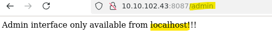

# **SAST**

SAST - (Static Application Security Testing) היא שיטה אשר סורקת ובודקת חולשות אבטחיות בקוד המקור , הבינארי והבתי (bytecode) של אפליקציות ותוכנות עוד שלבי הפיתוח הראשונים שלהן , השיטה הזו עובדת בצורה של white-box ומשמשת לבדיקה וסריקה של הקוד עוד לפני שנפרס או הורץ , כלומר השיטה פועלת במתווה של קוד האפליקציה עצמו ואינה יוצרת אינטרקציה עם תוכנות או אפליקציות חיצוניות כמו APIים למינהם או תוכנות צד שלישי , היא סורקת אך ורק את הקוד של האפליקציה עצמה ומחפשת חולשות ובעיות אבטחתיות שעלולות לאפשר לתוקפים זדונים לנצל אותן.

יישום שיטת SAST לרוב מצריך מסד נתונים גדול המכיל רישומים של המון חולשות אבטחתיות בכדי לייעל את היכולות שלה ולאפשר למצוא פערי אבטחה אשר נפוצים בפיתוח אפליקציה , עם זאת כלי SAST הם כלים אשר סורקים ובודקים נכנסים סטטים בקוד לכן כל כלי אשר עושה זאת נחשב כלי SAST בין אם זה עם שימוש במסד או לא (כלים אשר סורקים ובודקים את הקוד בזמן ריצה אינם נחשבים כלי SAST).

## **SAST Tools**

כלי SAST הם לרוב כלי CLI או הרחבות IDE שמשתמשות ברשימות גדולות(מסד נתונים) של חולשות אבטחה אשר נמצאים באופן מקומי או מרוחק ובעזרתם הם סורק את הקוד , הם עוברים על הקוד של ומשווים אותו אל מול הרשימות כך , היכולת הזאת מאפשרת לכלי הSAST להתריע על חולשות כבר בזמן כתיבת הקוד כאשר המפתח כותב אותו , הם מגיבים על הקוד שנכתב ומספקים מישוב עבור המפתח באופן מידי , כך ניתן לגלות חולשות מוקדם בתהליך הפיתוח.

מאחר ומתגלות חולשות חדשות כל הזמן כך יש הצורך לעדכן את הרשימות שנמצאות במסדי הנתונים באופן שוטף ורציף בשביל לאפשר את הרמה האבטחתית העדכנית ביותר , לכן כלי SAST המשתמשים ברשימות האלו שנשארות מעודכנות חשוב לשלב אותן בצינור הCI/CD כדי למקסם את היכולות שלהם ולזהות בעיות אבטחתיות חדשות ועדכניות שצצות.

כלי SAST קוד פתוח פופולריים:

- Semgrep
- SonarQube
- CodeQL
- Brakeman
- Bandit
- Find Security Bugs

## **SARIF**

SARIF (Static Analysis Results Interchange Format) הוא פורמט כתיבה בפורמט של JSON שמשתמשים בו בשביל להציג את תוצאות הסריקות בצורה נוחה וקלה להבנה , הפורמט מאפשר יצירת סטנדרט כתיבה נפוץ כך שכולם יהיו יכולים להבין ולקרוא אותו בצורה נוחה (כמו שפה משותפת).

## **Mission - Usage of SAST Tools**

- השתמש בכלי SAST ונתח את התוצאות



שימוש בכלי SAST בשם Bandit , סורק קוד python בצורה מעמיקה.

התקנה:

```bash
sudo apt install python3-bandit
```

שימוש בכלי:

```bash
bandit -r [project_name]
```
