# **לינוקס בסיסי:**

לינוקס היא מערכת הפעלה אשר תומכת בריבוי משתמשים , כלומר האפשרות שכמה משתמשים שונים ישתמשו במערכת ההפעלה בו זמנית , בנוסף היא מערכת הפעלה בעלת קוד מקור פתוח (open source) , כלומר כל אחד יכול לקחת את הקוד שלה ולשנות , להוסיף או להחסיר כל דבר שעולה בדעתו , בזכות היותה עם קוד מקור פתוח היא מאפשרת לכל משתמש להתאים את מערכת ההפעלה לצרכים האישית שלו , מערכות הפעלה של לינוקס , היא מאפשרת לכל אחד לקחת את קוד הליבה הבסיסי שלה ולכתוב לתוכה או עליה כל קוד שיבחר , החלק הליבתי הזה של מערכת ההפעלה נקרא הקרנל.

### **Linux Kernel:**

הקרנל נקרא גם הגרעין , הוא משמש גם כליבה של מערכת ההפעלה שאחראי על כל ההתממשקות בין התוכנה לחומרה , ניהול הזיכרון , עבודת המעבדים וניהל התהליכים , ניתן לחשוב על מערכת ההפעלה של לינוקס כאילו היא מורכבת משכבות , כאשר השכבה הכי גבוהה היא השכבה האפליקטיבית , השכבה הבאה היא הSHELL , אחריה הקרנל ואחרי החומרה , הקרנל בעצם מהווה כחלק התוכנתי הקרוב ביותר לחומרת המחשב.

הקרנל מנהל את כל האחראיות שלו באמצעות פסיקות , כאשר רכיב תוכנתי רוצה לבצע התממשקות עם רכיב חומרתי הקרנל מבצע פסיקה במעבד ומממש את הפעולה הרצויה.

מערכת ההפעלה של לינוקס מחולקת ל2 חלקים שונים , החלק של המשתמש והחלק של הקרנל , כל אחד מהחלקים האלו מופרדים ל2 תחומים שונים , תחום המעבד ותחום הזיכרון , בחלק המשתמש התחום שאחראי על פעולות המעבד נקראמצב משתמש (user mode) ועל תחום הזיכרון אחראי מרחב המשתמש (user space) ובחלק של הקרנל הם נקראים מצב קרנל (kernel mode) ומרחב הקרנל (kernel space) , בעוד שהחלק של המשתמש הוא החלק במערכת ההפעלה אותו המשתמש רואה ומתנהל דרכו , החלק שבו קורות כל הפעולות מאחורי הקלעים הוא החלק של הקרנל שאליו למשתמש לא אמורה להיות גישה או נראות , בחלק של המשתמש יש קונספט שנקרא הרשאות בשביל למדל ולבזר את היכולות והכוח של המשתמשים במערכת ההפעלה המשתמשים מוגבלים לאפשרויות ויכולות שונות , כלומר הגישה שלהם לחומרה מוגבלת, לעומת זאת בחלק של הקרנל הקונספט של הרשאות הוא לא דבר שקיים , כל פעולה שנעשת שם לא תלויה בהרשאות , כלומר גישה לא מוגבלת לחומרה , בזכות החלוקה הזאת מתאפשרות כל הפעולות המסובכות במערכת ההפעלה כגון הפרדת הרשאות , בניית קונטיינרים ומכונות וירטואליות (שניהם יוסברו בחלק של וירטואליזציה).

החלוקה הזאת בין המשתמש לקרנל מאפשרת למשתמש להיות מוגבל בפעולות שלו כלומר מוגבל גם בנזק שהוא יכול לבצע על המערכת , אם משתמש יבצע פעולה כושלת הנזק שהוא יכול לבצע מוגבל והקרנל יכול לפצות עליו , לעומת זאת עם תתבצע פעולה כושלת על ידי הקרנל היא עלולה להקריס את כלל המערכת.

* הגרסה האחרונה של קרנל של לינוקס ששוחררה היא 6.13.

### **Linux Distribution:**

הפצות של לינוקס הן בעצם מערכות הפעלה שמבוססות על הקרנל של לינוקס , ההפצות בנויות מהקרנל כבסיס של מערכת ההפעלה ועל גביו התווספו ספריות מערכת , חבילות תוכנות , ממשקים , מנהלי חבילות , קונפיגורציות והתאמות שונות ועוד , כל התוספים האלו מאפשרים חווית משתמש טובה יותר והתאמה לצרכים מסויימים של משתמשים שונים , חיבור כל התוספים האלו לכדי מערכת אחת יוצר בעצם מערכת הפעלה חדשה כלומר הפצה חדשה של לינוקס , הפצות שונות יכולות להיות מבוססות על הפצות אחרות אך בשורה התחתונה תמיד יהיה הקרנל של לינוקס.

## **Linux System ועבודה עם הShell:**

הצורה הנפוצה והחזקה ביותר בה משתמשים בלינוקס היא דרך הShell , שזהו האיזור שבו המשתמש מתממשק עם הקרנל , העבודה מול הShell נעשית על ידי פקודות , כל פקודה מאפשרת קריאה לפעולת שונות בקרנל ובכך המשתמש מבצע פעולות במערכת.

הפקודה השימושית ביותר בשביל להבין איך לעבוד נכון מול הShell ובאופן כללי עם כל הפקודות שניתן להזין לתוך הShell היא man.

man - הפקודה man היא קיצור של המילה manual , כלומר ספר עזר , היא משמשת בתור ספר עזר על פקודות אחרות , כדי שלא נצטרך לזכור כל מה שכל פקודה עושה או אם אנחנו לא יודעים מה המשמעות או השימוש של פקודה מסויימת נוכל להשתמש בפקודה man , כדי לעשות זאת אנחנו נרצה להזין בShell את המילה man ואחריה את הפקודה שאנחנו רוצים לקבל עליה מידע , למשל man man יתן לנו מידע והסבר על הפקודה man.

### **התקנת WSL:**

ניתן להתקין מערכת הפעלה לינוקס על גבי מערכת הפעלה של לינוקס , כדי לעשות זאת נצטרך לכתוב בתוך הcmd את הפקודות הבאות:

wsl --install

wsl --list --online

:בקצרה נוכל לכתוב גם

wsl -l -o

מתוך הרשימה שתוצג לנו נבחר את ההפצה שאותה נרצה להוריד ואז נכתוב את הפקודה הבאה:

wsl --install -d [Distro]

את הביטוי [Distro] נחליף בשם של ההפצה שאותה נרצה להתקין.

ברגע שההתקנה הסתיימה נעקוב אחרי ההוראות שנכתבות על המסך , ניצור משתמש וניתן לו סיסמה ומעכשיו יהיה לנו מערכת הפעלה של לינוקס , נוכל בכל פעם לכתוב בממשק הcmd את הפקודה wsl , פקודה זאת תפתח לנו shell של לינוקס ונוכל להשתמש בcmd ממש כמו ממשק shell של לינוקס.

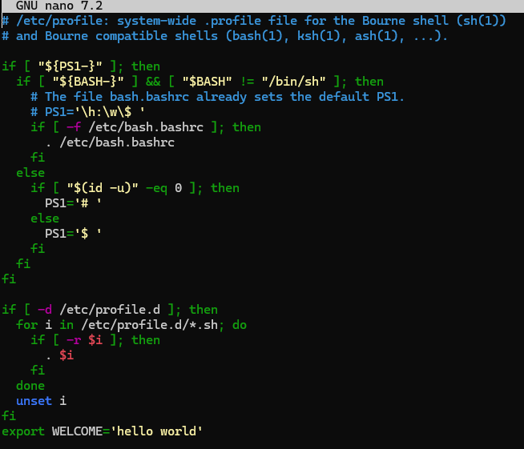

* תמונה להמחשבה , לאחר שמבצעים את הפקודה wsl --install

### **Text Manipulation:**

* לא יוצגו עוד צורות שימוש או דוגמות של פקודות שלא נחוץ לה הסבר מעמיק , כדי לקבל הסבר על פקודה כלשהיא מומלץ להשתמש בפקודה "man" :)

echo - פקודה שמאפשרת לנו להציג בShell שורות של טקסט או מחרוזות אשר מועברות אליה כarguments.

cat - פקודה שמאפשרת להציג תוכן של קבצים.

grep - פקודה שמאפשרת לחפש ולהציג תוכן ספציפי בתוך טקסט , השימוש הנפוץ בה מתבצע בעזרת pipline , נבצע פקודה כלשהיא שתציג לנו תוכן טקסט ולאחר מכן נכתוב pipline שזה התו | , ואחריו נכתוב את הפקודה grep יחד עם המחרוזת של התבנית שנרצה לחפש.

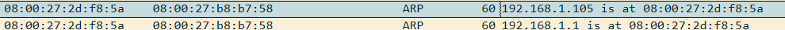

cut - פקודה שמאפשרת לחלק תוכן של קובץ ולהציג אותם , ניתן לבצע את החילוק של התוכן לפי index של התוכן שנרצה לחתוך , לפי טווח ועוד , החילוק מתבצע כתלות בפרמטרים שנציין בדגלים.

wc - קיצור של word count , משמש בשביל לספר את כמות המילים\שורות ועוד אפשרויות נוספות כתלות בדגלים שנציין בפקודה.

head - מחזיר את ההתחלה של קובץ מסוים , כלומר אם בקובץ יש 20 שורות הוא ידפיס את ה10 הראשונות , ברירת המחדל היא ה10 הראשונות אומנם אך אפשר לשנות את זה לכל מספר כתלות בפרמטרים שנציין בדגלים.

tail - עובד באותו כמו head רק מהסוף , מדפיס את הסוף של הקובץ והכמות כתלות בפרמטרים שנצייןשנבדגלים.

awk - פקודה שמשמשת כמו שפת סקריפט , היא בדרך כלל משמשת בשביל למצוא והדפיס דפוסים מסויימים בתוך קבצים.

sed - קיצור של stream editor , היא פקודה של עריכת טקסט בתוך קובץ , היא מאפשרת הכנסה , מחיקה , החלפה וחיפוש בתוך קבצים.

more - פקודה אפשר מאפשרת לראות את התוכן של קבצים בחלון חדש , בצורה כזו שלא מעמיסה על הטרמינל , משמשת בעיקר לקריאה של קבצים גדולים כמו לוגים, מאפשר לנוע קדימה בשורות הטקסט ואחורה עד גבול מסויים.

less - פקודה דומה לmore , עובדת באותה צורה רק הרבה יותר משוכלל , ניתן לנוע קידמה ואחורה ויש אפשרות חיפוש של טקסט ומאפשר גם לפתוח עורך טקסט.

### **Linux Shell And Enviroment Virables:**

ההבדל בין משתני SHELL למשתני סביבה הוא שמשתני סביבה נשמרים באומן מלא על כל המערכת כלומר systemwide בעוד שמשתני SHELL נשמרים רק על אותה הSHELL , למשל bash או csh הם SHELLים שונים בעלי משתני SHELL לא חופפים אחד לשני , לכל אחד יש משתנים משל עצמו שמשמשים את המשתמש רק באותו הSHELL , כאשר נעבור מSHELL אחד לאחר המשתנים לא בהכרח יהיו זהים ביניהם.

המשתנה הסביבתי PATH משמש את המערכת הפעלה בשביל לציין באיזה נתיבים לחפש את קבצי ההפעלה (executionable files) , כלומר איפה לחפש את הקבצים שצריך להריץ במערכת בהתאם לפקודות המשתמש , הרי לינוקס זה קבצים וקבצים זה הכל , כלומר גם הפקודות הם קבצי הרצה , המשתנה PATH מציין מה הם הנתיבים של קבצי ההרצה של הפקודות במערכת.

### **User and Groups:**

#### **מה זה UID וGID:**

UID – user identifier, זה הוא מספר מזהה יחודי עבור כל חשבון משתמש במערכת , המספר הזה מציין מי הוא המשתמש ומאפשר להבדיל בין משתמשים במערכת , איזה תהליכים רצים ברשות המשתמש , איזה ההרשאות יש לו , הקבצים שברשותו , ווידוא זהות המשתמש ועוד.

הUID ים בין 0-100 שמורים עבור משתמשי מערכת כמו למשמש למשתמש root שהואה"מלך" של מערכת ההפעלה יש UID 0 , שמסמל אותו בעל ההרשאות של root , המשתמש בעל ההרשאות החזקות ביותר במערכת , אחרי הUID 100 השימוש משתנה בין מערכות הפעלה ובדרך כלל שמורים עבור המערכת להקצאה דינאמית , אחרי UID מסויים למשל 1000 הUIDים מוקצים עבור משתמשים רגילים.

GID –group identifier , זה הוא מספר מזהה יחודי עבור קבוצה של משתמשים , המספר המזהה עבור קבוצה מסויימת משמש אותנו באופן דומה לשימוש של UID , ההבדל הוא שGID מאפשר לנו לזהות מס של משתמשים , בזכות האפשרות לתת לכמה משתמשים את אותו הGID ניתן לאפשר לכמה משתמשים שונים להיות בעלים על קובץ , תהליך או בעלי הרשאות מסויימות.

כפי שציינו קודם ניתן לזהות מי הבעלים של קובץ מסויים על ידי המספר המזהה שלו , לכל קובץ יש משתמש שלו שייך הקובץ וקבוצה ראשית שלה שייך קובץ , בצורה כזאת נוכל להכליל משתמש מסויים בקבוצה בשביל לתת לו הרשאות על הקובץ ולאפשר לו להיות גם בבעלות עליו, בדומה ניתן לעשות עם תהליכים , הרשאות מערכת וכדומה.

whoami - פקודה המדפיסה למסך את שם המשתמש של המשתמש הנוכחי.

id - פקודה שמראה את כל הidים של משתמש מסויים , במידה ולא יכתב שם משתמש זה יחזיר את המידע עבור המשתמש נוכחי.

useradd - פקודה היוצרת משתמש חדש.

groupadd - פקודה היוצרת קבוצה חדשה.

usermod - פקודה שמשמשת בשביל לערוך , לשנות, להסיר ולהוסיף נתונים על משתמש.

groupmod - פקודה שמשמשת בשביל לערוך , לשנות ,להסיר ולהוסיף נתונים על קבוצה.

passwd - פקודה המאפשרת לשנות את הסיסמה של המשתמש.

visudo - פותח את קובץ הsudoers לעריכה.

sudoedit - פקודה המאפשרת לערוך קבצים כאילו הם בהרשאות של sudo , נהוג לחשוב שsudoedit מאפשר לפתוח קובץ במצב עריכה בהרשאות sudo אך זה לא בדיוק נכון,sudo vi [filename ] מאפשר את זה, למעשה sudoedit בעצם יוצרת העתק של הקובץ שנרצה לערוך בתקיית /tmp ונותן לעותק שם ייחודי והרשאות רק עבור המשתמש שביצע את הפקודה , לאחר מכן משווה את הקובץ הערוך למקורי ומחליפה את הנתונים באופן בטוח , כך לא נוצר המצב שמשתמש יכול להשיג privellege escalltion בעזרת פתיחת עורך טקסט להריץ פקודות דרכו או לגשת לכל קובץ שמתחשק לו , לעומת זאת הadmin יכול להחליט איזה קבצים יכול המשתמש לערוך ולתת לפקודת sudoedit לערוך רק את אותם הקבצים שהוא מאשר גישה אליהם וכל שאר הקבצים שלא מאושר גישה עבורם לא ישתנו בעזרת הפקודה sudoedit גם אם ננסה.

su - פקודה המאפשרת להחליף בין חשבונות משתמש , עבור הפקודה su חשוב לדעת את ההבדל בין su רגיל לבין שימוש בsu ומיד אחר כך לציין - , (- su) ההבדל בינהם הוא שאם לא נציין את ה- נחליף בין חשבונות משתמשים בshell הנוכחי שלנו , כלומר נמשיך להשתמש באותו הshell של המשתמש המקורי ממנו החלפנו , יחד עם המשתנים הסביבתים שלו וכל שאר ההגדרות הקשורות אליו , עם זאת במידה ונוסיף את סימן ה - יפתח shell חדש עבור המשתמש אליו נחליף , כלומר תקיית הבית שלו תטען , הסקריפטים והמשתנים הסביבתיים שלו וכל שאר ההגדרות שלו , פעולה זאת מדמה פתיחת shell חדש לגמרי.

בדוגמה הבאה נוכל לראות שאנחנו נמצאים במשתמש test ואם נעשה su רגיל למשתמש root אז אנחנו עדיין ניהיה בshell של המשתמש test:

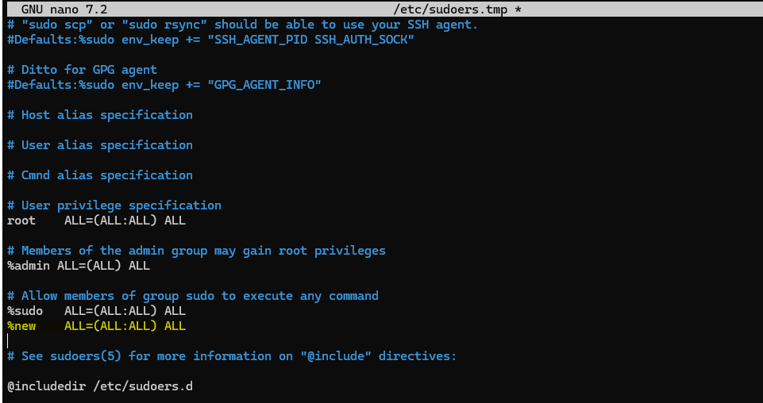

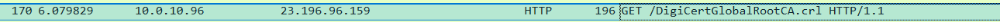

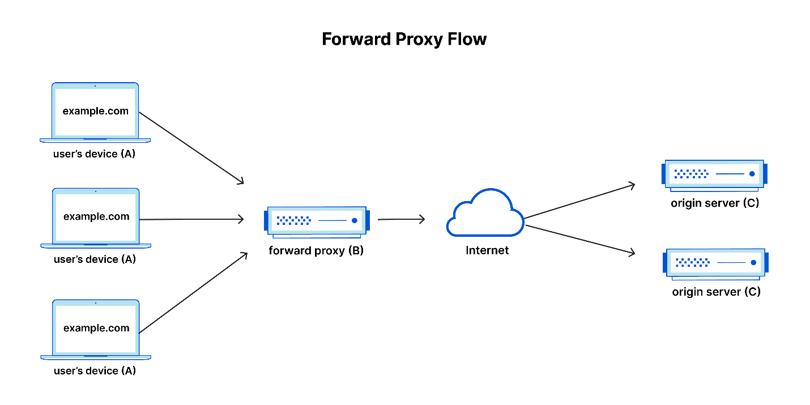

לעומת זאת אם נעשה su יחד עם סימן ה- נוכל לראות שגם משתני הshell שונו עבור המשתנים של root

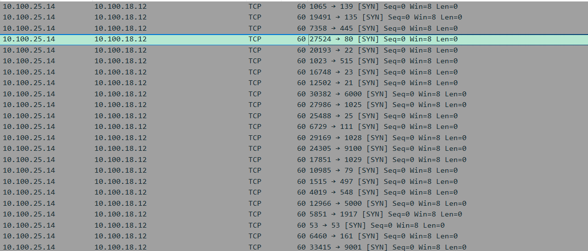

#### **קבצי נתוני משתמש חשובים:**

##### **/etc/passwd**

קובץ טקסט ששומר בתוכו מידע ונתונים על כל חשבון משתמש , זה הוא מיפוי של כל המשתמשים במערכת , הוא שומר בתוכו את הנתונים לפי השדות בפורמט הבא בהתאמה :

- שם המשתמש
- ממלא מקום X שזה הסיסמה (לא גלויה)
- UID
- GID
- מידע והערות לגביו
- תקיית הבית של המשתמש
- command\shell של המשתמש.

בעבר הקובץ היה שומר גם את סיסמאות המשתמשים אך התברר כי זה לא אבטחתי ישנם תהליכים או אפליקציות שיש להם גישה לקובץ וכך תוקף שמשיג שליטה עליהם יכול גם הוא להשיג גישה לקובץ וכך ניתן בעזרת התקפות מסויימות להשיג את הסיסמאות של המשתמשים ( מתקפות כמו dictionery attack בהם מנסים המון סיסמאות שכיחות בשביל לנסות לפצח מה היא הסיסמה למרות שהיא שמורה כhash).

: /etc/passwd פורט הכתיבה של הנתונים בקובץ

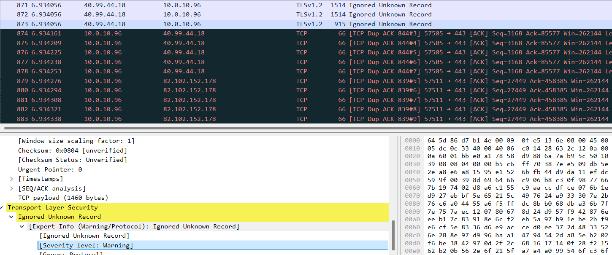

##### **/etc/shadow**

קובץ טקסט זה מכיל מיפוי של הנתונים הרגישים של המשתמשים לפי שם המשתמש , הנתונים נשמרים בפורמט מסויים זהה עבור כל משתמש , השדות בפורמט הם השדות הבאים בהתאמה :

- שם המשתמש
- הסיסמה של המשתמש (באופן מוצפן)
- כמה עבר מאז שהמשתמש שינה את הסיסמה שלו (במידה והמספר שמופיע שם הוא 0 המשתמש צריך לשנות את הסיסמה בהתחברות הבא שלו , ואם השדה ריק אז ההגדרה של התיישנות הסיסמה לא פועלת כלומר מדוסבלת)
- מרווח הזמן המינימלי שצריך לעבור בשביל שהמשתמש יוכל לשנות את הסיסמה שלו (אם המספר הוא 0 אז אין מרווח מינימלי)
- ,הזמן המקסימלי של תוקף הסיסמה (כלומר לכמה זמן הסיסמה תקפה עד שהמשתמש יוכרח להחליף סיסמה)
- מספר הימים לפני שהמשתמש יותרע שהוא צריך לשנות סיסמה (כלומר מציין כמה ימים מראש המשתמש יקבל התרעה לפני שסיסמתו פגה תוקף)
- לכמה זמן לאחר שהמשתמש דוסבל הסיסמה עדיין תקפה
- תאריך תפוגת התוקף של המשתמש בימים

הסיסמאות של המשתמשים שמורות כhash ורק למשתמש בהרשאות root יש גישה לקובץ הזה.

הפורמט שבו נשמרות הסיסמאות הוא פורמט שמציג לנו מידע על הצורה בה הסיסמה שמורה , ניתן לראות בכל אחד מהשדות של הסיסמאות בכל משתמש בו הסיסמה שמורה כhash שהפורמט בו נשמרות הסיסמרות הוא הפורמט:

$id$salt$hashed

כך שכל שדה בפורמט מסמל משהו אחר:

- **Id** - שדה שבעזרתו אפשר לזהות מה הוא האלגוריתם בעזרתו נעשה הhash של הסיסמה
- **slat** - מחרוזת רנדומלית שמתווספת לסיסמה לפני שעושים עליה את פונקצית הhash , מחרוזת זאת עוזרת להקטין את הסיכוי לפענוח הסיסמה.
- **hashed** - הסיסמה אחרי שנעשה עליה פונקציית hash ( הsalt נכלל שם)

: /etc/passwd פורמט הכתיבה של הנתונים בקובץ

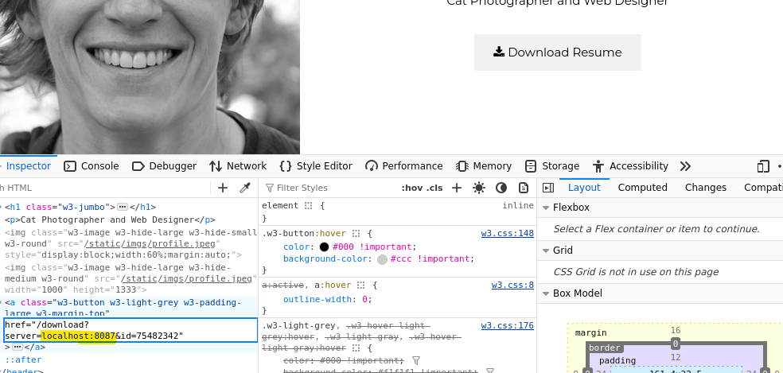

##### **/etc/group**

קובץ טקסט שמכיל בתוכו מיפוי של הקבוצות לפי שמות הקבוצות , הנתונים נשמרים בשדות בפורמט הבאה בהתאמה :

- שם הקבוצה
- הסיסמה של הקבוצה
- הGID
- 13092022
- המשתמשים של כל קבוצה

הקובץ משמש בשביל למפות את הקבוצות שקיימות והמשתמשים שנמאים בתוכן , השימוש בקבוצה מאפשר שיתוף משאבים וניהול קל יותר של הרשאות ומשתמשים.

: /etc/group פורמט הכתיבה של הנתונים בקובץ

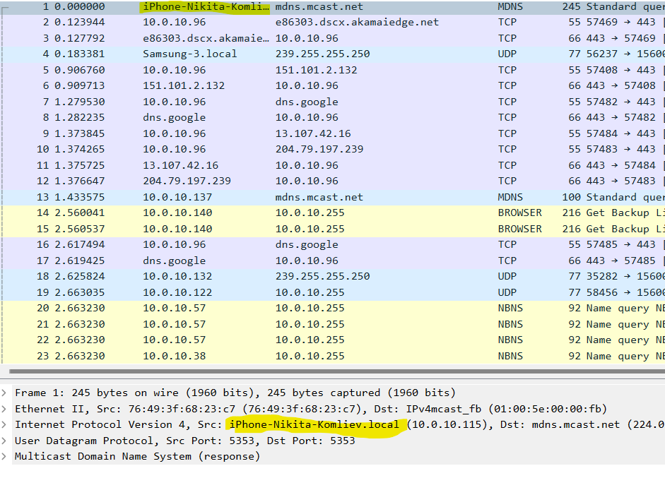

### **Navigaton in Shell:**

pwd - מחזיר את המיקום הנוכחי של המשתמש , מדפיס למסך את התיקייה שהמשתמש "נמצא" בה בזה הרגע.

ls - מדפיס את הרשימה ש לכל התקיות והקבצים שנמצאים בנתיב מסוים , התיקייה הנוכחית היא ברירת המחדל.

tree - מציג באופן ריקורסיבי היררכי את מבנה התקיות והקבצים שנמצאים בנתיב מסים , הוא מדפיס אותם למסך במבנה של עץ עם ענפים לפי הצורה ההיררכית שלהם.

cd - בשם המלא change directory מאפשר להחליף תקיה נוכחית , כלומר לעבור אל תקיה אחרת עליה "נעבוד".

exit - יוצא מהsession של הshell הנוכחית.

env - מציג את כל משתני הסביבה

### **תרגול פקודות:**

#### **מניפולצית טקסט לינוקס:**

הורדת קובץ words (קובץ בו יש המון מילים בשורות שונות) , הקובץ ימצא בנתיב:

/usr/share/dict/words

1. הדפסת 27 השורות הראשונות:
    - head -n 27 /usr/share/dict/words
2. הדפסת 30 השורות התחתונות:
    - tail -n 30 /usr/share/dict/words
3. פתיחת הקובץ ב'מצב מתמשך' , כלומר מספיס למסך מה שמתעדכן בקובץ:
4. [tail –f [filename
5. הדפסת מספר השורות בקובץ:
    - wc –l /usr/share/dict/words
6. הדפסת הקובץ כאשר כל מופע של האות 'a' מוחלף במילב Alpha :
    - sed "s/a/Alpah/g" /usr/share/dict/words
    - הסבר דגלים של הסקריפט :
        - s - דגל רגקס , מוצא דפוס מסוים ומחליף אותו בדפוס אחר , אינו שאפתן (עושה זאת פעם אחת כל פעם שמוצא).
        - g – דגל שאפתן , גורם לפקודה sed לעשות כמה שיותר החלפות בכל שורה בטקסט.
7. הדפס התור הראשון בקובץ : "/etc/fstab" בעזרת הפקודות ask וcut:
    - awk '{print $1}' /etc/fstab
    - cut -d " " -f -1 /etc/fstab
8. הדפס למסך רק את המילים שמכילים את הרצף abc בקובץ /usr/share/dict/words :
    - cat /usr/share/dict/words | grep abc

#### **משתני Shell ומשתנים סביבתיים:**

1. הצגת כל המשתנים הסביבתיים:
    - env
2. צור משתנה shell בשם WELCOME כתוב בו את המילה hello world ותדפיס אותו עם echo:
    - WELCOME="hello world" | echo $WELCOME
3. הפוך את המשתנה shell למשתנה סביבתי ותדפיס אותו עם printenv:
    - export WELCOME
    - printenv WELCOME
4. הפיכת המשתנה לקבוע בכל התחברות או session:
    - sudo nano /etc/profile
    - כתיבת הפקודה בסוף הקובץ:

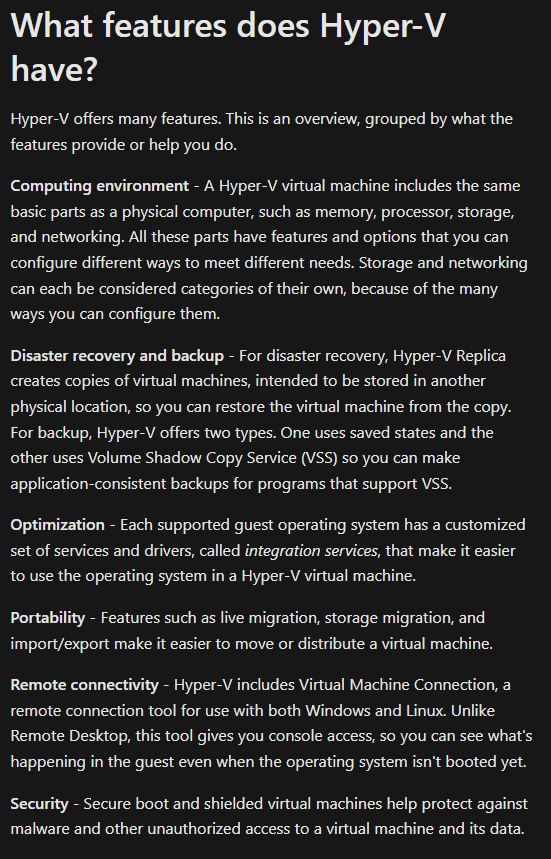

- - שמירת הקובץ על ידי CTRL+S
    - CTRL+X בשביל לסגור את עורך הטקסט

#### **משתמשים וקבוצות:**

* שימוש בsudo עבור משתמש שאין לו הרשאות חזקות כברירת מחדל

* באופן כללי - בחלק מהפקודות בלינוקס אם לא נציין גורם ספציפי עליו אנחנו עושים את הפעולה של הפקודה , המערכת תחשוב שאנחנו מתכוונים לשמתמש הנוכחי ותבצע את הפעולה עליו.

1. הוספת משתמש חדש
    1. sudo useradd [username]
        - אם נרצה להוסיף משתמש עם סיסמה
            1. sudo useradd -p [password] [username]
2. הוספת קבוצה חדשה
    1. sudo groupadd [groupname]
3. הוספת משתמש לקבוצה
    1. sudo usermod [username] -G [groupname]
    2. sudo groupmod [groupname] -U [username]
4. שינוי שם של קבוצה
    1. sudo groupmod [groupname] -n [new_groupname]
5. שינוי סיסמה של משתמש
    1. sudo passwd [username]
    2. sudo usermod -p [password] [username]
6. הוספת משתמש לקבוצת sudoers בעזרת פקודה
    1. sudo usermod -aG sudo [username]
        - הדגל -a מסמל append ומשמש יחד עם הדגל -G שמשמש בשביל לציין רשימה של קבוצות , כלומר יחד מאפשרים להוסיף את המשתמש למספר קבוצות חדשות בלי להסיר אותו מהקבוצה המקורית שלו.
    2. sudo groupmod sudo -U [username]
7. הסרת המשתמש מקבוצת sudo
    1. sudo usermod -rG sudo [username]
8. הוספת קבוצת משתמש להיות קבוצת sudoers עם פקודת visudo
    1. הפקודה sudo visudo תפתח לנו את הקובץ sudoers (sudoers file) , שנמצא בנתיב - /etc/sudoers
    2. נכתוב הקובץ את השורה הבאה ונשמור

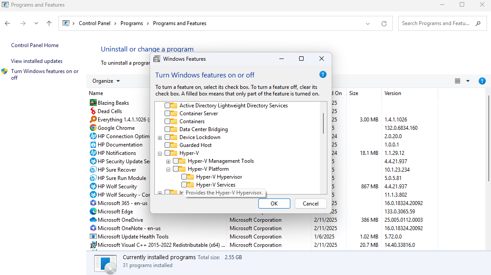

1. יצירת משתמש באופן ידני ללא הפקודה useradd
    1. נפתח לעריכה את הקבצים בעזרת הפקודה nano ונוסיף את השורות הבאות:
    2. sudo nano /etc/passwd
        - new:x:1010:1010::/home/new:/bin/sh
        - 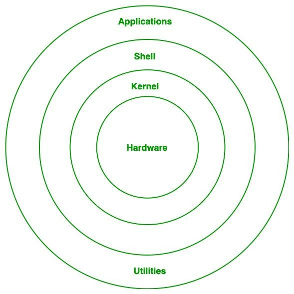
    3. sudo nano /etc/group
        - new:x:1010:new
        - 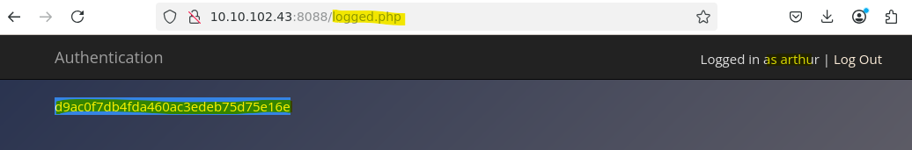
    4. ניצור למשתמש סיסמה עם הפקודה passwd
        - sudo passwd new
    5. ניצור למשתמש תקיית בית בעזרת תקיית /etc/skel שבעזרת נוצרות תקיות הבית במערכת
        - cp --recursive /etc/skel /home/new
    6. נהפוך את תקיית המשתמש להיות בבעלותו
        - chown --recursive new:new /home/new
    7. ניתן למשתמש את כל ההרשאות על התקייה שלו
        - sudo chmod --recursive 0700 /home/new
    8. 

#### **ניווט בתוך הSHELL:**

1. כיצד לראות קבצים נסתרים ?
    1. ls -la
2. כיצד ניתן לראות גדלים של קבצים בפורט שקריא לבני אדם?
    1. du -h
    2. ls -lh
3. שינוי התקייה הנוכחית לתקיית הבית (home) של המשתמש
    1. ~ cd (נכתב הפוך בקובץ , אמור להכתב cd ~ אבל זה נכתב הפוך פה)
4. שינוי לתקייה האחרונה שהיינו בה לפני הנוכחית:
    1. - cd (נכתב הפוך בקובץ , אמור להכתב cd - אבל זה נכתב הפוך פה)
5. מעבר לתקיית האב של התקייה הנוכחית של המשתמש:
    1. .. cd (נכתב הפוך בקובץ , אמור להכתב cd .. אבל זה נכתב הפוך פה)
6. מה יקרה אם ניהיה בתקיית הroot ונעשה .. cd?
    1. נגיע לתקיית / התקיה הראשית , נקראית גם תקיית הנתיב האבסולוטי , מכיוון ובמערכת הקבצים של לינוקס הכל מסודר במבנה של עץ אז ה - / זה ההתחלה של העץ , זה החלק ממנו יוצאים כל שאר הענפים כלומר שאר הקבצים והתקיות , זו התקייה הראשית.

* ניתן להקביל את התקייה / ל - :C בווינדואוס.

## **מאמרים ומקורות מידע - Linux:**

[אתר שמסביר מה זה לינוקס](https://www.redhat.com/en/topics/linux/what-is-linux)

[אתר שמסביר מה זה הקרנל של לינוקס](https://www.redhat.com/en/topics/linux/what-is-the-linux-kernel)

[אתר עם המון פקודות נפוצות שיש בלינוקס ובעוד מערכות הפעלה אחרות והסברים עליהם](https://ss64.com)

[העץ המשפחתי של כל ההפצות של לינוקס](https://distrowatch.com/dwres.php?resource=family-tree)

[הסבר של Microsoft על התקנת WSL - לינוקס על ווינדוס](https://learn.microsoft.com/en-us/windows/wsl/install)

## **נושאים נוספים להסביר:**

מה זה pipline?

מה זה דגלים של פקודה?

כיצד ניתן ליצור קובץ?

מה ההבדל בין symbolic link ל physical link

פקודות להוסיף :

הפקודה du

הפקודה find

הפקודה alias

הפקודה env

הפקודה history

הפקודה ip

הפקודה ifconfig

הפקודה lsof

הפקודה mkdir

הפקודה mkfile

הפקודה most

הפקודה mv

הפקודה nestat

הפקודה pgrep

הפקודה pkill

הפקודה ps

הפקודה rm

הפקודה rmdir

הפקודה sort

הפקודה touch

הפקודה whoami

הפקודה who

הפקודה w

הפקודה which

הפקודה whereis

הפקודה apropos

הפקודה nano

הפקודה vi

הפקודה vim
