# Reading Order Flowchart

This flowchart shows the recommended reading order for the Application Security study materials.

```mermaid
graph TD
    Start([Start: AppSec - חפיפה])
    
    %% רשתות Section
    Start --> N1[רשתות: מודל שבע השכבות]
    N1 --> N2[השכבה השנייה הרחבה]
    N2 --> N3[השכבה השלישית הרחבה]
    N3 --> N4[השכבה הרביעית הרחבה]
    N4 --> N5[השכבה השישית הרחבה]
    N5 --> N6[השכבה השביעית הרחבה]
    N6 --> N7[TLS-SSL]
    N7 --> N8[Wireshark]
    N8 --> N9[Tunneling]
    N9 --> N10[מאמרים ומקורות מידע - רשתות]
    
    %% Linux Section
    N10 --> L1[Linux: לינוקס בסיסי]
    
    %% וירטואליזציה Section
    L1 --> V1[וירטואליזציה: Cloud – High Level]
    V1 --> V2[מה זה on-prem והבדל מענן]
    V2 --> V3[בסיס של ענן]
    V3 --> V4[Containers]
    V4 --> V5[Kubernetes]
    V5 --> V6[מאמרים ומקורות מידע - וירטואליזציה]
    
    %% Git & GitHub Section
    V6 --> G1[GIT & GITHUB: Git]
    G1 --> G2[GitHub]
    G2 --> G3[מאמרים ומקורות]
    
    %% CI/CD Section
    G3 --> C1[CI-CD: What Is CI-CD]
    C1 --> C2[Blue-Green Deployment Technique]
    C2 --> C3[Canary Deployments]
    C3 --> C4[DevOps Pipeline]
    C4 --> C5[מאמרים ומקורות]
    
    %% DevSecOps Section
    C5 --> D1[DevSecOps: DevSecOps Explained]
    D1 --> D2[SAST]
    D2 --> D3[SCA]
    D3 --> D4[Posture Management]
    D4 --> D5[Secret Detection]
    D5 --> D6[Other Tools]
    D6 --> D7[JFrog]
    D7 --> D8[מאמרים מקורות]
    
    %% Security Section
    D8 --> S1[Security: Cryptography]
    S1 --> S2[PKI]
    S2 --> S3[Authentication and Authorization]
    S3 --> S4[Vulnerabilities and Exploits]
    S4 --> S5[Web Attacks]
    S5 --> S6[AppSec]
    S6 --> S7[Secret Management]
    S7 --> S8[Network Security]
    S8 --> S9[Endpoint Security]
    S9 --> S10[SIEM]
    S10 --> S11[Concepts]
    S11 --> S12[מאמרים מקורות]
    
    %% ספקי ענן Section
    S12 --> CP1[ספקי ענן: What is a Cloud Provider]
    CP1 --> CP2[Shared Responsibility Model]
    CP2 --> CP3[Threat Modeling]
    CP3 --> CP4[What is SDN]
    CP4 --> CP5[Horizontal vs vertical scaling]
    CP5 --> CP6[Hub & Spoke network topology]
    CP6 --> CP7[East-West traffic]
    CP7 --> CP8[North-South traffic]
    CP8 --> CP9[Egress and Ingress]
    CP9 --> CP10[AWS]
    CP10 --> CP11[GCP]
    CP11 --> CP12[AZURE]
    
    %% ענן Section
    CP12 --> CL1[ענן: CWPP]
    CL1 --> CL2[DSPM]
    CL2 --> CL3[SASE]
    CL3 --> CL4[CASB]
    CL4 --> CL5[API בענן]
    
    %% נושאים נוספים Section
    CL5 --> A1[נושאים נוספים: Networking]
    A1 --> A2[סתם מעניין לבדוק]
    
    %% WIZ Section
    A2 --> W1[WIZ: Topics to add in wiz Hafifa]
    
    W1 --> End([End: Study Complete])
    
    %% Clickable Links
    click N1 "https://github.com/Nturdsh27/AppSec-Hafifa/blob/main/Application%20Security%20Hafifa/Hafifa/AppSec%20-%20Hafifa/רשתות/מודל%20שבע%20השכבות.md"
    click N2 "https://github.com/Nturdsh27/AppSec-Hafifa/blob/main/Application%20Security%20Hafifa/Hafifa/AppSec%20-%20Hafifa/רשתות/השכבה%20השנייה%20הרחבה.md"
    click N3 "https://github.com/Nturdsh27/AppSec-Hafifa/blob/main/Application%20Security%20Hafifa/Hafifa/AppSec%20-%20Hafifa/רשתות/השכבה%20השלישית%20הרחבה.md"
    click N4 "https://github.com/Nturdsh27/AppSec-Hafifa/blob/main/Application%20Security%20Hafifa/Hafifa/AppSec%20-%20Hafifa/רשתות/השכבה%20הרביעית%20הרחבה-.md"
    click N5 "https://github.com/Nturdsh27/AppSec-Hafifa/blob/main/Application%20Security%20Hafifa/Hafifa/AppSec%20-%20Hafifa/רשתות/השכבה%20השישית%20הרחבה-.md"
    click N6 "https://github.com/Nturdsh27/AppSec-Hafifa/blob/main/Application%20Security%20Hafifa/Hafifa/AppSec%20-%20Hafifa/רשתות/השכבה%20השביעית%20הרחבה-.md"
    click N7 "https://github.com/Nturdsh27/AppSec-Hafifa/blob/main/Application%20Security%20Hafifa/Hafifa/AppSec%20-%20Hafifa/רשתות/TLS-SSL%20-.md"
    click N8 "https://github.com/Nturdsh27/AppSec-Hafifa/blob/main/Application%20Security%20Hafifa/Hafifa/AppSec%20-%20Hafifa/רשתות/Wireshark%20-.md"
    click N9 "https://github.com/Nturdsh27/AppSec-Hafifa/blob/main/Application%20Security%20Hafifa/Hafifa/AppSec%20-%20Hafifa/רשתות/Tunneling-.md"
    click N10 "https://github.com/Nturdsh27/AppSec-Hafifa/blob/main/Application%20Security%20Hafifa/Hafifa/AppSec%20-%20Hafifa/רשתות/מאמרים%20ומקורות%20מידע%20-%20רשתות-.md"
    click L1 "https://github.com/Nturdsh27/AppSec-Hafifa/blob/main/Application%20Security%20Hafifa/Hafifa/AppSec%20-%20Hafifa/Linux/לינוקס%20בסיסי-.md"
    click V1 "https://github.com/Nturdsh27/AppSec-Hafifa/blob/main/Application%20Security%20Hafifa/Hafifa/AppSec%20-%20Hafifa/וירטואליזציה-/Cloud%20–%20High%20Level-.md"
    click V2 "https://github.com/Nturdsh27/AppSec-Hafifa/blob/main/Application%20Security%20Hafifa/Hafifa/AppSec%20-%20Hafifa/וירטואליזציה-/מה%20זה%20on-prem%20ומה%20ההבדל%20בין%20סביבת%20ענן%20לסביבת%20on-prem-.md"
    click V3 "https://github.com/Nturdsh27/AppSec-Hafifa/blob/main/Application%20Security%20Hafifa/Hafifa/AppSec%20-%20Hafifa/וירטואליזציה-/בסיס%20של%20ענן-.md"
    click V4 "https://github.com/Nturdsh27/AppSec-Hafifa/blob/main/Application%20Security%20Hafifa/Hafifa/AppSec%20-%20Hafifa/וירטואליזציה-/Containers-.md"
    click V5 "https://github.com/Nturdsh27/AppSec-Hafifa/blob/main/Application%20Security%20Hafifa/Hafifa/AppSec%20-%20Hafifa/וירטואליזציה-/Kubernetes-.md"
    click V6 "https://github.com/Nturdsh27/AppSec-Hafifa/blob/main/Application%20Security%20Hafifa/Hafifa/AppSec%20-%20Hafifa/וירטואליזציה-/מאמרים%20ומקורות%20מידע%20-%20וירטואליזציה-.md"
    click G1 "https://github.com/Nturdsh27/AppSec-Hafifa/blob/main/Application%20Security%20Hafifa/Hafifa/AppSec%20-%20Hafifa/GIT%20&%20GITHUB/Git.md"
    click G2 "https://github.com/Nturdsh27/AppSec-Hafifa/blob/main/Application%20Security%20Hafifa/Hafifa/AppSec%20-%20Hafifa/GIT%20&%20GITHUB/GitHub.md"
    click G3 "https://github.com/Nturdsh27/AppSec-Hafifa/blob/main/Application%20Security%20Hafifa/Hafifa/AppSec%20-%20Hafifa/GIT%20&%20GITHUB/מאמרים%20ומקורות-.md"
    click C1 "https://github.com/Nturdsh27/AppSec-Hafifa/blob/main/Application%20Security%20Hafifa/Hafifa/AppSec%20-%20Hafifa/CI-CD-/What%20Is%20CI-CD%20And%20The%20Diffrences%20Between%20CI%20And%20CD-.md"
    click C2 "https://github.com/Nturdsh27/AppSec-Hafifa/blob/main/Application%20Security%20Hafifa/Hafifa/AppSec%20-%20Hafifa/CI-CD-/Blue-Green%20Deployment%20Technique-.md"
    click C3 "https://github.com/Nturdsh27/AppSec-Hafifa/blob/main/Application%20Security%20Hafifa/Hafifa/AppSec%20-%20Hafifa/CI-CD-/Canary%20Deployments-.md"
    click C4 "https://github.com/Nturdsh27/AppSec-Hafifa/blob/main/Application%20Security%20Hafifa/Hafifa/AppSec%20-%20Hafifa/CI-CD-/DevOps%20Pipeline-.md"
    click C5 "https://github.com/Nturdsh27/AppSec-Hafifa/blob/main/Application%20Security%20Hafifa/Hafifa/AppSec%20-%20Hafifa/CI-CD-/מאמרים%20ומקורות-.md"
    click D1 "https://github.com/Nturdsh27/AppSec-Hafifa/blob/main/Application%20Security%20Hafifa/Hafifa/AppSec%20-%20Hafifa/DevSecOps/DevSecOps%20Explained.md"
    click D2 "https://github.com/Nturdsh27/AppSec-Hafifa/blob/main/Application%20Security%20Hafifa/Hafifa/AppSec%20-%20Hafifa/DevSecOps/SAST.md"
    click D3 "https://github.com/Nturdsh27/AppSec-Hafifa/blob/main/Application%20Security%20Hafifa/Hafifa/AppSec%20-%20Hafifa/DevSecOps/SCA.md"
    click D4 "https://github.com/Nturdsh27/AppSec-Hafifa/blob/main/Application%20Security%20Hafifa/Hafifa/AppSec%20-%20Hafifa/DevSecOps/Posture%20Management.md"
    click D5 "https://github.com/Nturdsh27/AppSec-Hafifa/blob/main/Application%20Security%20Hafifa/Hafifa/AppSec%20-%20Hafifa/DevSecOps/Secret%20Detection.md"
    click D6 "https://github.com/Nturdsh27/AppSec-Hafifa/blob/main/Application%20Security%20Hafifa/Hafifa/AppSec%20-%20Hafifa/DevSecOps/Other%20Tools.md"
    click D7 "https://github.com/Nturdsh27/AppSec-Hafifa/blob/main/Application%20Security%20Hafifa/Hafifa/AppSec%20-%20Hafifa/DevSecOps/JFrog.md"
    click D8 "https://github.com/Nturdsh27/AppSec-Hafifa/blob/main/Application%20Security%20Hafifa/Hafifa/AppSec%20-%20Hafifa/DevSecOps/מאמרים%20מקורות-.md"
    click S1 "https://github.com/Nturdsh27/AppSec-Hafifa/blob/main/Application%20Security%20Hafifa/Hafifa/AppSec%20-%20Hafifa/Security/Cryptography.md"
    click S2 "https://github.com/Nturdsh27/AppSec-Hafifa/blob/main/Application%20Security%20Hafifa/Hafifa/AppSec%20-%20Hafifa/Security/PKI.md"
    click S3 "https://github.com/Nturdsh27/AppSec-Hafifa/blob/main/Application%20Security%20Hafifa/Hafifa/AppSec%20-%20Hafifa/Security/Authentication%20and%20Authorization.md"
    click S4 "https://github.com/Nturdsh27/AppSec-Hafifa/blob/main/Application%20Security%20Hafifa/Hafifa/AppSec%20-%20Hafifa/Security/Vulnerabilities%20and%20Exploits.md"
    click S5 "https://github.com/Nturdsh27/AppSec-Hafifa/blob/main/Application%20Security%20Hafifa/Hafifa/AppSec%20-%20Hafifa/Security/Web%20Attacks.md"
    click S6 "https://github.com/Nturdsh27/AppSec-Hafifa/blob/main/Application%20Security%20Hafifa/Hafifa/AppSec%20-%20Hafifa/Security/AppSec.md"
    click S7 "https://github.com/Nturdsh27/AppSec-Hafifa/blob/main/Application%20Security%20Hafifa/Hafifa/AppSec%20-%20Hafifa/Security/Secret%20Management.md"
    click S8 "https://github.com/Nturdsh27/AppSec-Hafifa/blob/main/Application%20Security%20Hafifa/Hafifa/AppSec%20-%20Hafifa/Security/Network%20Security.md"
    click S9 "https://github.com/Nturdsh27/AppSec-Hafifa/blob/main/Application%20Security%20Hafifa/Hafifa/AppSec%20-%20Hafifa/Security/Endpoint%20Security.md"
    click S10 "https://github.com/Nturdsh27/AppSec-Hafifa/blob/main/Application%20Security%20Hafifa/Hafifa/AppSec%20-%20Hafifa/Security/SIEM.md"
    click S11 "https://github.com/Nturdsh27/AppSec-Hafifa/blob/main/Application%20Security%20Hafifa/Hafifa/AppSec%20-%20Hafifa/Security/Concepts.md"
    click S12 "https://github.com/Nturdsh27/AppSec-Hafifa/blob/main/Application%20Security%20Hafifa/Hafifa/AppSec%20-%20Hafifa/Security/מאמרים%20מקורות-.md"
    click CP1 "https://github.com/Nturdsh27/AppSec-Hafifa/blob/main/Application%20Security%20Hafifa/Hafifa/AppSec%20-%20Hafifa/ספקי%20ענן/What%20is%20a%20Cloud%20Provider.md"
    click CP2 "https://github.com/Nturdsh27/AppSec-Hafifa/blob/main/Application%20Security%20Hafifa/Hafifa/AppSec%20-%20Hafifa/ספקי%20ענן/What%20is%20the%20Shared%20Responsibility%20Model.md"
    click CP3 "https://github.com/Nturdsh27/AppSec-Hafifa/blob/main/Application%20Security%20Hafifa/Hafifa/AppSec%20-%20Hafifa/ספקי%20ענן/Threat%20Modeling.md"
    click CP4 "https://github.com/Nturdsh27/AppSec-Hafifa/blob/main/Application%20Security%20Hafifa/Hafifa/AppSec%20-%20Hafifa/ספקי%20ענן/What%20is%20SDN.md"
    click CP5 "https://github.com/Nturdsh27/AppSec-Hafifa/blob/main/Application%20Security%20Hafifa/Hafifa/AppSec%20-%20Hafifa/ספקי%20ענן/Explain%20the%20difference%20between%20Horizontal%20vs%20vertical%20scaling.md"
    click CP6 "https://github.com/Nturdsh27/AppSec-Hafifa/blob/main/Application%20Security%20Hafifa/Hafifa/AppSec%20-%20Hafifa/ספקי%20ענן/What%20is%20a%20Hub%20&%20Spoke%20network%20topology.md"
    click CP7 "https://github.com/Nturdsh27/AppSec-Hafifa/blob/main/Application%20Security%20Hafifa/Hafifa/AppSec%20-%20Hafifa/ספקי%20ענן/What%20is%20East-West%20traffic.md"
    click CP8 "https://github.com/Nturdsh27/AppSec-Hafifa/blob/main/Application%20Security%20Hafifa/Hafifa/AppSec%20-%20Hafifa/ספקי%20ענן/What%20is%20North-South%20traffic.md"
    click CP9 "https://github.com/Nturdsh27/AppSec-Hafifa/blob/main/Application%20Security%20Hafifa/Hafifa/AppSec%20-%20Hafifa/ספקי%20ענן/Explain%20the%20difference%20between%20Egress%20and%20Ingress.md"
    click CP10 "https://github.com/Nturdsh27/AppSec-Hafifa/blob/main/Application%20Security%20Hafifa/Hafifa/AppSec%20-%20Hafifa/ספקי%20ענן/AWS.md"
    click CP11 "https://github.com/Nturdsh27/AppSec-Hafifa/blob/main/Application%20Security%20Hafifa/Hafifa/AppSec%20-%20Hafifa/ספקי%20ענן/GCP.md"
    click CP12 "https://github.com/Nturdsh27/AppSec-Hafifa/blob/main/Application%20Security%20Hafifa/Hafifa/AppSec%20-%20Hafifa/ספקי%20ענן/AZURE.md"
    click CL1 "https://github.com/Nturdsh27/AppSec-Hafifa/blob/main/Application%20Security%20Hafifa/Hafifa/AppSec%20-%20Hafifa/ענן/CWPP%20-%20Cloud%20Workload%20Protection%20Platform.md"
    click CL2 "https://github.com/Nturdsh27/AppSec-Hafifa/blob/main/Application%20Security%20Hafifa/Hafifa/AppSec%20-%20Hafifa/ענן/DSPM%20-%20Data%20Security%20Posture%20Management.md"
    click CL3 "https://github.com/Nturdsh27/AppSec-Hafifa/blob/main/Application%20Security%20Hafifa/Hafifa/AppSec%20-%20Hafifa/ענן/SASE-.md"
    click CL4 "https://github.com/Nturdsh27/AppSec-Hafifa/blob/main/Application%20Security%20Hafifa/Hafifa/AppSec%20-%20Hafifa/ענן/CASB-.md"
    click CL5 "https://github.com/Nturdsh27/AppSec-Hafifa/blob/main/Application%20Security%20Hafifa/Hafifa/AppSec%20-%20Hafifa/ענן/API%20בענן.md"
    click A1 "https://github.com/Nturdsh27/AppSec-Hafifa/blob/main/Application%20Security%20Hafifa/Hafifa/AppSec%20-%20Hafifa/נושאים%20נוספים%20שצריך%20ללמוד%20לדעתי-/Networking-.md"
    click A2 "https://github.com/Nturdsh27/AppSec-Hafifa/blob/main/Application%20Security%20Hafifa/Hafifa/AppSec%20-%20Hafifa/נושאים%20נוספים%20שצריך%20ללמוד%20לדעתי-/סתם%20מעניין%20לבדוק-.md"
    click W1 "https://github.com/Nturdsh27/AppSec-Hafifa/blob/main/Application%20Security%20Hafifa/Hafifa/AppSec%20-%20Hafifa/WIZ/Topics%20to%20add%20in%20wiz%20Hafifa.md"
    
    %% Styling
    classDef networkStyle fill:#e1f5ff,stroke:#01579b,stroke-width:2px
    classDef linuxStyle fill:#fff9c4,stroke:#f57f17,stroke-width:2px
    classDef virtStyle fill:#f3e5f5,stroke:#4a148c,stroke-width:2px
    classDef gitStyle fill:#e8f5e9,stroke:#1b5e20,stroke-width:2px
    classDef cicdStyle fill:#fff3e0,stroke:#e65100,stroke-width:2px
    classDef devsecStyle fill:#fce4ec,stroke:#880e4f,stroke-width:2px
    classDef secStyle fill:#ffebee,stroke:#b71c1c,stroke-width:2px
    classDef cloudProvStyle fill:#e0f2f1,stroke:#004d40,stroke-width:2px
    classDef cloudStyle fill:#e1bee7,stroke:#4a148c,stroke-width:2px
    classDef addStyle fill:#f1f8e9,stroke:#33691e,stroke-width:2px
    classDef wizStyle fill:#fff59d,stroke:#f57f17,stroke-width:2px
    classDef startEnd fill:#90caf9,stroke:#0d47a1,stroke-width:3px
    
    class N1,N2,N3,N4,N5,N6,N7,N8,N9,N10 networkStyle
    class L1 linuxStyle
    class V1,V2,V3,V4,V5,V6 virtStyle
    class G1,G2,G3 gitStyle
    class C1,C2,C3,C4,C5 cicdStyle
    class D1,D2,D3,D4,D5,D6,D7,D8 devsecStyle
    class S1,S2,S3,S4,S5,S6,S7,S8,S9,S10,S11,S12 secStyle
    class CP1,CP2,CP3,CP4,CP5,CP6,CP7,CP8,CP9,CP10,CP11,CP12 cloudProvStyle
    class CL1,CL2,CL3,CL4,CL5 cloudStyle
    class A1,A2 addStyle
    class W1 wizStyle
    class Start,End startEnd
```

## Study Sections Overview

### Click any link below to jump to that file:

#### 1. רשתות (Networks) - 10 topics
1. [מודל שבע השכבות](רשתות/מודל%20שבע%20השכבות.md)
2. [השכבה השנייה הרחבה](רשתות/השכבה%20השנייה%20הרחבה.md)
3. [השכבה השלישית הרחבה](רשתות/השכבה%20השלישית%20הרחבה.md)
4. [השכבה הרביעית הרחבה](השכבה%20הרביעית%20הרחבה.md)
5. [השכבה השישית הרחבה](השכבה%20השישית%20הרחבה.md)
6. [השכבה השביעית הרחבה](השכבה%20השביעית%20הרחבה.md)
7. [TLS-SSL](TLS-SSL.md)
8. [Wireshark](Wireshark.md)
9. [Tunneling](Tunneling.md)
10. [מאמרים ומקורות מידע - רשתות](מאמרים%20ומקורות%20מידע%20-%20רשתות.md)

#### 2. Linux - 1 topic
11. [לינוקס בסיסי](Linux/לינוקס%20בסיסי-.md)

#### 3. וירטואליזציה (Virtualization) - 6 topics
12. [Cloud – High Level](Cloud%20–%20High%20Level.md)
13. [מה זה on-prem ומה ההבדל בין סביבת ענן לסביבת on-prem](מה%20זה%20on-prem%20ומה%20ההבדל%20בין%20סביבת%20ענן%20לסביבת%20on-prem.md)
14. [בסיס של ענן](בסיס%20של%20ענן.md)
15. [Containers](Containers.md)
16. [Kubernetes](Kubernetes.md)
17. [מאמרים ומקורות מידע - וירטואליזציה](מאמרים%20ומקורות%20מידע%20-%20וירטואליזציה.md)

#### 4. GIT & GITHUB - 3 topics
18. [Git](GIT%20&%20GITHUB/Git.md)
19. [GitHub](GIT%20&%20GITHUB/GitHub.md)
20. [מאמרים ומקורות](Hafifa/AppSec%20-%20Hafifa/GIT%20&%20GITHUB/מאמרים%20ומקורות.md)

#### 5. CI/CD - 5 topics
21. [What Is CI-CD And The Differences Between CI And CD](What%20Is%20CI-CD%20And%20The%20Diffrences%20Between%20CI%20And%20CD.md)
22. [Blue-Green Deployment Technique](Blue-Green%20Deployment%20Technique.md)
23. [Canary Deployments](Canary%20Deployments.md)
24. [DevOps Pipeline](DevOps%20Pipeline.md)
25. [מאמרים ומקורות](Hafifa/AppSec%20-%20Hafifa/CI-CD/מאמרים%20ומקורות.md)

#### 6. DevSecOps - 8 topics
26. [DevSecOps Explained](DevSecOps/DevSecOps%20Explained.md)
27. [SAST](DevSecOps/SAST.md)
28. [SCA](DevSecOps/SCA.md)
29. [Posture Management](DevSecOps/Posture%20Management.md)
30. [Secret Detection](DevSecOps/Secret%20Detection.md)
31. [Other Tools](DevSecOps/Other%20Tools.md)
32. [JFrog](DevSecOps/JFrog.md)
33. [מאמרים מקורות](DevSecOps/מאמרים%20מקורות-.md)

#### 7. Security - 12 topics
34. [Cryptography](Security/Cryptography.md)
35. [PKI](Security/PKI.md)
36. [Authentication and Authorization](Security/Authentication%20and%20Authorization.md)
37. [Vulnerabilities and Exploits](Security/Vulnerabilities%20and%20Exploits.md)
38. [Web Attacks](Security/Web%20Attacks.md)
39. [AppSec](Security/AppSec.md)
40. [Secret Management](Security/Secret%20Management.md)
41. [Network Security](Security/Network%20Security.md)
42. [Endpoint Security](Security/Endpoint%20Security.md)
43. [SIEM](Security/SIEM.md)
44. [Concepts](Security/Concepts.md)
45. [מאמרים מקורות](Security/מאמרים%20מקורות-.md)

#### 8. ספקי ענן (Cloud Providers) - 12 topics
46. [What is a Cloud Provider](ספקי%20ענן/What%20is%20a%20Cloud%20Provider.md)
47. [What is the Shared Responsibility Model](ספקי%20ענן/What%20is%20the%20Shared%20Responsibility%20Model.md)
48. [Threat Modeling](ספקי%20ענן/Threat%20Modeling.md)
49. [What is SDN](ספקי%20ענן/What%20is%20SDN.md)
50. [Horizontal vs vertical scaling](ספקי%20ענן/Explain%20the%20difference%20between%20Horizontal%20vs%20vertical%20scaling.md)
51. [Hub & Spoke network topology](ספקי%20ענן/What%20is%20a%20Hub%20&%20Spoke%20network%20topology.md)
52. [East-West traffic](ספקי%20ענן/What%20is%20East-West%20traffic.md)
53. [North-South traffic](ספקי%20ענן/What%20is%20North-South%20traffic.md)
54. [Egress and Ingress](ספקי%20ענן/Explain%20the%20difference%20between%20Egress%20and%20Ingress.md)
55. [AWS](ספקי%20ענן/AWS.md)
56. [GCP](ספקי%20ענן/GCP.md)
57. [AZURE](ספקי%20ענן/AZURE.md)

#### 9. ענן (Cloud Security) - 5 topics
58. [CWPP - Cloud Workload Protection Platform](ענן/CWPP%20-%20Cloud%20Workload%20Protection%20Platform.md)
59. [DSPM - Data Security Posture Management](ענן/DSPM%20-%20Data%20Security%20Posture%20Management.md)
60. [SASE](SASE.md)
61. [CASB](CASB.md)
62. [API בענן](ענן/API%20בענן.md)

#### 10. נושאים נוספים (Additional Topics) - 2 topics
63. [Networking](Networking.md)
64. [סתם מעניין לבדוק](סתם%20מעניין%20לבדוק.md)

#### 11. WIZ - 1 topic
65. [Topics to add in wiz Hafifa](WIZ/Topics%20to%20add%20in%20wiz%20Hafifa.md)

---

**Total: 65 files**
