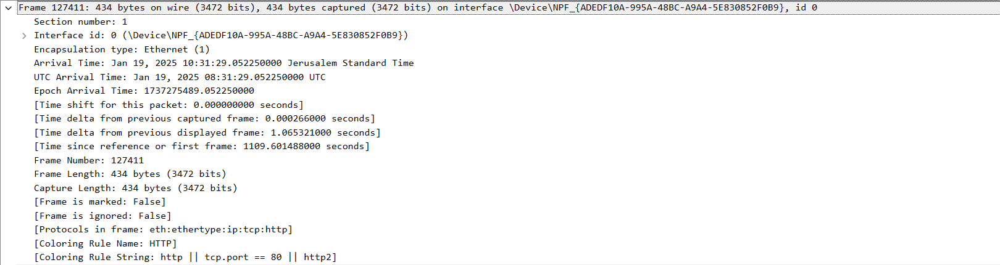

# **מודל שבע השכבות**

## **OSI:**

**המודל הזה הוא קונספט שבא במטרה ליצור את סטנדרט התקשורת ברשת , בעבר כל חברה היית משתמשת במודל תקשורתי אחר אחת מהשנייה ככה שמחשבים מסויימים לא יכולים לתקשר עם אחרים מפני שהם לא משתמשים באותו מודל תקשרות , בשביל לאפשר לכל המחשבים לתקשר יחד ולשלוח ולקבל מידע על גבי הרשת נוצר המודל של 7 השכבות שמתאר איך תקשרות ברשת אמורה להתבצע.**

**המודל עובד בצורה של שכבות , לכל שכבה יש מטרה שונה מהאחרת ,המידע במודל עובר בצורה דו כיוונית , כלומר כל שכבה מתקשרת עם השכבה שלפניה ואחריה ובתור , במהלך השליחה והקבלה של המידע השולח והמקבל מתחלפים בתפקידים , אם המידע עבר משכבה 1-7 בשליחה אז בקבלה הוא יעבור משכבה 7-1 , זה קורה בגלל תהליך הקפסוליזציה והדי-קפסוליזציה.**

### **Encapsulation:**

**קפסוליזציה ברשת זה הפעולה של הוספת מידע על המידע המקורי שנשלח ודי-קפסוליזציה ברשת זה הסרת המידע שנוסף על המידע המקורי , בתהליך הזה מהשכבה ה1-4 מתווסף מידע חיוני על המידע שעובר וכאשר מגיע ליעד שלו הוא מוסר , המידע הזה משמש את המידע המקורי למען המעבר שלו ברשת.**

### **שכבה 7: פרוטוקול - HTTP , DNS**

**שכבת האפליקציה אחראית על האינטראקציה של המשתמש עם המידע היא מספקת שירותים שבעזרתם היא מקשרת בין המידע שהמשתמש רוצה להעביר לבין השכבה הבאה במודל , תוכנות ואפליקציות משתמשות בשכבה הזאת בשביל לבצע תקשורת ולהעביר את הנתונים מהמשתמש לשכבת התצוגה.**

**השכבה עצמה לא כוללת בתוכה תוכנות או אפליקציות אלה היא מספקת פרוטוקולים ושירותים שונים שבעזרתם התוכנה יודעת לבצע את מעבר הנתונים והתקשורת ברשת , .**

### **שכבה 6: פרוטוקול - SecMux , SNMP**

**שכבת התצוגה אחראית על לפרסר את המידע לפורמט שהשכבה אחריה בסדר תוכל לקבל ולהבין , הצורה שבה היא תפרסר את המידע תלוי אם המידע שעובר מקופסל או לא , מכיוון שהשכבה אחראית על להעביר את המידע בצורה שניתן להציג אותו היא תומכת בפרוטוקולים המשמשים למען דחיסת מידע לתצורה של וידאו או תמונה ותומכת גם בפרוטוקולי אבטחה SSL\TLS.**

### **שכבה 5: פרוטוקול - WinSock , RPC , NFS**

**שכבת השיחה אחראית על כל מה שקשור בהקמת תשתית , ניהול החיבורים וסיום התקשורת בין רכיב מקומי למרוחק , כלומר היא אחראית על הקמת שיחה, ניהול שיחה וניתוק שיחה.**

### **שכבה 4: פרוטוקול - TCP ,UDP, DCCP & SCTP**

**שכבת התעבורה אחראית לאפשר העברה של מידע בין קצה לקצה , היא משתמשת בפרוטוקולים TCP וUDP בשביל להעביר את המידע מהשולח אל המקבל היא אחראית על ויסות עומסים של מעבר המידע ואיפשור תקשורת בין רכיבים שונים על אותו החיבור במקביל.**

**(יכול להשתנה תלוי שימוש בפרטוקולים שונים)**

**בצד השולח היא אחראית לקבל את המידע משכבת השיחה לבדוק שהסדר שלו נכון ואין בו שום תקלות , לפרק את המידע לסגמנטים או לדטאגרמס שלכל אחד יש Header משלו ולהוסיף את הפורט מקור ויעד.**

**בצד המקבל השכבה אחראית על לקרוא את פורט היעד ולהעביר אליו את הסגמנטים בסדר הנכון בשביל לחבר את ההודעה בצורה נכונה ומלאה ולבצע חיבור מחדש אם יש בעיה במידע.**

**(הסגמנטציה יכולה להשתנות כתלות בשימוש בפרוטוקולים שונים , יש פרוטוקולים שעושים את הסגמנטציה בצד המקבל ויש כאלה שבצד השולח)**

### **שכבה 3: פרוטוקול - ICMP , IPsec & IGMP , IP**

**שכבת הרשת אחראית על יצירת מסלול יעיל למען העברת המידע ברשת בצורה הכי מהירה וטובה שאפשר , בנוסף אחראית על פרגמנטציה ( במידה ויש סגמנטים גדולים מידי), הרשת מאפשרת חיבור של מספר צמתים , שכבת הרשתמ ספקת תוכן הודעה וכתובות IP לכל הודעה ומאפשר לרשת למצוא את הנתיב האופטימלי.**

### **שכבה 2: פרוטוקול - PPP, ETHERNET , IEEE 802.3**

**שכבת הנתונים אחראית בעיקר על מעבר חלק של המידע בין שני מכשירים היוצרים אינטרקציה עם אותה רשת , השכבה מתחלקת לשני תתי שכבות MAC שאחראית על איך מכשירים ניגשים לרשת ומעבירים מידע וLLC המשמשת כממשק לוגי בין שכבת הרשת לתת שכבה השניה , היא דואגת לבקרת זרימה סנכרון וריבוי מכשירים החולקים חיבור.**

**בנוסף השכבה אחרית על חלוקת הפקטות לפריימים בהתאם לגודל הפריימים של כרטיס הרשת ומוסיפה את כתובות הMAC על המידע ומכניזם לבדיקת שגיאות.**

### **שכבה 1: פרוטוקול - PON , DSL , Fiber Channel**

**השכבה הפיזית כוללת בתוכה את הרכיבים הפיזיים שאחראים על תרגום המידע לביטים ולהעביר אותו בין מכשירים שונים.**

**השכבה הפיזית קובעת גם באיזה תצורת קידוד המידע יעבור (זרמים חשמליים ,רדיו ,אור וכדומה)**

## **TCP/IP:**

**מודל הTCP/IP לא בדיוק עובר בצורה של שכבות כמו מודל הOSI אלה הוא מחולק ל4 היקפי פעולה שכל היקף פעולה מכיל בתוכו חלקים מהשכבות במודל OSI , כלומר הוא עובד בצורה מאוד דומה יחסית לקונספט של OSI ,מודל TCP/IP עובד בצורה שניתן להשוות כל היקף לכאילו תצורה שמאחדת שכבות במודל הOSI והן נקראות היקף אחד.**

**במקום להשתמש בצורה של שכבות בשביל ליצור סטנדרט תקשורתי מודל זה משתמש בפרוטוקולים ממשים במקום רעיון תיאורטי , כלומר הוא משמש כפתרון לבעיית התקשורת ולא כקונסט תיאורטי**

**מודל TCP\IP הוא מודל ממשי , הוא מבוסס על פרוטוקולים אמיתיים בעזרתם נעשית התקשורת לעומת זאת OSI מבסס קונספט של איך שמחשבים אמורים לתקשר , המודל שבו אנחנו משתמשים היום בשביל תקשורת הוא הTCP\IP , אבל גם בOSI יש שימוש , הוא עוזר לפרק בעיות לחלקים יותר קטנים ולאפשר לנתח אותם בצורה טובה יותר ובכך עוזר למנוע סכנות ותקלות טכניות.**

## **ההבדלים בין שני המודלים:**

- **מודל הOSI הוא מודל לימודי תיאורתי שהשימוש בו הוא בעיקר כדי להבין איך תקשורת עובד ואיך לבנות פרוטוקולים חדשים , לעומת זאת מודל TCP/IP מסתמך על מימוש אמיתי של המודל בעזרת פרוטוקולים אמיתיים.**
- **מודל OSI בעל 7 שכבות בעוד שמודל הTCP/IP בעל 4 היקפי פעולה.**

**נהוג להשוות את ארבעת ההקיפים בצורה הבאה:**

- **אפליקציה - מכיל שכבות 5-7 במודל הOSI - משתמש בפרוטוקולים: HTTP ,FTP , POP3 ,SMTP ,DNS,SSL\TLS,RPC ו SSH .**
- **נתיב תחבורה - מכיל את שכבה 4 במודל הOSI - משתמש בפרוטוקולים TCP ו UDP**
- **עבודה באינטרנט - מכיל שכבה 3 במודל הOSI - משתמש בעיקר בפרוטוקולים ICMP ו IP**
- **נגישות לרשת - מכיל את שכבה 1-2 במודל הOSI - משתמש בפרוטוקול ARP ו-ETHERNET.**

