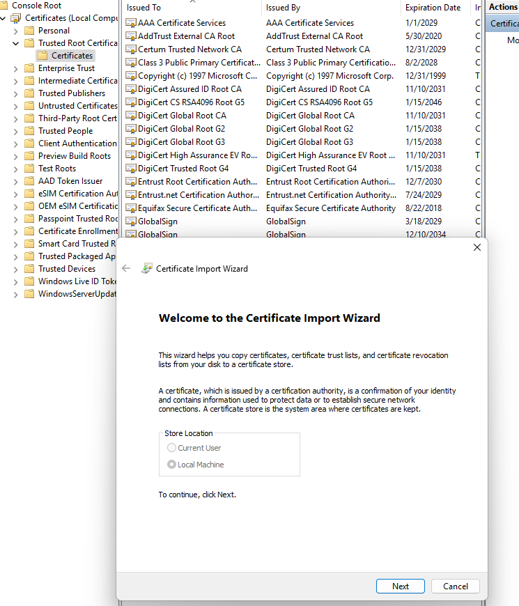

# **Canary Deployments:**

Canary Deployment או פריסה קנרית היא שבה נפרוס בצורה מוגבלת את השינויים שנעשו בתוכנה שלנו עבור מספר מצומצם של משתמשים אשר ישמשו בתור שפני ניסיון עליהם נבדוק את השינוי שעשינו (הם יהיו הקנרית*) , כך אותם משתמשים יתנסו עם הגרסה החדשה ויבדקו אותה כך נוכל לקבל משוב והבנה על איך משתמשים מגיבים לשינויים ב"עולם האמיתי" (בזמן אמת) וכך שנוכל לקבוע האם ניתן לשחרר את העדכון לקהל הרחב.

ישנו הבדל בין פריסה קנרית לעומת מסירה קנרית שחשוב לציין , מסירה קנרית היא שחרור גרסה מסויימת של התוכנה שלנו יחד עם השינויים שנעשו תוך הפרדה של השינויים האלו מהגרסה היציבה של התוכנה , בכך נוכל למסור באופן ציבורי את התוכנה העדכנית שלנו יחד עם השינויים שעשינו בתור גירסה ראשונית/גרסה בבנייה/גרסה לבדיקה (נקראות גם גרסאות - Alpha , Beta , Nightly) , נעשה זאת בתקווה שאנשים מסויימים או ארגונים יבחרו להתנסות בגרסאות האלו וככה נוכל לקבל משוב מהם.

פריסה קנרית היא שמסירה של התוכנה עם השינויים באופן כפוי , כלומר אנחנו נתקין ונעדכן את הגרסה החדשה של התוכנה שלנו בחלק מצומצם של המערכות ואז נחלק את המשתמשים בצורה כזו שאחוז מסויים ישתמש בגרסה עם השינויים (החדשה) והשאר ימשיכו להשתמש בגרסה היציבה (הישנה) , מאוחר יותר לפי השיקולים שלנו נחליט אם להפיץ את השינויים כגרסה חדשה בכלל המערכות.

ישנם 2 דרכים למימוש פריסה קנרית , נוכל לעשות זאת בעזרת פריסת Rolling או בעזרת פריסת צד-לצד (צורה שדומה לאיך שפריסת Blue-Green עובדת).

בפריסת rolling למשל נבחר מספר מסויים של שרתים אותם נעדכן עם השינויים החדשים , בעוד ששאר השרתים ימשיכו לעבוד עם הגרסה היציבה של התוכנה שלנו , לאחר מכן משתמשים יחשפו לשינויים שביצענו בשרתים הספציפים שבחרנו בעוד שאנחנו ננטר על השרתים עבור תקלות וביצועים וגם נקבל מישוב מהמשתמשים , כך נוכל להחליט אם אנחנו מרוצים מהשינויים , במידה ולא נחזיר את השרתים ששינינו למצב היציב או במידה וכן אז נחליט אם נרצה לפרוס את השינויים עבור כלל המשתמשים (במקרה הזה נעדכן את כל השרתים).

בפריסה צד-לצד כמו בפריסת Blue-Green , נקים העתק של התוכנה שלנו בסביבה נפרדת ונפנה אליה אחוז מסוים מתעבורת המשתמשים וכך בעוד שאנחנו מנטרים על הסביבה הזאת נגדיל את כמות התעבורה של המשתמשים שנעביר מהסביבה היציבה אל הסביבה החדשה עם השינויים שלנו , נמשיך את התהליך הזה עד שנמצא תקלה או שכל המשתמשים יעברו להשתמש בגרסה הקנרית החדשה.

חשוב לציין , ההבדל המהותי בין פריסה קנרית צד-לצד לבין פריסת Blue-Green היא שבפריסה קנרית אנחנו לא בטוחים בשינויים שיצרנו וחושבים שיש סיכוי שיהיו בעיות ותקלות ואנחנו לא רוצים לפגוע בביצועים של התוכנה השלנו , מצב כזה יכול לקרות בעדכון גדול מאוד או איזשהו פיצ'ר ניסיוני , לעומת זאת בפריסת Blue-Green אנחנו בטוחים בשינויים שביצענו ומעריכים שהסיכוי לתקלות או בעיות נמוכים יחסית או אולי צריכים להעביר את כלל המשתמשים ב"פעימה" אחת אל הסביבה החדשה.

* המושג Canary מופיע הרבה בעולם המחשבים ובמרחב הקיברנטי , מושג זה הוא רפרנס לציפור קנר/קנרית אשר שימשה כורי פחם בשביל לבדוק שבמכרה הפחם אין גז רעיל או ריכוז חמצן נמוך , היו שולחים את הציפור פנימה ואם היו שומעים את השריקות שלה היו מבינים שבטוח להכנס למכרה , אם לא אז היא כנראה מתה ומסוכן להכנס :(
