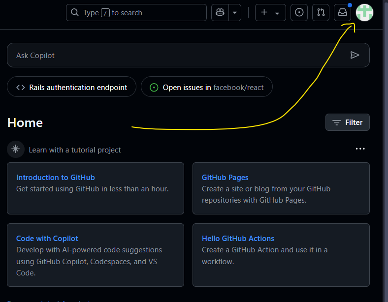
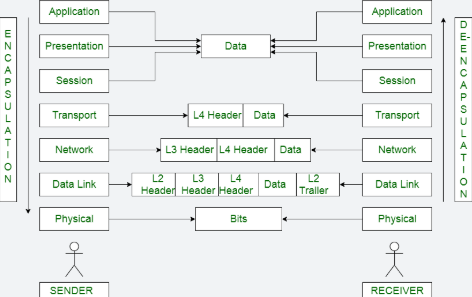

# **JFrog**

JFrog היא פלפורמה ההמספקת כלים למפתחים ואנשי DevOps שמשפרים את ניהול הגרסאות ותהליך הCI/CD , ה"מערכת האקולוגית" של JFrog תומכת בפורמטים שונים של packageים ויודעת להשתלב עם כלים CI/CD שונים , יכולות אלו עוזרות למפתחים להפוך את כל התהליך של הרכבה , בדיקה ופריסה של אפליקציות לאוטומטית בסביבות מחשוב שונות.

## **JFrog Products**

### **Artifactory**

ישנם כמה מוצרים חשובים שמרכיבים את ה"מערכת האקולוגית" של JFrog , אך הידוע מביניהם הוא Artifactory שמשמש כמנהל repo שיכול לתמוך בכל סוג קובץ ללא תלות בשפה שנכתבו בה או בטכנולוגיה בה הם משתמשים , הוא מאפשר זאת למפתחים בזכות היכולת שלו לנהל את הartifacts כbinary בפורמטים שונים על גבי פלטפורמות שונות , יכולת זאת הופכת אותו לscaleable ומאפשרת לו להמשתלב בתהליך ה CI/CD בצורה טובה.

#### **Artifacts**

המושג Artifacts מתייחס לקובץ המכיל בתוכו את הקוד המקומפל ואת המשאבים ששומשו בשביל לקמפל את הקוד, מכולל האובייקטים האלו נקראים Artifact , לדוגמה בJava אובייקטי Artifact יהיו קבצי jar , war ,ear , ב .Net אובייקטי Artifact יהיו קבצי dll .

#### **Artifact Repository**

Artifact Repo נקרא גם Binary Repo היא Repo מרכזית שמטרתה לאכלס סוגים שונים של Artifacts ,לפרוס ולנהל גרסאות שונות שלהם.

בשביל לוודא איכות , אמינות , זמינות ובקרה כל הArtifacts צריכים להיות מעודכנים לפי הגרסאות שלהם , להיות מנוהלים ופרוסים לכלל צוותי הפיתוח במקומות שונים , בשביל לאפשר זאת צריך לאחסן ולשתף אותם כך שיהיה גישה אליהם בכל פרוייקט שנעשה , יחד עם הArtifacts צריך שתיהיה גישה לכלים שמשמשים לתהליך CI/CD , לשם כך נועדה הArtifacts Repo , זו היא פתרון יעיל עבור שיתוף ואחסון הArtifacts וכלים נוספים עבור מספר גדל ומתמשך של Artifacts שצריכים להשאר מנוהלים בכל זמן (ever-expanding number of artifacts)

#### **Artifactory Explained**

Artifactory מאפשר איכלוס ניהול ופריסה של כל סוגי הקבצים והArtifacts , הוא מסוגל לאחסן ,לאבטח ולפרוס כל סוג של קובץ בין הם זה קובץ הפעלה , קבצי התקנה , קונפיגורציה , ספריות , container images וכו'.

המונח Artifactroy מתייחס ליכולת שלו לארח כל סוג של Artifact, כך שבמהלך תהליכי הDevOps ניתן לשלוף ולאחסן כל קובץ שנרצה בArtifactory והוא ישמש כמו מוקד מרכזי עבור כל הArtifacts.

#### **Artifactroy Subscription Versions**

ישנם גרסאות שונות של Artifactory , הגרסאות מחולקות Cloud וSelf-Hosted.

|Cloud|Self-Host|
|---|---|
|Pro|Free - Open Source|
|---|---|
|Enterprise X|Pro|
|---|---|
|Enterprise +|Pro X|
|---|---|
||Enterprise X|
|---|---|
||Enterprise +|
|---|---|

#### **Repositoies in Artifactory**

ישנם צורות שונות שניתן להשתמש בRepo של Artifactory , ניתן לאחסן אותם ב3 צורות שונות באופן מקומי , מרוחק או וירטואלי.

##### **Local**

ניתן לאחסן את הRepo באופן פיזי , מקומי אצל הלקוח , הוא ינהל אותה באופן עצמי ויפרוס אליה Artifacts כרצונו , ניתן להשתמש בrepo מקומי כנקודה מרכזית כה אפשר לאחסן את כל הקבצים הפנימיים שלא נרצה שיצאו החוצה , ניתן לאפשר גישה לRepo באופן מרוחק דרך כתובת URL :

`http://<host>:<port>/artifactory/<local-repository-name>/<artifact-path>`

ניתן להתייחס לגישות שקייימות בrepo מקומי כאל גישות read/write גם בdeployment(פריסה\העלאה) וגם בfetch (ייבוא) , כלומר ניתן להעלות artifacts וגם למחוק אותם (שני אלו הן גישות read+write) בנוסף ניתן להוריד artifacts(גישות write) וגם לקרוא אותם(גישות read).

##### **Remote**

Repo מרוחק משמש כCache proxy עבור Repoים שמנוהלים בURL מרוחק , Artifacts מנוהלים ומתעדכנים בRepo במיקום מרוחק אשר ניתן לשלוף ממנו Artifacts לפי הצורך , בשביל לגשת לArtifacts בRepo מרוחק נצטרך לגשת לURL שלו :

`http://<host>:<port>/artifactory/<remote-repository-name>/<artifact-path>`

כאשר ניתן לRepo המרוחק ונרצה לשלוף משם Artifact כלשהו הוא ייובא אל תוך הCache המקומי, כך שבמקום לגשת בצורה מרוחקת הartifact ישמר בCache המקומי , פעולה זאת מונעת עומס תעבורתי רשתי ומאפשר לפעול בצורה טובה יותר , באותה דרך בפעם הבאה שנרצה לייבא את אותו הartifact מהrepo המרוחק הוא ישלף מהcache המקומי , הrepo המרוחק משמש רק לייבוא של artifacts ושמירת בcache המקומי , ניתן להסיר מהcache את הartifacts השמורים אך לא ניתן לפרוס או להעלות אל הrepo המרוחק artifacts , הוא נועד רק לייבוא.

ניתן לגשת ישירות לartifacts שנמצאים בcahce בעזרת הURL :

`http://<host>:<port>/artifactory/<remote-repository-name>-cache/<artifact-path>`

**כפי שניתן להבין , ניתן לגשת לrepo מקומי בעזרת URL , גישה אל repo מקומי בעזרת הURL שלו זו היא הגישה ה"מרוחקת" , כלומר repo מרוחק הוא בעצם repo מקומי שמונגש בעזרת הURL , כך שאם נרצה להעלות artifacts לrepo מרוחק נעלה אותם פשוט לrepo המקומי וננגיש אותם בעזרת URL.**

ניתן להתייחס לגישות שקייימות בrepo מרוחק כאל גישות read/write ניתן לעשות רק fetch (ייבוא) , כלומר ניתן להוריד artifacts ולקרוא אותם(גישות read) וגם ניתן לערוך את הartifacts ש נמצאים בcache (גישות write) אך לא ניתן להעלות או למחוק אותם המיקום בו הם מאוחסן (מהcache ניתן למחוק אותם).

* ישנה גרסה חכמה של repo מרוחק שמשתמשת בAPI ומאפשרת פיצ'רים נוספים כמו סטטיסטיקות על הartifacts , סינכרון המאפיינים והשינויים של הartifacts ועוד**.**

##### **Virtual**

Repo וירטואלי משמש כמצבור של repoים מקומיים ומרוחקים ועוד וירטואלים נוספים , הוא מאפשר לאגד את כלל הrepoים אל URL לוגי יחיד דרכו יהיה ניתן לגשת גם לכמה סוגים שונים של repoים בצורה פשוטה ואחידה.

באופן ממקוד ניתן להגדיר שהיכולת של repo וירטואלי היא האגרגציה של מספר מרובה של repoים אל "מיקום" לוגי אחד.

ניתן להתייחס לגישות שקייימות בrepo וירטואלי כאל גישות read/write מבחינת fetch (ייבוא) , כלומר ניתן להוריד artifacts ולקרוא אותם(גישות read) וגם ניתן לערוך את הartifacts ש נמצאים בcache (גישות write) אך לא ניתן להעלות או למחוק אותם המיקום בו הם מאוחסן (מהcache ניתן למחוק אותם) , מה שכן ניתן להעלות אל הrepo המקומי שנמצא כחלק מהrepo הוירטואלי כך שאליו ניתן להעלות אך לא ניתן להעלות לוירטואלי באופן ישיר.

### **Curation**

curation הוא תהליך מונע-מדיניות אשר מאפשר אבטחה ושליטה טובה יותר בrepo לגבי packageים (חבילות) שבשימוש המפתחים , תהליך זה הוא כמו white-list עבור חבילות ח, כאשר מפתח ירצה להוריד חבילה מסויימת מrepo ציבורי לrepo המרוחק בארגון אותה החבילה תבדק אל מול הגדרות מדיניות (polices - פוליסות) של התהליך (תהליך הcuration) , בהתאם לבדיקה של החבילה מול המדיניות היא תאושר או תדחה , אם ישנם מספר מדיניות (פוליסות) שונות היא תבדק מול כל אחת ואחת מהן ואם תעמוד בכולם היא תאושר , במידה והיא לא תעמוד אפילו באחת מהן היא תדחה (כאן נכנסת ההשוואה ל white-list , במדיה ומשהו לא עומד באחת מהדרישות הוא נדחה).

השימוש בcuration מטפל באיומי supply-chain (רכיב יחיד שפגיעה בו או הוא עצמו עלול להשפיע על כלל הרכיבים או מספר רכיבים ולפגוע או להשפיע עליהם) , הוא מאפשר לארגון לוודא שהחבילות בהם הם משתמשים תקינות ובטוחות לפני שנעשה בהם שימוש וקיימות תלויות בהן.

curation עובד כתהליך משלים לxray שזהו מוצר נוסף של JFrog , שימוש בcuration יחד עם xray מאשר להגדיר ולהגביל מתפתחים לגבי איזה חבילות אין להם גישה , הגבלות אלו מאפשרות למנוע איומי אבטחה ובעיות רישיון.

**Xray**

מוצר זה של JFrog הוא כלי SCA אבטחתי-התאמתי שתוכנן להריץ סריקות באופן אוטומטי על artifacts ועל קוד בשביל למצוא חולשות ובעיות תאימות רשיון , הכלי מסוגל לסרוק כל סוג של artifacts בין זה קוד , קובץ קונפיגורציה , אפליקציה ועוד שלל נוספים , לאחר הסריקה הוא מסיק ממהם מסקנות ותובנות ומתריע כאשר הוא מוצא בעיה כלשהי , כאשר ניתן לפתור את הבעיות באופן פשוט הוא מציע את הפתרון ומקטלג את הבעיות בצורה הזו , כאשר לא ניתן הוא רושם מה הבעיה איך לפתור באופן כללי ואם אפשר לעשות זאת בפשטות.

הכלי מסוגל לעשות מגוון פעולות שונות כמו זיהוי חולשות ומישוב עליהן , סריקה עמוקה של התלויות שקיימות , בדיקה של רישוי שימוש בקוד פתוח , החלת ואכיפת מדיניות אבטחתיות ואינטגציוניות בפרוקייט ובתהליך הCI/CD , ניתוח נתוני הפרוקייט בצורה מעמיקה , אינטגרציה עם כלי CI/CD bux נוספים , הפקת דוחות והתרעות באופן מתקדם עבור תקלות או מקרים חריגים ועוד.

xray משתמש במאגרי נתונים של חולשות ידועות בשביל לזהות ולמנוע בעיות אבטחה קיימות או עתידיות , בצינור הCI/CD הכלי סורק באופן אוטומטי כל אחד מהartifacts בבנייה ולוודא שכל אחד מהם עומד בתנאים האבטחתיים ומונע סיכוניים אבטחתיים , בעזרת מדיניות(פוליסות) מוגדרות ניתן להחליט לדחות או לאפשר באופן אוטומטים חלקים מסויימים בבנייה בפרוקיט ולאפשר שיטות עבודה הכי טובות מבחינה אבטחתית.

## **Xray Vs. Curation**

## **JFrog Polices**

בJFrog Artifactory ובJFrog Xray ניתן לקבוע מדיניות שונות על מנת לאפשר הגבלות והגדרות שהם נרצה שהartifacts יעמדו , ישנם כמה סוגים שונים של מדיניות.

### **Xray Policies**

מה שמעניין את הצוות זה מה שמסומן בתכלת

- **Security** - מאפשר ליצור כללים עבור נושאי אבטחה וחולשות
    - **CVE** - ניתן ליצור חוקים עבור הפרות CVE , לפי דירוג שלהם , ID , חומרה , ברי תיקון ובעלי פתרון יישם (applicable)
    - **Malicues Packages** - כללים שיתריעו על הפרה שלהם עבור חבילות זדוניות שנמצאו
    - **Exposures** - כללים שיתריעו על הפרה שלהם עבור Secrects , Applications , שירותים והגדרות IaC מוטעות.
    - **Package Version** - כללים שיתריעו על הפרה שלהם עבור חבילות ספציפיות המוגדרות.
- **License** - מאפשר ליצור כללים עבור נושאי רישוי ותאימות
    - **Allowed Licenses** - מאפשר רשימה של רישיונות OSS שעלולים להיות קשורים לרכיב כלשהו , אם לרכיב כלשהו יש צורך ברישיון OSS שלא ברשימה אז הכלל יקפוץ (יתריע)
    - **Banned Licenses** - חוסם רשימה של רישיונות OSS שעלולים לא להיות קשורים לרכיב כלשהו , אם לרכיב כלשהו יש צורך ברשיון OSS שברשימה אז הכלל יקפוץ (יתריע)
    - **Multiple license permissive approach** - מאפשר שאם ליצור כללים שאם לפחות אחד מהרישיונות ב"תוקף" אז ושאר הרישיונות שרכיב משתמש בו אינם ב"תוקף" אז לא תקפוץ התרעה (לא יתריע אם לפחות אחד מהרשיונות בתוקף)
