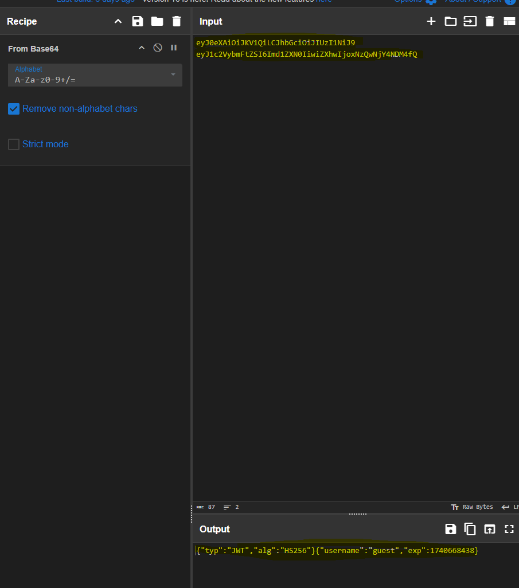

# **Git**

## 
<strong>מה זה GIT ולמה הוא משמש?</strong>

<strong>GIT היא מערכת לניהול גרסאות מבוזרת , שנוצרה על ידי לינוס טורבלדס, GIT מאפשרת עבודה על פרויקטים בצורה שיתופית ויעילה יותר כך שבעזרת מפתחים יכולים לשמור על סינכרון ביניהם ובין הגרסאות שהם מפתחים , היא מאפשרת ליצור העתקים מלאים בצורה מקומית של הפרויקט המשותף שעובדים עליו , היא שומרת בצורה מרוחקת repo (reposetory - מאגר) מרכזי שמהווה כזיכרון וירטואלי של הפרויקט שאנחנו עובדים עליו וכאשר משתמש רוצה להשתמש או לעבוד על הפרוייקט הוא מוריד העתק של הrepo הזה אל מחשב שלו מה שמאפשר יעילות של זמנים ועומסים , מכיוון שלכל משתמש יש את הrepo בצורה מקומית על האחסון שלו אז הוא לא צריך להוריד כל פעם מחדש את הפרוקייט בצורה מרוחקת ובכך המשתמש יכול לעבור בין commitים בלי צורך אפילו בחיבור אינטרנטי.</strong>

<strong>לGIT יש פיצר נוסף בשם stagging area המאפשר לפצל שינויים גדולים בפרויקט לחלקים יותר קטנים , כלומר לcommitים קטנים יותר , GIT עובד בצורה מסויימת בה הפרויקט שנעבוד עליו לא ישמר מחדש עד שנשנה בו משהו עם זאת במקום השמירה הזאת הוא יצביע לפרויקט ללא השינוי , בנוסף פיצר אחר של GIT הוא יצירת ענפים שהם מהווים כמין מתווה חדש של הפרויקט כמו פיצול שלו , למשל כאשר נרצה ליצור גרסה שונה של הפרויקט או כאשר נרצה לשנות או ליצור קוד חדש עבור הפרויקט.</strong>

## 
<strong>צורת העבודה הכללית של GIT ניתן לחילוק לכמה שלבים:</strong>

<strong>אתחול הסביבה - כאשר נרצה לעבוד על פרויקט ניצור repo מ-0 או נעתיק אחד בצורה מרוחקת אל סביבת העבודה שלנו.</strong>

<strong>ביצוע של שינויים בסביבה:</strong>

<strong>כאשר נבצע שינוי בפרויקט ונרצה שהוא ישמר נרצה לעשות לו commit ולהוסיף אותו לstagging area , נרצה לבדוק את השינויים בסביבת העבודה ולהוסיף אותם בstagging area מה שמאפשר להתכונן לעשיית הcommit ולאחר מכן ליצור את הcommit.</strong>

<strong>עדכון השינויים בrepo המרוחק - כאשר יצרנו את הcommitים שלנו נרצה לשתף אותם עם שאר המפתחים שאנחנו עובדים איתם ונעביר את הcommitים שביצענו בrepo המקומי שלנו אל הrepo המרוחק.</strong>

<strong>ענפים:</strong>

<strong>לצורך עבודה יעילה ומסודרת על הפרויקט GIT מייצר ענפים שבאמצעותם ניתן לעבוד על הפרויקט בלי לפגוע באף עבודה של מפתח אחר כשהוא עובד עליו , כך שכאשר נרצה לשנות קוד ניצור פיצול של העבודה על הפרויקט ונוכל למזג מאוחר יותר את הענפים לכדי ענף אחד בפרויקט (ענף ברירת המחדל בגיט נקרא main שבעבר היה נקרא master וממנו נוצרים הענפים).</strong>

<strong>במבנה הליבה של GIT יש קובץ בשם index , קובץ זה משמש את GIT כמערכת קבצים בפני עצמה שעוזרת לGIT לנהל את ההבדל בין הworking dir לבין הrepo והכלת השינויים ביניהם , הקובץ מכיל הצבעה על קבצים בסביבת העבודה ושומר בתוכו metadata חיוני , שינוי תוכן של קבצים נעשה בעזרת הindex בשני כיוונים מהrepo לworking dir , כאשר נרצה לבצע שינוי מהrepo על סביבת העבודה שלו , ולהפך מהworking dir לrepo כאשר נבצע commit או נוסיף קבצים חדשים לrepo.</strong>

<strong>ניתן להשוות את איך שGIT עובד כמו עבודה של DB , הוא משתמש בkey-value בשביל לשמור ערכים בrepo , לכל ערך יש רשומה אל הערך הזה ובכך נוכל לחזור אליו , צורת העבודה הזאת נקראת blobs וtrees , הblobs משמשים בשביל להגיע אל קובץ מסויים וליצירת אובייקט חדש ב-repo וtrees משמשים בשביל לשמור הקשרים בין הקבצים האלו כמו תיקייה ויכול להצביע לעצים אחרים , וכך בעצם GIT משתמש בפורמט של עץ בסיסי בשביל להציג את המבנה של תיקיות וקבצים.</strong>

<strong>בGIT ישנו פיצ'ר אבטחתי חשוב שמונע spoofing של commitים , כאשר נרצה לעבוד על פורייקט מסויים עם עוד מפתחים נרצה שלא יהיה אפשר שמפתח יוכל להתחזות למפתח אחר ולהוסיף קוד זדוני או שגוי באופן יזום אל הפרוקייט או אם סתם יש תקלה או באג וצריך לדעת מי המפתח שעשה את זה , בשביל זה נועד הפיצ'ר שמאפשר חתימת commitים על ידי הצפנה GPG שמוודא שהcommit שנחתם אצל המפתח באופן מקומי מצליח להתאמת מול המפתח הציבורי של המשתמש שנמצא בחשבון משתמש שלו.</strong>

## 
<strong>פקודות בGit - חסר הרחבה על ההסברים</strong>

השימוש בGit נעשה בעזרת CLI לכן בשביל להשתמש בו צריך לדעת פקודות , להלן הפקודות הבסיסיות:

### **Setup and Config Commands**

<ul dir="rtl">
<li>git -v - מציג את גרסאת הgit הנוכחית.</li>
<li>git help - מאפשר לקבל עזרה על פקודות או תקלות.</li>
<li>git config - מאפשר להגדר קונפיגורציות בסיסיות כמו שם או מייל</li>
</ul>

### **Getting and Creating Projects Commands**

<ul dir="rtl">
<li>git init - יצירת repo מקומית</li>
<li>git clone - משכפל את הrepo לתקייה חדשה , בנוסף מאפשר ליצור ענפי מעקב עבור כל ענף מרוחק ויוצר ומחליף אל הענף הפעיל מהrepo המשוכפל.</li>
</ul>

### **Basic Snapshotting Commands**

<ul dir="rtl">
<li>git add - הוספת רשימה של מהwork directory לאזור stagging , ניתן להשתמש בדגל --all כדי להעלות את כל הקבצים מהתקייה הנוכחית אל אזור הstagging.</li>
<li>git status - לראות אם היו שינויים מאז הcommit האחרון , מראה את כל השינויים שנעשה ואת השינויים שנוספו.</li>
<li>git diff - מראה את השינויים שנעשו מאז הcommit האחרון , בין commitים , בין ענפים , בין ענף לcommit וכו'.</li>
<li>git commit - רישום שינויים בrepo.</li>
<li>git reset [HEAD] - מאפס את הHEAD הנוכחי לHEAD המצויין</li>
<li>git rm - מסיר קובץ מהענף ומקובץ הindex.</li>
</ul>

### **Branching and Merging Commads**

<ul dir="rtl">
<li>git branch - מאפשר ליצור ענף חדש , להציג רשימה של הענפים הקיימים ולמחוק ענפים.</li>
<li>git checkout - מאפשר להחליף בין ענפים או להחליף בין קבצים עליהם נעבוד בעץ , הדגל -b מאפשר ליצור ענף חדש ולהחליף אליו, -B יוצר ענף חדש אם הענף לא קיים כבר , אם קיים מחליף אליו.</li>
<li>git switch - מחליף בין ענפים</li>
<li>git merge - ממזג בין 2 ומעלה הסטוריות פיתוח יחד , מיזוג בין ענפים או בין commitים.</li>
<li>git log - לבדוק את היסטורית השינויים (הcommitים)</li>
<li>git stash - מאפשר לשמור את השינויים שבוצעו בעותק משלהם בלי לעשות להם commit ובכך לעבוד על משהו אחר ולחזור אליהם אחר כך אם במידת הצורך (שימושי במידה ועובדים על קוד ואז צריכים לעבוד על קוד אחר באמצע הדרך אבל הקוד שעבדנו עליו עדיין לא מוכן לcommit , כך נעשה לו stash ונחזור אליו אחר כך)</li>
<li>git tag - מאפשר ליצור , להציג רשימה , למחוק ולאמת אובייקט tag שנחתם על ידי GPG</li>
</ul>

### **Sharing and Updating Projects Commads**

<ul dir="rtl">
<li>git fetch - מאפשר להוריד אובייקטים וrefs מrepo אחר/מרוחק יחד עם כל האובייקטים שהם צריכים בשביל שנוצרו בעבר.</li>
<li>git pull - מאפשר להוריד ולמזג אובייקטים מrepo אחר/מרוחק אל הrepo המקומי\אחר.</li>
<li>git push - מאפשר לעדכן refs אחרים/מרוחקים עם האובייקטים שנבחר לשייך את הפעולה אליהם.</li>
<li>git remote - מאפשר ליצור , למחוק ולהראות חיבורים עם repoים אחרים.</li>
</ul>

### **Patching Commands**

<ul dir="rtl">
<li>git cherry-pick - מאפשר לבחור commitים ולהכיל את השינויים שלהם תוך יצירת commit חדש לכל אחד מהם.</li>
<li>git rebase - מאפשר שילוב עבודה בין ענפים , לוקח מבנה/מספר של commitים ומעתיק אותם למקום אחר.</li>
<li>git revert - משמש כמו undo , לקוח מספר commitים (1 ומעלה) ומחזיר לאחור את השינויים שנעשו על ידי commitים אחרים עליהם ,כלומר מחזיר את המצב כפי שהיה בcommit(ים) שנבחר ומוסיף אותו כcommit חדש , <strong>בפשטות - מבטל שינויים שנעשו.</strong></li>
</ul>

<ul dir="rtl">
<li>refs (שם קולקטיבי עבור ענפים ואו tagים)</li>
</ul>

<strong>Git Tuotorial</strong>

