# **GitHub**

בעוד שGit הוא תוכנה חינמית עם קוד מקור פתוח , GitHub או גיטהאב הוא שירות SaaS (ענני), זהו שירות אירוח מבוסס אינטרנט עבור repoים של Git , השירות של GitHub מאפשר לספק פלטפורמה שיתופית עבור ניהול גרסאות למפתחים ומאפשר להם לשתף את הקוד שלהם עם מפתחים אחרים , ישנן 2 גרסאות של GitHub , הגרסה החינמית שמאפשרת ליצור repoים ציהורי בהם משתמשים יוכלים לשתף את הקוד שלהם וכל אחד יכול לגשת אליו , וגרסאה בתשלום בה משתמשים יכולים ליצור repoים פרטיים כך שרק אנשים עם הרשאות גישה לrepo שלהם יוכלו לגשת אליו , GitHub מאפשר פיצ'רים שונים כמו מעקב אחרי באגים , ניהול משימות וניהול פרוייקטים , משפתחים יכולים לעקוב אחרי ההתקדמות שלהם בפרוייקטים ולהוסיף הערות ותיעוד על גביהם תוך ראיה היסטורית ורוחבית על השינויים שנעשו במהלך הפרוייקט ובכך לעקוב אחרי ציר הזמן של הפיתוח שלהם, בנוסף GitHUb הוא מאפשר למפתחים להגיב , לשתף תקלות ובעיות , ולשתף חלקים מהקוד שלהם , בכך GitHub יוצר קהילה עבור מפתחים ומאפשר ליעל את הפיתוח בעזרת עבודה צוות ושיתוף ידע.

## **מבנה של GitHub**

### **GitHub Enterprise**

גרסאה מנוהלת אישית של פלטפורמת GitHub בעלת פונקציונליות דומה לשירות הרגיל של GitHub שאירגונים יכולים להריץ על גבי חומרה משלהם או לצרוך בתור שירות ענן.

לGitHub Enterprise יש חשבון Enterprise שזה הוא החשבון החזק ביותר בEnterprise , הוא מופרד מהEnterprise עצמו וכך גם המשאבים שלו , החשבון הזה הוא בעצם container מנהלתי המשמש בשביל פעולות מנהלתוית כגון חיובים , רשיון , מדיניות וכו' , מנהלים משתמשים בחשבון זה בשביל לנהל את הצורה בה GitHub יתממשק עם שאר המערכות.

בהירכרכיה של המבנה של GitHub הEnterprise הוא הTOP LEVEL כלומר הוא העליון ביותר וכל השאר תחתיו , לEnterprise יש Owner הנקרא Enterprise OWner והוא הבעלים של הEnterprise , הוא משתמש בחשבון הEnterprise בשביל לנהל אותו , בנוסף באופן כללי חשבון Enterprise הוא חשבון "בלתי נראה" כלומר אי אפשר לדעת שהוא קיים , רק הבעלים של הEnterprise מודע אליו.

### **GitHub Organization**

Enterprise מורכב מאחד או יותר Organizations (ארגונים) אליהם המשתמשים מתווספים , ארגונים הם בעצם הבעלים של repoים משותפים , צוותים , דיונים ופרוייקטים , החילוק לארגונים מאפשר למנהלים להשתית מדיניות ליבתית יותר (ספציפית) על repoים ששייכים לאגון מסויים וגם לשלוט יותר על התנהגות המשתמשים בארגון , מדיניויות שמוכלות קורות ברמת הארגון ולא ברמת ה-enterprise.  

**GitHub Repository**

repoים או מאגרים , הם הדרך שבה ניתן ל"ארח" את הקוד מקור של האפליקציה שנרצה וקבצים נוספים , הם מספקים התממשקות עבור מפתחים עם הממשק של GitHub , מבחינת פעילות , אבטחה ותהליכי CI\CD.

repoים הם חלק הנמצא ברמת הארגון , בעזרת הrepoים ניתן לחלק ולהפריד את הארגון ולאפשר חלוקה שלו בצורה נוחה יותר , מי שבתוך הארגון שהrepo שייך לו יכול להשתמש בו (במידה ולא צויין אחרת) אך כן ניתן להניגש את הrepoים של ארגון מסויים להיות קריאים למשתמשים מחוץ לארגון ואף מחוץ לenterprise.

#### **Types Of GitHub Repositories**

- public - זהו repo ציבורי , הוא נגיש לכולם דרך האינטרנט.
- private - זהו repo פרטי, הוא נגיש רק ליוצר שלו , למי שהיוצר מחליט לשתף איתו אותו ואם זה repo ארגוני אז גם למשתמשים ארגוניים מסויימים.
- internal - זהו repo שנגיש לכל משתמשי הenterprise , בארגונים ששייכים לחשבון enterprise סוג זה של repo מוגדר כברירת מחדל כאשר נוצר repo חדש.

#### **Branch Protection Rules**

כללי הגנה על הענף הם כללים או דרישות שניתן לאכוף על ענף מסויים, על כלל הענפים או על ענפים שעונים על דפוס מסויים שנקבע , הכללים האלו נאכפים לפני שנוצר שינוי כלשהו בענפים על ידי מפתח אחר , כלומר בעזרת הכללים האלו נוכל להציב דרישות מסוימות וכללים מסויימים בהם המפתח יצטרך לעמוד או השינוי שהם מתכוון להכיל בשביל לעדכן אותם בענף , ברירת המחדל היא שכללי הגנה על ענף מבטלים את היכולת לעשות force push של שינויים לענפים תואמים ולמחיקה שלהם.

כללי הכנה על ענף מוגרים כברירת מחדל כך שהם אינם פועלים על משתמשים בעלי הרשאות מנהלתיות על הrepo או על משתמשים בעלי ההגדרה של "bypass branch protections" , עם זאת ניתן להכיל עליהם ועל משתמשים מנהלתיים את הכללים האלו.

#### **Rulesets**

Rulesetים דומים לbranch protection rules אך מאפשרים גמישות רבה יותר ויכולות גבוהות יותר , ניתן להכיל rulesetים ברמה הארגונית , ברמת הrepo , הענף והtagים בrepo מסויים. בכל repo ניתן ליצור עד 75 rulesetים , בדומה לbranch protection rules גם בrulesetים ניתן לאפשר למשתמשים מסויימים לעקוף אותם , עם זאת לrulesetים יש את היכולת להיות מוכלים במקביל , כלומר כמה rulesetים יכולים להיות מוכלים בו-זמנית , ניתן לראות את הסטטוס של כל ruleset ולנהל אותו כך , כל אחד יכול לקרוא ולראות את הrulesetים המוכלים בכל repo מה שמאפשר למפתחים להבין טוב יותר איזה כללים הם "הפרו" , בנוסף rulesetים מאפשר מגוון רחב יותר של כללים , למשל ניתן ליצור כללים בשביל לשלוט על הmetadata של commitים.

### **GitHub Actions**

זו היא פלטפורמת CI\CD המאפשרת אוטומציות של pipline הבנייה , הבדיקה והפריסה , ניתן ליצור זרימות עבודה עבור כל אחד מהpipelineים עבור הrepo שנרצה , מעבר לכך הם מאפשרים ליצור אוטומציות שהם מעבר לתחום הDevOps אשר תורמות לזרימת העבודה על הrepo למשל כאשר נוצר issue חדש בrepo ניתן באופן אוטומטי לקטלג אותו עם כותרת מתאימה.

ניתן להשוות GitHub Actions לכלי אוטומטי שעוזר למפתחים להיות בטוחים שהקוד שלהם נבדק ונפקס בצורה טובה בהשקעה ידנית מינימלית.

#### **Enviroments In GitHub**

סביבות בGitHub הם בעצם שלבים במהלך הפיתוח והשימוש של תוכנה או אפליקציה , כאשר נפתח אפליקציה נרצה לוודא שהכל עובד בצורה טובה לפני ש"משחררים" אותה לקהל הרחב לשימוש , כלומר לשמשתמשים , לשם כך נועדו הסביבות , כאשר נפתח את האפליקציה או פיצ'ר כלשהו שאנחנו רוצים להטמיע בתוכה נרצה להיות בטוחים שהוא עובד כמו שצריך , לכן נרצה שיבדקו ויתקנו לפי הצורך , הסביבות הם הקונספט שמאפשר את השלבים האלו בשביל שחרור של ה"קוד" החדש שנרצה להוסיף או להוציא לאור , למשל יש סביבת פיתוח שהיא סביבה בה נפתח את הקוד ונבדוק שהוא עובד , לאחר מכן נעביר את הקוד לסביבת בדיקות , בסביבה הזאת נבדוק את הקוד בצורה מעמיקה יותר ונחפש בעיות ובאגים שונים בצורה הרבה יותר נרחבת , נוכל להעביר את הקוד בעוד כל מיני סביבות שונות בשביל לוודא ולבדוק דברים מסויימים , לבסוף נעביר א תהקוד לסביבת המוצר או הprod שזהו השלב האחרון בו ה"קוד" שיצרנו ישוחרר עבור הקהל הרחב ויהיה ניתן להשתמש בו.

השלבים האלו או הסביבות האלו עובדים לרוב בצורה של 3 שלבים , dev , test\stage, prod ,סביבת dev(development) סביבה של פיתוח הקוד , סביבת test(testing) או stage(staging) סביבה בה נבדוק את הקוד כמו שצריך , וסביבת prod(production) סביבה בה נשחרר את הקוד למשתמשים , החילוק של שלבי פיתוח ושחרור הקוד מאפשר למפתחים להיות בבקרה טובה יותר על הקוד שלהם , לאפשר הטמעה של קוד בצורה הרבה יותר בטוחה ולהימנע מבעיות ותקלות , לשמור על סדר וארגון בכל שלבי הפיתוח והעשייה ולהשאר בשליטה על הקוד , להגביל כל סביבה לפי חוקי העבודה בה.

## **WebHooks**

webhooks הם הודעות אוטומטיות שנשלחות מהrepo לשרת חיצוני כתגובה לאירוע מסוים שקרה בrepo , האירועים יכולים להיות כל פעולה בrepo בין אם זה pull , push או כל עדכון ופעולה אחרת , בזכות התגובות האלה (webhooks) כל תהליך האינטגרציה של GitHub קורה בצורה הרבה יותר טובה ומשפר את יעילות הפעילות.

השימוש בתגובות האוטומטיות האלו קורה בצורה כזו , כאשר אירוע מסוים קורה בrepo נשלח payload לURL מוגדר מראש בו מתואר מידע על האירוע הזה , השרת שמקבל את ההודעה מעבד את הנתונים ומגיב בהתאם עם פעולות שונות מוגדרות.

## **Secrets In GitHub**

secrets הם מידע רגיש המשמש עבור פעולות מסויימות, גישות , או פשוט מזהים ופרטים שחשוב שלא יהיו חשופים , מאחר והם נחשבים למידע רגיש הם דורשים אבטחה גבוהה שתוודא שאף גורם צד 3 לא יהיה חשוף אליהם.

הsecrets הם משתנים שניתן ליצור ברמת הארגון , הrepo או סביבה בrepo וניתן להשתמש בהם במהלך השימוש בGitHub Actions , ניתן להגדיר את הsecretים לקריא בלבד עבור workflowים מסויימים וכך לאפשר את השימוש בהם לפעולות ספציפיות.

secretים ברמה הארגונית מאפשר לשתף את אותו הsecret בין כמה repoים ולמנוע יצירה חוזרת שלהם עבור כמה repoים שצריכים את השימוש בהם , כך עדכון של secret ברמה הארגונית יעדכן אותו בכל מקום בארגון בו יש שימוש בו , באותו צורה ניתן לעשות זאת עבור repo ספציפי ובהתאמה הסביבות בrepo יכולו להשתמש ולהתעדכן לפי הsecret שברמת הrepo , וכך גם secret בסביבה בrepo.

ניתן להגביל את השימוש בsecretים עבור משתמשים ספציפים וכך לאפשר שימוש בהם רק עבור אותם משתמשים או להגדיר שרק reviewer יוכל לאשר את השימוש בsecret וכך להגביל את העבודה של workflow מסוים עד לאישורו של reviewer.

כדי להשתמש בsecret מסוים נציין את הcontext name שהוא secrets ואז נשים . ואחריה את שם הsecret שבו נרצה לעשות שימוש.

## **GitHub Apps**

אפליקציות GitHub הם צורה של אינטגרציה שניתן ליצור עבור GitHub , הם מאפשר להתממשק עם GitHub והעם פונקציות שונות בו ובכך לאפשר גמישות ושימוש טובים יותר בלי צורך בהתחברות משתמשים או חשבונות שירותים כלשהם , האפליקציות האלו יכולות לשמש עבור אוטומציות , תמיכה בהתחברות באמצעות GitHub עבור הזדהות , כלי עזר עבור מפתחים , אינטגרציה עם כלים חיצוניים אחרים ועוד, למשל ניתן לאפשר לאפליקציות לעשות פעולות בשם של המשתמשים במקום שהם יצטרכו לעשות אותם בעצמם ולצמצם את הפעילות הידנית. ניתן להגדיר את האפליקציות בצורה פרטית כלומר רק למשתשמ ששייכת לו האפליקציה או בצורה ציבורי כלומר משתמשים אחרים בארגן יוכלו להשתמש בה גם.

## **GitHub Roles**

בGitHub ניתן לנהל הרשאות משתמשים על ידי הקצאת תפקידים שונים שלכל אחד יש הרשאות שונות , התפקידים מתחלקים ל2 סוגים , תפקידי בגדר הOrganizations ובגדר הRepository.

### **Organization Roles**

הRoles בOrganization מאפשרים למשתמש לקבל הרשאות בכל הארגון , כלומר ההרשאות האלו יהיו תקפות בכל הארגון כולל כל repo שקיים בארגון כך שההרשאות שיש לו ברמה הארגונית קיימים גם ברמת הrepo.

נכון לנקודת זמן זו (2025) ישנם 8 "סוגים" שונים של Roles שקיימים בארגון , להלן :

- All-repository read – מאפשר הרשאות קריאה בכל הארגון ובכל הrepoים
- All-repository write - מאפשר הרשאות כתיבה בכל הארגון ובכל הrepoים
- All-repository triage - מאפשר הרשאות עבור סקירה שלissues ובקשות pull בכל הארגון ובכל הrepoים (בלי הרשאות כתיבה)
- All-repository maintain - מאפשר הרשאות כלליות לניהול repository בכל הארגון ובכל הrepoים בלי ההרשאות המאפשרות פעולות הרסניות או מסוכנות
- All-repository admin - מאפשר הרשאות מלאות בכל הארגון ובכל הrepoים כולל הרשאות אבטחתיות
- CI/CD admin - מאפשר הרשאות גישה ושימוש באוטומציות של GitHub בכל הארגון ובכל הrepoים
- Security manager - מאפשר הרשאות בתחומים אבטחתיים בכל הארגון ובכל הrepoים
- Custom – מאפשר ליצור Role בעל הרשאות מותאמות אישית לצרכים ולשימושים שלנו , ההרשאות בו יהיו תקפות לכלל הראגון והrepoים

### **Repository Roles**

הRoles Repository מאפשרים למשתמש לקבל הרשאות בכל הrepo , כלומר ההרשאות האלו יהיו תקפות בכל repo הספציפי בו הrole צויין , כך שההרשאות שיש לו יהיו קיימים רק ברמת הrepo , אלה אם כן יש לו role זהה או role בעל הרשאות חופפות ברמה הארגונית.

- Read – מאפשר הרשאות קריאה בכל הrepo
- Triage - מאפשר הרשאות עבור סקירה שלissues ובקשות pull בכל הrepo (בלי הרשאות כתיבה)
- Write - מאפשר הרשאות כתיבה בכל הrepo
- Maintain - מאפשר הרשאות כלליות לניהול הrepository בכל הrepo בלי ההרשאות המאפשרות פעולות הרסניות או מסוכנות
- Admin - מאפשר הרשאות מלאות בכל הrepo כולל הרשאות אבטחתיות

## **משימות בGitHub**

לפני שנוכל לעשות איזה שהם משימות בGitHub נרצה לפתוח משתמש GitHub עם repo שאיתו נוכל לעבוד.

נכנס לאתר של GitHub (www.github.com)

ישר כשנכנס נגיע לדף הdashboard שם נוכל לראות בצד שמאל למעלה את האפשרות ליצור repo חדש

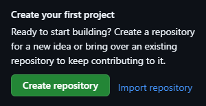

נלחץ על Create repository ונגיע לדף הבא:

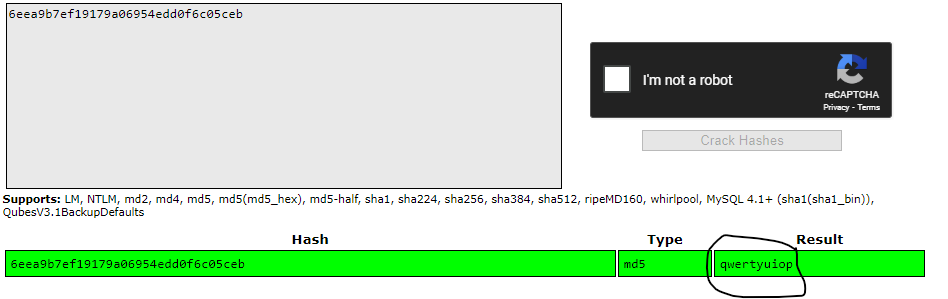ניתן לקרוא לrepo באיזה שם שנבחר כל עוד הוא לא תפוס כבר , במקרה הזה נקרא לו main , בנוסף נבחר מי הowner (הבעלים) של הrepo הזה.

לסיום נלחץ על הכפתור הירוק - Create repository וזהו יצרנו repo

כעת נעקוב אחר ההוראות שפה כדי שנקים repo משלנו על המחשב המקומי שיתחבר לrepo המרוחק שיצרנו

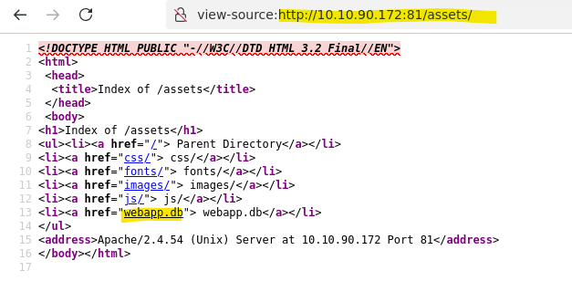

לפני זה נרצה להוסיף עוד כמה שלבים פשוטים עבור נוחות העבודה

1. ניצור תקייה שבה נוכל לעשות , בחרתי לקרוא לה git_actons , נכנס אליה וניצור סתם קובץ README.md בשביל לעשות לו commit לאחר מכן ואז push כדי לבדוק שהאוטומציה עובדת.
2. נעשה git init בשביל ליצור repo חדש
3. נעשה git add לקובץ שיצרנו בשביל עדכן אותו בindex ואז נעשה לו commit
4. (אפציונלי) נעשה git branch נראה שקוראים לmaster אז נשנה אותו לmain בשביל הנוחות
5. נוסיף את הrepo המרוחק אחריו נרצה לעקוב אצלנו וגם את הbranch שלו (הקישור https זה הrepo וקראנו לו origin)
6. נעשה push מהbranch שלנו שזה main אל הorigin , באופו דיפלטי זה יעשה את הpush לנף הראשי של הrepo במקרה הזה קוראים לו גם main (הדגל -u הוא לא מחייב אך מומלץ - הוא משמש בשביל לקבוע את הup stream שאיתו נעבוד בתור ברירת המחדל, כלומר לא נצטרך לציין את הremote או את הbranch כשנבצע פקודות git push או git pull)
7. לאחר מכן נצטרך להכניס פרטי התחברות - שם המשתמש והסיסמה ( **הסיסמה היא לא סיסמת המשתמש הרגילה אלה ה Personal Authentication Token שלו ראה נספח א')**
8. לאחר מכן נראה שהכל עבד וקרה הpush מעהנף main המקומי לענף main בrepo המרוחק שצויין.

* נוכל לראות בשורה התחתונה שבגלל שציינו את הדגל -u הענף main עוקב אחרי הענף origin/main שזה הענף בrepo המרוחק

### **GitHub Actions:**

- צור אוטומציה עם github actions שכל דחיפה לmain repo- הדפס הודעה פשוטה, למשל "hello i am here"
- כעת הכינו כפתור לאוטומציה זו במקום שתחכה לpushים לmain repo
- קבעו את האוטומציה שהיא תדפיס את ההודעה הזו כל פעם כשהשעה היא 10:00 בבוקר?
- ממש את כלל המשימות במקביל , גם את הכפתור וגם את האוטומציות

אחרי שיצרנו repo מקומי שאליו נעשה את פעולות הpush שלנו , נוכל לכתוב הAction שתעשה את האוטומציות שרצינו יחד עם הכפתור להפעלה ידנית.

**כדי ליצור Actions חדשים בrepo מסוים ראה נספח ב'**

כדי לכתוב Actions בGitHub נשתמש בקבצי YML או YAML (זה אותו דבר)

בקובץ הזה ניתן לראות את שהגדרנו את הדברים הבאים:

- תפעל כאשר קורה push בענף main
- תפעל כאשר השעה היא 10 בבוקר
- הגדרנו workflow_dispatch שזההכפתור שמאפשר לנו להפעיל את הAction ידנית
- הגדרנו להדפיס "hello i am here" כשאשר משהו עושה trigger לAction הזה

### **GitHub Webhooks:**

צור WebHook יחיד לארגון ספציפי

הWebHook יתפוס את השינויים האלה:

- שינויי חברות
- שינויים בארגון
- מאגרים משתנים

השתמש רק הגדרה יחידה של WebHook לשם כך.

כתוב קוד פשוט (Python/JavaScript) שתופס הודעות WebHooks אלה.

בשביל לבצע את המשימה הזו נצטרך את הדברים הבאים:

- ליצור ארגון ולהגדיר עליו WebHook (כנראה שנצטרך להיות עליו ownerים)
- שרת עם כתובת URL אליו יגיע כל הPOST Requests שהארגון ישלח על גבי שינויים שקורים
- קוד פייתון שיאזין לכל POST Request שהארגון שלנו ישלח וידפיס\ישמור אותם כקבצי json

**בשביל ליצור ארגון ראה נספח ג'**

כיד להגיע שרת עם כתובת URL נלך לאתר שנקרא ngrok ונרשם , ברגע שנעשה זאת נוכל לעקוב אחרי ההוראות באתר ולקבל כתובת URL סטטית משלנו שבה נשתמש , בנוסף נעקוב אחרי ההוראות כיצד להתקין ngrok על מערכת ההפעלה שלנו.

נקנפג בארגון שלנו WebHook חדש שישלך את כל העדכונים שצויינו ואת הURL שקיבלנו שאליו נרצה לשלוח את העדכונים

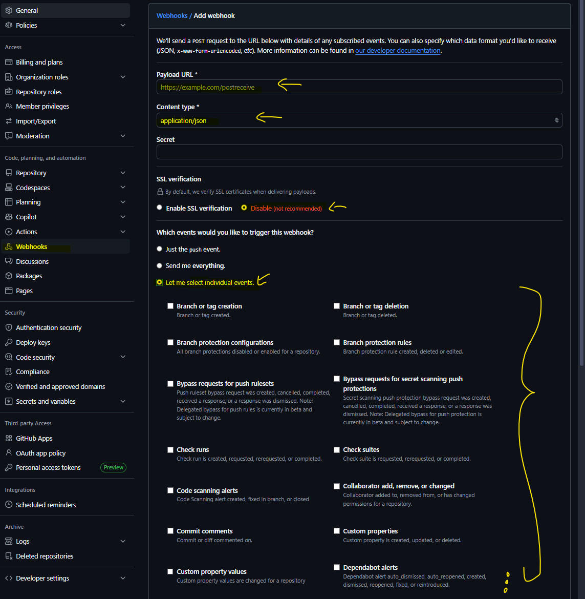

- נקנפג את הtoken שקיבלנו אחרי שנרשמנו לngrok
- ניצור תיקייה שעליה נעבוד והיא תיהיה בתור השרת שלנו
- נכנס אליה וניצור קובץ python חדש

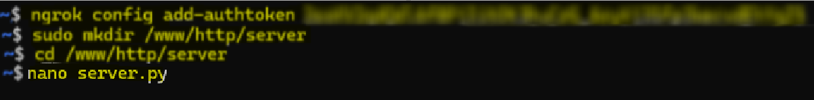

- בתוך הקובץ python נכתוב את הקוד הבא (זה הקוד שאני השתמשתי בו ניתן לעשות זאת בעוד דרכים וצורות שונות)

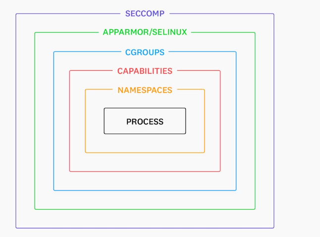

- נשמור את הקובץ
- נריץ את הקובץ ונקים את השרת בטרמינלים (נריץ את אחד מהם בbackground כדי שנוכל להריץ גם את השני ולראות)

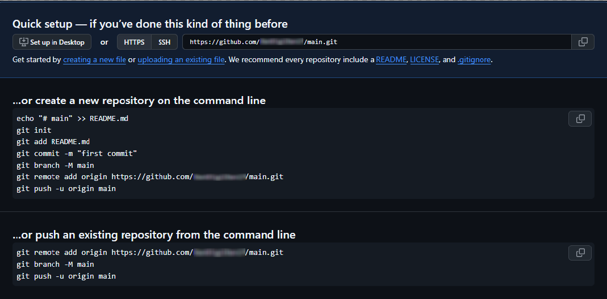

לאחר מכן נוכל להכנס לכתובת 127.0.0.1 על port 8080 ולראות את השינויים שנעשו

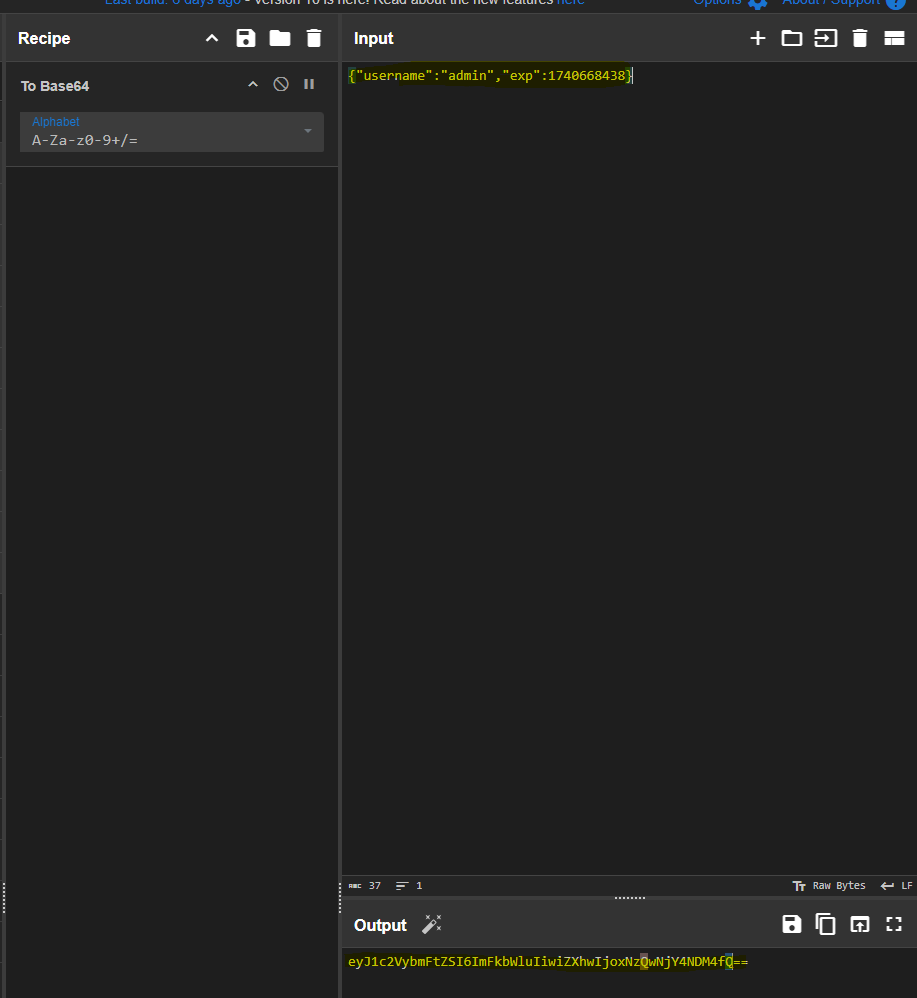

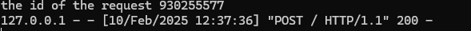הנה תמונה של חלק מהjson באתר ושהjson נשלח/

### **GitHub CLI:**

צור סקריפט/קוד פשוט המשתמש ב- Github CLI

הסקריפט צריך להדפיס את שמות כל הrepoים שבארגון

שים לב לפעולות שלך כשאתה משתמש ב- Github CLI!

נממש ת המשימה בעזרת פקודה פשוטה בלי הצורך בסקריפט:

gh repo list [organization-name]

### **GitHub Apps:**

ריק ביינתים

### **משימות ב-GitHub נספחי עזר:**

#### **נספח א' - Personal Authentication Token**

בשביל ליצור Personal Authentication Token נכנס לאתר של GitHub ([www.github.com](https://www.github.com))

1. נלחץ על התמונת פרופיל שלנו צד ימין למעלה

1. לאחר מכן נלחץ על כפתור הsettings

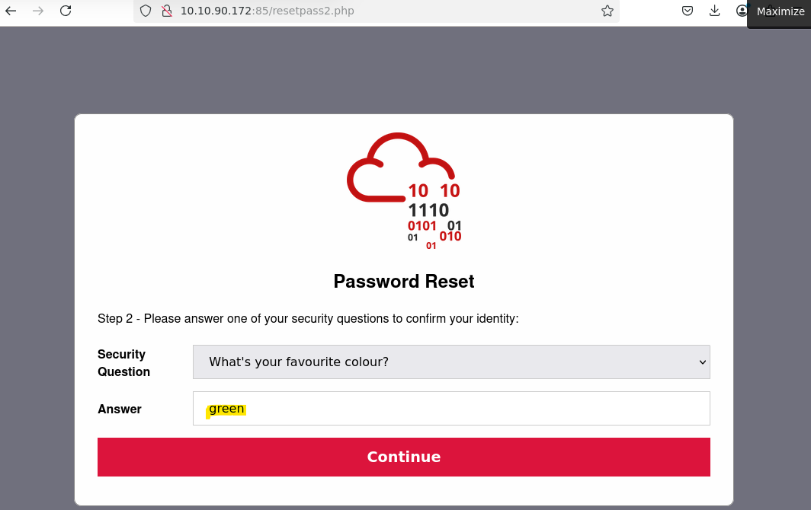

1. נלחץ על Developer Settings

1. נבחר ב Personal access tokens ואז נלחץ על Tokens(classic) נלחץ על הכפתור Generate new token ואז "Generate new token(classic)"

1. נוכל לשים Note לtoken הזה שנזכור משהו ולבחור לה תוקף , בנוסף נבחר איזה הרשאות יש לtoken הזה

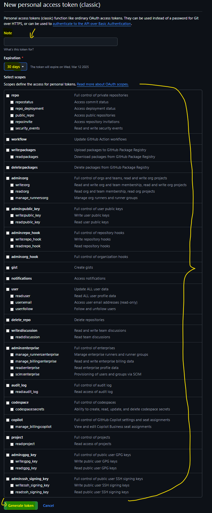

1. נוכל לראות את הtoken שיצרנו

#### **נספח ב' - יצירת Action בGitHub:**

1. נכנס לGitHub ובrepo שלנו נלך לtool bar העליון ונלחץ על Actions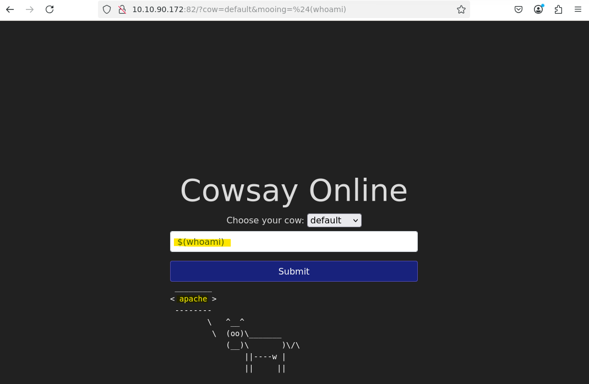
2. נוכל לבחור להקים Action משלנו או לקבל אחד עם המבנה המינימלי שאותו נצטרך , לפי הצורך שלנו נבחר במה להשתמש (בנוסף ניתן לבחור עוד המון סוגים של Actions שמופיעים באותו העמוד)

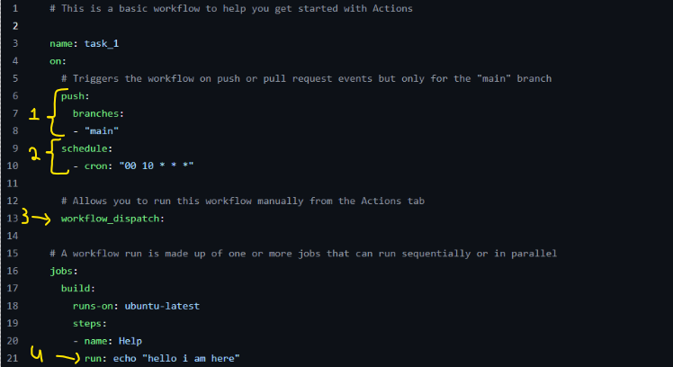

1. במידה ובחרנו ליצור בעצמנו נקבל קובץ yml ריק איתו נעבוד , במידה ונלחץ על כפתור הConfigure נגיע לדף הבא עם הקובץ yml הזה

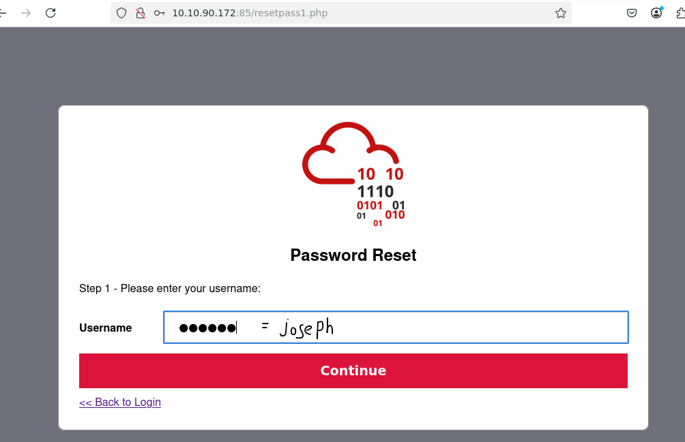

1. כאן נוכל לשנות את התוכן של הקובץ לפי הAction שנרצה ליצור , נוכל לשנות את השם של הקובץ yml כרצוננו , ניתן גם לראות את הנתיב בו הוא ישמר , כשנסיים נלחץ על הכפתור הירוק בצד ימין למעלה שרשום עליו - Commit changes...
2. כשנלחץ על הכפתור נראה את החלון הבא

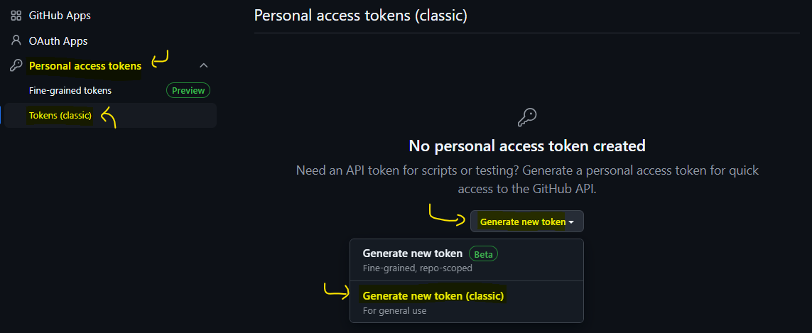

1. נוכל לשנות את השם של ההודעה עבור יצירת הAction הזה ולהוסיף תיאור כרצוננו , בסיום נלחץ שוב על הירוק בצד ימין למטה שרשום עליו - Commit changes

נוכל לראות שהקובץ נוצר כאשר נלחץ שוב על כפתור הActions בtool bar ונראה את הAction שייצרנו , השם שרשמנו בתוך הקובץ כשם הקובץ יופיע כשם של הworkflow בצד שמאל.

#### **נספח ג' - יצירת Organization:**

בשביל ליצור ארגון אנחנו נצטרך ליצור משתמש שהוא יהווה בתור הארגון שלנו , **ברגש ננפוך אותו לארגון לא יהיה ניתן להפוך אותו בחזרה למשתמש רגיל**

נעשה זאת בצורה הבאה:

- נכנס לאתר של GitHub ([www.github.com](https://www.github.com))
- נלחץ על התמונת פרופיל שלנו צד ימין למעלה
- נלחץ הsettings
- לאחר מכן בחלק של ה"Access" נלחץ על Organizations
- נלחץ על New organization
- נעקוב אחרי ההוראות בחלון שמופיע
