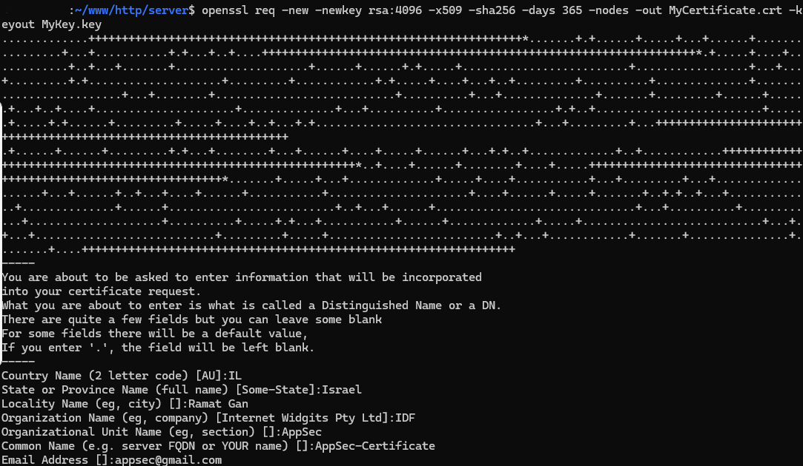
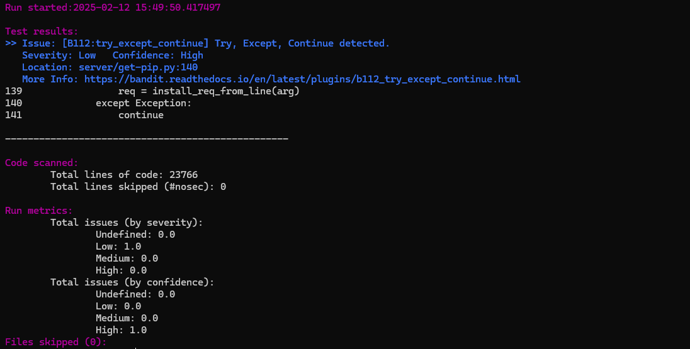
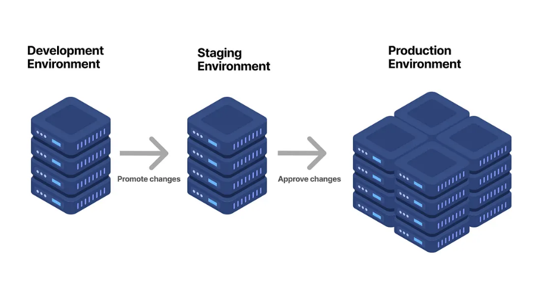
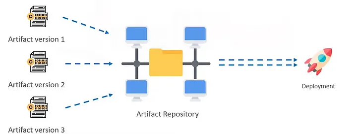
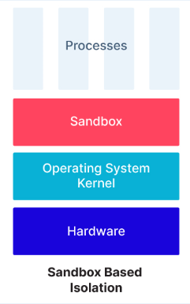
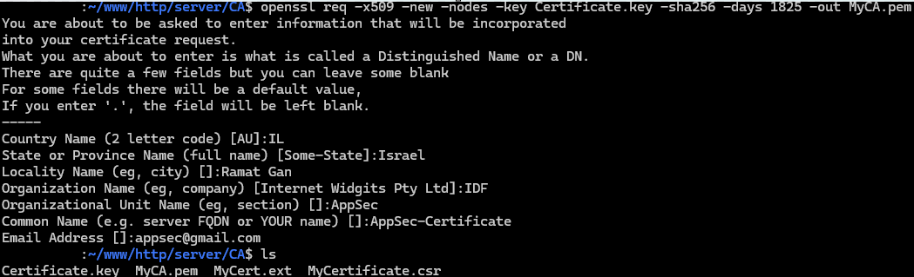
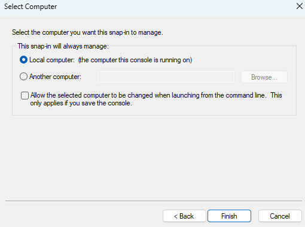
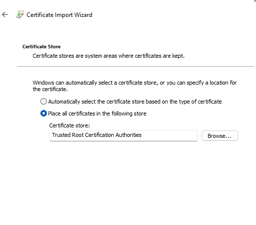
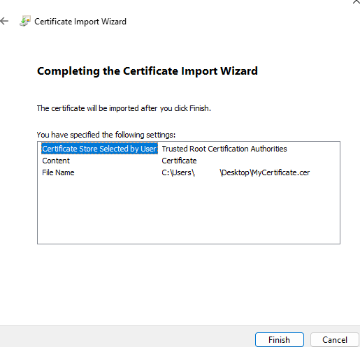
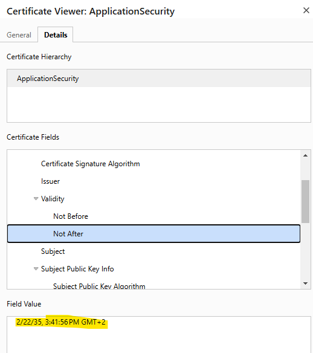

# **PKI**

## **What is PKI**

שימוש בהצפנות ובמפתחות הצפנה היא דרך בה ניתן להעביר מידע בין שני גרומים בצורה סודית וחסויה , עם זאת קיימת הבעיה של העברת המפתחות , איך נוכל להעביר את המפתח הצפנה הציבורי ולהיות בטוחים שהמפתח הצפנה הציבורי שהגורם השני שמקבל מפתח ציבורי באמת יקבל את המפתח שאני שלחתי ולא מפתח של אף גורם זדוני אחר , בכדי להתגבר על כך נצטרך לוודא את הזהות של המפתח , כלומר וידוא הזהות של מי ששלח את המפתח הזה בכדי לדעת בוודאות שהמפתח שהוא שלח לי הוא המפתח שקיבלתי ואני רוצה , בשביל "לחתום" את המפתחות האלו נצטרך גורם שעליו נוכל לסמוך בוודאות שאם הוא "יגיד" לנו "המפתח הזה הוא 100% אמיתי , תאמין לי אני בדקתיאת זה ואישרתי ואני אחראי על וידוא שזה באמת הוא" ונוכל להגיד לעצמו , "כן מעולה , אם הוא אמר כך אני מאמין לו" , בשביל זה נועד PKI.

PKI (Public Key Infrastrcture) הוא פתרון לבעיית החלפת המפתחות , הוא עושה זאת בעזרת הנפקת תעודות דיגיטליות באופן מפוקח ממשלתי , מאחר וממשלה היא גורם שניתן לסמוך עליו נדע שאם הממשלה "חתמה" על המפתח הזה ואנחנו רואים שניתן לאמת את הזהות של המפתח כ"חתום ממשלתית" נוכל להיות בטוחים שהמפתח שקיבלנו אמין ואמיתי.

הממשלה מנפיקה תעודות דיגטליות עבור גורמים רבים כמו מכשירים , בני אדם ,אפליקציות ועוד , בעזרת וידוא הזהות של כל אחד מהגורמים על ידי העובדה שהוא נחתם ממשלתית נוכל לדעת שהגוף העומד מאחורי שליחת המפתח הוא באמת מי שהוא טוען שהוא.

ניתן להתסכל על הגוף הממשלתי כאל גורם צד-שלישי ששני צדדים יכולים לסמוך על שיוודא שהכל קורה כראוי ובצורה אמינה , גוף שרוצה שתיהיה לו תעודה דיגיטלית שתזהה אותו יבקש מהגוף ההממשלתי (הצד-שלישי) להנפיק לו אחת כזאת והיא תיהיה אחראית לעשות זאת ולוודא שהוא באמת מי שהוא טוען שהוא.

* ישנה בעיה נוספת , איך נוכל מלחתחילה לקבל את התעודות הדיגטליות של הCAים , נצטרך איכשהו שהם יהיו לנו כדי שנוכל להשוות מולם ולהשתמש בהם , פתרון לבעיה זאת היא התקנת הRoot CA's וCA נוספים יחד עם התקנת מערכת ההפעלה כך שללקוחות יש אותם מראש על המחשב שלהם.

## **SSL/TLS need and usage**

## **Certificate in the SSL/TLS context**

## **The differences between the different versions of TLS**

- TLS 1.0 ו- 1.1 - ישנים ולא אבטחתיים , 1.0 נחשב כיורש של SSL ומאוד דומה לו.

- TLS 1.2 - אבטחתי, בשימוש נרחב, טוב עבור איזון בין תאימות לאחור ובטיחות.

- TLS 1.3 - מהיר ביותר , האבטחתי ביותר, best practice לשימושיים מודרנים.

ההבדליםבין הגרסות הוא שדרוג של אלגוריתמי האבטחה ויעול תהליך השיחה בין גרסה לגרסה , בנוסף חוסר שימוש באלגוריתמים לא אבטחתיים.

## **Missions**

- Create a self-signed certificate, then use it in a web server for https
    - 
    - 
    - 
    - 
- Create a CA, then sign a new certificate and use it for https on the web server
    - Linux
        - 
        - 
    - Windows
        - 
        - 
        - 
        - 
        - 
        - 
        - 
  
    - 
הפיכת התעודה לCA

        - 
        - 
        - 
        - 
- Make the CA to the trusted certificates on your machine (make sure there is a green lock)
- Explain how to inspect a certificate (for example, show when is its expiration date)
    - 

## **Certificate Chaining and intermediate CA**

כדי לאפשר לעוד גורמים נוספים להפיק עבור עצמם תעודות דיגטליות או עבור אחרים הם צריכים לקבל "אישור ממשלתי" שהם באמת אמינים לעשות זאת , כך נבנה איזה שהוא עץ היררכי של גופים שמאמתים אחד את השני כשהגוף הממשלתי הוא השורש בהיררכיה שממנו הכל מתחיל.

גופים שיוצרים תעודות דיגילטית לגורמים אחרים נקראים CA's (Certificate Athorities) , הגוף הממשלתי שנמצא בשורש האימותים של הזהויות נקרא Root CA , הCAים אחראים על יצירת התעודות הדיגיטליות , המדיניות שלהם ,עיסוקם ותהליכי ההנפקה והנישול של התעודות.

על ידי האפשרות שגופים אחרים יחתימו על גופים נוספים , מתקיים עץ החתימות עד הroot , כאשר מנסים לבדוק את תקינותה של התעודה הדיגיטלית עושים איטרציה אחרוה עד הroot ,גופים שחותמיםגופים אחרים נקראים intermediate.

כאשר גוף מנסה לוודא את אמינותה של תעודה דיגיטלית הוא בודק את תוקפה של התעודה ושהיא לא נושלה ואז הוא עובר על הCertificate Chain , כאשר תעודה מסויימת חתומה היא עושה זאת על ידי יצירת תעודה ומפתח פרטי משלה , לאחר מכן שולחת את התעודה לגורם מהיימן שחותם עליה , כעת יש לה תעודה חתומה ויש לה מפתח שהיא יכולה לחתום איתו גופים אחרים שיפנו אליה כגורם המהיימן שהיא תפנה לגוף הבא עד לroot , כך נוצר שרשרת שכל גוף מ"אשר" גוף אחר.

## **Client Certificate**

תעודות לקוח הן תעודות שנועדו לאשר את זהותו של הלקוח מול שרת אחר , כדי לוודא את אמינות הזהות של הלקוח שהוא מי שהוא טוען שהוא ממונק עבור תעודה דיגיטלית הנחתמת על ידי גוף מוסמך , למשל בכרטיס אשראי או בשימוש בVPN יש שימוש בclient certificate.

