# **Web Attacks**

## **OWASP**

### **Top 10 OWASP**

1. Broken Access Control
    1. 
    2. 
2. Cryptographic Failures
    1. 
    2. 
    3. 
    4. 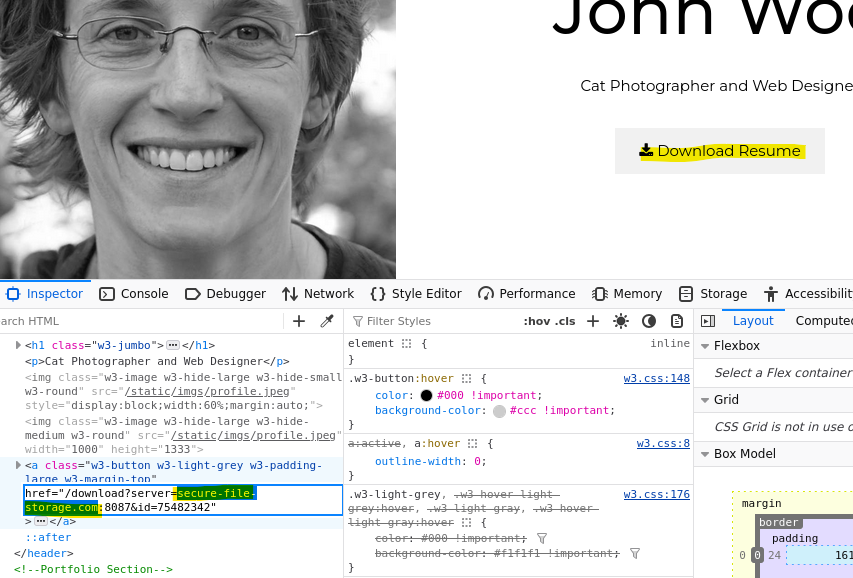
    5. 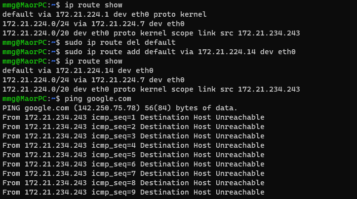
    6. 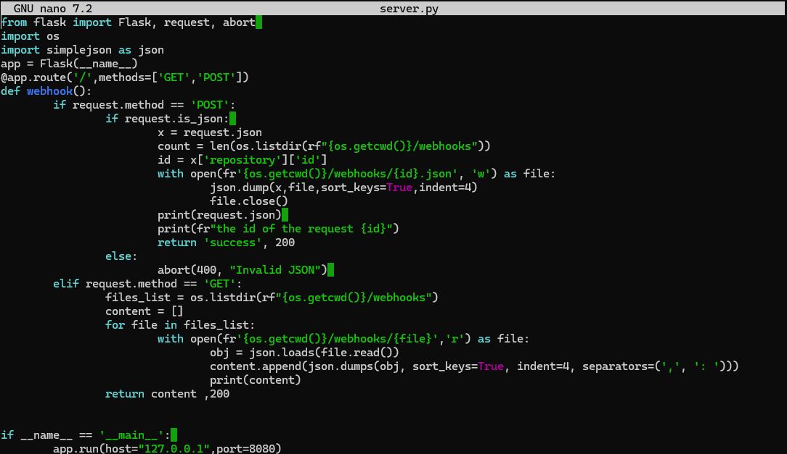
    7. 
3. Injection
    1. Command Injection
        1. 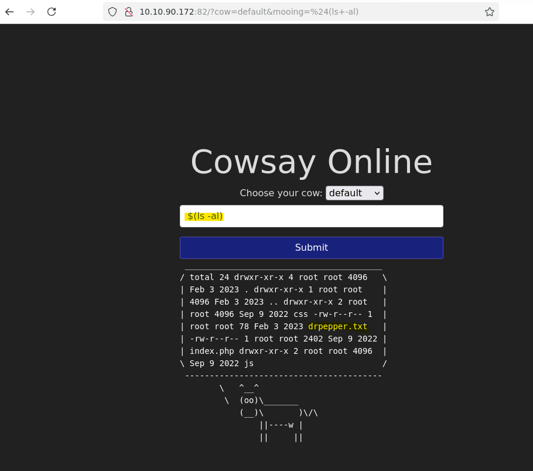
        2. 
        3. 
        4. 
        5. 
4. Insecure Design
    1. 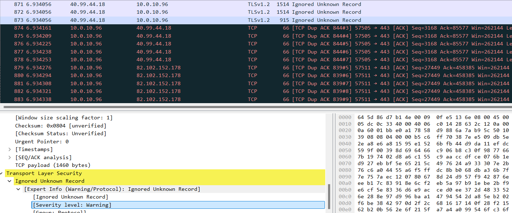
    2. 
    3. 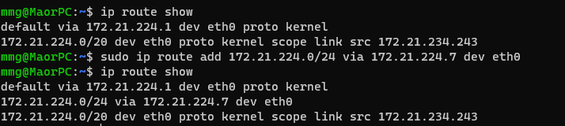
    4. 
    5. 
    6. 
    7. 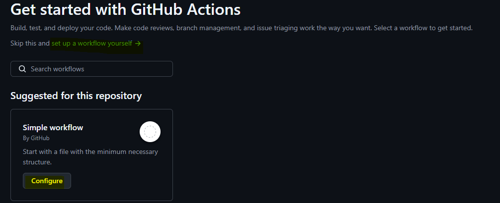
    8. 
5. Security Misconfiguration
    1. 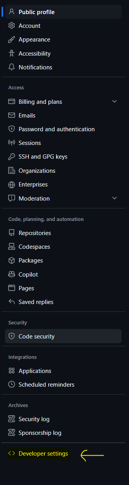
    2. 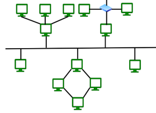
6. Vulnerable and Outdated Components
    1. 
    2. [https://www.exploit-db.com/exploits/47887](https://www.exploit-db.com/exploits/47887)
    3. 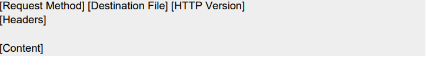
    4. 
7. Identification and Authentication Failures
    1. 
    2. 
    3. 
    4. 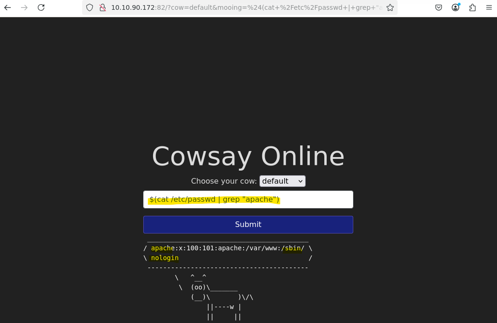
    5. 
    6. 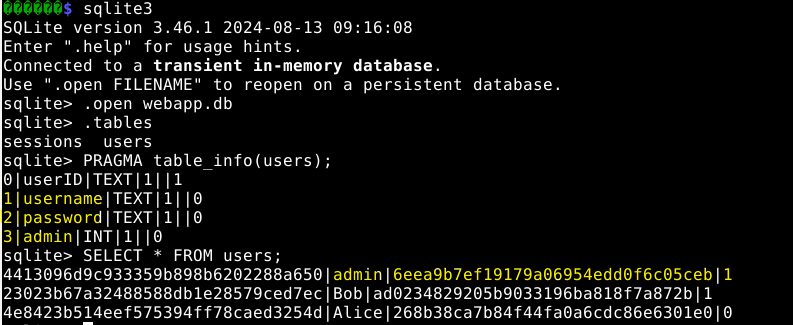
8. Software and Data Integrity Failures
    1. 
    2. 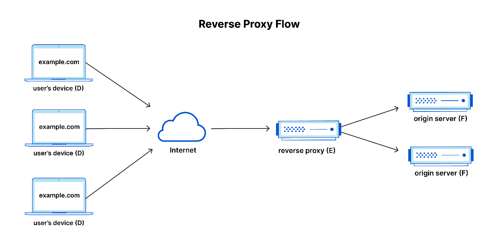
    3. 
    4. 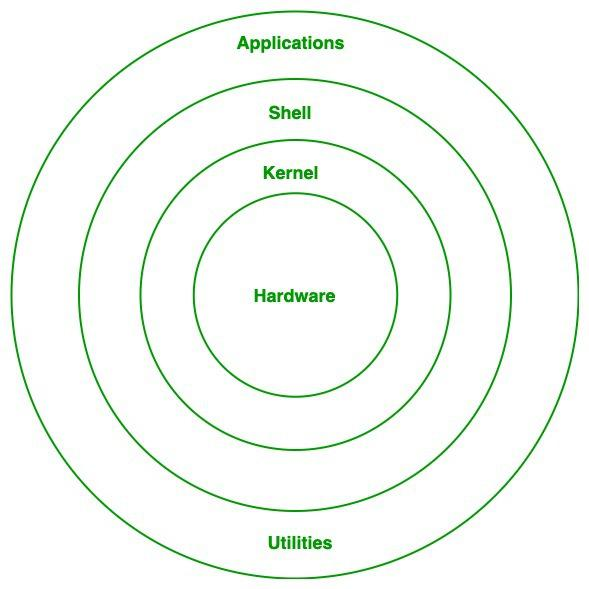
    5. 
    6. 
    7. 
9. Security Logging & Monitoring Failures
    1. 
10. Server-Side Request Forgery (SSRF)
    1. 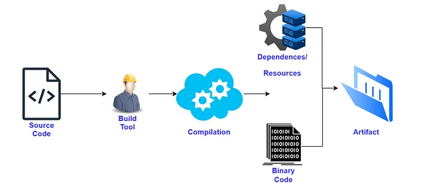
    2. 
    3. 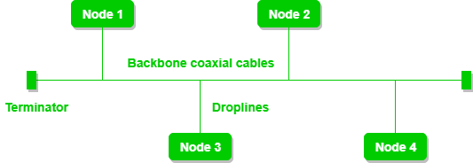
    4. 
    5. 
    6. 
    7. 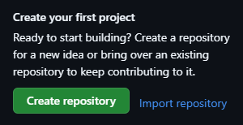
    8. 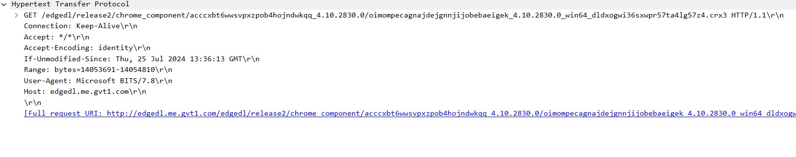
    9. 

הסברים מלאים + תרגול נמצאים באתר של TryHackMe בחינם באחת מהכתובות האלו:

[https://tryhackme.com/room/owasptop102021](https://tryhackme.com/room/owasptop102021)

[https://tryhackme.com/room/owasptop10](https://tryhackme.com/room/owasptop10)

## **Attacks**

### **DOS & DDOS**

DOS וDDOS הם שידרוג אחת של השנייה , המונח DOS אומר Denial-Of-Service וDDOS אומר Distrebuted-Denial-Of-Service , הרעיון מאחורי 2 המתקפות היא גרימה שרת או רכיב מסויים להיות בעומס יתר וכתוצאה מכך לא לתפקד , למשל מתקפת DOS או DDOS על שרת אינטרנטי מסוים למשל gov.co.il יכולה להתבצע למשל על ידי הצפה של השרת בבקשות HTTPS זדוניות עד להבאתו למצב בו הוא לו מצליח לטפל בכל הבקשות , מצב זה יגרום לו לא לתפקיד כראוי ובכך לא להיות מסוגל לטפל בבקשות לגיטימיות של משתמשים רגילים.

ההבדל בין DOS לDDOS הוא פשוט מאוד , מתקפת DOS מתבצעת ממקור יחד ומתקפת DDOS קורת ממקורות מרובים , למשל אני אוכל דרך המחשב הביתי שלי להציף את השרת בבקשותולגרום לDOS לחלופין אוכל לעשות זאת בנוסף גם דרך הלפטופ , הטלפון או כל רכיב אחר שארצה , כאשר אעשה זאת מכמה מכשירים המתקפה תיהיה Distrebuted כלומר מבוזרת בין כמה מקורות , לחלופין אוכל גם להשתמש בבוטים או במחשבים שהצלחתי להשתלט עליהם באופן זדוני ולבצע אותה הפעולה.

יש כמה דרכים שונות למנוע מתקפות DOS וDDOS , ביניהם שימוש במאזני עומסים (load balancer) , כלים כמו WAF בשביל לסנן את התקשורת , ולחסום מתקפות זדוניות , , שימוש בCache ובהגבלת כמות התקשורת שעוברת ברשת.

**Brute Force**

מתקפת Brute Force או ברוט-פורס היא מתקפה בה תוקף משתמש בשיטה של ניסיון וטעיה בשביל להציג לפרצח פרטי הזדהות , סיסמאות , הצפנות ועוד , שיטה זו היא שיטה פשוטה יחסית אך שימושית מאוד בשביל להצליח להשיג גישות , תוקפים שמשתמשים בשיטה זאת יודעים לשים כמטרה משתמשים חלשים יותר , מערכות חלשות יותר ובאופן כללי נקודות חולשה במערכת הכללית .

ישנם שיטות שונות בהם יודעים להסיק איך ועל מי לבצע את מתקפת הbrute-force , למשל יש משתמשים דיפולטים כמו guest , admin . anonymous שהסיסמאות שלהם נשארות זהות ולא משנים אותן ואז קל לנחש , או משתמשים שהסיסמה שלהם חלשה אז קל לנחש אותה , לפעמים מתשמשים במתקפות אחרות כמו phishing בשביל להשיג שם משתמש כלשהו או סיסמה ואז לבצע בעזרת חלק מהפרטים מתקפת brute force.

ישנם כמה סוגים של מתקפות brute force , יש את הסוג הרגיל בו משתמשים בסיסמאות נפוצות או רגילות בהם אנשים נוהגים להשתמש , סיסמאות אלו נקראות סיסמאות חלשות כי הם מוכרות והרבה אנשים משתמשים בהם , הם פשוטת ולא מתוחכמות לרוב, תוקף יבחר משתמש כלשהו וינסה להתחבר עם המון סיסמאות שונות עבור אותו המשתמש עד שיצליח להתחבר עם אחת מהן , סוג מתקפה נוספת נקראת מתקפת Dictionary , בה משתמשים בסיסמאות ומשתמשים שהשיגו ממערכות שנפרצו ומנסים להשתמש בהם בשביל להשיג גישות , מנסים מלא משתמשים עם הסיסמאות שנמצאו להם עד שמצליחים להכנס , ניתן לשלב את שתי המתקפות האלו יחד למתקפה משולבת , בנוסף ישנה מתקפת Reverse Brute-Force בה התוקף השיג סיסמה כשלהי והוא מנסה אותה על המון משתמשים שונים.

בכדי למנוע מתקפות Brute-Force חשוב להשתמש בסיסמאות חזקות , סיסמאות שלא קל לנחש , בשמירת הסיסמאות בDB חשוב להשתמש בsalt וpepper עבור הסיסמאות וכמובן בhash של הסיסמה ולא בסיסמה עצמה , בנסוף רצוי להשתמש באלגוריתם bcrypt שהופך את פיצוח הhash לקשה במיוחד , ניתן לעשות הגבלות נוספות כמו כמות ניסיון כולשים מוגבלת או הימנעות מפישינג בשביל להדליף כמה שפחות מידע עבור התוקפים.

### **SQL Injection**

SQL Injection או SQLi היא חולשה אבטחתית באתרי web שמאפשרת לתוקפים להשתמש בשאילתות SQL בשביל להתערב בפעילות הרגילה של האפליקציה עם הDB , בכך התוקף משיג גישה למידע שלא אמור להיות להו גישה אליו או שהוא לא אמור להיות יכול להשיג גישה אליו באופן רגיל.

בעזרת מתקפת SQLi ניתן להשיג , להדליף , לשמור , לשנות ולעדכן המון מידע בDB כמו מידע של משתמשים , מידע על האפליקציה ועוד , תוקף שמשיג גישה לDB בעזרת השאילתות יכול לערוך ולמחוק מידע ובכך לגרום לשינויים תמידיים בDB עצמו , בנוסף מתקפות SQLi יכולות להוביל להסלמת הרשאות ואף למתקפות DOS.

מתקפות SQLi מוצלחות בדרך כלל יובילו להשגות גישה למידע רגיש כמו סיסמאות , פרטי כרטיס אשראי או כל מידע אישי רגיש אחר.

בדרך כלל מתקפות SQLi קורות בעזרת השימושבשאילתות SQL הכוללות שימוש בשאילתת SELECT עם שימוש בשאילתות WHERE , יכולות לקרות גם בשימוש של שאילתות כמו Update , INSERT וORDER BY.

ישנם כמה סוגים של SQLi:

- in-band SQLi - תוקף משתמש באותו נתיב תקשורתי בשביל לבצע את המתקפה ובשביל להשיג את המידע , תתי החלוקה של סוג המתקפה הזאת הם Error-based בה התוקף גורם לשרת להחזיר הודעות שגיאה ובכך להצליח להסיק ולהשיג מידע על השרת , Union-based בה התוקף מנסה להשיג מידע בעזרת השימוש בUNION.
- inferential (Blind) SQLi - מתקפה בה התוקף שולח שאילתות לשרת ולא רואה תגובה באופן רגיל כמו בin-band ,התוקף שולח payload לשרת ומתבונן בצורה שבה הוא מגיב ובהתנהגות שלו בשביל ללמוד ולהסיק מידע על המבנה שלו ודרך הפעולה שלו , ניתן לסווג את המתקפה הזאת לשני סוגים , Boolean בהנבדק אם חוזרת תשובה מהשרת או לא כתלות במשתנה הבוליאני שהתוקף בחר (אמת או שקר) , Time-based בה התוקף גורם לשרת לחכות לפני שהוא מגיב ובכך רואה כמה זמן לוקח לו לבצע פעולות (שיטה זאת יכולה לשמש בשביל מתקפות DOS)
- Out-of-band SQLi - שיטה שמתקיימת רק בתנאים מסויימים , משתמשים בה כאשר לא ניתן לבצע את המתקפה בצורת in-band , תוקף גורם לשרת להחזיר את המידע שהוא מנסה להשיג לעמדה מרוחקת ולא דרך ערוץ התקשורת הרגיל שלה עם האפליקציה , בשביל לאפשר מתקפה מסוג זה צריך שהשרת יוכל לבצע בקשות DNS או HTTPS.

מתקפות SQLi קורות לרוב בגלל שמשתמשים בנתונים ה"raw" שמשתמש מזין במקום בפרמטרים או אם מתירים שימוש בתווים שעלולים להיות מסוכנים ולהתפרש כחלק משאילתת SQL , לכן כדי להמנע ממתקפות SQLi חשוב לא להשתמש בנתונים שהמשתמש מזין אלה בפרמטרים במהלך שימוש בשאילתות , בנוסף איסור שימוש בתווים שעלולים להתפרש כחלק מתויים השייכים לשאילתות SQL.

### **XSS**

Cross-site scripting ידוע גם כXSS , היא חולשה אבטחתית באתרי web המאפשרת לתוקף לפגוע במשתמשים במהלך האינטרקציה שלהם עם האפליקציה , במתקפה זו תוקף מצליח לגרום לאצר כלשהו להריץ קוד זודוני בתור קוד שהוא כחלק מהאתר עצמו , כלומר התוקף גורם לאתר להריץ את הקוד הזדוני שלו כאילו זה קוד רגיל לגמרי שהאתר אמור להריץ למרות שהוא לא.

כאשר תוקף מצליח להחדיר את הקוד הזדוני שלו לתוך האתר , הוא גורם לאתר להריץ את הקוד בהרשאות שלו , כלומר לקוד יהיה את היכולות שיש לאתר , כגון גישה לתכנים ועריכה שלהם בכל חלקי האחסון האפשריים לשרת ,שימוש בפרטי משתמש בשביל בקשות HTTP (בכך יכול להתחזות למשתמש לגיטימי).

בכדי שיתממשו מתקפות XSS בצורה מוצלחת צריכים להתקיים 2 תנאים על ידי האתר:

- האתר מקבל קלט שעלול להיות מעוצב על ידי תוקף , כך תוקף יכול להחדיר קלט שהוא רוצה במקום קלט לגיטימי.
- האתר יכליל את הקלט בתוך עמוד כלשהו מבלי לסנן אותו קודם , כלומר מבלי לוודא שקלט הזה לא יכול להיות מורץ על ידי JS (JavaScript).

ישנם 2 סוגים עיקריים של מתקפות XSS:

- Reflected - תוקף גורם מחדיר לURL ספציפי קוד זדוני באופן מוטמע , לאחר שמטמיע את הקוד בURL הוא גורם לקורבן להריץ את הURL (למשל ללחוץ עליו) , בכך האפליקציה הפגיעה משתמשת בpayload הזדוני בתגובה שלה לדפדפן של המשתמש מבלי לשמור אותו על השרת.
- Stored - תוקף מצילח להזריק דרך הweb app קוד זדוני אשר נשמר על השרת (כמו paylaod לDB או קובץ כלשהו על השרת וכו') , הקובץ נשמר ללא הרצה שלו , בכך המתקפה פועלת כאשר משתמש (קורבן) טועםן את הדף שמריץ את הקוד , בכך ניתן לפגוע בכמות מרובה של משתמשים.
- DOM-based - מתקפות אלו הן מתקפות שקורות רק בצד הלקוח , כל הקוד הזדוני שמוזרק מתרחש רק בצד של הלקוח בלי אף תקשורת עם צד השרת , הוא מתבצע על ידי מניפולציה של DOM (Documented Object Model) של עמוד באתר.

כדי להגן ממתקפות XSS חשוב לסנן את המידע שמגיע מהדפדפן לשרת , חשוב לבדוק שהתוכן שמתקבל אינו תוכן שניתן להרצה , ניתן לעשות זאת על ידי פונקציות ו-APIים שונים, בנוסף שימוש בCSP (CONTENT SECURITY POLICY) שהם מדיניות שמגדירות לדפדפן מה משאבי הJS או הCSS בהם הוא משתמש ובכך להגביל אותו שהוא יוכל להריץ רק אותם , סינון אפשרי נןוסף הוא המרת תווים שעלולים להיחשב כתווי HTML לקוד שמסמל אותם , למשל: `">"` מומר ל-
`"&gt;"`.

* הגדרה שעוזרת להגן ממתקפות XSS היא חסימת שימוש בHTTP Trace שבעזרת ניתן לגנוב cookie של משתמשים

### **CSRF**

(CSRF(Cross-site request forgery ידועה גם בתור XSRF או session riding היא מתקפה באתרי web המאפשרת לתוקף לגרום למשתמש לבצע פעולות ללא כוונתו של המשתמש , התוקף מערים על משתמשים לגיטימים לכדי ביצוע פעולות לא מכוונות באפליקציה , המתקפה הזאת מנצלת את האמון שיש בין משתמשי לאתרי הWEB , האמון הזה גורם לאתרי WEB לקבל כל בקשת HTTP מהדפדפנים של משתמשים לגיטימים באופן אוטומטי.

מתקפות CSRF יכולות להוביל להשלחות רבות , בדרך כלל מתקפות אלו משתמשות ב2 ערוצים אותם הם מנצלות בשביל לבצע את המתקפה:

- האמון בין אתרי הweb או האפליקציות לבין הדפדפנים של המשתמשים - לעיתים האפליקציה תנהל את הsessionים תוך שימוש בID של משתמש הידועים לדפדפן ולא מעבר , כך תוקף יכול גם לראות את הID ולנצל את זה.
- Same-origin policy and cross-origin resource sharing loopholes - תוקפים המוצאים חורים שניתן לנצל במנגנון הSOP או הCORS ובכך לגרום לאתרים לתקשר עם אתרים אחרים , בכך למשל לגרום לאתר לתקשר עם אתר זדוני אחר.

ישנם 3 שלבי עבודה כלליים למתקפות CSRF:

1. תוקפף יוצר URL או סקריפט בעזרתו הוא מנצל את החולשה.
2. התוקף משתמש בsocial engineering בשביל לגרום למשתמש ללחוץ על הURL או להריץ את הscript.
3. משתמש אשר מחובר כבר לאתר שולח (בעל כורחו) הודעת HTTP זדוני והמתקפה הצליחה (לא ניתן לעלות על המתקפה , אלה רק אחרי שהיא כבר צלחה)

בכדי להצליח למזער ולגלות מתקפות CSRF נרצה לעשות שימוש בכלי בדיקות אבטחה אשר בודקים את האבטחה של אתרים ואפליקציות web בצד הלקוח ובצד השרת , לבדוק בעזרתם את ניהול הsessions של האפליקציות והאתרים שלא יהיו תלויים בצד הלקוח או בcookies של הדפדפן , בנוסף נרצה לסרוק עבור בקשות Ajax ונקודות קצה API לא מאובטחות , לשים לב שאף מידע כמו tokenים או מידע אחר שיכול לשמש למתקפות CSRF לא נכלל באתר , באפליקציה , בURLים וכו' , דבר נוסף שיכול להועיל הוא שימוש בסורקי קוד שעשויים לגלות חולשות היכולות לשמש למתקפות CSRF כבר בקוד.

בשביל להצליח למנוע מתקפות CSRF נרצה להשתמש בכלים שונים כמו WAF מתקדם , להטמיע טכניקות של הגנה לעומק , לאמץ את עבודת ה"shift left" ככל הניתן במהלך הפיתוח ועוד.

### **SSRF**

SSRF (Server-side request forgery) הוא וקטור תקיפה שלם שניתן לנצל בדרכים שונות , באופן בסיסי ניתן להגדיר מתקפת SSRF כיכולת של תוקף לגרום לאפליקציה לבצע בקשות רשתיות ל מבוקרות אל יעדים לבחירתו של התוקף (למשל יעדים בהם הוא שולט או יעדים אחרים בתוך השרת שאליהם הוא ירצה לנתב את הבקשות) , המתקפה היא בעצם היכולת של התוקף לגרום לשרת לבצע בקשות מזוייפות מטעמו שלו , אלה שהתוקף הוא בעצם זה ששולט בבקשות ולא השרת , בכך התוקף יכול לנצל את השרת לבצע פעולות במקומו ולהדליף מידע ללא כוונה , מטווה התקיפה של SSRF מנוצל לרוב על ידי התוקף בעזרת שלחית קלט בפורמט URL אל היעד אליו התוקף מעוניין לנתב את הפניות של האפליקציה , אותו קלט מועבר לצד השרת שמבצע את התקשורת מטעם האפליקציה אל היעד שהתוקף בחר.

ניצול מתקפת SSRF יכול להתבטא בפעולות רבות כמו RCE , גרימה לXSS ובנוסף יכולותו של התוקף להשתמש בשרת כמעין פרוקסי אל תוך הרשת הפנימית של השרת , בכך התוקף מסוגל לתקשר עם רכיבים בתוך הרשת הפנימית של השרת שאינם חשופים באינטרנט ולהשיג מידע ואף להשתלט על האפליקציה כולה.

תהליך ניצול מטווה מתקפה של SSRF יקרה בדרך כלל בשלבים הבאים:

1. זיהוי נקודה חולשתית אצל השרת - התוקף ימצא פונקציה באפליקציה ההמאפשרת לו לשלוח בקשות HTTP או URL כלשהו מצד הלקוח.
2. יצירת הpayload הזדוני - התוקף יצור בהתאם paylaod זדוני כלשהו הכולל את הURL שהוא רוצה לנתב אליו.
3. עיבוד הpayload בצד שרת - השרת יעבוד את הpayload ויבצע בקשה אל היעד שנבחר באופן זדוני על ידי התוקף.
4. הצלחת המתקפה - השרת יפנה אל היעד הנבחר יאחזר ממנו את המידע שהתוקף רצה ויחזיר אותו לתוקף ,בכך ידליף מידע או יאפשר גישות לא רצויות לתוקף.

כדי להגן ממתקפות המנצלות את וקטור התקיפה של SSRF נרצה לוודא ולסנן את כל הקלטים המתקבלים על ידי המשתמש באופן קפדני ומדוייק , בכך לאפשר רק לURL ספציפים להתקיים , נרצה גם להשתמש בwhitelist עבור סינון כתובות הURL שלשרת מותר לפנות אליהם , נרצה לממש עקרונות הפרדה ובידול ,בכך נבודד רכיבים אשר לא אמורים לתקשר אחד עם השני ברשתות שונות כך לא יוכלו לגשת אחד לשני , נשתמש בACLים וFWים , מימושים אבטחתיים נוספים כמו שימוש בheaderים ופרוטוקולים מאובטחים כמו אכיפת שימוש בCSP ובפרוטקול HTTPS. פעולות נוספות שיכולות למזער את המתקפות הם בידקות מחזוריות של האפליקציה , נתיעוד וניטור תקשורתי ומימוש עקרונות POLP.

### **XXE Injection**

XXE (XML External Entity) Injection היא מתקפה בה תוקף מנצל את אפשרות של קבצי XML להשתמש ביישויות חיצוניות ובכך מנצל אתהפרסור (ניתוח) של יישויות XML אלו בכדי לגרום למערכת להשתמש בקלטי הXML הזדוניים שהוא מזין ובכך לפגוע באפליקציה , המתקפה מתרחשת כאשר תוקף מזין קלט XML המכיל הפניה ליישות חיצונית שלא אמורה להיות אפשרות לגשת אליה , קלט זה מעובד על ידי פרסר שמקונפג בצורה חלשה (באופן חולשתי , הוא מעבד את הקלט ומאפשר לו לפעול או מאפשר את השימשו בו , דבר שלא אמור להיות).

מתקפה זה עלולה לגרום לנזקים רבים כמו DOS , דלף מידע , זיוף בקשות צד שרת , סריקת פורטים , יכולת להריץ פקודות ועוד. תוקף מסוגל להזין קלט שיראה כמו קלט מערכת מוצהר , בכך לגרום לXML פרסר לזהות אותו כפרמטר ,לעבד אותו ולהחליף אותו במיקום שצויין , בכך במידה והקלט מכיל מידע שלא אמור להיות גלוי , הפרסר עלול להציג אותו ובכך להדליף מידע.

בכדי למנוע את המתקפה הזאת נרצה לחסום את האפשרות להשתמש בXXE בכדי שהXML פרסר לא יעבד אותם , לסנן את הקלטים המוזנים על ידי המשתמשים ולהשתמש בספריות אשר לא תומכות בפיצ'רים חולשתיים של XML.

### **CRLF Injection**

CRLF (Carriage Return and Line Feed) Injection היא מתקפה בה תוקף מזריק רצף של תווי CRLF (%0D%0A, or \r\n in ASCII לנתוני קלט המשתמש ובכך מסוגל להזריק HTTP Headers שרירותיים או לפצל את התגובת הHTTP , ההשפעה של הזרקות CRLF גורמות לסיומה והתחלתה של שורה חדשה בפרוטוקולי עיבוד טקסט רבים (ביניהם HTTP) , בכך התוקף יכול לתמרן את הבקשות והתגובות של פרוטוקולים אלו לכדי מצב בו הוא להסלים למתקפות אחרות כמו XSS , הזרקת עמוד , הרעלת הcache הwebי ועוד.

שני השימושים הנפוצים ביותר למתקפה זו הם HTTP Splitting שכבר הוזכר והשימוש השני הוא הרעלת לוגים , בה התוקף מזריק ללוגים תווים היוצרים שורות חדשות ובכך מבלגן את הלוגים ויכול בכך להסתיר מתקפות שקרו או לבלבל את מי שמנסה לקרוא אותם.

דוגמה למימוש מתקפת HTTP Splitting היא למשל מתקפה בה תוקף גורם מתמרן את הHeaderים בתגות HTTP ובכך גורם להם להריץ קוד שרירותי כלשהו למשל בJS.

בכדי למנוע מתקפה זאת נרצה לסנן קלטי משתמש , לבדוק תווים המשמשים בשביל יצרת שורה חדשה (לעשות להם strip) , לקודד מידע שעובר (בכך להקשות על תוקף להזריק תווים) ולסרוק באופן מחזורי את האתר בכדי למצוא ולתקן חולשות.

## **Extras**

- [XSS-Game](http://xss-game.appspot.com/)
- [Google Gruyer](https://google-gruyere.appspot.com/)
- [OWASP Juice Shop](https://owasp.org/www-project-juice-shop/)
