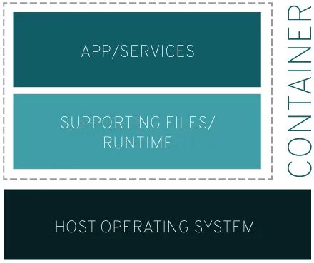
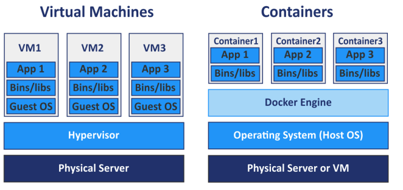
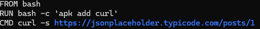
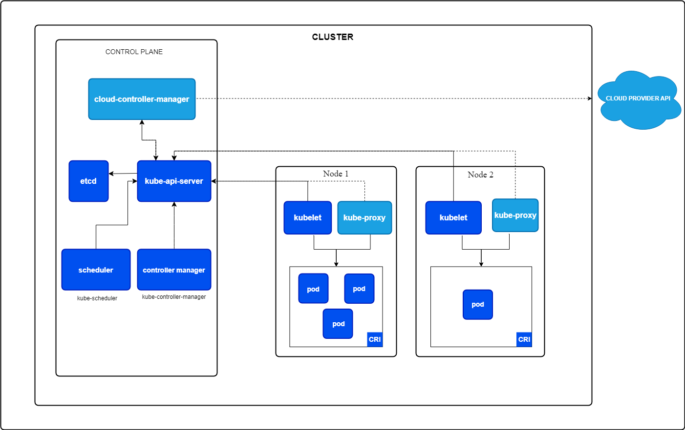
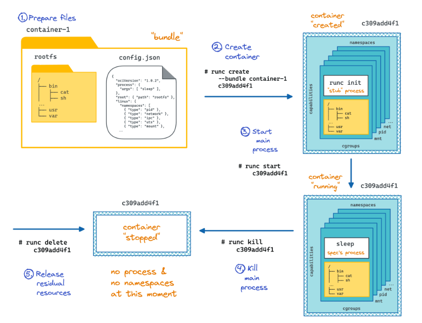
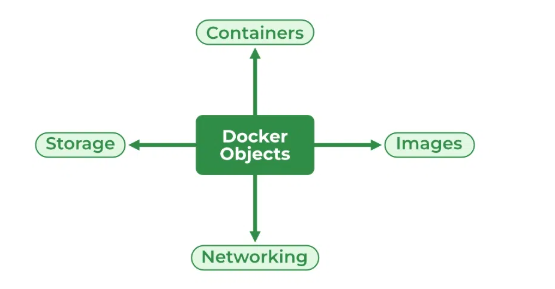
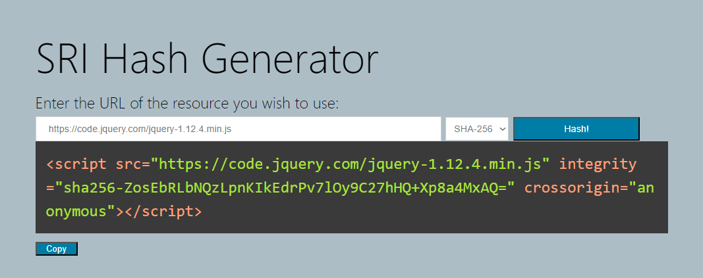

# **Containers:**

## <div dir="rtl">**שכבות בידוד של קונטיינרים**</div>

<div dir="rtl">**בידוד של קונטיינרים מתבצע בצורה של שכבות שמהוות כמסוג של פילטרים , כל שכבה מספקת בידוד נוסף לקונטיינר.**</div>


### **SECCOMP:**

<div dir="rtl">**שכבה זו היא פיצ'ר של לינוקס שמוכל ברמת הריצה של הקונטיינר שבעזרתו ניתן להגביל קריאות מערכת של תהליך בקונטיינר , הפיצ'ר מאפשר סוג של whitelist של קריאות מערכת שבעזרתו אפשר לפלטר איזה קריאות מערכת יתאפשרו לתהליך וכל השאר לא.**</div>

### **APPARMOR/SELINUX:**

<div dir="rtl">**שני הסוגים האלו בשכבה הם סוג של מערכות בקרת גישה על משאבים , הם מגבילים את הגישה של התהליכים בקונטיינרים למשאבים שונים.**</div>

<div dir="rtl">**APPARMOR עושה את זה בצורה של יצירת פרופילים לתהליכים שרצים על בקונטיינר ולכל אחד מהפרופיל ניתן להגדיר את הגבלות הגישה למשאבים שונים על המחשב.**</div>

<div dir="rtl">**SELINUX עובד בצורה של יצירת תוויות למשאבים במערכת הפעלה של לינוקס ובכך הוא מגביל את הגישה למשאבים האלו בהתבסס על התווית של המשאב והתכונות של התהליכים שמנסה לגשת למשאב הזה.**</div>

### **CGROUPS:**

<div dir="rtl">**נועדו בשביל לנהל את משאבי המערכת על ידי שליטה במשאבים עבור אוסף של תהליכים , הם מאפשרים או מגבילים גישות על משאבים של חומרה כמו CPU או MEMORY ובכך מונעים מתהליכים אחרים להשתמש במשאבים של קונטיינר אחר , ההגבלה נעשית על ידי חלוקה של ניצול המשאבים בצורה הירככית.**</div>

<div dir="rtl">**CGROUPS מאפשרים לשלוט בכמות המשאבים שתהליך מנצל, בעזרתם אפשר להגביל תהליכים לא להשתמש בכמות גדולה מידי של משאבים שכתוצאה מכך יפגעו בתהליכים אחרים שנמצאים במערכת ובביצועים שלהם , בכך נגביל לתהליכים שונים את יכולות ניצול משאבי המערכת ונקטין את הסיכון שתהליכים יפגעו אחד בשני.**</div>

<div dir="rtl">**ההגבלה שCGROUPS מאפשרים על תהליך מגבירים את האבטחה שלנו על המערכת , היא מאפשרת למנוע DDOS attacks כמו fork bomb (יצירה של המון תתהליך בשביל שיצרכו המון משאבים ויקריסו את המחשב).**</div>

### **CAPABILITIES:**

<div dir="rtl">**זהו מנגנון שקיים במערכות הפעלה של לינוקס והוא מיושם באותו הצורה גם בתוך קונטיינרים , בעבר היה חילוק הרשאות שהפריד בין פעולות של משתמש פשוט למשתמש רוט , ככה שאם משתמש היה רוצה לעשות משהו בהרשאות גבוהות יותר היה צריך לרוץ עם סודו או עם הUID של רוט , מכיוון שזה לא אבטחתי במיוחד נוצר המנגנון של CAPABILITIES , מנגנון זה מאפשר לחלק את ההרשאות שיש לרוט להרשאות שונות אינדבדואליות שאת כל אחת מההרשאות ניתן להקנות לתהליך או קובץ באופן ספציפי.**</div>

### **NAMESPACES:**

<div dir="rtl">**זהו מנגנון שקיים במערכות הפעלה של לינוקס המאפשר לצמצם לתהליכים את ה"נוף" שלהם על משאבי מערכת , כלומר לספק עבור תהליך תצוגה מבודדת של משאבי מערכת כך שהוא "יכיר" רק בקיומן של המשאבים שאותם המערכת בודדה עבורו , ניתן ליישם את הNAMESPACES על מקבץ של תהליכים או על תהליכים אינדיבידואלים , על ידי השמת תהליכים בNAMESPACES משלהם ניתן להגביל את הגישות או המשאבים שלהם, משאבים כמו מערכת הקבצים , תהליכים אחרים שרצים על המחשב המארח ועוד , בצורה כזו שינויים שנעשים בסביבת הNAMESPACE גלויה לכל תהליך שנמצא בתוכו , אך שינויים לא גלויים בין NAMESPACES שונים , כלומר עבור תהליך שנמצא בNAMESPACE אחד שינויים שמתרחשים בNAMESPACE אחר לא גלויים ולהפך.**</div>

<div dir="rtl">**ישנם 8 סוגים של NAMESPACES נכון לתאריך הנוכחי:**</div>

**Mount, PID, Network, Cgroup, IPC, Time, UTS, User**

#### **Mount(mnt):**

<div dir="rtl">סוג מרחב שמות (NAMESPACE) זה מאפשר לבודד את לקבוצה של אחד או יותר תהליכים את את התפיסה שלהם על מערכת הקבצים , כך שתהליכים במרחבי שמות שונים של MOUNT יכולים להיות בעלי ראות שונה על מערכת הקבצים ועל ההיררכיה שלה , זה מתבטא בצורה כזו שתהליכים הנמצאים בMountים שונים יכולים להיות בעלי מערכת קבצים שונה אחת מהשנייה.</div>

<div dir="rtl">כאשר עושים לתהליך כלשהו מרחב שמות MOUNT , נוצרת עבורו מערכת קבצים חדשה במקום האחת האחרת שמוגדר כברירת המחדל עבורו (שהיא מערכת הקבצים הרגילה של מערכת ההפעלה) , שימוש במרחב שמות MOUNT שימושי מאוד למקרים בהם נרצה להפריד בין הקבצים אליהם יכולים לגשת תהליכים שונים , למשל הפרדה בין הגישה של תהליכים שנמצאים ב2 מרחבי שמות MOUNT שונים אל קבצים אחד של השני , או למנוע מתהליכים בMOUNT מסויים לגשת לקבצים שמשמשים רק את המארח או תהליכים אחרים בו.</div>

#### **PID(pid):**

<div dir="rtl">מרחב שמות PID מאפשר לבודד את הראות של תהליכים במרחב על שאר התהליכים במחשב המארח או במרחבים אחרים , הבידוד למרחבים מאפשר להבטיח שרק תהליכים שנמצאם באותו מרחב שמות PID יכולים לראות אחד את השני , ניתן לאפשר לכמה קונטיינרים לחלוק את אותו מרחב שמות PID ובכך ליצור אינטגרציה ביניהם , בנוסף הפרדה של תהליכים למרחבי שמות PID שונים מאפשר שתהליכים במרחבים שונים יהיו בעלי PID זהה , כלומר בכל מרחב תהליכים יכולים להשתמש באיזה PID ש"מתחשק" להם כל עוד עדיין לא משתמשים בו במרחב שהם נמצאים , היכולת הזאת מאפשרת לתהליך להשתמש באותו PID בכמה מרחבי שמות PID שונים שהוא חלק מהם , עם זאת ניתן לתת לכל קונטיינר init משלו (PID 1) , התהליך אב של כל התהליכים.</div>

<div dir="rtl">מנקודת המבט של מרחב שמות PID , לכל תהליך במרחב יש 2 PID אחד פנימי בתוך המרחב ואחד חיצוני עבור המרחב המארח את המרחב שלו, כלומר שהתהליך מיוצג בתוך המרחב עם הPID שלו ומחוץ למרחב עם הPID של המרחב.</div>

<div dir="rtl">מאחר ולכל תהליך במרחב יש כביכול 2 PIDים , ניתן ליצור מרחבי שמות PID באופן מקונן כך שיהיו כמה מרחבים אחד בתוך השני באופן היררכי, התהליכים יהיו בעלי PID שונים עבור כל מרחב שהם נמצאים בו , תהליך יוכל לראות רק את הליכים שנמצאים באותו מרחב שלו ותהליכים שנמצאים במרחב שמקונן במרחב שלו באופן היררכי , כלומר אם יש מרחב בתוך מרחב , תהליכים שנמצאים במרחב החיצוני יותר יוכלו לראות את כל התהליכים במרחב הפנימי ובמידה וקיימים עוד מרחבים בתוך המרחב הפנימי התהליך במרחב החיצוני יוכל לראות גם אותם וכך זה ממשיך באופן היררכי , לעומת זאת התהליכים במרחב הפנימי לא יוכלו לראות את התהליכים במרחב החיצוני כמו שהוסבר מקודם , משתמע מכך שלכל תהליך יש PID אחד עבור כל שכבה שהוא חלק ממנה בצורה כזו או אחרת (בין אם זה המרחב שלו שחלק מהמרחב החיצוני לו או שהתליך בתוך מרחב).</div>

#### **Network(net):**

<div dir="rtl">מרחב שמות Network מאפשר להקנות לכל מרחב משאבים רשתיים משלו , בכך ניתן לבודד את המשאבים הרשתיים של כל מרחב מהמשאבים הרשתיים של מערכת ההפעלה , כלומר בכל מרחב יהיו הגדרות רשת , כתובות , רכיבים ועוד משלו.</div>

<div dir="rtl">הבידוד הזה מאפשר לכל שבכל מרחב יהיו תהליכים שישתמשו באיזה כתובות , פורט או כל רכיב רשתי אחר שהם צריכים בשביל לפעול בצורה חופשית בלי להיות מעורבים בתעבורה של שאר התהליכים שנמצאים בקונטיינרים שונים ולוודא שתעבורה שמיועדת לתהליך מסוים באמת תנות רק אליו , ניתן למשל ליצור כמה קונטיינרים בעלי כמה אתרי WEB שונים שכולם משתמשים בפורט 80 אבל התקשורת שלהם תיהיה מופרדת אחד מהאחר.</div>

#### **Cgroup(cgroup):**

<div dir="rtl">מרחב שמות Cgroup או Control group מאפשר לשלוט בכמות המשאבים שתהליך רואה, הוא עובר בצורה דומה לשכבת הcgoups רק במקום להגביל את השימוש הוא מגביל את הנראות על משאבי המערכת , המרחב הזה גורם לתהליך ל"דעת" רק על כמות מסוימת מסך כל המשאבים במערכת , כלומר הוא אומר לו שיש רק X מקום במערכת למרות שיש יותר ממנו , בכך התהליך חושב שזה כל המשאבים שיש לו , ההגבלה הזאת מונעת ממנו להשתמש במשאבים במערכת ולצרוך יותר מדי משאבים ולפגוע בשאר התהליך.</div>

#### **IPC (ipc):**

<div dir="rtl">מרחב שמות IPC נועד בשביל לבודד משאבי תקשורת תוך-תהליכיים , כלומר לבודד את המשאבים שמאפשרים לתהליכים עצמאיים ליצור אינטרקציה או לתקשר אחד עם השני, התקשורת ביניהם מאפשרת לתהליכים לפעול בלי להשפיע אחד על השני כמו מעין שיתוף פעולה אחד עם השני , המשאבים האלו הם בדרך כלל תורי בקשות POSIX (POSIX messages queues) ו SYSTEM V IPC.</div>

#### **Time (time):**

<div dir="rtl">מרחב שמות Time מאפשר לתהליכים להיות בעלי הגדרות זמן שונות מהמארח.</div>

#### **UNIX Time-sharing System (uts):**

<div dir="rtl">מחרב שמות UTS מאפשר לכל תהליך להיות בעל HOSTNAME וNIS DOMAIN משלו כך שכל מרחב בעצם מקנה לתהליכים במרחבי שמות UTS שונים HOSTNAME ו NIS DOMAIN משלהם בלי להשפיע על שאר התהליכים במערכת (מקורו הכינוי של מרחב שמות זה מגיע ממבנה בשפת C בשם - struct utsname)</div>

#### **User ID (user):**

<div dir="rtl">מרחב שמות User מאפשר לבודד תכונות משתמש של תהליכים , כמו חשבון המשתמש שמפעיל את התהליך , המרחב הזה קריטי בעיקר מבחינה אבטחתית , מאחר ותהליכים נוטים להשתמש בחשבון root על מנת לפעול , המרחב הזה מאפשר לכך שתהליכים יכולו לפעול במשתמש root בתוך המרחב שלהם בלי שיהיו root על המחשב המארח , מה שיוצר הפרדה בין בפעולב שלהם ולא מסכן את המארח לכך שתהליך יפעל עליו כ-root.</div>

## **VM - Virtual Machine:**

<div dir="rtl">**מכונה וירטואלית זו היא תוכנה שהרעיון שלה הוא לדמות מחשב אמיתי , התוכנה יושבת על מחשב אמיתי ומשתמש ברכבי החומרה שלו בצורה וירטואלית כלומר "מוקצה" לה אחוזים מהחומרה שבהם היא תשתמש ומבחינת היא משתמש בכל החומרה הקיימת כי זה מה שהיא יודעת שקיים , תוכנת הVM ביא סביבת עבודה מבודדת מהמחשב האמיתי כלומר תוכנות המורצות בגבול הVM לא יצרו אינטרקציה עם תוכנות על המחשב שמארח את הVM עליו ותהיה הפרדה מוחלטת ביניהם.**</div>

<div dir="rtl">**VMים משמשים אותנו לסביבות פיתוח שונות , לבדיקות של תוכנות או מעכות הפעלה , לגיבוי ועוד.**</div>

<div dir="rtl">**VMים מאפשרים לנו לדמות סביבת עבודה שתראה בדיוק כמו כל מחשב שנרצה , החומרה הוירטואלית וכל המערכת של הVM הם בעצם לא באמת המחשב שלנו, בזכות זה נוכל לעשות כל מיני פעולות שברךך כלל עלולות לסכן את המחשב שלנו אבל מכיוון וזה קורה במסגרת הVM לא נשקפת אף סכנה למחשב האמיתי שלנו , אנחנו נרצה להריץ תוכנות בתוך הVM במקום על השרת הפיזי שלנו מכיוון שזה מוריד בהרבה את רמת הסיכון והנזק הפוטנציאלי של תוכנות למיניהן.**</div>

## <div dir="rtl">**מה זה קונטיינר:**</div>

<div dir="rtl">**המושג קונטיינר משמש בשביל לתאר מרחב תוכנתי המבודד אפליקציה כלשהי משאר המערכת הפעלה עליה היא פועלת תוך סיפוק כל המשאבים והצרכים של אותה אפליקציה , כלומר קונטיינר הוא בעצם יחידה תוכנתית שמאכלס בתוכנה את כל הקוד והתלויות שצריך בשביל להקים , להפעיל , לבנות ולהריץ אפליקציה כלשהי , הקונטיינר מספר את כל הקוד והתלויות האלו בכל זמן ובכל מקום בו נרצה להריץ את האפילקציה שלנו , ניתן לחשוב עליו כמו ארגז כלים נישא שבו יש את כל מה שאנחנו צריכים בשביל לעבוד (להפעיל את האפליקציה) לא משנה איפה נעשה זאת.**</div>

<div dir="rtl">**בזכות הזמינות , הבידוד והבידול שקונטיינרים מאפשרים הים פותרים המון אתגרים מבחינת פיתוח ודיפלויימנת של תוכנות , הם מאפשרות למפתחים להיות בטוחים שלא משנה איפה ומתי ירצו להריץ את האפליקציה שלהם היא תמיד תעבוד , קונטיינרים מאפשרים בידוד והקצאת משאבים לכל אפליקציה , משפרים את הביצועים של האפליקציות ומאפשרים להם לרוץ בכל סביבת עבודה ביעילות ובמהירות.**</div>

<div dir="rtl">**התהליכים שפועלים בתוך קונטיינר פועלים באופן מבודד משאר מערכת ההפעלה כך שהמשאבים , התקשורת וכל דבר אחר שהם צריכים מבודד משאר המערכת כך שאין להם קשר אחר עם השני , כך התהליכים בקונטיינר לא תלויים בשאר התהליכים שקורים במערכת וגם לא מפריעים אחד לשני.**</div>




## <div dir="rtl">**ההבדל בין קונטיינר של DOCKER לVM:**</div>

<div dir="rtl">**מאחר וגם VMים וגם קונטיינרים מאפשרים להקים סביבת עבודה מבודדת בעלת תלויות משלה ומאפשרות גישה לחומרה של המחשב באופן וירטואלי הן מזכירות אחת את השניה אבל יש כמה הבדלים מהותיים ביניהם:**</div>

<div dir="rtl">- **לעומת VMים קונטיינרים מאפשרים יחידות הרבה יותר נוחות לעבודה עבור מתכנתים ואנשי IT .**</div>
<div dir="rtl">- **קונטיינרים הרבה יותר קלים מVMים , כלומר צורכים פחות כוח מחשוב.**</div>
<div dir="rtl">- **הוירטוליזציה של VMים קורת ברמת החומרה בעוד שקונטיינרים הם ברמת מערכת ההפעלה .**</div>
<div dir="rtl">- **קונטיינרים משתמשים בהרבה פחות זיכרון מאשר הVM וחולקות בקרנל של מערכת ההפעלה.**</div>
<div dir="rtl">- **קונטיינרים מאפרים לנו לשלוט על רמת הבידוד שלהם.**</div>

<div dir="rtl">**ניתן להסביר את ההבדל בין קונטיינר DOCKER לבין VM בצורה הבאה , כדי להרים VM צריך להרים עבורו מערכת הפעלה אורחת שלמה שבעזרתו יוכל לרוץ הVM וכל הVM ירוץ על מערכת ההפעלה המארחת של המחשב , כלומר עבור כל VM נצטרך להקים OS אורח משלו שעליו ירוצו כל התהליכים והתוכנות , לעומת זאת קונטיינרים של DOKCER מאפשר לנו להריץ את כל הקונטיינרים כלומר כל הסביבות המבודדות שאנחנו רוצים (כמו שVM מאפשר לנו סביבות מבודדות) על מערכת הפעלה אחת , כל הקונטיינרים חולקים את אותה מערכת הפעלה של המחשב המארח , הם פועלים ברמת מערכת ההפעלה יחד עם הקרנל , הם עושים זאת באמצעות תוכנה שנהוג לקרוא לה הDOCKER ENGINE שזאת שכבה המאפשרת להקים ולנהל את הקונטיינרים על גבי מערכת ההפעלה , הDOCKER ENGINE משתמשי בפיצ'רים של LINUX כמו NAMESPACES וCGROUPS בשביל לאפשר את הניהול והבידוד עבור הקונטיינרים.**</div>



<div dir="rtl">**אקסטרה על DOCKER - קונטיינרים יכולים לכאורה לרוץ על כל מערכות ההפעלה , זה בעצם לא מדויק , בעבר המנוע של Docker היה מבוסס על ספריית LXC שהיא מבוססת לינוקס , כיום המנוע הוחלף על ידי מנוע בשם Containerd , הרעיון של המנוע החדש היה פשוט עוד קונטיינר שבתוכו הAPI שמאפשר ליצור ולנהל קונטיינרים וככה Docker לא צריך להרים כל פעם מחדש קונטיינר חדש של הספרייה של הקונטיינרים של לינוקס הוא פשוט עובד עם הקרנל של לינוקס , הוא מרמים מיקרו מכונה וירטואלית של לינוקס ועובד בזכות הפיצ'רים של הקרנל שלה , ניתן לסכם זאת בכך שDocker מבוסס על הקרנל של לינוקס ולכן קונטיינרים יכולים לרוץ רק על לינוקס.**</div>

## <div dir="rtl">**יצירת CONTAINER של DOCKER:**</div>

<div dir="rtl">בשביל ליצור את הקונטיינר נצטרך Image ובשביל ליצור image נצטרך dockerfile , נעשה זאת כך.</div>

<div dir="rtl">ביצירה הזאת נעשהimage של docker מבוסס bash שעושה בקשת API בעזרת curl לאתר הזה : https://jsonplaceholder.typicode.com/posts/1</div>

<div dir="rtl">ניצור תקייה עבור הפרוייקט , התקייה תכיל את כל הדברים הדרושים להקמת כל המשאבים להקמת הimage , ביניהם את הdockerfile:</div>

```bash
mkdir DockerDir
```

<div dir="rtl">נכנס תקייה:</div>

```bash
cd DockerDir
```

<div dir="rtl">ניצור את הDockerFile :</div>

```bash
nano Dockerfile
```

<div dir="rtl">בתוכו נכתוב את הטקסט הבאה:</div>



<div dir="rtl">נסביר כל שורה:</div>

<div dir="rtl">- FORM - מציין על בסיס מה ניצור את הimage שלנו , ניצור לצור image מאפס על ידי - FROM scratch</div>
<div dir="rtl">- RUN - ניתן לציין איזה פקודות ירוצו בקונטיינר בזמן בנייה</div>
<div dir="rtl">- CMD - מאפשר למשתמש לציין בDOCKERFILE איזה פקודות הוא רוצה שירוצו</div>

<div dir="rtl">נשמור את הטקסט.</div>

<div dir="rtl">נריץ את הפקודות הבאות :</div>

<div dir="rtl">ניצור את הimage:</div>

```bash
sudo docker build -t [image-name] [Dockerfile-path]
```

<div dir="rtl">בimage-name נכניס את השם שאנחנו נרצה לתת ל image שלנו.</div>

<div dir="rtl">ניצור את הקנטיינר מהimage:</div>

```bash
docker run --name [container-name] [image-name]
```

<div dir="rtl">ב container-name נכניס את השם שאנחנו נרצה לתת ל container שלנו.</div>

### <div dir="rtl">**הflow המלא:**</div>

### <div dir="rtl"></div>





## <div dir="rtl">**מה הוא image ותפקידו:**</div>

<div dir="rtl">**הimage הוא קובץ קבוע שלא ניתן לשינוי , הוא מהווה כמו "תמונה" של הContainer , הרצת image היא למעשה יצירה של Container. קל לחשוב על ה-image כעל תבנית ממנה יוצרים Container.**</div>

### <div dir="rtl">**יצירת קונטיינרים ומה זה image**</div>

<div dir="rtl">**כדי ליצור קונטיינר מimage יש שלבי בסיס מאוד ספציפים שמוגדרים על ידי ה-OCI :**</div>

<div dir="rtl">1. **הContainer Runtime מקבל קריאה ליצור קונטיינר חדש עם הפנייה למיקום של הimage שלו ומאפיין יחודי מהContainer Engine.**</div>
<div dir="rtl">2. **Container Runtime קורא ומוודא את ההגדרות של הimage.**</div>
<div dir="rtl">3. **אחר כך קוראת ההקצאה של משאבים ,נקודות הmount ומרחב השמות תוך כדי פירוק ומיזוג של השכבות בimage , ככה הקונטיינר מוכן לרוץ (על ידי הENGINE).**</div>
<div dir="rtl">4. **אחר כך יוצרים תהליך חדש עם mount על הroot של מערכת הקבצים שלו כדי שיוכל לגשת רק למשאבים הנכונים במכסה שלו וההגדרות אבטחה הנכונות(על ידי הENGINE).**</div>
<div dir="rtl">5. **עכשיו ניתן להתחיל , עצור או למחוק את הקונטיינר , מחיקה תמחק גם את כל ההפניות לקונטיינר וינקה את מערכת הקבצים.**</div>

<div dir="rtl">**image זהו טמפלייט של הוראות שממנו ניתן להרכיב את הקונטיינר , הimage זה בעצם קוד קבוע שניתן להרצה (אחרי פירוק) ולא לשינוי (read-only) והוא מאפשר להרצה של קונטיינר.**</div>

<div dir="rtl">**קונטיינרים הם בעצם תהליכים מובדדים של מערכת ההפעלה , אפשר להתייחס לimageים שבונים את הקונטיינרים כ-archives עם מערכת קבצים בתוכם , כאשר נרצה ליצור קונטיינר אנחנו בעצם נחלץ את התוכן של ה archive הזה לתוך התיקייה כך שהתהליך בפנים בעצם יקבל מערכת קבצים root משלו.**</div>

<div dir="rtl">**הדבר שמרכיב קונטיינר בצורה יעילה הוא image , כל image ניתן ליצור בעזרת dockerfile (וקובץ manifest.json) שכל שורה בו יוצרת שכבה בimage , Imageים בנויים משכבות, בכל אחת מהשכבות יכול להיות תלויות , קבצים וספריות מערכת שסביבת הקונטיינר צריכה.**</div>

<div dir="rtl">**כל שכבה בעצם מייצגת מודיפיקציה אחרת .**</div>

<div dir="rtl">**ישנם 2 סוגים של imageים , סוג בסיס וסוג הורה , בסיס הוא פשוט image ריק לגמרי שניתן לבנות ממש מ-0 והורה זה שימוש בimage שכבר נבנה בצורה בסיסית בחלקו ועליו נוכל לבנות את כל שאר ההגדות והפונקציות שאנחנו רוצים,על גבי השכבות של הimage הengine יוסיף שכבה שניתן לקרוא ולכתוב בה וכך נוכל לשמור נתונים שונים על קונטיינרים שנבנו מאותו הimage.**</div>

<div dir="rtl">**manifest.json בנוי מהmetadata**</div>

<div dir="rtl">**כדי ליצור קונטיינר לא חייב להשתמש בimage , כל מה שצריך מבחינה מינימלית בשביל ליצור קונטיינר זה : config.json ,תיקיה שתהווה כמערכת הקבצים וקובץ הפעלה כלשהו.**</div>


<div dir="rtl">**למרות זאת השימוש בimageים הוא מה שהופך את כל התהליך של יצירה והרצה של קונטיינרים ליעיל יותר , הimageים מאפשרים לנו ליצור בסיס קבוע בעל היכולת לשימוש חוזר , בכך ניתן לבנות קונטיינר מחדש בצורה יעילה וטובה יותר מבלי הצורך לכתוב את כל ה"הוראות" ליצירה שלו מחדש.**</div>

<div dir="rtl">**בנוסף ניתן לשומר בcache שכבות בimage , על ידי שמירה של שכבות ניתן יהיה לבנות imageים מחדש בצורה הרבה יותר קלה ומהירה , כאשר נבנה image נוכל לבדוק אם כל שכבה שאנחנו מתכוונים ליצור כבר נבנתה בעבר , במידה וכן נשתמש בה , חשוב לציין שזה נעשה רק במידה ולא נעשה שינויים בשכבות שאנחנו מתכוונים לבנות , בכך נשתמש ברצף השכבות שקיימות לנו בcache עד לנקודה בה יש שינוי באחת מהשכבות (כלומר לא אותה שכבה או שינוי בקוד שבה) , כדי לוודא שהשכבות באמת זהות ולהשתמש בהן , הן נשמרות בתור hash בsha256 כך שלכל שכבה מזהה יחודי וכך נשווה בין הhashים של הקוד של השכבות ורק במידה והן זהות נשתמש בשכבה הבנוייה.**</div>

#### <div dir="rtl">**דוגמה מופשטת לאיך יכול להראות מבנה של image:**</div>

<div dir="rtl">- **השכבה הראשונה היא שכבת הבסיס והיא תאפשר לשאר השכבות לעבוד , בשכבה זו יהיו פקודות בסיסיות ומנהל חבילות.**</div>
<div dir="rtl">- **בשכבה השנייה נתקין את הruntime ואת התלויות שלו.**</div>
<div dir="rtl">- **בשכבה השלישית יועתק הrequirements.txt file של האפליקציה שנרצה להפעיל.**</div>
<div dir="rtl">- **השכבה הרביעית תתקין את התלויות שהאפליקציה צריכה.**</div>
<div dir="rtl">- **השכבה החמישית תעתיק ממש את הקוד מקור של האפליקציה.**</div>

## <div dir="rtl">**שימוש בפקודות DOCKER בCLI:**</div>

<div dir="rtl">1. כיצד ניתן לראות את כל הimageים של docker שקיימים על המכונה</div>
    - sudo docker images
<div dir="rtl">2. כיצד ניתן לראות את כל הcontainerים של docker שקיימים על המכונה</div>
    - sudo docker container ls -a
<div dir="rtl">3. כיצד ניתן לראות את כל הcontainerים של docker שפועלים כרגע על המכונה</div>
    - sudo docker container ls -a
<div dir="rtl">4. כיצד נכנס לקונטיינר שפועל בעזרת bash</div>

<div dir="rtl">ניצור קונטיינר שיהיה אחד שנוכל באמת להכנס אליו (לא חובה אם כבר קיים קונטיינר שפועל)</div>

- - sudo docker run -it --name [container_name] [image_name]

<div dir="rtl">נתחיל את הקונטיינר, כלומר נפעיל אותו</div>

- - sudo docker start [container_name]

<div dir="rtl">נפעיל shell של bash על הקונטיינר ונציין שאנחנו רוצים שהוא אינטרקטיבי וישנסה לגרום לshell להראות רגיל תוך שימוש בדרייברים של תצוגה ומקלדת בשביל לכתוב (זה מה ש-it עושים , i מציין intercative shell כלומר שהshell ישאר פתוח ולא יסגר לאחר פקודה אחת , הt מציין Allocate a pseudo-TTY , שזה אומר שהוא ינסה לדמות shell)</div>

- - sudo docker exec -it [conatiner_name] bash

<div dir="rtl">1. איך ניתן להפעיל container בלי להכנס אוטומטית</div>

<div dir="rtl">הפקודה הבאה פותחת את הקונטיינר במצב deattach כלומר הקונטיינר לא יהיה מחובר אלינו כשהוא יפעל ובעצם יפעל ברקע</div>

- - sudo docker run -it -d --name [container_name] [image_name]
    <div dir="rtl">- הדגל -d גורם לקונטיינר לפעול ברקע</div>

<div dir="rtl">1. נוכל להכנס לקונטיינר עצמו שפועל מבלי הצורך לפתוח עליו shell</div>
    - sudo docker attach ubuntu

<div dir="rtl">כדי לצאת המקונטיינר בלי לעצור אותו (exit עוצר את הקונטיינר ונצטרך להפעיל אותו מחדש)</div>

<div dir="rtl">- - נעשה ctrl+p ואז ctrl+q (הפיכת הshell מinteractive shell לdaemon shell) מה שמאפשר לגרום לקונטיינר לחזור לפעול ברקע ואנחנו נפעל על הshell המקורי</div>

<div dir="rtl">1. עצירה ומחיקה של כל הcontainerים</div>
    - docker stop $(docker ps -a -q)
    - docker rm $(docker ps -a -q)

<div dir="rtl">משימה:</div>

<div dir="rtl">1. צור 2 קונטיינרי docker של WordPress ו1 MySQL בעוד ששני הקונטיינרים של WordPress ישתמשו בקונטיינר של MySQL בתוך DataBase</div>
<div dir="rtl">2. הוסף קונטיינר docker של nginx בתוך load balancer בין שני הקונטיינרים של הWordPress</div>
<div dir="rtl">3. צור קובץ docker-compose שיצור את המשימה הזאת לבדו</div>

<div dir="rtl">ניצור שני קבצים compose.yml וnginx.conf , בcompose.yml נכתוב:</div>


```yaml
services:
  mysql:
    image: mysql:5.7
    container_name: mysql
    restart: always
    environment:
      MYSQL_ROOT_PASSWORD: rootpassword
      MYSQL_DATABASE: wordpress
      MYSQL_USER: wpuser
      MYSQL_PASSWORD: wppassword
    volumes:
      - mysql_data:/var/lib/mysql
    networks:
      - wp_network

  wordpress1:
    image: wordpress:latest
    container_name: wordpress1
    restart: always
    environment:
      WORDPRESS_DB_HOST: mysql:3306
      WORDPRESS_DB_USER: wpuser
      WORDPRESS_DB_PASSWORD: wppassword
      WORDPRESS_DB_NAME: wordpress
    depends_on:
      - mysql
    networks:
      - wp_network

  wordpress2:
    image: wordpress:latest
    container_name: wordpress2
    restart: always
    environment:
      WORDPRESS_DB_HOST: mysql:3306
      WORDPRESS_DB_USER: wpuser
      WORDPRESS_DB_PASSWORD: wppassword
      WORDPRESS_DB_NAME: wordpress
    depends_on:
      - mysql
    networks:
      - wp_network

  nginx:
    image: nginx:latest
    container_name: nginx
    restart: always
    ports:
      - "80:80"
    volumes:
      - ./nginx.conf:/etc/nginx/nginx.conf:ro
    depends_on:
      - wordpress1
      - wordpress2
    networks:
      - wp_network

volumes:
  mysql_data:

networks:
  wp_network:
```

<div dir="rtl">בnginx נכתוב :</div>


```nginx
events {}

http {

upstream wordpress_backend {

server wordpress1:80;

server wordpress2:80;

}

server {  
listen 80;  
  
location / {  
proxy_pass http://wordpress_backend;  
proxy_set_header Host $host;  
proxy_set_header X-Real-IP $remote_addr;  
proxy_set_header X-Forwarded-For $proxy_add_x_forwarded_for;  
}  
}  

}
```

<div dir="rtl">חשוב לציין ששני הקבצים האלו צריכים להיות באותה התקייה , לאחר מכן נריץ :</div>
docker compose up –d

<div dir="rtl">והאתר יפעל.</div>

## <div dir="rtl">**אקסטרות - לא חלק מהחפיפה באופן רשמי**</div>

### <div dir="rtl">**בידוד קונטיינר**</div>

<div dir="rtl">**ישנם כמה גישות לבידוד קונטיינרים , גישת הבידוד היא כתלות בחברה שמספרת את השירות של הקונטיינרים , חברות שונות משתמשות בגישות שונות.**</div>

<div dir="rtl">**Linux containers דוקר קונטיינרד:**</div>

<div dir="rtl">**הגישה שבה קונטיינרים לינוקסאים מבודדים היא בעזרת פיצ'רים של מערכת ההפעלה של לינוקס , בעזרת הפיצ'רים האלו ניתן להגביל כל תהליך שנמצא בקונטיינר , כל הקונטיינרים רצים על VM משותף עם קרנל מערכת הפעלה משותפת.**</div>



#### <div dir="rtl">**קונטיינרים מבוססים SandBox גוגל gVisor:**</div>

<div dir="rtl">**עובדים בצורה יחסית דומה לקונטיינרים לינוקסאים ועדיין חולקים את אותו הקרנל , ההבדל הוא שבמקום להשתמש בפיצ'רים של מערכת ההפעלה לינוקס בשביל לבודד את הקונטיינרים ישנו sandbox מאובטח שנועד כדי לספק את המשאבים והקריאות שהאפליקציה דורשת מהממשאבי הקרנל.**</div>



#### <div dir="rtl">**קונטיינרים מבוססים VM אמזון AWS:**</div>

<div dir="rtl">**הקונטיינרים מבודדים על ידי hypervisor אשר בדרך כלל יש שימוש בVM קלים יחסית , הבידוד אפקטיבי באותו מידה של hypervisor פיזי רק עם האפשרות לבטל כל מיני פיצ'רים מיותרים שהקונטיינרים לא צריכים.**</div>

<div dir="rtl">1. **Docker-ים , ו-Containers ועל הארכיטקטורה שלהם.**</div>

<div dir="rtl">**Dockerים הם PaaS שמאפשרים וירטואליזציה ברמת מערכת ההפעלה, הפלטפורמה מאפשרת פיתוח הפעלה והנגשה של הקונטיינרים , דוקרים מאפשרים להריץ אפליקציות בסביבות מבודדות שהם בעצם הקונטיינרים ומאפשרים יעילות עבודה מאוד גבוהה לפיתוח ותפעול של אפליקציות , הם נקראים גם Container Engine כי בעזרתם ניתן להריץ Containerים.**</div>

<div dir="rtl">**הארכיטקטורה של דוקר עובדת בצורה של client-server הדוקר לקוח עובד מול הדוקר דמיין שהוא אחראי על כל הקונטיינרים ועל הבנייה , הרצה והפצה של ככלל , ניתן לעבוד עם הדוקר לקוח גם בצורה מרוחקת וגם לוקאלית , התקשורת בין הדמיין והלקוח קורת באמצעות REST API על גבי סוקטים של UNIX או ממשק רשתי, בנוסף ניתן לעבוד עם Docker Compose שזה בעצם לעבוד מול אוסף של קונטיינרים.**</div>

### **DOCKER ENGINE:**

<div dir="rtl">**מורכב מ DOCKER DAEMON , DOCKER API , DOCKER CLI**</div>

#### **DOCKER DAEMON :**

<div dir="rtl">**dockerd הדמיין של הדוקר מאזין לAPI (דרך HTTP) של דוקר ומנהל את האובייקטים של הדוקר , בנסוף יכול לתקשר עם דמיינים אחרים בשביל לנהל את השירותים של הדוקר.**</div>

#### **DOCKER CLIENT:**

<div dir="rtl">**docker הדרך העיקרית בה משתמשים מתממשקים עם דוקר , המשתמשים מבצעים פקודות בעזרת הCLI הנשלחות לdockerd והוא מבצע אותם , הdocker משתמש בDocker API ויכול לתקשר עם יותר מדמיין אחד.**</div>

<div dir="rtl">***ה- Docker Runtime הוא חלק מהDocker Engine , המקורי הוא runc**</div>

#### **DOCKER DESKTOP :**

<div dir="rtl">**אפליקציה שבעזרת ניתן להשתמש בDOCKER , האפליקציה מכילה את docker daemon , clinet , compose , content trust , kubernetes וcredential helper.**</div>

#### **DOCKER HOST:**

<div dir="rtl">**סוג של מכונה שאחראית על הרצה של יותר מקונטיינר אחד , היא מורכבת מהדמיין , אימג'ים , קונטיינרים , רשתות ואחסון.**</div>

#### **DOCKER REGISTRIES:**

<div dir="rtl">**מקום בו ניתן לאחסן קונטיינרים ואימג'ים ,זהו שירותי ענני שניתן לגשת אליו דרך האינטרנט ולשים או לשלוף מתוכו קונטיינרים בכל זמן וכל מקום, ניתן לאחסן אותם באופן פרטי או ציבורי.**</div>

#### **DOCKER OBJECTS:**

<div dir="rtl">**בעזרת דוקר ניתן ליצור אובייקטים שהם בעצם מה שעושים עליהם את אינטגרציה ועליהם ניתן לעבוד בפועל , ישנם כל מיני סוגים של אובייקטים ביניהם קונטיינרים.**</div>

#### **DOCKER Images:**

<div dir="rtl">**הם איזה שהוא read only טמפלייט לבניית קונטיינרים , הם מכילים הוראות ליצירת הקונטיינר, אימג'ים מורכבים מ dockerfiles , בתוך dockerfile ישנם הוראות לאיך אימג' אמור להיות וכל הוראה שמתבצעת יוצרת שכבה באימג' כך שבהינתן שינויים בdockerfile האימג' ישתנה לפי השכבות ששונו.**</div>

#### **DOCKER Containers:**

<div dir="rtl">**הוסבר כבר.**</div>

#### **DOCKER Storage:**

<div dir="rtl">**משמשים כדי לאחסן שכבות של הimage ונתונים בשכבות בקונטיינר שבה ניתן לכתוב.**</div>

#### **DOCKER Volumes:**

<div dir="rtl">**משמשים כדי לאחסן נתונים שאמורים להמשיך להתקיים מעבר לתוחלת חיים של קונטיינר , או נתונים שקונטיינרים צריכים לחלוק.**</div>

#### **DOCKER Network:**

<div dir="rtl">**מאפשר למשתמש לקשר את הקונטיינר לכמה רשתות שונות ולאפשר תקשורת בין 2 או יותר קונטיינרים שרצים על אותו המארח.**</div>


### **Container Runtime vs. Container Engine**

#### **Container Runtime:**

<div dir="rtl">**בארכיטקטורה של קונטיינר, container runtime אחראי לפרוק imageים של קונטיינרים ולהפוך אותם לתהליך שיכול לרוץ , בזכותו יש את האפשרות ליצור , להפעיל ולכבות (להשתמש ב-) קונטיינרים.**</div>

<div dir="rtl">**Container Runtime מספקת את המערכת שמפעילה ישירות את הקונטיינר ומספקת את פונקציונליות הליבה להפעלה של אפליקציות בכל בקונטיינר, היא אחראית על יצירה בידוד וניהול של תהליכים בתוך כל קונטיינר , הקצאת משאבים לכל קונטיינר כדי להבטיח יעילות ואכיפת בידוד בין קונטיינרים.**</div>

<div dir="rtl">**ישנם 2 סוגים של Container Runtime:**</div>

<div dir="rtl">- **Low-level - אין אינטראקציה ישירה עם הruntime ,יש לו רק פונקציות בסיסיות לתפעול והוא עובד ברמה הנמוכה ישירות מול מערכת ההפעלה.**</div>
<div dir="rtl">- **High-level - יש אינטרקציה ישירה עם הruntime , הוא מספק ממשק ידידותי למשתמש עם יותר פונקציות תפעול מאשר רק בסיסיות.**</div>
<div dir="rtl">- **Sandboxed and Virtualized - משמשים בעיקר לבידול נוסף , sandbox מאפשר בידול טוב יותר בין קונטיינרים למארח בכך הקונטיינר רץ על איזה יש סוג של קרנל משל עצמו ככה שאין אינטראקציה של הקרנל של המארח עם הקונטיינרים (לא באמת זה פשוט שכבה נוספת שמתקשרת עם קרנל המארח) , virtualized מאפשר בידול בעזרת VM ככה שהקונטיינר ירוץ על קרנל משל עצמו ולא על הקרנל של המארח.**</div>

#### **Container Engine:**

<div dir="rtl">**מנוע קונטיינר הוא פלטפורמת התוכנה התומכת בשימוש של קונטיינרים, הוא מספק התממשקות עם הruntime של ומאפשר יצירה , ניהול ותפעול של קונטיינר באמצעות image שלו , הוא בנוסף מטפל בinputים של המשתמש והAPI .**</div>

<div dir="rtl">**מנוע קונטיינר אחראי בפועל על 3 דברים עיקריים:**</div>

<div dir="rtl">**סיפוק API\ממשק משתמש:**</div>

<div dir="rtl">**בכדי שבכל פעם לא נצטרך לקמפלר תוכנת C שתעשה את כל הפעולות כמו clone() syscall ולהגדיר מחדש את החוקים של SELinux מ-0 , פותח הCLI והAPI של DOCKER , חלק משמעותי במנוע של הקונטיינר הוא הממשק פקודות והAPI שיש למשתמש דרכן ניתן לתקשר עם הדומיין (כל זה הוא מאפשר בעזרת קריאות לruntime).**</div>

<div dir="rtl">**העברה או הרחבה של imageים לדיסק:**</div>

<div dir="rtl">**חלק זה מורכב מ2 שלבים:**</div>

<div dir="rtl">1. **המנוע מושך את הimage לתוך הlocal cache ובכל פעם שמתחיל קוטיינר חדש המנוע אחראי למפות את הCoW של הimage של אותו הקונטיינר ולעתים קורובות מוסיף שכבה שהיא writeable לקונטיינר שיהיה אפשר לכתוב בה נתונים.**</div>

<div dir="rtl">**לכל משיכה של image מהregistery נמשך גם ההפצה שלו , הimage מגדיר את הmetadata והנתונים ברפוזטורי של הקונטיינר וההפצה מגדירה איזה שכבות של הimage וmetadata נמשך מהregistery (הengine מספק את הmetadata ל runtime בשביל שיצור את הconfig.json).**</div>

<div dir="rtl">1. **בכל פעם שמתחיל קונטיינר חדש , עותק וירטואלי שנוצר מהקבצים של הimage של הקונטיינר ממופה לתוך הקונטיינר , בדומה להקצאת מקום של VM ,במידה והקונטיינר הוא read-only זהו השלב האחרון של המנוע ,לעמות זאת אם זה non-read-only הוא אחראי גם למפות writable volume על גבי השכבות של הimage של הקונטיינר , כאשר נכתוב מידע לתוך הקונטיינר זה ירגיש כאילו אנחנו כותבים נתונים לתוכו אבל בעצם אנחנו רק כותבים נתונים לשכבת CoW של הimage.**</div>

<div dir="rtl">***כל האחריות של ה container engine קורת תוך התממשקות עם הruntime הוא פשוט מבצע**</div>

<div dir="rtl">**לו קריאות וכך הוא פועל.**</div>

<div dir="rtl">**אפשר להסתכל על הruntime כמו משהו שפועל מאחורי הקלעים כדי שהכל יעבוד בעוד שהengine מספק התממשות איתו והעברה של נתונים אליו, כמו מערכת ההפעלה והקרנל.**</div>

<div dir="rtl">**Container Engineים שמשתמשים במפרט הספציפי של הOCI נחשבים כאילו הם משתמשים ב Container Runtime שהוא low –level.**</div>

### **Dokerfile**

<div dir="rtl">**Dockerfile הוא קובץ מבוסס טקסט בו ניתן לכתוב מעין פקודות פשוט אותן פקודות הן בעצם ההוראות ליצירת Image והוא בעצם כמו קוד מקור שלו.**</div>

<div dir="rtl">**Dockerfiles מכילים פקודות חשובות ליצירת imageים ובעזרתם ניתן ליצור image מקונפג לפי הצורך האישי של כל מקרה.**</div>
