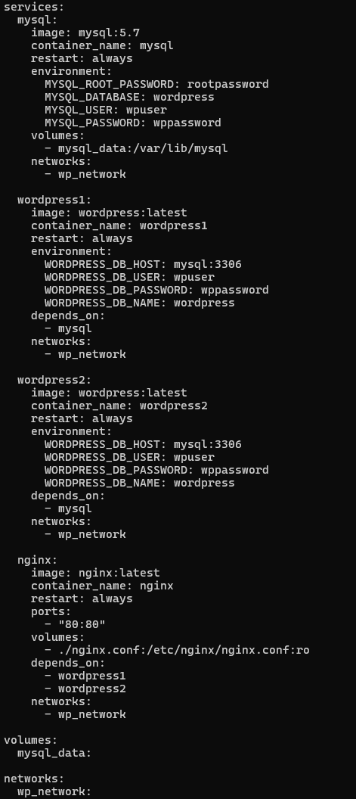

# **Kubernetes:**

**שימוש בcontainerים היא דרך טובה בשביל לאגד ולהרץ אפליקציות , הם מאפשרים סביבת פעולה קלה ומבודלת בה ניתן להפעיל אפליקציות בצורה אבטחתית ופשוטה , עם זאת בסביבת prod (production - הסביבה שבה האפליקציה עובדת וכבר לא רק בתהליך פיתוח, כלומר הסביבה מנגישה ללקוחות את הגרסה העדכנית ביותר בה ניתן להשתמש , הסביבה הזאת מאפשרת ללקוחות להשתמש ולגשת לתוצר הסופי הנוכחי של האפליקציה) נצטרך לנהל את הcontainerים שמרצים עליהם את האפליקציות שלנו ולוודא שהם תמיד למעלה (רצים ועובדים) , כלומר במקרה שcontainer נופל צריך להרים אחד חדש במקומו , כל הניהול הזה הוא אחד מהתפקידים שיש לk8s (Kubernetes).**

**בפשטות k8s היא מערכת קוד פתוח המשמשת לפריסה , גידול וניהול אפליקציות בcontainerים.**

**המערכת של k8s מספקת הרבה יכולות כמו ניהול תעבורה רשתית , איזון עומסים , אוטומציות שונות ( כמו שימוש במערכת אחסון ,החלפה או הפעלה מחדש של containerים במידה ויש כשל כלשהו, הרמה , הורדה , יצירה ומחיקה של containerים , ניהול ניצול המשאבים של המערכת ) , אבטחה ושימוש במידע רגיש בצורה יעילה , גידול וקיטון אפליקציות במידת הצורך ועוד.**

## **Kubernetes Architecture:**

נהוג להתסכל על הארכיטקטורה של k8s בתוך תבנית הנקראת cluster או אשכול , בתוך האשכול קיימים אובייקטים שונים שיחד מאפשרים לk8s לפעול כראוי , רכיבי הליבה של אשכול הם Control Plane ו Worker Node(s) (אחד ומעלה) , על גבי האשכול רצים הWorkloadים.

### **Control Plane**

הControl Plane הוא הרכיב שמנהל את כל האשכול , ניתן להריץ את הרכיבים שמרכיבים אותו על גבי כל אחד מהמכונות באשכול אך נהוג להריץ את כולם על גבי אותה מכונה בשביל הפשטות ולא להריץ אף user container על אותה המכונה (כלמר לא להריץ Podים על אותה המכונה).

#### 
**רכיבי הControl Plane**

##### **kube-apiserver**

הAPI של k8s הוא הרכיב aמהווה כfront-end עבור הControl Plane וזו הדרך שבה יש למשתמשים אינטרקציה עם האשכול , בזכות הAPI ניתן לשלוט בכל חלקי האשכול , ניתן ליצור , לנהל ולקנפג כל אובייקט באשכול , אפשר לומר שהרכיב הזה הוא החוליה המקשרת בין המשתמש לבין כל הרכיבים באשכול שמאפשרת לו לתמרן אותו כרצונו , האימפלמנטציה העיקרת של k8s API היא kube-apiserver ,הוא תוכנן לשימוש באופן רוחבי כלומר ניתן להקים כמה kube-apiserver ובכך לאזן תעבורה ביניהם.

##### **etcd**

רכיב זה הוא מערכת אחסון key-value עקבית ששומרת בתוכה נתונים מערכתיים, השמירה של הנתונים נעשית בצורה היררכית שיוצרת מבנה של מערכת קבצים , היא משמשת כמערכת הקבצים הסטנדרטית של k8s ומאחסן בתוכה את כל הנתונים על האשכול כמו מצבו הנוכחי , מצבו הרצוי , קונפיגורציות של משאבים ונתוני זמן ריצה.

etcd משתמש באלגוריתם RAFT (אלגוריתם שבו המידע עובר דרך צומת אחת בעלת השליטה להחליט על שינוי המידע ומפיצה לשאר הצמתים) בשביל לשמור על עיקביות המידע שמאוחסן בו , לרוב השימוש הפרקטי של etcd הוא שימרת נתוני משאבים כך שהמפתחות (keys) הם המשאבים עצמם והערכים (values) הם המצב של אותם המשאבים , כך שכל שינוי של המשאבים ומצבם משתקף באחסון של etcd ומאפשר להקל על ביצוע פעולות כמו תזמון משימות. בנוסף מקל גם על פעולות כמו גילוי שירות ותיאום בין מערכות מבוזרות (למשל אשכולים וcontainerים).

##### **kube-scheduler**

אחרי להשגיח Podים חדשים שנוצרים שלא הוקצה להם Node ולבחור עבורם Node עליו ירוצו.

##### **kube-controller-manager**

הרכיב הזה אחרי להריץ את תהליכי הcontroller השונים , ניתן לתאר את הcontroller בk8s לולאת בקרה שמודעת למצב האשכול באופן תדיר ואחראית לבצע או לבקש לעשות שינויים על מנת לקרב את מצב האשכול הנוכחי למצב הרצוי עבורו.

ישנם סוגים שונים של controllerים עבור רכיבים שונים למשל עבור כל Node , עבור יצירת Podים לביצוע משימות , עבור חיבור בין שירותים שונים אל הPodים ועוד , כל תהליכי הcontroller מתבעצים על גבי אותו התהליך שהרצתו זה התפקיד של הkube-controller-manager.

##### **cloud-controller-manager (optional)**

הרכיב הזה מאפשר לחבר בין האשכול לבין הAPI של ספק ענן מסוים , הוא מאפשר להפריד בין הרכיבים שנמצאים באינטראקציה עם פלטפורמת הענן מהרכיבים שנמצאים באינטראקציה רק עם האשכול.

### **Worker Node**

רכיבי הNode אחראים על הרצתם של Nodeים , תחזוקת הPodים שרצים וסיפוק סביבת זמן ריצה ( סביבה שמספקת לתהליכים את כל השירות שהם צריכים בשביל לפעול , כגון תוכנות , ספריות , משתנים סביבתיים ועוד).

#### 
**רכיבי הWorker Node**

##### **kubelet**

סוכן שפועל בכל Node באשכול , תפקידו לוודא שcontainerים רץ בתוך Pod.

##### **kube-proxy(optional)**

פרוקסי רשתי שרץ על כל Node באשכול ומיישם חלק מקונספט השירות של k8s (דרך להנגשה של האפליקציה שרצה על מספר Pod כשירות אינטרנטי) , הוא מתחזק חוקים רשתיים על הNodeים שמאפשרים תקשורת אל הPodים באופן רשתי על גבי sessiosnים מתוך או מחוץ לאשכול (כמו שימוש בTCP או UDP בשביל תקשורת החוצה או פנימה).

הkube-proxy יעדיף להעביר את התעבורה הרשתית בעזרת הפילטור פאקטות הרגיל של מערכת ההפעלה אם ופנוי לשימוש, אך אם אין הוא עדיין יכול לעשות זאת בעצמו.

##### **Container Runtime**

רכיב שאחראי על ניהול ההרצה של container ומחזור החיים שלו בסביבת k8s.

ישנם עוד רכיבים רבים שניתן להוסיף בכל Node בשביל להוסיף פיצ'רים שונים באשכול, אך אלו שצוינו הם ההכרחיים ביותר.

### 
**סוגי ארכיטקטורה בKubernetes**

אומנם רכיבי הליבה של k8s נשארים זהים ניתן לנהל ולעשות בהם שימוש בצורות שונות , בכך ניתן לעצב ולתחזק אשכול שמתאימים לצרכים ספציפים.

#### **Deploymet Variations of Control Plane:**

- 
השימוש הרגיל בו הרכיבים רצים ישירות על המכונות הייעודיות או הVMים, לעיתים קרובות מנוהל כשירות systemd.

- 
ניתן להשתמש בהם על גבי Podים סטטיים שמנוהלים על ידי kubelet על גבי Nodeים ספציפיים.

- 
להריץ את כל הControl Plane על גבי Podים בתוך האשכול עצמו.

- 
שימוש אפשרי של ספקי ענן - הפשטה של הControl Plane וניהול שלו כחלק מהשירות שלהם.

#### 
**מיקום הWorkloadים**

ניתן למקם את הWorkloadים בצורה שונה כתלות בגודל של האשכול, דרישות הביצוע שלו ופוליסות הפעולות שלו.

- 
באשכולי פיתוח או אשכול שהם קטנים , ניתן להריץ את הControl Plane והWorkload על אותם הNodeים

- 
באשכול ייצור גדולים לעיתים יוקצו Nodeים ייעודיים עבור הControl Plane בצורה מופרדת מהWorkloadים.

- 
ארגונים מסוים מעדיפים להריץ תוספים קריטיים או כלים המשמשים לפיקוח על גבי הNodeים של הControl Plane.

## **Pod**

Pod הוא האובייקט מחשוב הקטן ביותר שניתן לפרוס (to deploy) בk8s והוא מורכב מכמות של containerים (אחד ומעלה) אשר חולקים את אותם משאבי האחסון והרשת, ובהוראות כיצד להריץ את הcontainerים.

התוכן של Pod תמיד יהיה ממקום ומתוזמן בצורה משותפת וירוץ בהקשר משותף, המודל של Pod מדמה מארח לוגי ספציפי לאפליקציה, הוא מכיל בתוכו כמה אפליקציות שקשורות זו בזו.

מעבר לcontainerים של אפליקציות, Pod יכול להכיל init container(s) שזה הוא container(ים) שחייבים לרוץ עד השלמתם לפני ריצה אפליקציות אחרות, ניתן להריץ אותו במהלך עליית הPod.

ההקשר המשותף בPod הוא מערך של namespaces, cgroups ועוד צורות בידוד שונות של לינוקס , בדיוק כמו שcontainer מבודד , כך שPod מאוד דומה במימושו למספר containerים שחולקים את אותו מרחבי השמות ואותן נפחי מערכת קבצים.

ישנם 2 מודלים עיקריים לשימוש בPodים , דרך אחת היא מודל "container-אחד-על-Pod" שזה המודל הנפוץ יותר בו בכל Pod קיים רק container אחד והPod פשוט משמש כמעטפת המנוהלת ישירות על ידי הControl Plane במקום שהוא ינהל את הcontainer ישירות.

מודל נוסף מודל "כמה-containerים-על-Pod" , במודל זה Pod מקפסל אפליקציה שמורכבת מכמה containerים במיקום משותף שעובדים בצורה הדוקה יחד וחולקים אותם משאבים.

## **Workload**

Workloadים הן בעצם האפליקציות שרצות על גבי k8s , הצורה שבה הן רצות בk8s טמון בצורה שבה Nodeים רצים, הNodeים עובדים בצורה כזו שעל גביהם רצים Podים ועל גבי הPodים נמצאים containerים , כל Node מנוהל על ידי הControl Plane ומכיל את כל השירותים הנחוצים להרצת הPodים שבו , ניתן לחשוב על המבנה של הNodeים בצורה של קופסאות בתוך קופסאות , ניתן להקביל Node לארגז גדול , בתוך הארגז יש מספר של קופסאות שהם הPodים , בתוך כל קופסא יש גם מספר של קופסאות קטנות יותר שהם הcontainerים.

הWorkload יכול לרוץ על גבי Pod יחיד, כמה Podים שונים ואף על גבי כמה Nodeים שונים , לכל Pod יש מחזור חיים מוגדר שלפיו הוא מורץ , כך שצריך ליצור Pod חדש בכל סוף מחזור חיים של Pod קודם בשביל להמשיך את התפקוד השוטף , עם זאת לא צריך לנהל כל Pod באופן ישיר ולשם כך קיימים משאבי workload שהם משאבים שמקנפגים controllerים שיוודאו את הסוג והכמות של הPodים ירוצו בשביל שיתאימו למצב הרצוי של כל Pod.

## **Kubernetes Service**

הService היא שיטה המאפשרת להנגיש אפליקציות רשתית שרצות באשכול שלנו אל הרשת , הService מאפשר להקצות לכל Pod כתובת IP משלו ובכך ליחצן אפליקציות עבור לקוחות ולאפשר להם אינטראקציה איתם על ידי הפיכת מספר של Podים לזמינים ברשת בעזרת השיטה הזו , כל זאת מבלי הצורך לשנות אף דבר באפליקציה שלנו.

### **Service Types**

ישנם כמה סוגים שונים של Serviceים שמאפשרים בחירה בין סוגים ספציפיים של שירות כך שיתאימו לפי הצורך למשל במידה ונרצה לחשוף את האשכול כשירות חיצוני בכתובת חיצונית שזמינה מחוץ לאשכול.

#### **CluserIP**

חושף את השירות על האשכול רק באופן פנימי , כלומר על הIP הפנימי של האשכול , שימוש בסוג זה יחשוף את השירות לנגיש רק בתוך האשכול (סוג זה הוא ברירת המחדל).

#### **NodePort**

חושף את השירות בכל כתובת Node בport סטטי , שיטה זאת תגדיר כתובת IP כמו בשיטת CluserIP.

#### **LoadBalancer**

חושף את השירות באופן חיצוני באמצעות מאזן עומסים , המאזן עומסים לא מסופק על ידי k8s אלה על ידי הלקוח בדרך כזו או אחרת.

#### **ExternalName**

ממפה את השירות אל שם DNS.

## **Ingress**

מאפשר שירות תקשורת HTTP(S) זמינה באמצעות מנגנון שנקרא protocol-aware configuration , המנגנון הזה יודע להבין מושגים אינטרנטים כמו URI ,hostnames,paths ועוד ובעזרתם הוא יודע למפות תעבורה אל backendים שונים שמבוססים על חוקים שניתן להגדיר בעזרת הk8s API.

בכך Ingress חושף נתיבי HTTP(S) מחוץ לאשכול אל שירותים בתוך האשכול, הוא מאפשר לגבש חוקי ניתוב אל משאב אחד כך שניתן לחשוף מספר רכיבי בWorkload שרצים בנפרד באשכול מאחורי מוקד מאזין יחיד .

## **Helm**

Helm או הגה בעברית הוא מנהל חבילות של k8s שמקל על על מפתחים לנהל,לקנפג ולפרוס אפליקציות ושירותים באשכול , Helm מורכב מcommand line בצד לקוח שנקרא helm ומTriller שזהו רכיב שרתי בתוך האשכול.

K8s משתמש בקבצי קונפיגורציה YMAL , בעזרתם ניתן בכמה שורות פשוטות של קוד להקים ולנהל אשכול, אותם קבצים משתנים ומתעדכנים כל הזמן , Helm הוא כלי שימושי שמתחזק פריסה יחידה של קובץ YAML עם מידע על גרסאות השונות של קבצי הYMAL המשמשים להקמת וניהול האשכול.

Helm מאפשר אוטומציה עבור יצירה , אריזה , קינפוג ופריסה של אפליקציות על ידי שילוב קבצי קונפיגורציה אל תוך חבילה יחידה שניתנת לשימוש חוזר , הפיצ'ר שמאפשר את היכולות האלו לhelm נקרא helm chart.

### **Helm Chart**

תרשים הגה (Helm chat) הוא חבילה שמכילה בתוכה את כל המשאבים שצריך עבור פריסה של אפליקציה באשכול , החבילה הזו כוללת בתוכה קבצי YAML עבור שימושים שונים כגון פריסות , שירות , secretים ומפות תצורה שמאפשרים להקים את האפליקציה לפי הצורך , בעזרת תרשים הגה ניתן לציין את הקונפיגורציות והמשאבים שנצטרך בתוך קובץ YAML אחד ופשוט להריץ את הפריסה שלו , ניתן לעשות זאת בשימוש חוזר לפי הצורך.

השימוש בתרשימי הגה הוא נחוץ מאחר והם מאפשרים לנהל רכיבי אפליקציה , בזכות זאת שמארגנים את רכיבי האפליקציה לתוך התרשימים האלו קל להתקין ולשדרג אותם , הם מאפשרים להפחית את העבודה הידנית הדרושה בשביל לתחזק אל האפליקציה ועוזרת למנוע תקלות שנובעות מחסור עקביות (תקלות שנובעות כאשר מנהל מערכות גדולות ומסובכות).

השימוש בתרשימי הגה מאפשר לבנות ולבדוק אפליקציות בצורה קלה יותר בCI/CD pipeline , בזכותן ניתן לפרוס באופן אוטומטי אפליקציות בכל סביבה להקטין את זמן הבנייה שלהן.

