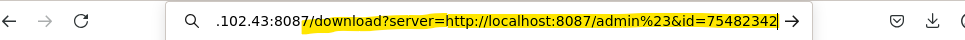

# 
<strong>סתם מעניין לבדוק:</strong>

<ul dir="rtl">
<li>המון נושאים בלינוקס</li>
<li>IPC – POSIX</li>
<li><a href="https://thesecretlivesofdata.com/raft/">הסבר על אלגוריתם RAFT בצורה ויזואלית ואינטרקטיבית</a></li>
<li>GNU Privacy Guard</li>
<li>what is the meaning of nember in versions numbers - Major, Minor, Path</li>
<li>Roles GitHub - repo + organization</li>
<li>nightly , alpha , beta</li>
<li>PKCE</li>
<li>Exploit-DB</li>
<li>SOP & CORS</li>
<li>Top 10 OWASP TryHackMe - פתח משתמש ותשלים את החדר</li>
<li>SSDLC TryHackMe - [https://tryhackme.com/room/securesdlc](https://tryhackme.com/room/securesdlc)</li>
<li>windows hypervison</li>
</ul>

- [https://learn.microsoft.com/en-us/virtualization/api/hypervisor-platform/hypervisor-platform](https://learn.microsoft.com/en-us/virtualization/api/hypervisor-platform/hypervisor-platform)

