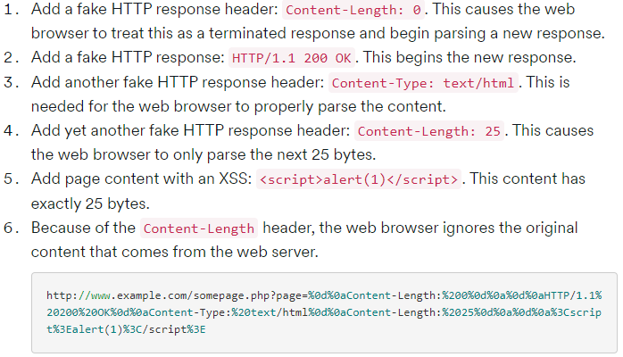
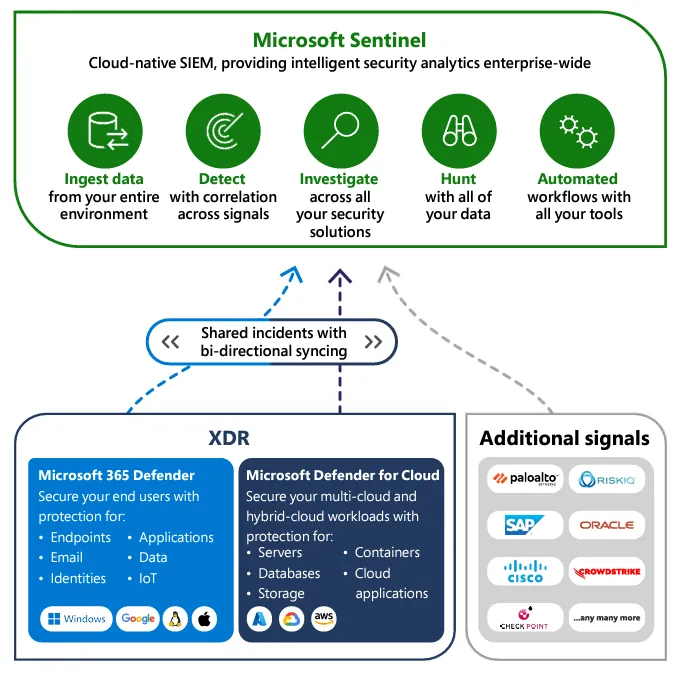
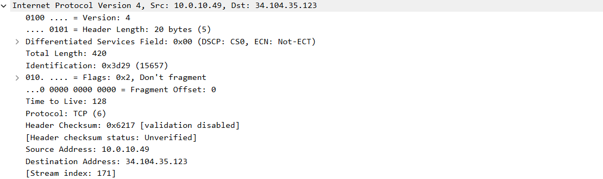
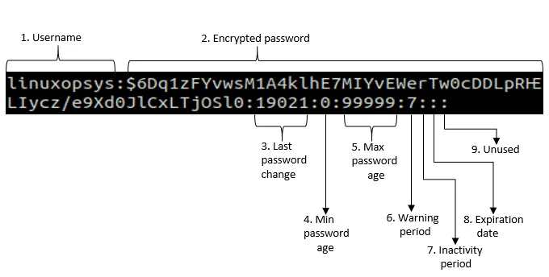

# **Wireshark :**

Wireshark היא אפליקצייה המשמשת ל"תפיסת" פאקטות שעוברות ברשת ומאפשרת לעשות אנליזה לכל אחת מהפאקטות בנפרד , הוא מאפשר לקחת מכרטיס הרשת את המידע שזורם ומציג אותם בצורה מובנת יותר לעין , זה נעשה על ידי יירוט של התעבורה הרשתית בדיקת הheaderים והpayloadים , פיענוח הפרוטוקולים , הוצאת המידע הרלוונטי וכתיבתן.

## 
<strong>זיהוי השדות בפאקטת HTTP:</strong>

Frame:

Packet:

TCP Header:

HTTP Payload :

## **Pcap 1:**

חשוד

יש ניסיון של brute force למשתמש בשם : bro עם סיסמאות של המספרים בין 1-31 לתוך שרת FTP בניסון להכנס כמשתמש FTP.

EFDIBI

## **A.pcap :**

ARP Spoofing

תיאור כללי על הpcap:

יש ARP SPOOFING מכתובת 192.168.1.105 על כתובת 192.168.1.104 , 192.168.1.105גורם ל192.168.1.104 לחשוב שהוא 192.168.1.1.

## **B pcap :**

חשוד

נעשית שליחה של הודעות לSYN לכל מיני פורט של פרוטוקולים ידועים על מנת למצוא איזה מהם פתוח , כלומר נעשה פה port scan לפורטים ידועים.

## **C.pacp :**

לא חשוד

ניתן לראות את הטלפון של ניקיטה קומלייב התוקף הרוסי הידוע לשמצא

מעבר של תעודה דיגיטלית

