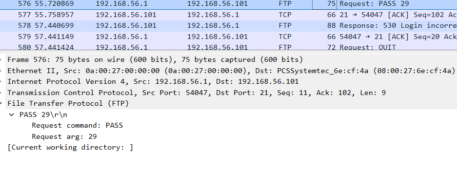
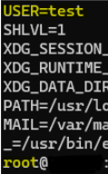
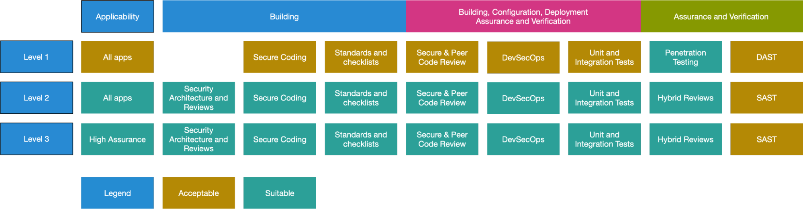

# 
**השכבה השביעית הרחבה:**

## **HTTP Protocol:**

**פרוטוקול HTTP הוא פרוטוקול שעובד בצורה של client-server הוא נוצר במטרה לספק סטנדרט בין web browser ושרת הweb כדי שיוכלו לתקשר ביניהם , הפרוטוקול הוא בעצם סט של חוקים שמגדיר איך להעביר את הנתונים בין המחשבים וכך ניתן לגלוש ולמצוא מידע שאנחנו מחפשים.**

**הפרוטוקול עובד בצורה של request-response , כאשר נחפש כתובת URL באינטרנט (אחרי שהפרוטוקול DNS יחזיר לנו את כתובת הIP של השרת שאליו אנחנו מנסים לפנות) הweb browser ישלח לשרת בקשות ובתגובה השרת יחזיר תשובות , הבקשות הם איזה מידע אנחנו רוצים והתשובות זה המידע הזה (או הודעות הקשורות אליו במידה וקיים או לא קיים וכו') , במהלך הrequest הלקוח יציין איזה מידע הוא רוצה בנוסף הוא יציין עוד מידע חיוני על המידע\הבקשה\השרת ועוד , בתגובה השרת יציין את המידע שהמשתמש ביקש ו\או מידע על המידע\הבקשה\השרת.**

**בקשה בפרוטוקול בנויה מכל מיני אלמטנים העיקרים בהם הם: request method , headers , body , שתי הmethod העיקריות הם GET וPOST , השיטה GET משמשת כדי לקבל משאבים מהשרת בעוד שPOST מבקש מהשרת ליצור משאב חדש בשרת המרוחק , כך מתקיימת רוב האינטרקציה בין מחשבים בפרוטוקול, הheader מידע נוסף שעובר בין הלקוח לשרת והbody הוא החלק שנושא את המידע מהמשתמש.**

**התקשורת קוראת בין שני המחשבים על גבי חיבור TCP , התעבורה של המידע בפרוטוקול HTTP עוברת על גבי SESSION אחד של חיבור TCP בין מחשב ליעד (בגרסאות החדש , 2 ו3) , בסוף השימוש בפרוטוקול החיבור נסגר , ה-port המוגדר לתקשורת של פרוטוקול HTTP הוא port 80 כלומר על גבי הport הזה יקרה השיחה.**

**הפרוטוקול HTTP הוא פרוטוקול לא מאובטח , אם ננסה לראות את התוכן של הפקטות שעוברות בפרוטוקול נראה שאנחנו יכולים לראות את כל המידע שעובר בשיחה כplaintext , לכן הומצא הפרוטוקול HTTPS שעובד באותה צורה שHTTP עובד רק שהוא משתמש בהצפנה של ההודעות באמצעות הצפנה SSL\TLS ובכך הופך את הפרוטוקול למאובטח , בנוסף מאפשר לאמת את שרתים בעזרת תעודות דיגיטליות , כאשר נוצר חיבור SSL השרת שולח למשתמש אישור של התעודה הדיגיטלית שלו כדי להוכיח שהוא לא מזוייף והלקוח יבדוק את התעודה מול הCA.**

**למרות שהפקטות של פרוטוקול HTTPS מוצפנות עדיין ניתן לראות בהם מידע אחר שיכול להיות שימושי כמו שם הדומיין , הIP של המקור , זמן שהמשתמש שהה באתר ושיערוך של גודל ההודעה שהלקוח העביר.**

## **HTTP Session:**

**יצירת שיחה (Session ) באמצעות פרוטוקול HTTP נעשית ב3 שלבים:**

1. 
**הלקוח יוצר חיבור אמין עם השרת איתו הוא רוצה לתקשר למשל בעזרת TCP.**

2. 
**לאחר מכן הלקוח שולח HTTP request לשרת ומחכה לתשובה.**

3. 
**השרת מעבד את הבקשה של הלקוח ושולח תגובה בהתאם.**

## 
**מבנה פאקטה HTTP:**

**מבנה של פאקטת HTTP יכול להיות ב2 צורת , צורת בקשה וצורת תגובה , המבנה של שניהם דומה עם כמה שדות שונים המבדילים ביניהם.**

**מבנה של בקשת HTTP:**

**מבנה של תגובת HTTP:**

### 
**השדות בבקשת HTTP:**

**מבנה של בקשת HTTP בנוי מהשדות הבאים:**

#### **Request Methods:**

**GET - קבלת מידע ממשאב כלשהו , התשאול של המידע נמצא בURL.**

**POST - שליחת מידע לשרת כלשהו למען יצירה או עדכון של משאב (יכול לשמש לעוד מגוון פעולות כמו למשל מחיקה).**

**PUT – משמש לשליחת מידע לשרת כלשהו בשביל יצירה או החלפה של משאב או הנתונים בו.**

**ההבדלים בין POST לבין PUT :**

**השוני בינו לבין POST היא שהצורה בה השינוי הזה קורה , PUT היא שיטה אימפוטנטית כלומר אם אני אשלח כמה בקשות זהות אני אקבל אותה תגובה עבורן , לעמות POST שיכול להחזיר בקשות שונות , אפשרות לדמות את זה לטופס של מילוי שאלון , אם אשתמש בPUT השאלון ששלחתי יהיה אותו השאלון שאני מחליף את התוכן בו בכל בקשת PUT כלומר לא אצור משאב חדש עבור כל בקשת PUT זהה שלי אבל POST יכול ליצור לי כמה שאלונים שונים במאגר הנתונים , חשוב להבין , כדי שPUT יוכל להתבצע נצטרך לדעת במדוייק את המיקום (URL) של המשאב שנרצה לשנות , השרת יקח את המידע שנשלח לו ויחליף לגמרי את המידע שאנחנו הבאנו במידע שהקיים במשאב,בעצם יחליף לגמרי את האובייקט הקיים של המשאב במשאב אחר עם המידע שהבאנו , במידה והמשאב לא קיים הוא ינסה ליצור אחד ולשים בו את המידע , בבקשת POST אנחנו לא נצטרך את המיקום (URL) המדוייק של המשאב , אנחנו פשוט נעביר לשרת נתונים , הוא ייצור משאב ויעדכן בו את המידע שלנו ואז יחזיר לנו את המיקום של איפה שהוא נמצא , POST יכול לשמש לא רק לעדכון נתונים הוא משמש לעוד פעולות שונות נוספות חוץ מיצירה ועדכון של נתונים, כל פעולה של עיבוד נתונים שנשלחת לשרת יכולה להעשות על ידי POST למשל מחיקה.**

**HEAD - מאוד דומה לGET רק שהוא לא מחזיר לנו תגובה , HEAD מבצע את אותה הבקשה כמו שבקשת GET היית עושה רק בלי לקבל תגובה לבקשה הזאת , הוא מאפשר לבדוק מה תיהיה תשובת הGET לפני שהיא תקרה , בקשת הHEAD תחזיר לנו את הHeaderים (metadata) של משאב מסויים, כך למשל נוכל לבדוק מה אנחנו עומדים להוריד למחשב שלנו בלי להוריד אותו עדיין.**

**DELETE - מוחק משאב במיקום ספציפי.**

**PATCH - משמש לעדכן ערכים ספציפים משאב.**

**OPTIONS - אופציה זאת מראה לנו את אפשרויות התקשורות של משאב היעד.**

**CONNECT - משמש ליצירת תקשורת דו כיוונית עם המשאב (tunnel).**

**TRACE - משמש בשביל LOOP-BACK , בעיקר בשביל בדיקות של הנתיב אל משאב היעד (שימושי בעיקר לDEBUGGING).**

#### **Destination File:**

**שדה זה בבקשת הHTTP מייצג את הקובץ אליו ניגש בבקשה שלנו , הקובץ שיצא בURL בבקשת הGET זה הקובץ שנמצא בשדה הזה.**

#### **HTTP Version:**

**(נמצא גם במבנה של Request וגם במבנה של Response)**

**שדה זה מייצג את גרסת הפרוטוקול בה משתמשים בבקשה , מכיוון שצריך שהתקשורת תקרה באותו גרסה של הפרוטוקול , בשליחת הבקשה תצויין הגרסה שלו בצורה הזאת : HTTP\X.X.**

#### **Headers:**

**הדרים בפאקטת HTTP מאפשרים ללקוח ולשרת להעביר עוד מידע נוסף חיוני לגבי התקשורת ביניהם ,המבנה בו הם נמצאים בפאקטה היא בצורת key-value , ההדרים מופרדים אחד מהשני בירידת שורה.**

**ניתן לסווג את ההדרים ל4 קטגוריות שכוללים הדרים בהקשרים דומים:**

**General Header : הדרים שמשמשים גם בבקשת וגם בתשובות אבל אין להם השפעה של מסד הנתונים.**

**Request Header: הדרים שמשמשים את הלקוח בשליחת הבקשה.**

**Response Header: הדרים שמכילים את המיקום של מה שביקשת הלקוח.**

**Entity Header: הדרים מכילים מידע על הגוף שנותן את המשאבים.**

**בבקשת HTTP נשתמש בRequest Header , להלן החשובים ונפוצים ביותר מביניהם:**

**Host -** הידר זה הוא הדר חובה , בלעדיו הבקשה לא תוכל לענות בחיוב , הוא מכיל את הHOST , כלומר כתובת IP או דומיין של האתר אליו נרצה לגשת.

**Connection -** סוג החיבור , פתוח או סגור.

**Keep-Alive -** הידר זה מגיע בעקבות הדר Connection במידה ובחרנו שהחיבור יהיה פתוח והוא מצייג את הזמן שבו צריך שההדר ישאר פתוח.

**User-Agent -** מספק מידע על המשתמש , כלומר על מי שגולש בעזרת הדפדפן , בהידר זה הדפדפן מעביר לשרת מידע שעוזר לו להתאים את התוכן שלו לסוג הדפדפן עצמו ולמערכת ההפעלה של המחשב , ההידר הזה מורכב מ3 שדות עיקריים:

- 
Product : שמכיל את זהות הדפדפן או המוצר שאיתו שולחים את הבקשה.

- 
Product-Version : הגרסה של המוצר ששולח את הבקשה.

- 
Comment : שדה בו נכלל מידע נוסף לגבי תתי-מוצרים , מערכת או כל תוסף שבו הלקוח משתמש.

השימוש בUser Agent מאפשר לשרתים להתאים את השירות שהם נותנים למשתמש , כאשר המשמש שולח לשרת את הגרסה והזהות של מערכת ההפעלה או הדפדפן שלו השרת יכול להחליט להציג לו את תוכן האתר בצורה שונה , למשל אם השרת מציג את התוכן של האתר בצורה שונה בין טלפון או מחשב בשל גודל המסך של המכשיר.

אנקדותה מעניינת , קונספט שנקרא Web Crawler (שימוש בbotים בגישה לאתרים) ,הוא כאשר מנסים לגשת לאתר בעזרת "משתמש" שהוא לא בן אדם , ישנם crawler ים טובים וישנם רעים, Crawlerים טובים , ינסו לגלוש לאתר מסויים בשביל לבדוק את הביצועים, האיכות שלו או ינטרו עליו , לרוב הם יספקו את המילים bot בתוך הUA string(מחרוזת User-Agent ) לעומת זאת , ישנם Crawlerים רעים שינסו לגלוש באתר בשביל להשיג מידע עליו כמו מיילים שיהיה ניתן להספים , מתווי כניסה ותקיפה ועוד, Crawlerים כאלו לרוב ייזיפו את עצמם כמכשיר רגיל , לפעמם ישתמשו בצירופים מוזרים או לא הגיוניים כמו " Mozilla/5.0 (Linux;**Android** 3.1**ipad 4 Build/AppleWebKit** Gecko)" , מוזר יהיה לראות מכשיר של Apple עם מערכת הפעלה של Android לכן זה מחשיד וניתן לעלות על זה.

**דוגמה ל-Syntax של User-Agent :**

User-Agent: [product]/[product-version] [comment]

**Accept או Accept-XXXXX –** שדה שמכיל את מה שהדפדפן מוכן לקבל.

**Referer -** הידר זה נמצא בבקשה בתנאי שקרתה הפנייה מאתר אחד לאחר , כלומר אם נכנסנו לאתר והוא הפנה אותנו לאתר אחר , בהדר הזה יהיה רשום את הכתובת שהפנתה אותנו לדף אליו נגיע.

**Cookie -** הידר בו מועבר מידע הcookie.

**Content-Type -** בrequest method כמו POST נגדיר פה את הצורת קידוד שבה המידע נשלח.

**Content-Length –** הידר המציין את אורך הcontent שיהיה בבקשה.

#### **Content:**

**שדה זה צריך להיות מופרד בשרות רווח מההדר האחרון , הוא משמש אותנו כאשר אנחנו שולחים מידע אל השרת , בשדה נצרף את התוכן אותו נרצה לשלוח.**

### 
**השדות בתגובת HTTP:**

#### **HTTP Version**

**(נמצא גם במבנה של Request וגם במבנה של Response)**

**שדה זה מייצג את גרסת הפרוטוקול בה משתמשים בבקשה , מכיוון שצריך שהתקשורת תקרה באותו גרסה של הפרוטוקול , בשליחת הבקשה תצויין הגרסה שלו בצורה הזאת : HTTP\X.X.**

#### 
**Response Id וResponse Name:**

**כאשר שרת יקבל בקשה הוא יחזיר לנו תגובה בהתאם לבקשה שלנו וליכולות שלו , לכל תגובה כזו יש מספר סידורי (ID) ושם (NAME) שמזוהה עבורה , למשל 200 (ID) , OK (NAME) - משמש כדי לתאר בקשה שהצליחה.**

#### **Headers:**

**בדיוק כמו בבקשת HTTP יש הדרים השייכים לתגובה , להלן כמה נפוצים.**

**Date – הזמן הנוכחי לפי השרת.**

**Server - מידע ופרטים על השרת ( לדוגמה מערכת הפעלה או גרסאות).**

**Last-Modified – זמן שמציין את הפעם האחרונה בה נערך הקובץ.**

**Content-Length - האורך של הcontent שהוחזר.**

**Connection - אופן החיבור.**

**Content-Type - הקידוד של הcontent המחוזר.**

**Location - שדה המכיל כתובת אליה נועבר במקרה של Redirection (Response ID – 3XX) , שדה זה משמש בסיס במתקפות כמו Splitting Response HTTP ו-Redirection Open.**

#### **Content:**

**שדה זה אחראי להחזיר לנו את התוכן שאנחנו מבקשים מהאתר , תוכן זה הוא הדף שחיפשו , כלומר קוד בשפת HTML CSS JS וכו' , שפןת קוד של צד לקוח , השרת מחזיר אותו לדפדפן שלנו והוא מציג אותו.**

## **HTTP Response Status Codes:**

כעת נעמיק עוד בheaderים Response Name ו-Response ID , הסתכלנו במבנה של תגובת HTTP שם היו השדות Response Name ו-Response ID , השדות האלו מסמנות מה היא סוג התגובה והשם שלה (תיאור קצר וכללי של מה היא בעצם התגובה הזאת) , לאותם שדות ניתן לקרוא גם Status Codes מאחר והם נותנים לנו אפיון של התגובה שקיבלנו ומה היא אומרת לנו , קודי הסטטוס נכתיב בצורה של מאות כך שספרת המאות משתנה בין 1-5 בהתאם לקטלוג של סוג ההודעה , הנה קודי הסטטוס הנפוצים ושימושים ביותר.

### 
**Status Code 1XX - מידעי:**

**Continue –100** : קוד זה משמש כאשר אנחנו רוצים לשלוח תוכן בגוף הפאקטה של הHTTP , הוא בא לידי בצורה הבאה , בשביל שלא נשלח לשרת פאקטה עמוס בתוכן במצב בו הוא לא מסוגל לעבד אותה כרגע או כי ההדרים שציינו לא מתאימים לשרת אנחנו נשלח לו בקשת HTTP בה אנחנו נציין שאנחנו רוצים תגובה ממנו שואמרת לנו "היי הכל טוב תשלח לי" בשביל זה אנחנו נציין בבקשת הHTTP את ההידר EXPECT : 100 –CONTINUE , את הבקשה הזאת אנחנו נשלח בנפרד לתוכן אותו אנחנו רוצים להעביר לשרת , ברגע שנעשה זאת השרת יפתח את הפאקטה יסתכל על ההדרים שלנו ויגיד לנו אם הם מתאים ונכונים עבורו , במידה והכל בסדר הוא ישלח לנו בחזרה את קוד הסטטוס Continue – 100 , כלומר הוא אומר לנו הכל טוב עם השדות שלך בבקשה בוא תשלח לי את המידע שאתה רוצה להעביר לי וככה נשמע שלחה של פאקטה גדולה שיכולה להעמיס על התקשורת רק כדי שהיא תיפול.

**101 - Switching Protocols :** קוד זה משמש אתה הלקוח כאשר הוא רוצה לשנות את הפרוטוקולים בהם הוא והשרת משתמשים בשביל התקשורת שלהם , כלומר במדיה ואנחנו משתמשים בגרסה ישנה של פרוטוקול מסויים ואני מחליט שאני רוצה להשתמש בגרסה שונה חדישה יותר לדוגמה , אני אציין בבקשת HTTP בשדה Upgrade את סוג הפרוטוקול והגרסה בה אני רוצה להשתמש , בהתאם לכך השרת יחזיר לי תגובת HTTP עם קוד סטטוס 101 במידה והוא מסכים וכך נוכל לקבל אישור על שבאמת הוחלף הפרוטוקול.

### 
**Status Code 2XX - הצלחה:**

**OK – 200 :** קוד זה מסמל שהבקשה נעשת בהצלחה , בין אם זה כאינדיקציה לכך שהמידע שביקשנו התקבל או המידע שרצינו ליצור ולעדכן נעשה , קוד זה מסמל שהבקשה שנעשת קרתה בהצלחה ומחזיר את המידע המבוקש בהתאם לסוג בקשה.

**Created – 201 :** קוד זה מסמל שהבקשה של יצירת משאב כלשהו נעשת בהצלחה , כלומר הוא מחזיר לנו "היי מה שביקשת קרה" אבל הוא לא מחזיר את המידע עצמו אלה אומר נותן לנו הפנייה אל אותו המשאב שנוצר למשל יחזיר את המיקום שלו (URL) או ID מסוים שלו.

**Accepted – 202 :** קוד זה מסמל שהבקשה התקבלה אך לא נעינת עדיין , מכיוון ובHTTP אין דרך לשלוח תגובה בצורה אסינכרונית (כלומר בלי בקשה אין תגובה) אז השרת יחזיר תגובה עם הקוד הזה שבדרך כלל מציין שתהליך או שרת אחרים מתמודדים עם הבקשה שלנו ולא השרת עצמו.

### 
**Status Code 3XX - ניתוב מחדש:**

**Moved Permanently – 301 :** קוד זה מסמל שהמשאב שחיפשנו כבר לא נמצא בכתובת הזאת והוא הועבר לכתובת (URL) אחרת באופן קבוע , הכתובת URך החדשה תחזור בתגובה של קוד זה.

**Found – 302 :** קוד זה מסמל לנו שהמשאב שאנחנו מחפשים הועבר באופן זמני למיקום אחר , בשליחת תגובה זו השרת מציין כי במהלך הניתוב ממיקום אחד לאחר זה בסדר אם נשנה את הmethod בה משתמשים בבקשת הHTTP עבור המיקום החדש.

**See Other – 303 :** קוד זה נשלח על ידי השרת בשביל לציין עבור שולח הבקשה שהמשאב שהוא מחפש לא נמצא פה ומכוון אותו לשלוח בקשת GET בURI אחר.

**Temporery Redirect – 307 :** קוד זה נשלח על ידי השרת כאשר הוא רוצה להפנות את שולח הבקשה למיקום אחר אליו המשאב אותו הוא מחפש הועבר באופן זמני , קוד זה דומה במהותו לקוד 302 אך ההבדל הוא שכאשר השרת מגיב את הקוד הזה הוא מציין מנחה את השולח לחפש בכתובת אחרת תוך שהוא אומר לו שאסור לו לשנות את הmethod בה הוא השתמש בבקשה הנוכחית , כלומר אם הוא השתמש בPOST אז גם במיקום אליו הוא מופנה הוא ישתמש בPOST.

**Permanent Redirect – 308 :** קוד זה משלב בתוכו את קוד 307 וקוד 301 , המהות מאחוריו זהה לקוד 301 כלומר המשאב הועבר באופן תמידי למיקום אחר והשרת בנוסף מפנה אותו אל המיקום החדש , עם זאת כמו בקוד 307 השרת מציין שאסור לשולח להשתמש בmethod שונה מהבקשה הנוכחית , כלומר אם הוא השתמש בGET אז גם במיקום החדש הוא ישתמש בGET.

### 
**Status Code 4XX - שגיאות צד לקוח:**

**Bad Request – 400 :** קוד זה נשלח על ידי השרת כאשר הוא מסרב או אין באפשרות לעבד את הבקשה שנשלחה כתוצאה משגיאה בצד הלקוח.

**Unauthorized – 401 :** קוד זה מסמל שהשולח אינו מורשה לגשת למשאב שהוא מבקש מכיוון שאינו מאומת , אם הוא היה מאומת יכול להיות שהוא היה מקבל גישה למשאב שהוא צריך (במידה ויש לו גישה כשהוא מאומת) , קוד זה בעצם אומר למשתמש שהוא צריך להתאמת קודם בכדי בכלל לבדוק אם יש לו או אין לו גישה למשאב לפי הזהות שלו.

**Forbidden – 403 :** בדומה לקוד 401 , השרת מסרב לתת לשולח גישה למשאב מאחר ואין לו הרשאות לגשת אליו , לעומת קוד 401 כאן השולח כן מאומת וזהותו ידועה לשרת אך פשוט אין לו גישה אל המשאב.

**Not Found – 404 :** קוד זה משמש את השרת בשביל להודיע לשולח שהמשאב שהוא חיפש לא קיים , מנקודת מבט של הדפדפן הURL פשוט שגויה או לא מוכרת בתור URL שבשימוש ולכן לא נמצא המשאב , מנקודת מבט של שימוש בAPI יכול להיות שהמיקום שהוא מחפש כלומר הנקודת קצה אליה מנסים לגשת כן קיימת (כלומר המיקום) אך המשאב הספציפי לא קיים , בנוסף שרתים מסויימים ישתמשו בקוד זה בשביל במקום בקוד 403 בשביל להחביא את המשאב מלקוחות לא בלי הרשאות אליו.

**Method Not Allowed – 405 :** קוד זה אומר שהmethod שהשתמשנו בו לא נתמך על ידי השרת על המשאב , כלומר אי אפשר לבקש את הmethod הזה על המשאב.

**Proxy Authentication Required – 407 :** קוד זה משמש את השרת כמו קוד 401 אך הוא מציין שאת ההתאמתות צריך לעשות דרך Proxy.

**Request Timeout – 408 :** קוד זה משתשמ את השרת בשביל לבקש לסגור חיבורים שאין בהם שימוש , קוד זה נשלח לעיתים בלי שום בקשה מצד הלקוח.

**Gone – 410 :** קוד זה משמש את השרת בשביל להצהיר שהמשאב שבוקש נמחק לצמיתות ואין כתובת אחרת להפנות אליה , יחד עם זאת הוא מציין בפניי הלקוח שכדי שימחק את זיכרון המטמון והקישור שלו אל המשאב הזה.

**Content To Large – 413 :** קוד זה משמש את השרת בשביל לציין שהתוכן בבקשה גדול מהמגבלה , לעיתים השרת יסגור את החיבור או שהוא יגיד לו לנסות שוב יותר מאוחר.

**Upgrade Requierd – 426 :** קוד זה מציין שהשרת לא מוכן לקבל את הבקשה בגלל הגרסה של הפרוטקול שבה היא נשלחת , עם זאת הוא אולי יהיה מוכן לקבל את הבקשה אם הלקוח ישנה את הפרוטוקול בו הוא משתמש.

**Too Many Requests – 429 :** קוד זה מציין שהלקוח שלח יותר מידי בקשות בטווח זמן מסויים.

**Unavilable For Leagal Reasons – 451 :** קוד זה מציין שהמשאב אליו הלקוח ניסה לגשת לא ניגש מכיוון שהוא לא חוקי.

### 
**Status Code 5XX - שגיאות צד שרת:**

**Internal Server Error – 500 :** קוד זה מציין שהשרת נתקל במצב שהוא לא יודע להתמודד איתו ולא מצא אף קוד מסוג 5XX שמתאים יותר לסיטואציה לכן הגיב את הקוד הזה.

**Not Implemented – 501 :** קוד זה מציין שהmethod שנעשה בה שימוש בבקשה לא נתמכת על ידי השרת ולא ניתן לטפל בבקשה.

**Bad Gateway – 502 :** קוד זה משומש על ידי שרת שמשמש כשרת proxy או כgateway , בעזרת קוד זה השרת אומר שתוך כדי שהוא מטפל בבקשה הוא קיבל תגובה שגויה במעלה השרשרת של התקשורת.

**Gateway Timeout – 504 :** קוד זה משמש כאשר השרת משמש כproxy או gateway , בעזרת קוד זה השרת אומר שהוא לא קיבל תגובה בזמן ממעלה השרשרת של התקשורת.

## **HTTP Body:**

כאשר נשלח פאקטת HTTP בין אם היא של בקשה או תגובה , אנו נוכל לציין תוכן שאנחנו רוצים להעביר או לקבל , לשדה שבו נעביר את התוכן שאנחנו רוצים קראנו Content , זה הוא השם הכללי של התוכן , בשמו האחר נקרא הHTTP Messege Body , זהו המידע שאנחנו נעביר או נקבל בכל פאקטת HTTP (במידה וקיים תוכן שצריך לעבור) , זה הוא בעצם גוף ההודעה והחלק שבעזרתו קורת כל חלופת המידע שאנחנו מבקשים בזמן גלישה.

## **HTTP/1.0:**

הגרסה הזאת של HTTP הוסיפה את היכולת להשתמש בהידרים ביניהם Content-Type שבזכות ההידר הזה ניתן להעביר קבצים שהם לא רק מסוג HTML בהכרח, Status Codes של הצלחה או כישלון של הבקשה , בנוסף הוסיף את הmethods של Post ו Head (הmethod של GET כבר היה קיים בגרסה 0.9).

## **HTTP/1.1:**

בגרסה הזאת של הפרוטוקול התווספה השימוש בהידר של HOST כחוובה בשליחת בקשות , איפשר לעמות גרסת HTTP 1.0 לשמור על תקשורת רציפה , כלומר בגרסה 1.0 כל צמד של בקשה ותגובה הצריכו מהלקוח לפתוח חיבור חדש עם השרת איתו הוא רוצה לתקשר גרסה 1.1 הוסיפה את ההאפשרות לבצע כמה בקשות על גבי חיבור יחיד. בנוסף 1.1 הוסיף את קוד הסטטוס Continue שאיפשר לשרתים "לאשר" את ההידר בבקשות כנכונים לפני שליחת המידע עצמו , עם זאת נוספו לפרוטוקול 6 methods חדשים ביניהם :PUT,PATCH,DELETE,TRACE,CONNECT,OPTIONS , בנוסף הגרסה הזאת אפשרה תמיכה בשפות שונות , קומפרסיה ודיקומפרסיה ,העברות על טווח של בתים(כלומר לא צריך לקבל את כל הדף בשביל לקבל את המידע הדרוש לנו שקיים בדף) ועוד.

## **HTTP/2.0:**

בגרסה הזאת נוספה האפשרות של multiplexing , כלומר גרסה 1.1 איפשרה לנו לשלוח בקשות ותגובות על אותו החיבור אך בזוגות , בצורה סינכרונית , על כל בקשה מתקבלת תשובה ורק לאחר שהיא התקבלה אפשר לשלוח בקשה חדשה , גרסה 2.0 הוסיפה את ההאפשרות לשלוח כמה בקשות במקביל בלי הצורך לחכות לתגובה לפני כל בקשה , בצורה אסינכרונית , כל זה עדיין על גבי חיבור יחיד.

הגרסה איפשרה בנוסף לתעדף איזה בקשה תגיע קודם , למשל אם נרצה את העיצוב של הדף (CSS) לפני הקוד שלו (JS) , בנסף לכך גרסה 2.0 הפכה את השימוש בקומפרסיה ודיקומפרסיה שגרסה 1.1 איפשרה לאוטומטי באמצעות GZip.

מאחר וישנה האפשרות לציור חיבור יחיד על מנת לבקש מספר בקשות בעזרת הגרסה הזאת התווספה האפשרות לאפס את השיחה ולהתחיל חדשה באותו הרגע , כלומר היא איפשרה ללקוח ולשרת לסיים את השיחה ביניהם באופן מידי מכל סיבה שהיא ומיד לפתוח חיבור חדש , יחד עם זאת בכדי למנוע הצפה של בקשות אל השרת נוספה הפעולה ששרת ינסה לחזות משאבים עתידים שהלקוח עשוי לבקש או רוב הסיכויים ייבקש בקרוב הגרסה 2.0 איפשרה לו ל"דחוף" בצורה פרואקטיבית משאבים לזיכרון המטמון של הלקוח.

* 
בנוסף 2.0 הפכה את הפרוטוקול לפרוטוקול בינארי במקום plain text מה שאיפרה לתרגם ולפרש את המידע באופן מהר יותר על ידי המחשב.

## **HTTP/3.0:**

הגרסה הזאת לא הסיפה יותר מידי בשונה מ2.0 , היא הוסיפה שימוש מתמיד בהצפנה ושימוש בפרוטוקול QUIC.

## **Cookies:**

כאשר גולש באתר מסוים באינטרנט אנחנו יוצרים שיחה (session) עם אותו אתר , כל שיחה כזו היא בעצם החיבור שלנו עם אותו אתר , במהלך השיחה אנחנו מתקשרים עם האתר אנחנו מחליפים איתו מידע לפי הצורך שלנו , בין היתר הדפדפן בו אנחנו נשתמש גם יספק מידע עלינו בכדי שהאתר שבו אנחנו גושלים יוכל לספק התאמה אישית יותר טובה וחוויתית בזמן הגלישה שלנו , בכדי לעשות זאת הדפדפן צריך לשמור עלינו מידע , שבכל שיחה שהוא יוצר עם אתר כלשהו תהיה לו האופציה לתת לו מידע עלינו , את המידע הזה הוא ישמור לזמן מוגבל קבוע מראש או לאורך השיחה שלנו עם האתר , הדרך שבה הוא מקבל את המידע הזה היא משרת האינטרנט , בכל שיחה שרת האינטרנט ישלח לדפדפן שלנו מידע עלינו והדפדפן ישמור את המידע הזה בקובץ באופן מקומי על המחשב שלנו , בכל שיחה חדשה שלנו הדפדפן יצרף בבקשות שלנו לאתר בו אנחנו גולשים מידע רלוונטי עלינו , המידע יכול להיות הרשאות מסוימות , העדפות משתמש , הגדרות וכו', השרת משתמש במידע הזה בשביל לשפר את חווית המשתמש שלנו , לעקוב אחר פעולות שלנו ועבור השיחות שלנו עם האתר. למשל אם התחברנו לאתר מסוים דרך דף ההתחברות שלו ואנחנו רוצים לעבור לדף אחר באתר אנחנו לא נרצה להתחבר מחדש בכל מעבר בין דפים בשביל זה הדפדפן ישלח לשרת בבקשת הHTTP את הCookies שלנו בה הוא יצרף מידע רלוונטי עלינו בשביל שהשרת יזהה שזה אנחנו ולא ידרוש מאיתנו להתחבר מחדש , בנוסף הCookies משמשים בשביל לאפשר לשרת לשפר את חווית המשתמש שלנו ולזכור עלינו פרטים מסוימים בשביל שלא נצטרך לעשות זאת בעצמו וכך הוא מקל עלינו כאשר אנחנו חוזרים לבקר בו , עם זאת הCookies משמשים את האתר גם בשביל לעקוב אחר הפעילות שלנו ובהתאם לכך להנגיש לנו פרסומות או להשתמש במידה הזה למען שירותים אנליסטים שונים.

### **Exploit Cookies :**

מאחר וCookies מכילים מידע עלינו חלקו רגיש יותר וחלקו פחות ניצול של Cookies יכול להועיל מאוד לתוקפים שונים , Cookies Hijacking או Session Hijacking הן שיטות תקיפה בהם תוקף מנצל את המידע שנמצא בCookies בשביל להתחזות לאותו משתמש אשר הCookies האלו שייכים לו , כאשר תוקף משיג גישה לsession cookie כלשהו הוא מסוגל להשתמש בזהות של אותו משתמש אליו הוא מתחזה בשביל להשיג גישה למידע רגיש או לעשות פעולות בשמו של המשתמש דבר היכול להוביל לנזק גדול.

ישנם דרכים רבות להשמיש Session Hijacking כמו הספנה של פאקטות על מנת על טווח לא מוצפן על מנת להשיג את הCookies שמועברים בשיח בין המשתמש לשרת , שימוש בXSS שיכול לאפשר לו לגנוב מהדפדפן את הCookies , מתקפות MiTM או הנדסה חברתית כמו Phishing.

הפוטנציאל נזק שגניבת Cookies יכול לגרום הוא מאוד רחב , הוא נותן לתוקף המון אפשרויות שונות לנזק בין אם זה נזק פיננסי , משפטי , פרטיות ,מוניטין ועוד.

### 
**מתקפות על HTTP:**

- **DDOS**
- 
**HTTP Get Flood- תוקף יכול להעמיס שרת בהמון בקשות GET חוזרות ממחשב יחד או מספר מחשבים כדי להעמיס על השרת ולעצור אותו מלפעול ובכך לא לאפשר לו לענות למשתמשים לגיטימיים.**

- 
**HTTP Request Smuggling - מתקפה בה תוקף יכניס בheader של הבקשה שני headerים שמובילים לדרכים שונות שאליהם הבקשה תגיעה ובכך יוכל להעביר query זדוני.**

## **JWT**

Json Web Token) JWT) הוא סטרינג במבנה Json מקודד ב- Base64 , שימוש בJWT נעשה בדרך כלל בניתנת הרשאות עבור משתמשים , בJWT יצויינו האובייקטים איזה ההרשאות שהמשתמש מבקש על האובייקטים(SSO לרוב משתמש בJWT) , שימוש נוסף בJWT הוא החלפת מידע , ניתן להעביר מידע בין גורמים בצורה חשאית ובטוחה , בעזרת חתימה או הצפנה של המידע.

מבנה הJWTמורכב מ3 חלקים הheader הpayload והsignature שכולם מקודדים בBase64 בשליחת הJWT , כל אחד מהם מופרד ב - "." בעת השליחה.

Header - שדה בו מצויין את סוג הToken והאלגוריתם המשמש לחתימה של הJWT.

Payload - מכיל את הClaims שהמשתמש שולח , כלומר מה הוא טוען שהוא (כדי לקבל בהתאם את ההרשאות שמגיעות לו) , למשל המשתמש יכול לטעון שהוא admin או שהשם שלו זה Jhon Smith , חלק זה מיועד לפרטים שהמשתמש שולח.

Signature - חלק זה מיועד לחתימה שעושים מהsecret ומהheader ו הpayload אחרי שקודדו לBase64 , החתימה נעשת בעזרת HMAC בשימוש בsecret או בעזרת RSA\ECDSA אם משתמשים בהצפנה.

מבנה שבו נשלח הJWT בבקשת HTTP הוא בשדה הAuthorization :

Authorization: Bearer [token]

**כאשר נעשה שימוש בJWא לא יהיה שימוש בCookies!**

## **DNS Protocol:**

**פרוטוקול DNS הוא פרוטוקול שעובד בדך כלל בport 53 , זה הוא פרוטוקול ניתוב שמות הוא משמש בשביל לתרגם ולמצוא כתובות לפי השמות הזכירים שלהם , כלומר הוא יודע לתרגם את השמות הדומיין לIP שלהם כדי שלא נצטרך לזכור את הIP בעל פה.**

**הפרוטוקול עושה את זה בעזרת מנגנון בשם Name-to-Address Resolution או DNS Resolution , המחשב שולח לשרת הDNS Resolver את הכתובת (השם : www.example.com) ומבקש ממנו שיתרגם אותו לכתובת IP כדי שיוכל למצוא את השרת לפי הIP שלו.**

**לקוח שירצה למצוא את הכתובת שם של שרת כלשהו יעשה זאת בצורה של חיפוש לפי שלבים , בכל שלב אם ימצא הכתובת IP שהלקוח מחפש תחזור אליו תשובה מיד והתהליך יפסק:**

- 
**קודם כל הוא יחפש ב cache שלו (כדי שלא נצטרך לתרגם כל פעם שמות לIP מחדש התרגום שלהם נשמר ב cache).**

- 
**אם לא נמצא רשומה של התרגום ב cache נחפש בקובץ Hosts (שם שמורות תרגום של רשומות לIP).**

- 
**אם לא נמצא שם נפנה ל DNS RESOLVER , הוא יתחיל את כל התהליך של החיפוש בצורה ההיררכית של domain name servers , כך ימשיך לחפש עד שימצא את הHOST (במידה וזה רקורסיבי) אם זה חיפוש איטרטיבי אנחנו נצטרך לתשאל כל הפנייה לשרת אחר באופן עצמי ולא דרך הresolver).**

- 
**הכתובת תמצא ותחזור ללקוח הוא ישמור אותו ב cache ויפנה לשרת שחיפש.**

**שרת DNS RESOLVER רקורסיבי מוצא את הכתובת IP של השם שהלקוח מבקש בצורה שנראית רקורסיבית , כלומר הוא מבקש מהROOT הוא מחזיר לו תשובה ואז מבקש מהTLD שאליו הוא הפנה אותו שמבקש מהאוטורטיבי שאליו הפנה אותו וכך הלאה עד שמגיעים לHOST והRESOLVER מעביר את זה ללקוח , החפוש " הרקורסיבי" חוסך עבודה ללקוח , משמע תהליך החיפוש קורה על ידי הRESOLVER עד שנמצא הHOST והלקוח לא מעורב בתהליך.**

**שרת DNS RESOLVER איטרטיבי מוצא בצורה של תשאול כל אחד מהשרתים בנפרד לגבי כתובת הIP של השם שהלקוח מבקש , כלומר הוא מבקש מהROOT והוא מפנה אותו לTLD ואז הRESOLVER הולך ומבקש מהTLD בעצמו , הוא מפנה אותו לאוטורטיבי אז הRESOLVER הולך לאוטורטיבי ומבקש ממנו בעצמו , הוא מחזיר לו מי הHOST ואז הRESOLVER מחזיר את זה ללקוח , כל פעם שהRESOLVER מקבל תשובה כלשהי הוא מחזיר אותו ללקוח ואז הלקוח מבקש להמשיך לתשאל את הגוף שהוחזר אליו כתשובה עד שהHOST נמצא , משמע הלקוח מעורב בכל תהליך החיפוש.**

**Local DNS Client - מתייחס למחשב עצמו של הלקוח , זהו שירות שרץ על מחשב הלקוח שמבצע את התשאולים.**

**שרתי DNS עובדים בצורה היררכית ,הDNS RESOLVER יפנה לשרת שהוא ROOT בו יש דומיינים ידועים כללים לפי אזורים בעולם , כך משרת הROOT ממשיך אל ה(TLD-(TOP LEVEL DOMAIN שאחראי על כל הדומיינים הכי גדולים ברמה הארצית, שם הוא ממשיך לחפש את החלק הבא בכתובת ומעביר את החיפוש לשרתי הsecond level שהם שרתים אוטורטיבים שמכילים את הכתובות IP אל מול השמות של השרתים שהם אחראים עליהם וכך יגיע לHOST כל התהליך הזה קורה בזכות זה שלכל שרת DNS יש מצביע FQDN משלו (כלומר בזכות ההיררכיה הזאת שרת הDNS מצליח למפות את השרת המבוקש ולהחזיר למחשב שביקש) התהליך קורה בצורה קצת שונה כתלות אם הוא איטרטיבי או רקורסיבי (ראה למעלה).**

### 
**תהליך התשאול של DNS לכתובות mail.google.com:**

1. 
**נבדוק אם קיימת רשומה בCache**

2. 
**נבדוק אם קיימת רשומה בקובץ hosts**

**כעת שאר התהליך תלוי בהאם סוג החיפוש הוא רקורסיבי (מסומל ב-R), לא-רקורסיבי (מסומל ב-NR) או איטרטיבי (מסומל ב-I).**

- 
1. **NR : הלקוח יפנה אל הDNS Resolve שיבדוק בCache שלו או ברשומות שלו (במידה והוא השרת האוטורטיבי של הרשומה) או לחלופין יתשאל באופן אוטומטי שרת אוטורטיבי שהוא יודע שיש לו את התרגום לכתובת הDNS Resolver יחזיר ללקוח והתהליך יעצר, במידה ולDNS Resolver אין תשובה הוא "יתרגם חלק מהכתובת" , הוא יפנה את הלקוח לשרת שהוא חושב שיכול לעזור , משם הלקוח ימשיך את התהליך בצורה איטרטיבית עד שהוא יצליח למצוא תרגום והתהליך יעצר.**

    2. 
**R :הלקוח יפנה לDNS Resolver שיפנה לשרת Root שהוא מסומל כ(.) ויבקש שיחזיר לו את התרגום של הרשומה שהוא מחפש אם הוא ימצא הוא יחזיר לו אם לא אז הוא יחזיר לו הפנייה לשרת אחר שיוכל לעזור לו והDNS resolver ימשיך לחפש בעצמו את התרגום לכתובת , כלומר ימשיך לשרת הבא שיכיל את (למשל com.) .**

    3. 
**I : הלקוח ישלח שאילתת DNS לDNS Resolver בה הוא יבקש תרגום של הרשומה , אם הוא יודע לתרגם אותה בעצמו הוא יחזיר לו תשובה , במידה ולא הResolver יחזיר לו הפנייה לשרת ROOT , הלקוח יתשאל את שרת הROOT אם יש לו תרגום לכתובת שהוא צריך ויחזיר לו אם כן , במידה ואין לו הוא יחזיר ללקוח הפנייה לשרת אחר שיכול לעזור לו למצוא תרגום לכתובת שהוא מחפש (למשל TLD) , הוא יעשה זאת בלי לעזור ללקוח ויפיל עליו את כל התשאולים עבור המשך התרגום.**

    4. 
**R :הDNS Resolver ימשיך את התשאול בעצמו ויפנה לשרת הבאה אליו הפנה אותו הRoot , במקרה הזה שרת TLD , שרת הTLD יחזיר לו הפנייה אל שרת אחר אוטורטיבי שיוכל לעזור לו למצוא את התרגום של הרשומה (למשל google.) , אותו תהליך חוזר חלילה עד שמגיעים אל הHOST שזה ה-(mail.) , ברגע שנמצא התרגום הוא חוזר אל הDNS Resolver שמחזיר את התרגום ללקוח.**

    5. 
**I : הלקוח ישלח שאילתת DNS בה הוא יבקש תרגום של הרשומה מהשרת אליו הפנו אותו במקרה הזה שרת TLD כלומר ה-(com.) , אותו שרת יבדוק אם יש לו תרגום שלה ויחזיר , במידה ואין לו התהליך חוזר חלילה והלקוח ימשיך לתשאל בעצמו עד שימצא תרגום לרשומה שהוא מחפש.**

- 
**חיפוש איטרטיבי אומר שהלקוח או שרת כשלהו יעבורו בין referralים עד שימצא את התשובה , כלומר "מעקב" אחר המבנה ההיררכיה בין ההפניות שמתקבלות , אם הROOT הפנה לTLD אז נלך ונתשאל את הTLD אם הTLD הפנה לשרת אוטורטיבי אחר אז נתשאל את השרת האוטורטיבי בעצמנו , נעשה מעקב אחרי העץ ההיררכיה של מיפוי הכתובת.**

- 
**חיפוש רקורסיבי עצם אומר שהDNS Resolver או שרת אחר יעשה חיפוש איטרטיבי בעצמו עד שהוא ימצא את הHOST ויחזר אותה למי שחיפש (הResolver או הלקוח שבסוף יעבור אל הלקוח).**

- 
**חיפוש לא רקורסיבי אומר שאו שנקבל ישר את התשובה שאנחנו מחפשים או שנקבל הפנייה לשרת אחר יוכל להחזיר לנו תשובה או לעזור לנו להשיג תשובה , כלומר חיפוש זה במצב שבו לא קיבלנו ישר את התשובה שאנחנו מחפשים יחזיר לנו הפניה לנקודה מסויים (למשל לנוקדה מסויימת באמצע הכתובת , בכתובת** [**www.example.co.il**](https://www.example.co.il) **נוכל לקבל את .co.il שממנו נמשיך ) דשממנה נמשיך לעשות חיפוש איטרטיבי.**

### **DNS Request/ Respone Fields:**

שאילתות ותגובות DNS בעלות אותו מבנה של Header בעוד שהתוכן משתנה בהתאם לסוג ההודעה , כל השדות בHeader באורך של 16 ביטים ובהסכ הכל מהווים כ64 ביטים כלומר 6 שדות.

מבנה של הודעת DNS כולל בתוכו 4 חלקים , התוכן בכל אחד מהחלקים נשלט על ידי שדה הflags , ארבעת החלקים הם : Question,Answer,Authorative,Additional , כל החלקים חוץ מQuestion חולקים את אותו הפורמט.

**DNS Header:**

**Transaction ID:** מזהה ההודעה.

##### **Flags :**

שדה זה אחראי על איזה סוג של הודעת DNS תיהיה , הוא מורכב מתתי שדות שונים שכל אחד מהם הוא דגל.

QR : שדה באורך 1 ביטים , דגל שמסמל האם ההודעה היא שאילת (0) או תגובה (1).

OPCODE : שדה באורך 4 ביטים , דגל זה מסמל מה היא סוג השאילת.

AA : שדה באורך 1 ביטים , דגל המשמש בתגובה בשביל לסמל האם לשרת יש את הסמכות עבור הHOST המתושאל.

TC : שדה באורך 1 ביטים , דגל המסמל שההודעה נקטע כי היא היית ארוכה מידי.

RA : שדה באורך 1 ביטים , דגל המשמש בתגובה ומסמל האם השרת המתושאל תומך בריקורסיה.

RD : שדה באורך 1 ביטים , דגל המשמש את הלקוח לסמן שהוא מעוניין בתשאול רקורסיבי.

AD : שדה באורך 1 ביטים , דגל המשמש בתגובה בשביל לסמן שהשרת וידא את המידע.

CD : שדה באורך 1 ביטים , דגל המשמש בשאילת כדי לסמן שגם מידע לא מאושר יכול להתקבל כתגובה.

**Question Section:**

Name: שדה באורך משתנה , משמש בשביל לציין את שם המשאב שאותה אני רוצה.

Type : משמש בשביל לסמן מה סוג הרשומה.

Class : משמש בשביל לציין את קוד המחלקה למשל אינטרנט(IN).

##### **Answer, Authority, and Additional Sections:**

Name: שדה באורך משתנה , משמש בשביל את שם הצומת שאליו שייכת הרשומה.

Type : משמש בשביל לסמן מה סוג הרשומה שצורה מספרית.

Class : משמש בשביל לציין את קוד המחלקה למשל אינטרנט(IN).

TTL : סופר את כמות השניות שרשומה נשארת בתוקף , מקסימום של 2 בחזקת 31 פחות שזה 68 שנים בערך.

RDLENGTH : אורך שדה הRDATA.

RDATA : משמש בשביל מידע נוסף על משאב הרשומה.

#### **Record Types:**

A : סוג רשומה זה הוא הנחוץ ביותר , בעוד ששמו "A" קיצור של address , הוא תומך רק בIPv4 והוא משמש בשביל תרגום שם HOST או שם דומיין לכתובת IPv4.

AAAA : סוג רשומה זה מאוד דומה ל"A" אך הוא תומך רק בIPv6.

CNAME : סוג רשומה זה לא משמש בשביל תרגום שם כלשהו לכתובת אלה משמש בשביל להפנות משם אחד לאחר , כלומר הוא ישמש בשביל להצביע אל השם היותר ראשי , הוא ישמש בשביל להצביע מהכינוי אל השם התקין/המקורי , למשל אם יש תת-דומיין של דומיין מסוים אז הסוג רשומה הזה יצביע מהתת-דומיין לדומיין.

NS : סוג הרשומה הזאת משמשת בשביל להפנות את החיפוש אל שרת הDNS האוטורטיבי של הדומיין , כלומר להפנות אותו לשרת יש לו את היכולת לתרגם את שם הדומיין לכתובת הIP.

MX : סוג רשומה זה משמש בשביל להפנות מייל אל שרת מייל , בנוסף מציין את התעדוף של השרתים , כלומר הוא יתן דירוג של העדפה של השרתים אליהם קודם כל לנסות להעביר את המייל ואם תיהיה שגיאה זה ידורדר בסדר העדיפויות.

PTR : סוג הרשומה עושה את הפעולה ההפוכה של A וAAAA , הוא משמש בשביל למפות כתובות IPv4 וIPv6 אל שמות דומיינים.

SOA : סוג רשומה זה מכיל מידע מנהלי על הדומיין או התחום DNS.

SRV : רשומה שמשמש בשביל לציין באיזה HOST ואיזה פורט אמורים להשתמש בשביל שירותים מסויימים בכתובת IP.

TXT : סוג רשומה זאת מאפשרת לרשום מידע , כלומר טקסט תיאורי בתוכה.

DNSKEY : משמש בשביל להכיל מפתח ציבורי בשביל חתימות DNSSEC.

CAA : מאפשר לבעל הדומיין לציין מי יכול לספק תעודות עבור הדומיין.

IPSECKEY : משמש בשביל פרוטוקול IPSEC

### 
**הפרוטוקולים בשכבה הרביעית בהם DNS משתמש:**

UDP : פרוטוקול DNS משתמש בUDP על מנת לשלוח DNS QUERIES בצורה מהירה ויעילה , הוא בוחר בו מהסיבות האלו על פני אמינות , מאחר וביצוע תרגום השמות הוא תהליך שקורה הרבה אם היינו משתמשים בTCP כל הזמן אז זה היה גוזל המון זמן כי היינו צריכים כל פעם ליצור חיבור ולחכות לתשובה במקום זאת UDP מאפשר לנו "לירות לכל הכיוונים" בלי להאט , עם זאת כמות המידע שיכול לעבור על גבי UDP הוא מוגבל יחסית לעומת TCP.

TCP : פרוטוקול TCP בא לידי שימוש כאשר יש דרדור מUDP , זה קורה בדרך כלל שUDP לא הצליח להכי לאת כל המידע שעבר כלומר המידע היה רב מידע עבורו לכן הוא מדרדר לTCP שמאפשר מעבר גדול יותר של נתונים , כיום מאחר ויש יותר ויותר שימוש בIPv6 , המנעות מספאם ושימוש בDNSSEC פרוטוקול DNS יעדיף להשתמש בTCP כי גודל התגובה שהוא מחזיר יותר גדול משל UDP (סיבה זאת נובעת למשל מהשימוש בDNSSEC שחותם דיגיטלית את הQUERIES מה שמגדיל את הכמות מידע שעובר).

### **ROOT Servers:**

בעקבות השימוש בUDP בDNS כשנבתה הארכיטקטורה של DNS פרוטוקול UDP איפשר עד 512 בתים, בשימוש בפרוטוקול היה צורך בכתובות IP לכן הוא מבוסס על פרוטוקול IPv4 שדרש 32 בתים ,כשהמציאו את הפרוטוקול DNS היה מאוד נוח שיהיו 13 שמות דומיין ל13 כתובות IPv4 , כך שלכל שרת ROOT יש IP שלו 13 כתובות IPv4 אומר 416 בתים , מה שמשאיר 96 בתים נוספים למידע נחוץ אחר , לכן היה נוח שיהיה רק 13 כתובות כאלו כי זה התאים בצורה נוחה בתוך גודל הפאקטה, כיום יש יותר מ600 שרתי ROOT אבל 13 כתובות ושימוש Anycast בשביל להשתמש בהם.

### **DNS Cache :**

**שימוש בDNS Cache עוזר לנו במהלך תשאולי DNS , הוא מאפשר לנו לשמור את המיפוי של כתובות שכבר חיפשנו בעבר ללא הצורך לחפש אותם שם , השמירה של המיפוי קורת לזמן מוגל ומתעדכן בכל שאילת , יש כמה סוגי של DNS CACHING.**

**Local Cache: זיכרון מטמון (Cache) מקומי על מחשב הלקוח שיכול להשמר על ידי מערכת ההפעלה או הדפדפן , זו היא הצורה הכי מהירה אך גם הכי פחות מדוייקת כי הCHACHE המקומי הוא הכי רחוק מהשרת האוטורטיבי שמחזיק את הכתובות הכי עדכניות ורלוונטיות.**

**Resolver Chache : שהוא יותר מאוזן בין מהירות לאמינות מאחר והוא יותר קרוב לשרת האוטורטיבי אבל רחוק יותר מהלקוח , יתרון שיש לו הוא שהוא מחדש את מיפוי הכתובות של כאשר הDNS TTL פג תוקף באופן אוטומטי כך שהוא שומר על עדכניות.**

**Authorative Cache : זו היא הצורה הכי איטית באופן יחסי לשאר הCACHING שבה נעשה תשאול של CACHE מאחר והשרת האוטורטיבי רחוק מאיתנו , עם זאת הוא יתן לנו את התשובה הכי מדוייקת מבין האפשרויות מאחר והוא מעדכן את הCACHE שלו כל הזמן כי הוא המקור.**

### 
**שרת DNS בדומיין:**

**השרת שאותו צריך להגדיר בתור השרת DNS בדומיין AD הוא הDC אבל לא הDC הראשי , צריך שיהיה לפחות 2 DCים שכל אחד יגדיר את האחר כשרת DNS ראשי וכשרת המשני יגדירו את עצמם בעזר loopback של 127.0.0.1.**

[**DNS: DNS servers on [adapter name] should include the loopback address,**](https://learn.microsoft.com/en-us/previous-versions/windows/it-pro/windows-server-2008-R2-and-2008/ff807362\(v=ws.10\)?redirectedfrom=MSDN)

[**but not as the first entry | Microsoft Learn**](https://learn.microsoft.com/en-us/previous-versions/windows/it-pro/windows-server-2008-R2-and-2008/ff807362\(v=ws.10\)?redirectedfrom=MSDN)

**במקרים ספציפיים מאוד בהם יש עומס של DNS queries , נרצה אולי להגדיר שרת DNS יעודי למרות שזה דבר שיכול לגרום לתקלות ( או בשרתים שהם ללא AD למשל לינוקס , או אם נרצה ליישם DNSSEC)**

**DNSSEC - חתימה דיגיטלית של הqueries**

## 
**מתקפות על DNS:**

**DNS spoofing - מתקפה בה התוקף שולח תגובת DNS מזוייפת לשרת הDNS ובכך גורם לו לחשוב שהוא השרת הנכון שהוא מחפש , ובכך כל פעם שהלקוח יחפש את האתר הלגיטימי הוא יגיע לכתובת של התוקף שתחכה את האתר הלגיטימי ובכך יוכל לגנוב לו מידע רגיש.**

**DNS Tunneling - מאפשרת לתוקף להסוות פקטות זדוניות בתור פקטות DNS ובכך לעקוף FWים שמאפשרים תעבורה של פקטות DNS ולהדליף מידע החוצה**

**DNS Hijacking - תוקף שמשיג שליטה על שרת לגיטימי גורם לו להפנות משתמשים שמנסים לגשת לשרת הלגיטימי אל שרת זדוני מזויף שהוא מקים.**

## **DHCP Protocol**

1. 
**פרוטוקול שעובד במודל client-server ומשתמש בדרך כלל בportים 67 ו68 (67 בצד שרת 68 בצד לקוח), הפרוטוקול מאפשר להקצות הגדרות רשת לרכיבים ברשת באופן אוטומטי , הגדרות כמו : IP , SUBNET MASK , DEFAULT GATEWAY , DNS SERVER ADDRESS.**

**הפרוטוקול מבוסס על שלבים שמכונים DORA.**

**4 השלבים ב DORA הם:**

- 
**Discover -כדי לבדוק אם יש שרתי DHCP הלקוח מג'נרט הודעה בה הוא שואל אם קיים שרת DHCP ברשת ושולח אותה בbroadcast לכל הרכיבים ברשת בה הוא גם מבקש הגדרות רשת.**

- 
**Offer - שרת הDHCP יקבל את ההודעה ויחזיר ללקוח הקצאה של IP שפנויה וTCP information , בנוסף את כמות הזמן שיכול להשתמש בכתובת, בהודעה יציין השרת את הID שלו כדי שיהיה אפשר לזהות אותו, במידה ויש יותר משרת DHCP אחד הלקוח יאשר את הראשון שהוא קיבל (ההודעה נשלחת בפורמט של broadcast בשכבה השלישית כלומר 255.255.255.255 ובunicast בשכבה השנייה כלומר הכתובת MAC של הלקוח ולא כתובת broadcast).**

- 
**Request - כשהלקוח מקבל את הoffer הוא יוצר gratuitous ARP ושולח אותו ברשת כדי לבדוק אם יש איזה שהוא מחשב עם IP זהה לשלו , אם אף אחד לא ענה נשלחת הודעה לשרת בbroadcast שמראה על כך שהוא אישר את הגדרות הרשת.**

- 
**Accept - כתגובה השרת DHCP ישמור את כתובת הIP עבור הלקוח ויצמד בין הכתובת לID של הלקוח וכמות הזמן שהוא יכול להשתמש בהכתובת.**

**שרת ה DHCP יכול גם להחזיר Negative ACK MSG במקרה שהכתובת כבר לא פנויה או לא בתוקף , בנוסף במקרה ונגמר לו הpool של הכתובות השרת יחזיר את ההודעה הזאת.**

**DHCP release - כשפג התוקף של הכתובת שרת ה-DHCP שולח הודעה זאת ללקוח כדי להגיד לו שנגמר הזמן של הכתובת שלו**

**במידה והלקוח שלח את gratuitous ARP וקיבל תשובה הוא אומר לשרת שיש כבר מחשב עם הכתובת הזאת.**

**במידה והוגדרה כתובת IP באופן ידני ללקוח הלקוח ישלח הודעה בשם DHCP information שם השרת ישלח לו בחזרה רק את ההגדות רשת שהוא צריך בלי להקצות לו כתובת IP.**

**DHCP spoofing -במהלך שלבי הDORA התוקף יכול להתחזות לשרת DHCP (מכיוון וכל שלבי ההקצאה קורים בbroadcast) ובכך יוכל להקצות לקורבן הגדרות רשת לא לגיטימיות , למשל default gateaway מזויף שהוא יהיה הIP של התוקף ובכך כל התעבורה תעבור אל הלקוח תעבור דרך התוקף (ישיג MiTM) , או למשל יוכל להחליף את כתובת הDNS שהוא מגדיר ללקוח בכתובת מזוייפת ובכך לגרום ל DNS Poisoning.**

**DHCP starvation - תוקף שולח המון הודעות Discover לשרת הDHCP עם כתובות MAC מזוייפות , שרת הDHCP מנסה לענות לכל ההודעות האלו ולהקציב כתובות IP כתוצאה מזאת הpool של הכתובות IP של השרת נגמר ובכך אין לו יותר כתובות להקצות למשתמשים לגיטימים , ובכך יכול לגרום לDOS ואם התוקף ירצה הוא יכול להקים שרת DHCP לא אמיתי בעזרתו יקצה כתובות IP והגדרות רשת כמו default gataway וDNS server למשתמשים לגיטימים בצורה לא לגיטמית ובכך כל התעבורה תגיע אליו והוא ישיג MiTM.**

**ניתן למנוע בעזרת port מאובטח שמאפשר הגבלה של כמות כתובות הMAC שהוא "לומד" ובכך לא יעביר כתובות MAC שהוא לא מכיר**

## **RDP Protocol :**

RDP הוא פרוטוקול אשר מאפשר למחשב להתחבר למחשב אחר ממיקום מרוחק ומשתמש בפורט 3389 , הפרוטוקול מאפשר להעביר את תצוגת המסך של מחשב מרוחק כמידע אל מחשב הלקוח וממחשב הלקוח להעביר את הקלטים של המקלדת והעכבר , התקשורת בין המחשבים שונה מאוד בכמות המידע שעובר ביניהם , בעוד שהמון מידע עובר מהמחשב המרוחק אל הלקוח עובר מעט מאוד מידע מהלקוח אל המחשב המרוחק באופן יחסי.

בגרסאות שונות של הפרוטוקול הוא משתמש בUDP ואו בTCP , לרוב הוא יעדיף את השימוש בUDP מכיוון שהוא מהיר יותר , בנוסף את כל המידע הוא מעביר בצורה מוצפנת על גבי הטווח בעזרת RSA.

## **SSH Protocol :**

פרוטוקול SSH הוא פרוטוקול אשר מאפשר יצירת חיבור ומעבר של מידע בצורה מאובטחת על טווח שאינו מאובטח, כלומר הפרוטוקול מאפשר למחשבים ברשת לתקשר ביניהם בצורה אמינה ומוצפנת גם אם התקשורת ברשת לא מוצפנת ובשביל התקשורת הוא משתמש כברירת המחדל בפורט 22, בנוסף SSH מאפשר תינול , כלומר היכולות של מידע לעבור בין רשתות אף על פי שהוא לא אמור לעבור ביניהם.

SSH רוכב על גבי פרוטוקול TCP בעזרתו הוא יוצר את החיבור האמין בין נקודות, ומשתמש באלגוריתמי הצפנה סימטרית בשביל להצפין את המידע שעובר, ההצפנה נעשית אחרי שנעשה חיבור בTCP והיא קורת בעזרת שיטת החלפת מפתחות א-סימטרית, כדי ששני צדדים יוכלו להחליף ביניהם את המפתחות הסימטריים שאיתם הם יפענו את ההצפנה יש שימוש במפתח ציבורי ומפתח פרטי שהם מפתחות אסימטריים בשביל להחליף את המפתחות הפרטיים האלו כלומר לשתף אותם ואז בעזרת מפתח זהה להצפין את המידע ולפענח אותו לאחר מכן.

