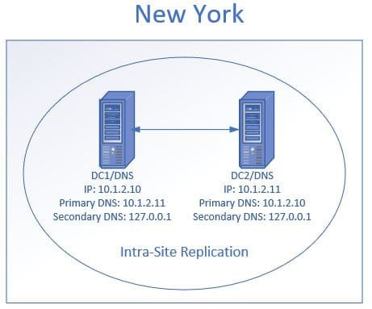
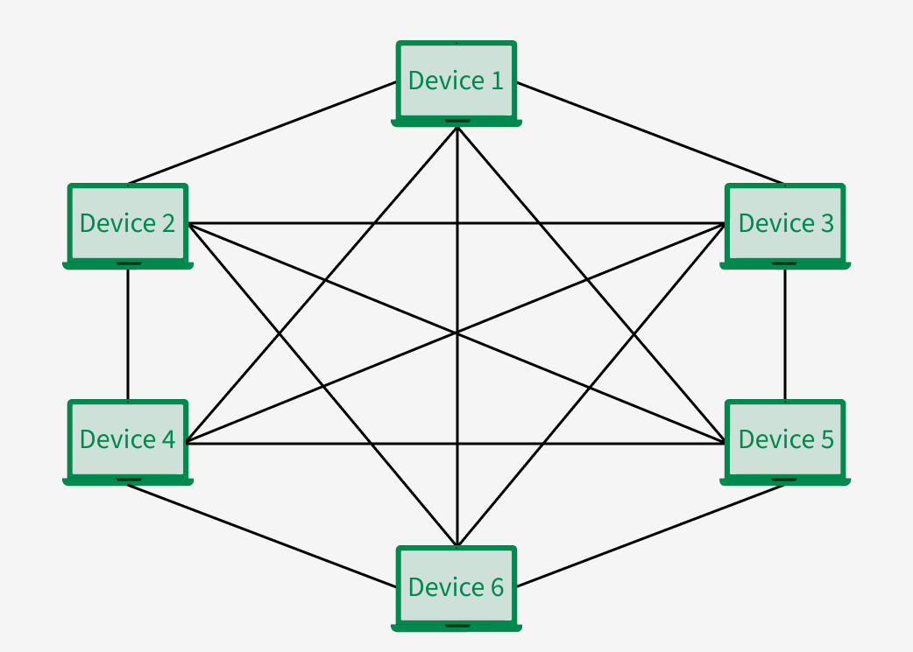
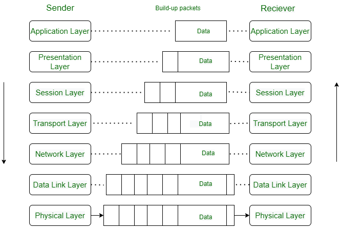
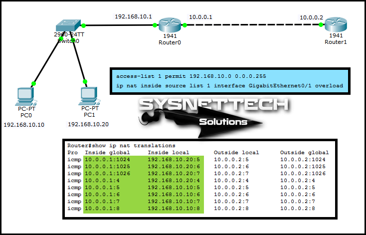
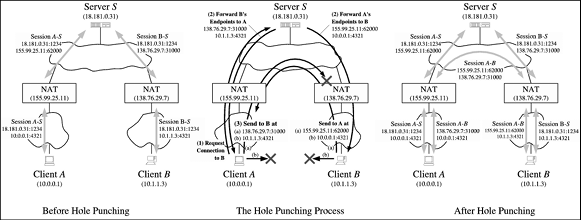
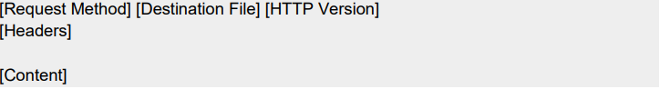
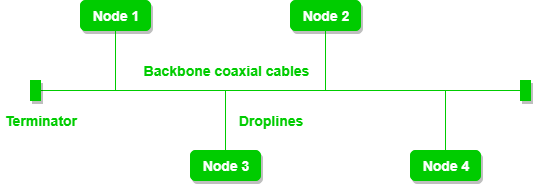
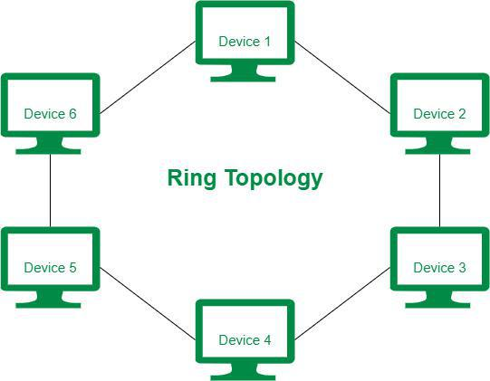
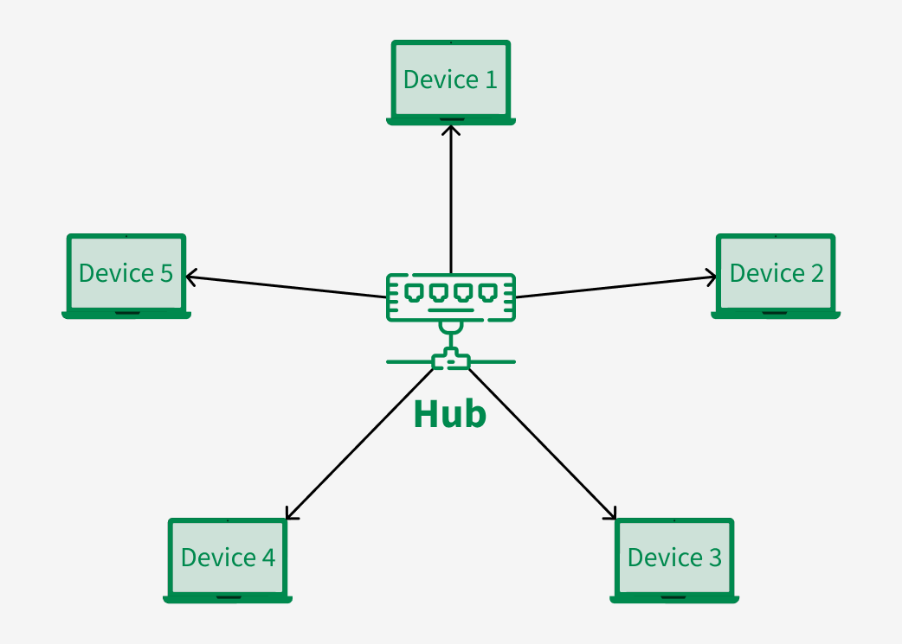

# 
<strong>השכבה השלישית הרחבה</strong>

## **IP:**

### **IPv4:**

<strong>IPv4 הוא פרוטוקול רשתי המשמש למען זיהוי ותקשורת ברשת, הוא מיוצג על ידי כתובות לוגיות המשמשות ברשת , כל מבנה של כתובת IPv4 בנוי מ32 ביטים ומחולק ל4 חלקים כך שכל חלק הוא 8 ביטים סהכ 4 אוקטטות המופרדות בנק' אחת מהשנייה, בכל אוקטטה יכול להיות מספר בין 0-255 , כלומר מספר האפשרויות של כתובות IP שקיים הוא 232 , כל כתובת IPv4 מחולקת לhost id ולnet id ככה שאחד מאפשר להבדיל בין כתובות בתוך הרשת והחלק האחר מאפשר להבדיל בין רשתות בהתאמה.</strong>

<strong>כתובות IPv4 מחולקות לפי אזורים בעולם ככה שאפשר לזהות איזה מקום נמצא מחשב מסויים לפי הכתובות IP שלו , בנוסף לפעמים ניתן גם להבין מי הISP (הספק) שלו.</strong>

### **Reserved IP addresses:**

<strong>כתובות IP שמורות הם כתובות IP שלא ניתן להשתמש בהם בשביל לבצע תקשורת במרחב הציבורי , את הכתובות האלו חברות ענק המנהלות את חלוקת הכתובות העולמית שומרות לפעולות או ביצועים ספציפים ושימוש בתוך רשתות פרטיות או לפרוטוקולים ספציפיים.</strong>

<strong>ישנם גם כתובות IPv6 שהם reserved פשוט לא מצויין</strong>

#### 
<strong>קטגוריות של כתובות IP שמורות:</strong>

##### **Private IP Addresses:**

<strong>כתובות IP פרטיות משמשות בשביל שימוש בתוך רשתות הLAN ולא ניתן להשתמש בהן באופן ציבורי , כלומר לא ניתן להשתמש בהן באינטרנט הפומבי , בכדי שמכשירים עם IP פרטי עדיין יוכלו לתקשר באינטרנט באופן ציבורו נוצרה טבלת הNAT המאפשר למכשירים ברשת פרטית לחלוק כתובת ציבורית אחת ובאמצעותה לתקשר באינטרנט.</strong>

<strong>מאחר וסהכ כל הכתובות האפשריות הן 2 בחזקת 32 ובקצב של העידן של היום יש יותר מכשירים מהכמות הזאת עלה הצורך בחיסכון בכתובות IP , לכך נועדו הכתובות IP הפרטיות , הם עוזרות לחסוך בשימוש בכתובות ברחבי העולם ובכך לאפשר ליותר מכשירים לקבל כתובות IP ולתקשר(כל תהליך התקשורת הזה קורה בעזרת ה-NAT).</strong>

<ul dir="rtl">
<li><strong>10.0.0.0-10.255.255.255 - הכתובות השמורות המשמשות בדרך כלל לרשתות גדולות</strong></li>
<li><strong>172.16.0.0-172.31.255.255 - הכתובות השמורות בדרך כלל לרשתות בינוניות</strong></li>
<li><strong>192.168.0.0-192.168.255.255 - הכתובות השמורות בדרך כלל לרשתות קטנות.</strong></li>
</ul>

##### **Loopback Address:**

<strong>כתובות IP המשמשות לloopback נועדו בשביל שהמחשב יוכל להפנות תעבורו אל עצמו , כתובות הloopback עוזרות בפתירת בעיות בתוכנות ובחומרה בפן הרשתי (כתובת שהמחשב מסמן אצלו כ-"myself").</strong>

<strong>הטווח של הכתובות loopback הן 127.0.0.1 - 127.255.255.255</strong>

##### **Link-Local Adresses:**

<strong>כתובות אלו משמשות לתקשורת רק בתוך רשת מקומית , כתובות אלו לא ניתנות לניתוב ולשימוש באינטרנט הציבורי או לתקשרות עם מכשירים מחוץ לרשת המקומית , השימוש העיקרי של סוג הכתובות הזה הוא למען הגדרת כתובת אוטומטית למכשירים חדשים ברשת , גילוי מכשירים אחרים השייכים לאותה הרשת ופונקציות נוספות.</strong>

##### **Multicast Addresses:**

<strong>כתובות multicast הם כתובות המשמשות את בכדי להעביר הודעות multicast ברשת , כלומר כדי להעביר לכמה יעדים שונים ברשת הודעה באותו הזמן , הטווח של כתובות אלו הן : 224.0.0.0-239.255.255.255 , שימושים נפוצים לכתובות אלו הן בסטרימינג , גיימינג , סחר במניות ועוד.</strong>

##### **Broadcast Addresses:**

<strong>כתובות broadcast משמשות בשביל לשולח הודעה ברשת המקומית לכלל המכשירים ברשת ללא יעד ספציפי , כתובות אלו מאוד חיוניות להתנהלות השוטפת של הרשת , בזכותה מכשירים יכולים לגלות מכשירים אחרים ברשת , בנוסף היא משומשת בפרוטוקול DHCP פרוטוקול המאפשר הקצאת הגדרות רשת בתוך הרשת בצורה אוטומטים , במהלך שלב הDiscover יש שימוש בbroadcast.</strong>

<strong>הכתובת המשמשת לbroadcast היא 255.255.255.255</strong>

##### **Documentation and Test Networks addresses :**

<strong>כתובות אלו משמשות לצורך לימודי או למען בדיקות קונפיגורציה בסביבת רשת , בדרך כלל נמצאות בספרי לימוד ומדריכים.</strong>

##### **Special Uses Addresses:**

<strong>כתובות מסוג זה משמשות לצרכים מאוד ספציפים או פונקציות שונות המצויינות בRFCים שונים , כתובות אלו הן יחודיות ויש להם מטרה בתוך מבנה של תשתית של רשת.</strong>

<ul dir="rtl">
<li><strong>0.0.0.0 - מסמל default gateaway , כתובות לראוטר</strong></li>
<li><strong>100.64.0.0-100.127.255.255 - טווח זה שמור לשימוש בNAT</strong></li>
<li><strong>198.18.0.0-198.19.255.255 - בדיקה של רשתות</strong></li>
</ul>

### **Subnetmask:**

<strong>כשהחל השימוש בפרוטוקול IP הוחלט שרשתות יסווגו לסוגים שונים של רשתות , כל אחד מהסוגים ניתן לזהות לפי הבית הראשון בכתובת הIP , כך קוטלגו כתובות הIP מA-E , לסוגי כתובות מA-C הוגדרו כללים מסויימים בעוד שלD וE לא.</strong>

<strong>הצורה שבה זה נעשה היא שכתובת A תשתמש רק באוקטטה הראשונה שלה בכדי לקבוע את הרשת כך שמתפנים לעוד 3 אוקטטות המאפשרות לתת כתובות יחודיות לכל רשת , כתובת מסוג B תשתמש ב2 האוקטטות הראשונות שלה לקביעת הרשת וכתובת מסוג C תשתמש ב3 האוקטטות הראשונות שלה , כלומר כתובות מסוג A יכילו כמות גדולה של כתובות שונות אבל כמות קטנה של רשתות שונות , מסוג B זה יהיה פחות כתובות מA אבל יותר רשתות וכך גם לC יהיה פחות כתובות מB אבל יותר רשתות , עם זאת כתובות מסוג C עדיין מאפשרות 254 כתובות שונות בכל רשת ומכיוון שלא בכל רשת צריך כל כך הרבה כתובות נבע הצורך לחלק אותן מטעמי אבטחה ויעילות (אבטחה : אם יהיה כתובות שיכולות לעבוד ברשת אבל לא בשימוש גורם זדוני יוכל לנצל זאת ולהשתמש בכתובת כזו בשביל לפעול ברשת כאילו הוא חלק ממנה)</strong>

<strong>בכדי לבצע את החלוקה הזאת לתתי רשתות נוצר הsubnet mask , המבנה שלו גם הוא כ32 ביטים ומורכב מ4 אוקטטות , הצורה בה הוא משומש הוא בעשיית הפעולה הבינארית AND עם כתובת IP , המבנה של subnet mask תמיד יהיה רצף של 1 ואחריו רצף של 0 (לא יהיה רצף של 0 לפני רצף של 1 כמו : 11111111.11111111.00000000.11111111 , לעומת זאת מקרה תקין יהיה : 11111111.11111111.00000000.00000000)</strong>

<strong>בעזרת הsubnet mask ניתן לייצג כתובות מסוג A , B או C ככתובות מסוג אחר (מאותם הסוגים , למשל A כ-C) , הsubnetmask מסמל כמה מהאוקטטות משמשות לקביעת רשת וכמה משמשות לקביעת כתובות ככה שרצף הביטים שהוא 1 מסמל לקביעת רשת ורצף הביטים שהוא 0 מסמל לקביעת כתובות (Net ID ו Host ID).</strong>

<strong>למרות היעול של subnet mask הוא עדיין לא מספיק טוב , לכן הומצא הCIDR.</strong>

#### **IP Classes:**

**Class A: 1.0.0.0 to 127.255.255.255**  
**Class B: 128.0.0.0 to 191.255.255.255**  
**Class C: 192.0.0.0 to 223.255.255.255**  
**Class D: 224.0.0.0 to 239.255.255.255**  
**Class E: 240.0.0.0 to 255.255.255.255**

#### 
<strong>ההבדלים בין הclassים השונים של כתובות IP:</strong>

<strong>Class A - בדך כלל משמש ספקיות אינטרנט , ממשלות , מוסדות חינוכיים וגופים גדולים שצריכים הרבה כתובות.</strong>

<strong>Class B - משמש בדרך כלל גופים בינונים</strong>

<strong>Class C - משמש בדרך כלל לכתובות ברשתות פנימיות , כמו בתים , משרדים וכו'.</strong>

<strong>Class D - משמש בשביל multicast</strong>

<strong>Class E - שמור בשביל מחקרים בדיקות ופיתוח ברשת.</strong>

**What would be the minimal network size for a network with 12 hosts? what would be its subnet mask?**

<strong>כדי למצוא את הגודל רשת המינימלי שבו יש X מכשירים נצטרך למצוא מה ה2 בחזקת N הקרוב ביותר לX הזה מכיוון שביט הוא יכול להיות או 0 או 1 כלומר 2 מספרים , לכן נבין שאם נחשב נמצא ש2 בחזקת 4 זה 16 , מכיוון שבכל רשת יש 2 מכשירים שהכתובת שלהם היא כתובת שמורה נחסר 2 מהתוצאה ויצא לנו 14 , כלומר בסהכ גודל הרשת הוא 14 , בכדי למצוא את הsubnet mask נהפוך בסהכ הביטים מהסוף שמצאנו שצריך שזה הN שלנו ל-0 כלומר 4 ביטים ויצא לנו בsubnet mask של כתובת מclass של C את התוצאה : 255.255.255.240 (האוקטטה האחרונה תיהיה 11110000 שזה 240 בדצימלי)</strong>

**What would be the minimal network size for a network with 600 hosts? what would be its subnet mask?**

<strong>כדי למצוא את הגודל רשת המינימלי שבו יש X מכשירים נצטרך למצוא מה ה2 בחזקת N הקרוב ביותר לX הזה מכיוון שביט הוא יכול להיות או 0 או 1 כלומר 2 מספרים , לכן נבין שאם נחשב נמצא ש2 בחזקת 10 זה 1024 , מכיוון שבכל רשת יש 2 מכשירים שהכתובת שלהם היא כתובת שמורה נחסר 2 מהתוצאה ויצא לנו 1022 , כלומר בסהכ גודל הרשת הוא 1022 , בכדי למצוא את הsubnet mask נהפוך את סהכ הביטים שמצאנו שצריך שזה הN שלנו ל-0 כלומר 1024 ביטים ויצא לנו בsubnet mask של כתובת מclass של B את התוצאה : 255.255.252.000 (האוקטטה האחרונה תיהיה 00000000 ואחת לפניה תיהיה 11111100)</strong>

### **CIDR:**

<strong>CIDR היא צורה שבה ניתן להציג subnet mask בצורה שונה , CIDR מיוצג ככתובת עליה עושים את הsubnet mask ואת מספר הביטים שלא עושים להם subnet mask לדוגמה 10.0.0.1/24 , הייצוג שאחרי ה-\ הוא חיסור של סהכ כל הביטים של הIP שזה 32 פחות הביטים שלהם עושים mask במקרה הזה זה 8.</strong>

<strong>ההבדל המהותי בין subnetmask לבין CIDR הוא החיסכון בכתובות שCIDR מאפשרת לעומת השיטה של הclassification של subnet mask , מאחר והsubnet mask מחולק לclassים כשכל class יכול מכיל מספר קבוע של כתובות לא פחות ולא יותר , לכן CIDR מאפשר לsubnet mask להיות יותר דינאמי ולא לבזבז סתם כתובות IP ברשת שלי או לחלופין לאפשר יותר מידי כתובות IP ברשת שלי.</strong>

<strong>בנוסף , הבדל נוסף הוא התצוגה שלהם , הCIDR מייצג את מספר הביטים של הרשת והsubnet mask מייצג את המספרים שהביטים עצמם מייצגים.</strong>

**How many hosts can the network 10.10.128.0/22 hold? what would be the first valid ip address? what would be the last valid ip address?**

<strong>מספר הביטים המצויין בCIDR הוא 22 כלומר ישנם 10 ביטים להם עושים mask , כלומר אם נחשב את סהכ כל הhostים שאפשר להכיל ברשת הזאת נמצא שאפשר סהכ 1022 (מחסרים 2 בגלל הכתובות ששמורות) , הכתובות הראשונה ב mask הזה תיהיה 10.10.128.1 והאחרונה תיהיה 10.10.131.254 מכיוון שה2 ביטים האחרונים יכולים להיות במינימום 00 או 11 ואם הם 00 אז האוקטטה תראה ככה : 10000000 שזה 128 ואם הם 11 אז היא תראה ככה : 10000011 שזה 131 לכן אלו הכתובות שיהיו ברשת.</strong>

### 
<strong>למה צריך גם כתובות IP וגם כתובות MAC:</strong>

<strong>במידה והיינו משתמשים רק בכתובות MAC בשביל לתקשר ברשת העולמית היה הצורך של רכיב יזכור כל כתובת של כל רכיב שקיים , המבנה של כתובות MAC הוא ללא סדר היררכי כלשהו וללא צורה לזיהוי באופן גלובלי , כלומר אי אפשר לצמצם את איזורי החיפוש כמו מה שכתובות IP מאפשרות לנו וכתובות MAC אין "מוכרות" באופן גלובלי, אם ננסה להשתמש רק בכתובת MAC זה אומר של ראוטר יהיה צריך למפות המון כתובות של המון רכיבים כל הזמן ולעדכן את המיפוי הזה בהתאם למצב הרכיבים אם הם מחוברים או מנותקים מהרשת או אם הם עברו בכלל לרשת אחרת או מיקום אחר ,זה היה דורש המון זיכרון , בזכות כתובות הIP ניתן לזהות בצורה יחודית כל רכיב וגם לחלק את הרכיבים בכלל הרשת העולמית לקבוצות , בשל כך ניתן ליצור טופולוגיה רשתית הררכית המאפשרת לתקשר בלי לדעת כל כתובת של כל רכיב.</strong>

<strong>אם כך אז מדוע אנחנו צריכים כתובות MAC , נצא מנוקדת הנחה ואין כתובות MAC , יש רק כתובות IP , אנחנו יודעים שכתובות IP הן כתובות לוגיות , כלומר הן לא "אמיתיות" , לא פיזיות אלה רק איזה שהיא תווית שאנחנו מקבלים שמייצג את הזהות של הרכיב שלנו , מה קורה במצב בו אנחנו מתחבר לרשת כלשהי לא משנה איזה בפעם הראשונה , איך נצליח לקבל את התווית הזו שתזהה אותנו , הרי מכיוון ואין לנו כתובת IP עדיין אז אין לנו איך לתקשר ברשת בשביל לבקש כתובת , לחלופין אנחנו יכולים להגדיר כתובת IP בצורה סטטית בעצמנו אבל אז זה אומר שלכל רכיב חדש נצטרך להגדיר כתובת IP ידנית , ומה אם היא תפוסה? או מה אם הכתובת IP שנגדיר היא לא בפורמט הנכון של הרשת? הרי אין לנו איך לדעת כי אנחנו עוד לא חלק ממנה , בנוסף אם נתנתק מרשת אחת ונטוס למקום אחר בעולם וננסה להתחבר לרשת וננסה לתקשר אנחנו לא נצליח גם במידה והיינו מחוברים לאחת בעבר , הרי חלוקות כתובות הIP בעולם עובדות לפי איזורים גיאגרפים או היררכיה תוך רשתית כלשהי , גם אם יש לנו כתובת IP היא לא בהרכח תתאים ולא נוכל לבקש חדשה כי אנחנו לא חלק מהרשת עדיין , לכן יש את כתובת הMAC , אנחנו נשלח ברשת הודעה בשכבה השנייה בה אנחנו נגיד היי אני (כתובת MAC : XX:XX:XX:XX:XX:XX) רוצה לקבל כתובת IP תתנו לי בבקשה וכך נקבל כתובת שתאפשר לנו לתקשר מחוץ לרשת הLAN שאנחנו חלק ממנה ובאופן כללי לתקשר ברשת.</strong>

### **IPv6:**

<strong>זהו פרוטוקול אינטרנטי חדיש שבא לתת מענה לבעיות שיש בפרוטוקול IPv4 פרוטוקול זה מאפשר כתובות לוגיות ייחודיות המשמשות לזיהוי רכיבים ברשת, IPv6 הוא בגדול של 128 ביטים 8 רצפים של 16 ביטים כל רצף מכיל מספרים הקסדצימליים ונקודותיים , כתובות IPv6 נוצרו בשל המחסור העתידי בכתובות IPv4 ומאפשרות הרבה יותר אפשרויות של כתובות IP , המבנה של כתובות IPv6 מחולק ל3 כך שה48 ביטים הראשונים משמשים כדי לזהות את הרשת הספציפית שהכתובות חלק ממנה , 16 הביטים הבאים משמשות בתוך ארגונים בשביל לזהות תתי רשתות וה64 ביטים הנוספים נועדו בשביל לזהות לקוח ספציפי ברשת.</strong>

<strong>פרוטוקול IPv6 מוסיף עוד פיצ'רים שונים מלבד הכמות המאוד גדולה של כתובות אפשריות , הוא משפר את הצורה בה עושים הגדרות לכתובות , מיספור מחודש ברשת ואת הrouter announcment , נוסף על כך פרוטוקול זה הרבה יותר מאובטח מהפרוטוקול שקדם לו יש בו פתרונות אבטחתיים מובנים כמו הצפנה והתאמתות , מאפשר הגדרה אוטומטית של כתובות ללא שימוש בפרוטוקול DHCP ובעל header פשוט יותר מה שמגביר את היעילות והתקורה ומאפשר ביצועים טובים יותר ברשת.</strong>

## **Fragmentation:**

<strong>פרגמנטציה היא פעולה בה מחלקים את הפאקטות למנות יותר קטנות לפי הגודל המקסימלי שהMTU של כרטיס הרשת יכול לקבל , כאשר פאקטה מגיעה לראוטר הוא בודק מה גודל המנה המקסימלי של כרטיס הרשת של היעד ולפי זה יודע לחלק את הפאקטות למנות יותר קטנות כדי שהן יוכלו לעבור , כל מנה נמדדת בגדול של 8 ביטים חוץ מהמנה האחרונה שהיא השארית של החילוק של הפאקטה ולכל אחת מהמנות יש את הדגל MF חוץ מהמנה האחרונה ושדה הoffset במנות מסומנים לפי הoffset של האורך של הפאקטה.</strong>

## **IP Packet:**

### **IPv4:**

<strong>מבנה פאקטה של IPv4 בנוי רק מ2 חלקים - header וdata , בפאקטה בפרוטוקול הזה אין footer או איזה שהוא checksum שבודק טעויות במידע.</strong>

#### **Header:**

<strong>המבנה של הheader בנוי מ14 שדות , 13 שדות מתוכן הן שדות שחייהים בפאקטה בעוד שהשדה options הוא שדה אופציונלי , השדות בפאקטה מסודרות בסדר מסויים לפי הביטים בפאקטה כך שכל כמות ביטים ספציפית מייצג בתוכה שדה.</strong>

##### **Version:**

<strong>שדה זה בגודל של 4 ביטים והוא מסמל את הגרסה של הפרוטוקול , בפאקטת IPv4 השדה הביטים בשדה תמיד יהיו שווים לסיפרה 4.</strong>

##### **Internet Header Length (IHL):**

<strong>שדה זה בגודל של 4 ביטים; בשל הסיבה שפאקטות IPv4 יכולות להשתנות בגודלן בגלל השדה optional הגודל של הפאקטה יכול להשתנות בהתאם , שדה זה הוא השדה שמציין מה אורכה של הפאקטה , הערך המינימלי שיכול להיות בפאקטה הוא הסיפרה 5 והמקסימלי זו הסיפרה 15 , השדה הזה מציין כמה 32-bit words קיימות בפאקטה , מכן נוסע שגודל מינימלי של פאקטת IPv4 היא 20 בתים וגודל מקסימלי הוא 60 בתים.</strong>

##### **Diffrentiated Services Code Point (DSCP):**

<strong>גודל שדה זה הוא 6 ביטים , מאחר ונתונים רשתיים תומכים בסוגים שונים של שירותים כמו וידאו , קול , מיילים וכודמה עלה הצורך לסווג כל אחד מהם בצורה שונה בשביל לאפשר את היעילות הטובה ביותר בכל אחד מהם , בשביל לעשות זאת נוצר הDiffServ שזה הוא צורת ארכיטקטורה רשתית המשמש כמנגנון לסיווג ניהול ותיעדוף של תעבורה וQoS ברשת , הוא עושה זאת בעזרת קודים בין 0-63 כך שכל קוד מסמל סוג שונה של שירות , הקודים מחולקים לEF , AF וBE כאשר הקוד EF הוא הקוד המתועדף ביותר ותחת הסוג AF מקוטלגים קודים שונים בתיעדוף הררכי שונה ובנוסף הקוד BE מסמן שאין תיעדוף של הפאקטות מצב המאפשר יצירה של תור בו הפאקטות מתקבלות לפי סדר הגעתן ולא לפי תעדוף כלשהו , התפקיד של שדה זה בפאקטה הוא לציין לאיזה סוג של שירות הפאקטה הזאת שייכת , כלומר לאיזה DiffServ שייכת הפאקטה הזאת , ציון זה נעשה בעזרת קוד , לכל קוד משוייך סוג אחר של שירות וכך ניתן להבדיל איזה שירות משומש בפאקטה.</strong>

##### **Explicit Congestion Notification (ECN):**

<strong>גודל שדה זה הוא 2 ביטים , ECN הוא סוג של תוסף אופציונלי במבנה הפאקטה והתפקיד שלו נועד כדי להתריאה על עומסים רשתיים , התוסף הזה נתמך כאשר שני הנקודות המתקשרות מאפשרות אותו והתשתית הבסיסית שלהם תומכת בו , בעבר ראוטר היו מפילים פאקטות במקרה של עומס תעבורתי אך בזכות הECN הראוטר מסוגל לסמן בפאקטה שיש עומס במקום להפיל את הפאקטה.</strong>

##### **Total Length:**

<strong>גודל שדה זה הוא כ-16 ביטים , שדה זה מתאר את כל גודל הפאקטה מקסימום 65,535 בתים.</strong>

##### **Identification:**

<strong>שדה בגודל של 16 ביטים , שדה ייחודי המשמש בשביל לזהות קבוצה של פרגמנטים ששייכים לאותה הdatagram.</strong>

##### **Flags:**

<strong>שדה בגודל של 3 ביטים המכיל בתוכו 3 flags שונה שכל אחד בגודל של 1 ביט.</strong>

**Reserved(R):**

<strong>חסר משמעות כרגע , זה דגל ששמור למטרות עתידיות בשביל הפיתוח של הפרוטוקול והוא תמיד מוגדר ל-0.</strong>

**Don't Fragment(DF):**

<strong>דגל המציין אם אפשר לעשות פרגמנטציה על הdatagram , אם הדגל מוגדר 1 ויהיה הצורך לעשות פרגמנטציה לפאקטה אז הפאקטה תיפול.</strong>

**More Fragments(MF):**

<strong>דגל שמוגדר רק לפאקטות שנעשה עליהם פרגמנטציה , אם נעשה פרגמנטציה על הפאקטה בכל פרגמנט חוץ מהאחרון יוגדר הדגל הזה , הסיבה שהאחרון לא יוגדר עם הדגל יהיה כדי שיהיה אפשר להבחין בין פאקטות הבאות שלא נעשה עליהן פרגמנטציה , במקום זאת יוגדר עליה ה non-zero Fragment Offset field.</strong>

##### **Fragment Offset:**

<strong>שדה בגודל 13 ביטים , השדה הזה מגדיר את האופסט ביחס לתחילת הפאקטה המקורית (שלא נעשה עליה פרגמנטציה) , פרגמנטים הם בגדלים של 8 בתים זו הסיבה שאורך של פרגמנטים גם הוא בכפולות של 8 חוץ מהפרגמנט האחרון שהוא השארית לכן יכול להיות קטן יותר.</strong>

<strong>בנוסף , דגל זה תומך בפרגמנטציה של פאקטות בצורה שבה יחרגו מהאורך המקסימלי של פאקטה.</strong>

##### **TTL(Time-To-Live):**

<strong>שדה זה בגודל ש ל8 ביטים , השדה הזה משמש בשביל להגביל את "אורך החיים" של הפאקטות ולמנוע כשל רשתי , הוא מונע מהפאקטה לעשות loop סתם ככה בין ראוטרים ולהמשיך להשלח עד אין סוף בלי שהיא תיפול בדרך , הערך בשדה הזה מצוין בשניות ומרווחי זמני שהם פחות משניות מתעגלות כלפי מעלה , בפועל השדה משמש כדי לספור את כמות הhopים שהפאקטה עשתה בין כתובת לכתובת עד שהגיע ליעד שלה או עד שנפלה בדרך , כאשר פאקטה מגיע לראוטר הוא מחסיר 1 מהערך הנוכחי של הTTL ברגע שהערך מגיע ל0 הפאקטה נופלת ובדרך כלל הראוטר מחזיר פאקטת ICMP לשולח שמציינת שהפאקטה חרגה מהזמן שהיה מצויין בTTL .</strong>

<strong>שדה הTTL יכול להשתנות בכמות הhopים המוגדרת בו כתלות במערכת הפעלה , במערכות הפעלה של Windows הTTL מוגדר כ-128 בעוד שבמערכות הפעלה מבוססות UNIX הוא מוגדר ל64 וישנם מכשירים רשתים שונים בהם הוא יכול להיות מוגדר גם ל255.</strong>

##### **Protocol:**

<strong>שדה זה בגודל של 8 ביטים , שדה זה מציין את הפרוטוקול המשומש בחלקת המידע בפאקטה (כמו TCP , UDP , ICMP וכו') בשכבה 4.</strong>

##### **Header CheckSum:**

<strong>שדה בגודל 16 ביטים , משמש בשביל checksum.</strong>

##### **Source Address:**

<strong>שדה בגודל 32 ביטים , שדה זה מכיל את כתובת IPv4 של המקור (מוען) של הפאקטה , יכול להשתנות אם נעשה שימוש בNAT.</strong>

##### **Destenation Address:**

<strong>שדה בגודל 32 ביטים , שדה זה מכיר את כתובת IPv4 של היעד (נמען) של הפאקטה ,</strong>

##### **Options:**

<strong>שדה זה בגודל של בין 0 עד 320 ביטים והוא מחולק לחלקים של 32 ביטים לכל חלק , שדה זה מכיל כל מינינ אןופציות שונות שמשנות את התנהגות הפאקטה , כמו צורת הניתוב שונה. בנוסף שדה זה כולל גם אפשוריות שעדיין בגדר ניסיוניות כך ששימוש בשדה לפעמים נחשב כמסוכן וראוטרים חוסמים פאקטות שיש בהם שימוש באופציות.</strong>

## 
<strong>פרוטוקולים:</strong>

### **ARP:**

#### 
<strong>המטרה והflow של הפרוטוקול:</strong>

<strong>המטרה העיקרית של פרוטוקול ARP היא תרגום כתובות IP לכתובות MAC , פרוטוקול זה עוזר לקשר בין השכבה השנייה לשלישית , הוא מתרגם כתובות MAC שהם כתובות סטטיות לכתובות IP שהם כתובות שמשתנות כל הזמן , כאשר מחשב מנסה לחפש MAC של מחשב לפי כתובת הIP שלו הוא עושה את התהליך הבאה:</strong>

<strong>המחשב ימצא את הARP CACHE בו נמצא הARP TABLE , שם יחפש אם כבר קיים תרגום של כתובות IP לMAC אם יש הוא ישתמש בתרגם הזה כבר.</strong>

<strong>במידה ולא מצא הוא ישלח הודעת broadcast לכל המחשבים ברשת בה הוא ישאל למי שייך הIP הספציפי שהוא מחפש כתוצאה יחזיר המחשב פאקטה ARP response בה הוא יחזיר את הIP שלו והMAC שלו.</strong>

<strong>המחשב יעדכן בטבלה שלו את התרגום של הכתובות.</strong>

<strong>ARP TABLE היא טבלה בה המחשב שומר תרגום של כתובות IP לMAC , בעזרת הטבלה הזאת המחשב יכול ליעל את החיפוש שלו עבור כתובות , את הטבלה הזאת הוא שומר בCACHE שנמחק כל כמה דקות.</strong>

<strong>ARP Response נשלחת כUNICAST וגם כאשר נעשית עדכון של טבלת הARP , כאשר לקוח ינסה לעדכן את הכתובת כי פג תוקפה קרב אז הוא ישלח בקשת ARP באופן ספציפי ליעד הספציפי בUNICAST כדי לרפרש את הטבלה.</strong>

#### 
<strong>סוגים של ARP :</strong>

Reverse ARP : הלקוח מבקש לתרגם את הכתובת של עצמו כדי לדעת מי הוא בעצם.

Inverse ARP : תרגום של MAC ל IP.

Proxy ARP : מתרגם כתובות IP לMAC בין רשתות מופרדות.

Gratuitous ARP : תשובת ARP ללא בקשה.

ARP : תרגום של כתובת IP לMAC.

#### **ARP Fields :**

<strong>Hardware Type (HTYPE):</strong> שדה באורך 16 ביטים , מסמל את סוג פרוטוקול של השכבה השנייה בה משתמשים , למשל 1 זה ETH.

<strong>Protocol Type (PTYPE) :</strong> שדה באורך 16 ביטים , מציין את הפרוטוקול שעבורו מיועדת בקשת ה-ARP. למשל IPv4, עם הערך 0x0800.

<strong>Hardware Length (HLEN) :</strong> שדה באורך 8 ביטים , אורך של כתובת חומרה. עבור Ethernet, אורך הכתובת הוא 6.

<strong>Protocol Length (PLEN) :</strong> שדה באורך 8 ביטים, מסמל את האורך של כתובות עבודה באינטרנט.

<strong>Operatin (OPER) :</strong> שדה בארוך 16 ביטים , מסמל את סוג הבקשה שמתבצעת , 1 לבקשה, 2 לתשובה.

<strong>MAC (SHA) :</strong> שדה באורך 48 ביטים , מציין את כתובת הMAC של השולח , בבקשה ARP יציין את כתובת השולח , בתשובת ARP יציין את כתובת העונה לבקשת השולח.

<strong>IP (SPA) :</strong> שדה באורך 32 ביטים , מסמל את כתובת הIP של השולח.

<strong>TARGET MAC (THA) :</strong> שדה באורך 48 ביטים , שדה המשמש בשביל כתובת היעד , בבקשת ARP היא תיהיה כתובת BROADCAST בתשובת ARP היא תיהיה כתובת השולח.

<strong>TARGET IP (TPA) :</strong> שדה בארוך 32 ביטים , משמש בשביל לסמן את כתובת הIP של היעד.

#### 
<strong>מתקפה בעזרת ARP:</strong>

<strong>להגיע לעמדה של MiTM בעזרת ARP Poisoning ו ARP Spoofing וכך התוקף יכול להגיע למצב בו הוא יגרום לקורבן לחשוב שהוא היעד וינתב אליו את הפקטות ויגרום ליעד לנתב את הפקטות אליו גם כך ששניהם יצטרכו להעביר דרכו את הפקטות (למשל שני מחשבים וראוטר)</strong>

<strong>כדי לעלות על המתקפה נרצה להשתמש בסוויץ' מאובטח שיודע לוודא שהפקטות לגיטימיות ולהפיל אותם אם הם חשודות ( בדיקה דינאמית של הARP).</strong>

<strong>בנוסף כדי להתגבר על ARP Spoofing נרצה לבדוק שבARP Table שלנו אין 2 כתובות IP עם אותה הכתובת MAC , במידה ויש זה אומר שיש רכיב שמתחזה ל2 מכשירים.</strong>

#### **Gratutious ARP :**

<strong>תגובת ARP שלא התקבלה על ידי בקשת ARP (נשלחת כbroadcast בעלת opcode 2 כדי לציין שזו תגובה שלא הגיע בעקבות בקשה).</strong>

<strong>שימושים בGratutious ARP:</strong>

<strong>רכיב שרוצה להכריז על קיומו ברשת :</strong>

<strong>אם יש רכיב חדש ברשת והוא רוצה לגרום לשאר הרכיבים לעדכן את המיפוי שלו בלי שהם יצטרכו לשלוח לו בקשה.</strong>

<strong>רכיב שרוצה לעדכן את מיפוי כתובת הMAC לIP שלו אצל שאר הרכיבים ברשת:</strong>

<ul dir="rtl">
<li><strong>רכיב החליף כרטיס רשת ונשאר עם אותה הכתובת.</strong></li>
<li><strong>מכונת וירטואלית החליפה כתובת MAC ונשארה עם אותה הכתובת IP.</strong></li>
<li><strong>במהלך פרוטוקול DHCP כחלק מבדיקה האם יש מחשב עם אותם הגדרות רשת כמו שלו.</strong></li>
</ul>

<strong>עומס של תעבורה:</strong>

<ul dir="rtl">
<li><strong>אם שני רכיבים חולקים איזה שהיא כתובתIP או MAC (אם יש רכיב שמחלק את הרכיבים לפי פורטים) כלשהיא ואחד מהם חווה עומס של תעבורה אז הוא ירצה ירצה לעדכן את שאר הרכיבים ברשת שעכשיו הרכיב האחר מקבל תעבורה ולא הוא.</strong></li>
</ul>

### **ICMP:**

<strong>פרוטוקול ICMP נועד במטרה לבצע בקרת תקלות והודעות במעבר של פקטות בין רכיבים רשתיים , לפרוטוקול IP אין את היכולת הזאת לכן הוא מסתמך על ICMP , כאשר יש תקלה במעבר של פקטה יוכל המחשב לדווח על התקלה הזאת בעזרת שימוש בפרוטוקול ICMP , הרכיב ישלח פקטת ICMP שתכיל את תיאור של מה שהוא מבקש , לפי שדה הtype הרכיב שיקבל את הפקטה ידעה בערך איזה סוג של תקלה קרתה או איזה סוג של הודעה התקבלה וידע לפעול בהתאם , הפרוטוקול עובד בצורה שלא מוודאת חיבור עם היעד, היוא פועל כיחידת נתונים עצמית.</strong>

<strong>דוגמה לשימוש בפרוטוקול ICMP היא למשל כאשר ראוטר יקבל פאקטה גדולה מידי ולא יכול להעביר אותה , הראוטר יפיל את הפאקטה וישלח פאקטת ICMP למקור בה הוא יצין שהפאטה היית גדולה מידי , דוגמה נוספת לשימוש בICMP היא לניתוחים רשתיים כמו למשל בשימוש של traceroute.</strong>

<strong>הHeader של פקטת ICMP היא בגודל של 32 ביטים והיא מורכבת מ-3 שדות : Type ,Code , CheckSum ומ-Extended header ו Payload.</strong>

#### **CheckSum:**

<strong>שדה זה בגודל 16 ביטים , שדה המשמש לchecksum , בקרת המידע.</strong>

#### **Code:**

<strong>שדה בגודל של 8 ביטים , שדה זה מכיל אקטרה מידע על ההודעה.</strong>

#### **Type:**

<strong>שדה בגודל של 8 ביטים , שדה זה מסמל את סוג ההודעה.</strong>

##### 
<strong>להלן Types חשובים:</strong>

<strong>ניתן תיאור לכל Type במידה ורלוונטי לתאר אותו.</strong>

- **0 Echo Reply**
<ul dir="rtl">
<li><strong>3 Destination Unreachable -קוד 0 רשת , קוד 1 להוסט קוד 2 לפרוטוקול קוד 3 לפורט קוד 4 צריך לעשות פרגמנטציה לנתונים קוד 5 ניתוב המקור נכשל</strong></li>
<li><strong>4 Source Quench - אם לרוטר אין מספיק מקום בבאפר כדי להעביר את הדטגרמס לרשת הבאה במסלול הניתוב</strong></li>
<li><strong>5 Redirect - כאשר יש נתיב יותר קצר בו המידע יכול לעבור הראוטר שולח את זה למקור , קודים 0 1 2 3 יגדירו למי הרואטר ימליץ לנתב ולאן</strong></li>
<li><strong>8 Echo</strong></li>
<li><strong>11 Time Exceeded - אם הTTL הוא 0 קוד 0 או כאשר הראוטר לא הצליח לחבר את הדטגרמס בזמן המוקצב שלו קוד 1.</strong></li>
<li><strong>12 Parameter Problem - אם הראוטר או ההוסט מוצאים תקלה בפרמטרים שבheader למצב שהם לא יכולים לעבד את הדטגרמס , קוד 0 תקלה קוד 1 חסר</strong> <strong>אופציה שהיא חוב 3 האורך גדול מידי</strong></li>
<li><strong>13 Timestamp - הזמן מהרגע שנשלחה ההודעה</strong></li>
<li><strong>14 Timestamp Reply - הזמן מהרגע שהתקבלה ההודעה</strong></li>
<li><strong>15 Information Request</strong></li>
<li><strong>16 Information Reply</strong></li>
</ul>

## **IPSec:**

<a href="https://www.digitalwhisper.co.il/files/Zines/0x03/DW3-3-IPSEC.pdf">הסבר על IPSEC</a>

## **IGMP:**

[https://www.cloudflare.com/learning/network-layer/what-is-igmp/](https://www.cloudflare.com/learning/network-layer/what-is-igmp/)

## **Static Routing:**

<strong>כאשר נרצה להעביר מידע בין שני מחשב בLANים שונים , כלומר באינטרנט , אנחנו נצטרך לנתב את הפאקטות מהמקור שזה אנחנו אל היעד שלנו , מכיוון שאנחנו לא נמצאים על אותו הLAN אנחנו נשתמש בכתובות הIP אחד של השני בשביל לתקשר בינינו , כדי שאני אוכל למצוא את מחשב היעד שאני רוצה לתקשר איתו אני אצטרך להשתמש בכתובת שלו (או לפחות בכתובת שמייצגת אותו) , בשביל זה נצטרך לעשות ניתוב לפאקטות שלנו , לכן נשתמש בנתב , בעזרת נתב נוכל להעביר פאקטות באינטרנט , הנתב יכול למצוא את הדרך הטובה ביותר בין 2 רכיבים ובכך להעביר את הפאקטות מהמקור אל היעד , ניתוב סטטי הוא הגדרת טבלאות הניתוב בצורה ידנית ולא בעזרת פרוטוקולים שמאפשרים לעשות נתיוב דינאמי.</strong>

### **Default Gateway:**

<strong>זו היא הכתובת ברירת המחדל אליה יעברו הפאקטות כאשר לא צויינה כתובת יעד מתאימה בפאקטה , כלומר אם לא נמצאה כתובת מתאימה לכתובת יעד בפאקטה אז הכתובת לא ברשת וצריכים לנתב אותה לרשת אחרת , הdefault gateway היא הכתובת אליה מועברות כל הפאקטות שלא מוצאות את היעד שלהם ברשת , בדרך כלל הכתובת הזאת מוגדרת לראוטר כי הוא הרכיב שיכול לנתב בין רשתות.</strong>

<strong>הוספת כתובת סטית בלינוקס:</strong>

<strong>שינוי default gateway בלינוקס:</strong>

## **NAT:**

<strong>השימוש העיקרי של NAT היא תרגום בין כתובות פרטיות לכתובת הציבורית , בראוטרים יש טבלה הנקראת NAT בה נשמרים בהתאמה כתובות IP פרטיות והפורט שלהן ברשת הפנימית אל מול כתובת IP ציבורית והפורט שלהן באינטרנט.</strong>

<strong>NAT מאפשר שמירה על פרטיות של הכתובות הפרטיות שמתקשרות מאחר והכתובת הפרטית לא נחשפת אף פעם אלה רק הכתובות הציבורית , נוסף על כך מכיוון שהוא משתמש רק בכתובת ציבורית ברשת הציבורית הוא מונע מספור מחודש של כתובות כל פעם , מאחר וכתובות IP משתנות מעת לעת אז יהיה צריך לעדכן רק את הכתובת הציבורית ולא כל אחד מהכתובות הפרטיות.</strong>

<strong>עם זאת , תרגום של הכתובות גורם לעיכובים במעבר בין נתיבים ברשת , בנוסף ישנם אפליקציות שלא יודעות לעבוד עם NAT או פשוט לא יפעלו כשהוא פועל , הוא מסבך את השימוש בtunneling , וגורם לראוטר לעסוק במיפוי פורטים משהו שהוא לא אמור לעסוק בו(בשימוש בPAT שזה סוג הNAT הנפוץ ביותר).</strong>

<strong>בזכות טבלת המיפוי הזאת הראוטר יודע להעביר כל פאקטה ליעד המתאים לה גם כאשר שני רכיבים מנסים לפנות לאותה כתובות ולקבל מאותה הכתובת פאקטות , המיפוי בראוטר עובד בצורה כזאת שנוצר התאמה בין הכתובת הציבורית ופורט מג'ונרט לבין הכתובת הפרטית ופורט מג'ונרט.</strong>

### **Dynamic NAT:**

<strong>זהו מיפוי בין כמות כתובות פרטיות לכמות של כתובות ציבוריות , כלומר לכל כתובת פרטית יהיה כתובת ציבורית משלה , ישנו pool של כתובות הציבוריות כך שכל כתובת פרטית ממופת לכתובת ציבורית , אם יהיה יותר כתובות פרטיות מציבוריות לא יהיה ניתן למפות אותן ופאקטות המנסות לצאת ממקורות עם כתובות לא ממפות יפלו בדרך.</strong>

### **Static NAT:**

<strong>זהו מיפוי בין כתובת פרטית אחת לכתובות ציבורית אחת , בצורה סטטית כך שיהיה רק כתובות אחת ממפות לכתובות הציבורית הזאת , משומש בדרך כלל לאתרי אינטרנט.</strong>

### **PAT:**

<strong>זו הגרסה הנפוצה ביותר והיעילה ביותר שגם הוזכרה למעלה , תרגום של מספר כתובות פרטיות לכתובת ציבורית אחת ומיפוי שלהן בעזרת פורטים שונים לזיהוי ביניהם.</strong>

### **Hole Punching:**

<strong>הבעיה העיקרית בNAT היא שהוא לא יכול לקבל חיבור חיצוני בגלל שאי אפשר לדעת את הכתובת הספציפית איתה נרצה לתקשר , לכן הומצא הקונספט של hole punching , הפתרון הזה מאפשר יצירה של תקשורת בין צמתים עם NATים למרות העובדה שהם לא מקבלים תקשרות חיצונים , השימוש בשיטה זאת מצריך שרת חיצוני ציבורי עם כתובת IP סטטית שאיתה שני המחשבים החפצים ביצירת קשר צריכים לתקשר , זה הוא גם החיסרון בשיטה זו - היא תמיד מצריכה שרת חיצוני , השיטה פועלת בצורה בה לקוח A מבקש ליצור תקשורת עם לקוח B , הוא שולח הודעה לשרת החיצוני , אותו שרת שולח ללקוח A את הIP והפורט של לקוח B וללקוח B את הIP והפורט של לקוח A , כל אחד מהלקוחות שולח הודעה סתמית חסרת משמעות אחד לשני כך שהNAT של A ממפה את כתובת של A והפורט המתאים לו והNAT של B ממפה את הכתובת של B והפורט המתאים לו , מאחר ולפני שנשלחו הפאקטות בין הלקוחות עוד לא נוצר מיפוי של הכתובות והפורטים אז הפאקטות יפלו גם הNAT לא מאפשר למעבר שלהן , אך מהרגע שבו כל אחד שלח את ההודעה ונרשם בטבלת הNAא הפאקטה הבאה כבר תוכל לעבור,ובכך בזכות המיפוי הזה הNAT יאפשר למעבר של פאקטות בין שני הכתובות האלו (הסבר זה מתאר Hole Punching ב-UDP , בTCP ההודעה הסתמית תיהיה הודעת SYN כאשר השנייה מביניהן שתגיע אל הNAT ותעבור אל הלקוח ישלח בתגובה אליה הודעת SYN+ACK וכך תמשיך יצירת השיחה כמו תקשורת TCP רגילה).</strong>

<strong>חשוב לציין ששיטת הHole Punching לא תעבור בSymmetric NAT.</strong>

## **Routing Schemes:**

### **Unicast:**

<strong>הודעת unicast היא הודעה בה יש מעבר של מידע בצורה של אחד-לאחד , יש רק מקור אחד ויש רק יעד אחד , ההודעה תשלח רק בין אחד לשני , בפרוטוקולים TCP וHTTP יש שימוש בUnicast.</strong>

<strong>אנלוגיה : שיחה בין שני אנשים.</strong>

### **Broadcast:**

<strong>הודעת broadcast היא הודעה בה יש מעבר של מידע בצורה של אחד-לכולם , יש רק מקור אחד ויש מספר לא ספציפי של יעדים , כלומר ההודעה תישלח לכולם , כל מי שמתקשר ברשת יקבל את ההודעה לא משנה מי זה , בפרוטוקולים DHCP וARP יש שימוש בBroadcast.</strong>

<strong>ישנם 2 סוגים של הודעות Broadcast , סוג הראשון בו ההודעה שנשלחת לכלל המכשירים המחוברים תוכל להשלח רק למכשירים שנמצאים באותה הרשת עם השולח , סוג שני בו השולח מעביר הודעה לכל המכשירים הנמצאים ברשת אחרת ממנו.</strong>

<strong>בסוג הודעה זו לא תתקבל בהכרח תשובה מהנמענים , כלומר אומנם ההודעה תגיע לכולם אך לא בהכרח תתקבל תגובה להודעה או כתוצאה ממנה.</strong>

<strong>אנלוגיה לסוג הראשון:</strong>

<strong>שידור של תוכנית טלוויזיה , מעבר של וידאו או שמע מהרשת של השידור אל כל הרשתות השונות של הטלוויזיות שנמצאות על ערוץ השידור.</strong>

<strong>אנלוגיה לסוג השני:</strong>

<strong>הרצאה באולם לאנשים , איש אחד שמדבר וכולם שומעים אותו.</strong>

### **Multicast:**

<strong>הודעת multicast היא הודעה בה יש מעבר של מידע בצורה של כמות-לכמות, יש כמות ספציפית של שולחים ויש מספר ספציפי של יעדים , כלומר ההודעה תישלח לכמות יעדים ספציפיים המצוינים מכמות מקורות ספציפית , כל יעד יכול להיות מקור ולהיפך , שיחות Zoom היא דוגמה לשימוש בMulticast.</strong>

<strong>בשביל לשלוח הודעת multicast נצטרך שרכיבים מסויימים יחשבו כחלק מהקבוצה שאנחנו רוצים לשלוח אליה , כלומר שהם יוכלו לקבל הודעות מכתובת\ות מסויימותכהודעת multicast , ישנו טווח כתובות שמור בשביל לשלוח הודעות multicast , הטווח הזה הוא חלק מclass D של כתובות הIP והוגדר בטווח של : 224.0.0.0 - 239.255.255.255 , בעזרת הכתובות האלו ניתן לשלוח הודעות multicast , גם הטווח הזה מחולק בתוכו לעוד טווחים לפי שימושים.</strong>

<strong>בשביל שנוכל לשלוח הודעת multicast נצטרך לציין את הכתובת בטווח שצויין (תלוי לפי שימוש) ושהמכשירים שהם חלק מהקבוצה כלומר מכשירים שמאשרים שהם מקבלים הודעות שהמקור שלהם זה הכתובת שלנו והיעד שלהם זה כתובת multicast שאנחנו מציינים (ניתן לשלוח הודעות multicast גם אם אין אף חברי קבוצה , בנוסף ניתן לשלוח הודעות multicast גם בתור מקור שהוא לא חלק מהקבוצה).</strong>

<strong>אנלוגיה:</strong>

<strong>חבורות במסיבה , אנשים עוברים בין חבורות ומדברים עם מי שהם רוצים.</strong>

### **Anycast:**

<strong>הודעת anycast היא הודעה בה יש מעבר של מידע בצורה של אחד-אחד בקבוצה, יש רק מקור אחד בעוד שהיעד הוא חלק מקבוצה כלשהי שאיתה נרצה לתקשר, כלומר ההודעה תעבור מהמקור אל אחד מתוך היעדים שהם חלק מהקבוצה , המקור יבחר לשלוח את ההודעה ליעד הכי קרוב שהוא חלק מהקבוצה שהוא מחפש, בפרוטוקול DNS יש שימוש בAnycast.</strong>

<strong>אנלוגיה:</strong>

<strong>כאשר רוצים לעזוב מסיבה שהיינו בא , נרצה להודות למארגנים של המסיבה , אז נחפש את אחד מהמארגנים נפנה לאחד הכי קרוב אלינו ונגיד לו תודה ונעזוב.</strong>

### **Geocast:**

<strong>הודעת geocast היא הודעה בה יש מעבר של מידע בצורה של אחד-לכמות, יששולח אחד המקור ויש מספר ספציפי של יעדים הנכללים כיעדים לפי המיקום הגאוגרפי שלהם , כלומר ההודעה תישלח לכמות יעדים ספציפיים הנמצאים באותו אזור גיאוגרפי , הכמות יעדים יכולה להיות גם 1 , שליחת ההודעה יכולה להעשות בצורה של שליחה ליחיד , שליחה באזור של רדיוס מסויים , או שליחה לכמות נקודות ספציפיות, משמש למשל בשביל פרסומות בטלפון , הודעות חירום על סכנות אקלים ומזג אוויר לפי איזור גאיגרפי והתראות פיקוד העורף הן דוגמות לשימוש בGeocast.</strong>

<strong>אנלוגיה:</strong>

<strong>התראות על טילים לפי איזור גיאוגרפי.</strong>

## **Routing:**

<strong>הצורך בראוטר נובע מהצורך להקים רשתות LAN שיתקשרו עם רשתות LAN אחרות, בזכות ראוטר ניתן ליצור רשתות LAN שונות , הראוטר מאפשר לנתב תעבורה בין רכיבים ברשת ובכך לאפשר לכמות מכשירים לתקשר אחד עם השני ולהיות מחוברים בשכבה השלישית , הראוטר מאפשר חיבור אל המודם, המודם הוא הרכיב שמחבר אותנו אל האינטרנט , בעזרת היכולת של ראוטר ליצור רשת והיכולת שלו לעבוד עם המודם ניתן לבצע חיבור אינטרנט עם מספר מכשירים באותה הרשת , לראוטר יש מספר כרטיסי רשת בהם הוא משתמש בשביל לעשות זאת , כרטיס רשת אחד המאפשר לנו לתקשר בWAN ואחר בשביל לתקשר בLAN שלנו, בזכות טבלאות הניתוב ופרוטוקולי הניתוב של הראוטר ניתן להעביר את הפאקטות מרשת לרשת בצורה נכונה ויעילה , בנסוף בזכות היכולות של ראוטר לנתב בצורה יעילה ונכונה פאקטות ניתן לאפשר תעבורה באינטרנט , בזכות טבלת הניתוב שלו הוא מזהה את היעד והוא יודע לקבוע את הנתיב הנכון עבור פאקטה אל היעד שלה וכך הוא מעביר את הפאקטה בין רשתות עד ליעד הסופי שלה.</strong>

### **Direct And Indirect Delivery:**

<strong>ההבדל בין שליחה ישירה לבין שליחה לא ישירה של פאקטות היא שבשליחה ישרה היעד שלנו נמצא באותו רשת שלנו , כלומר אנחנו והיעד חולקים את אותה הרשת כלומר הוא נמצא בlocal network שלי , מאחר ואני יודע את הכתובת הסופית שלו אני אשלח באופן ישיר את הפאקטה אליו , לעומת זאת שליחה לא ישירה היא במצב בו אני והיעד שלי לא נמצאים באותה הרשת ואני לא רואה את הכתובת יעד בתוך הרשת שלי , כלומר הוא ואני לא חולקים את אותה הlocal network לכן אני אצטרך גורמים נוספים שיעזרו לי להעביר את ההודעה בין רשתות עד שיגיעו לרשת שלו ויעבירו לו את ההודעה.</strong>

<strong>אנלוגיה:</strong>

<strong>שליחת מכתבים בדואר.</strong>

### **Link State:**

<strong>Link state הוא אלגוריתם ניתוב דינאמי המשומש בפרוטוקולים בהם ראוטרים משתמשים,אלגוריתם זה מתמקד במיפוי מדויק ומפורט של טופולוגית הרשת , כל ראוטר המשתמש בפרוטוקול כזה מכיל בתוכו מסד נתונים גדול בשם LSDB שאוגר בתוכו מידע על כל החיבורים (Links) השכנים לו (כלומר מחובר אליהם) באופן ישיר , המצב שלהם ועל העלויות ניתוב שלהם ( לדוגמה המרחק שלהם).</strong>

<strong>הבסיס בשיטת ניתוב זו מתאפשר בעזרת LSA (Link State Advertisements) בין רכיבים שכנים , כלומר כאשר קורה שינוי ברשת כמו שינוי זמינות (למשל מחובר או מנותק מהרשת) של רכיב אז השכנים שלו ייצרו LSA ויציפו אותו לשאר הראוטרים ברשת , בהתאם שאר הראוטרים יעדכנו את הטבלה שלהם ויפיצו לשאר, תהליך זה מאפשר לשמור על טופולוגית רשת עדכנית בכל זמן.</strong>

### **Distance Vendor:**

<strong>Distance Vendor הוא אלגוריתם ניתוב דינאמי המשמש לקביעת הנתיב הקצר ביותר בו יעבורו נתונים ברשת , פרוטוקולים המשתמשים באלגוריתם זה פועלים בצורה כזו שכל ראוטר שומר ומתחזק טבלת ניתוב משלו המכילה מידע על המרחקים אל יעדים שונים , בכך ראוטרים המשתמשים בפרוטוקול הזה חולקים ביניהם את המידע , הם משתפים את המידע בצורה מחזורית עם השכנים להם , כל תקופת זמן מסויימת הם מעדכנים אחד את השני וכך הם לומדים את טופולוגית הרשת בצורה לא ישירה ונשארים עדכניים.</strong>

### 
<strong>ההבדל בין האלגוריתמים:</strong>

<strong>ההבדל המהותי בין האלגוריטמים הוא שהאלגוריתם Link State הרבה יותר יעיל וטוב לרשתות גדולות אך גם מסובך וקשה להטמעה , בעוד ש Distance Vendor הרבה יותר קל לשימוש וניהול אך הרבה פחות יעיל ופחות מתאים לרשתות גדולות.</strong>

### **RIP - Routing Information Protocol:**

<strong>פרוטוקול זה משתמש באלגוריתם של Distance Vendor , אלגוריתם זה מחשב את המרחק הקצר ביותר לפי כמות הhopים בין המקור ליעד , כך שהכמות הנמוכה ביותר של hopים היא המרחק הקצר ביותר ונבחר כנתיב הטוב ביותר , בגרסה ה1 של הפרוטוקול אין הודעת אימות בין הראוטרים בנוסף הצורה בה היה עושה broadcast היית בעזרת הכתובת 255.255.255.255 , לעמות זאת בגרסה ה2 של הפרוטוקול יש שימוש בסיסמאות או בMD5 HASH בשביל אימות והוא משתמש בכתובת 224.0.0.9 בשביל לעשות multicast במקום broadcast וכך מיעל את העדכון של הטופולגיה ושולח הודעת עדכון רק לגורמים שצריכים לקבל אותה ולא לכולם , בכך מיעל את העיבוד הודעות של שאר הראוטרים (עדיין בגרסה ה2 יש תמיכה בשליחת הודעת broadcast לראוטרים בגרסה ה1 בשביל תאימות לאחור).</strong>

**OSPF - Open Shortest Path First:**

<strong>פרוטוקול זה הוא פרוטוקול המשתמש באלגוריתם מסוג Link State והוא מאפשר ניתוב של כתובות אינטרנטיות כלומר IP , הפרוטוקול עובד בצורה של חילוק לאיזורים , כך שבכל איזור יש מספר רכיבים מסויים (מומלץ פחות מ50) , החלוקה לאיזורים נועדה בשביל למנוע עומסים ברשת ולאפשר יעילות טובה יותר של הפרוטוקול , החילוק לאיזור קורה בצורה כזאת שיש איזור שנקרא איזור 0 שהוא האיזור הבסיסי ביותר , כלומר בלעדיו הפרוטוקול לא יכול לעבוד , דרך איזור זה כל התעבורה עוברת , אין מצב שתעבורה תגיע מאיזור לאיזור בלי לעבור דרך איזור 0 (בגרסה השנייה של הפרוטוקול לא חייב שאיזור הבסיס יקרא איזור 0).</strong>

<strong>בשביל להפיץ את טופולוגית הרשת לכלל הראוטרים הפרוטוקול בוחר ראוטר אחד שישמש בתור הDR שלו (Disegnated Router) , אותו הראוטר יהיה אחרי להפיץ את הLSA בBroadcast לשאר הראוטרים , בנוסף הוא הפרוטוקול יבחר BDR שהוא בעצם הbackup של הDR ומשמש בתור DR משני במידה והDR הראשי נופל , כלומר אם הDR מפסיק לעבוד הBDR לוקח פיקוד וממלא את העבודה שלו במקום.</strong>

**BGP - Border Gateway Protocol:**

<strong>בשביל להסביר את הפרוטוקול הזה צריך להבין מה הם AS (Autonomous Systems) , האינטרנט בעצם בנוי מהמון רשתות שיחד יוצרים רשת אחת , לכל הרשתות האלו יש תת רשתות וגם להן , ככה שאותם הרשתות הן בעצם ASים , הAS הם בעצם איזשהו pool של ראוטרים המנוהלים על ידי ארגון אחד , אפשר לומר שכל ארגון הוא בעצם AS כלשהו.</strong>

<strong>הפרוטוקול BGP הוא פרוטוקול שמשתמש באלגוריתם Distance Vendor , הפרוטוקול משמש לקביעת הנתיב הטוב ביותר אל צמתים באינטרנט , הפרוטוקול הזה הוא מה שמאפשר לנו ניתוב של מידע באינטרנט מאחר והוא מאפשר ניתוב של מידע בין ASים כלומר בין ארגונים.</strong>

<strong>בניתוב באינטרנט ראוטרים משתמשים בeBGP בשביל להעביר תעבורה , בהתאם יכול להיות ברשת iBGP המשמש להעברת תעבורה בתוך הרשת האוטונומית (AS) , הiBGP לא בהרכח עובד באותה צורה כמו הeBGP וגם לא נחוץ בשביל לפעול עם הeBGP.</strong>

**eBGP – external BGP**

**iBGP – internal BGP**

## **Network Topologies:**

<strong>המושג טופולוגיה רשתית מתייחס לצורה בה הרכיבים ברשת מסודרים , כלומר איך הראוטרים , סווויצ'ים , מחשבים וכו' מחוברים אחד לשני, הטופולוגיה של הרשת תקבע באיזה צורה הרכיבים מחוברים אחד לשני ואיזה רכיב מחובר למי , בשל כך היא תקבע את צורת התעבורה ברשת.</strong>

<strong>ישנם שתי קטגוריות של טופולוגיה רשתית , טופולוגויה פיזית ולוגית , טופולוגיה פיזית מתייחסת להרכב ולצורה הפיזית בה רכיבים מסודרים ומחוברים אחד לשני בעוד שטופולוגיה לוגית מתייחסת להעברת נתונים בין הרכיבים ברשת ללא תלות לאופן שבו הם מחוברים.</strong>

<strong>ישנם סוגים שונים של סידורים טופולוגים , להלן כמה נפוצים.</strong>

### **Point to Point Topology:**

<strong>טופולוגיה מסוג זה כשמה היא חיבור בין נקודה לנקודה , כלומר בין שולח למקבל , היתרון בטופולוגיה זאת היא שהיא מאפשרת רווח פס גדול.</strong>

### **Mesh Topology:**

<strong>טופולוגיה זאת היא צורה בה כל המכשירים מחוברים אחד לשני , לכל רכיב יש חיבור לכל אחד מהרכיבים ברשת, לכל חיבור יש ערוץ משלו והערוצים האלו נקראים links (בטופולוגיה זאת יש שימוש בפרוטוקולים כמו DHCP או ADCP).</strong>

<strong>יתרונות:</strong>

<ul dir="rtl">
<li><strong>תקשורת מהירה בין הצמתים</strong></li>
<li><strong>טופולוגיית "רשת" היא טופולוגיה חזקה ועמידה</strong></li>
<li><strong>קלה לאבחן תקלות מכיוון שלכל חיבור בין רכיב יש link משלו</strong></li>
<li><strong>אבטחה ופרטיות כי לכל אחד יש חיבור אישי עם הרכיב שאיתו הוא רוצה לתקשר</strong></li>
</ul>

<strong>חסרונות:</strong>

<ul dir="rtl">
<li><strong>קשה לבנות את הסוג טופולוגיה הזאת וגם להגדיר אותה זה מסובך</strong></li>
<li><strong>עלות גבוה בשל הסוג וכמות הכבלים וגם עלות התחזוק שלה גבוה</strong></li>
</ul>

### **Star Topology:**

<strong>טופולוגיה זו היא מבנה בו כל הרכיבים מחוברים למרכז והוא Hub , כל צומת שרוצה להתחבר לטופולוגיה הזאת מחוברת אל הHUB והוא הרכיב המרכזי כלומר כל המידע הנשלח בין הרכיבים עובר דרכו.</strong>

<strong>יתרונות:</strong>

<ul dir="rtl">
<li><strong>כמות כבלים ככמות המכשירים ככה שטופולוגיה זאת קלה ליצור.</strong></li>
<li><strong>כל רכיב צורך פורט אחד כדי להתחבר לHUB כך שכמות הפורטים ככמות הרכיבים.</strong></li>
<li><strong>טופולוגיה עמידה מכיוון שאין link שיכול לגרום לכשל מרכזי , אם link אחד נופל זה לא משפיע על כל הטופולוגיה.</strong></li>
<li><strong>קל לזיהוי ופתרון תקלות.</strong></li>
<li><strong>עלויות זולות , כבלים זולים</strong></li>
</ul>

<strong>חסרונות:</strong>

<ul dir="rtl">
<li><strong>אם הרכיב המרכזי כושל אז כל הטופולוגיה כושלת (אפקט מפולת גדול)</strong></li>
<li><strong>עלות התקנה גבוהה</strong></li>
<li><strong>הביצועים תלויים ברכיב המרכזי</strong></li>
</ul>

### **Bus Topology:**

<strong>טופולוגיה זאת היא צורה בה כל הרשת מחובר לכבל אחד , כל הרכיבים מחוברים לאותו הכבל.</strong>

<strong>יתרונות:</strong>

<ul dir="rtl">
<li><strong>יש צורך בכבל ראשי אחד לא משנה כמה רכיבים קיימים וכבל חיבור משני לכל רכיב</strong></li>
<li><strong>סוג הכבלים המשומשים לטופולוגיה זו מאפשרים מבירות גבוהה יחסית של תעבורה</strong></li>
</ul>

<strong>חסרונות:</strong>

<ul dir="rtl">
<li><strong>דורש הרבה כבלים</strong></li>
<li><strong>הכבל הראשי מהווה כשל מרכזי</strong></li>
<li><strong>בתעבורה גובה יכולים להיות הרבה התקלויות</strong></li>
<li><strong>כל רכיב שנוסף לרשת מאט אותה</strong></li>
<li><strong>אבטחה לא טובה</strong></li>
</ul>

### **Ring Topology:**

<strong>טופולוגית טבעת היא טופולוגיה רשתית בה לכל אחד מהרכיבים יש רק שני רכיבים השכנים לו ומחוברים אליו , בטופולוגיה זאת אם מחשב רוצה לתקשר עם מחשב אחר שהוא לא שכן שלו , התקשורת תצטרך לעבור דרך שאר הרכיבים לפי הסדר עד ליעד , מסיבה זאת יש בטופולוגיה זאת שימוש במאריכי טווח במקרים בהם הטופולוגיה מונה המון רכיבים.</strong>

<strong>ניתן לאפשר תנועה דו כיוונית של טופולוגיה זאת אבל במקרה זה הטופולוגיה תיהיה שונה ותקרה טבעת כפולה בה לכל מחשב יש חיבור למחשב בשכן לו ולמחשב השכן לו אליו , מה שמצריך שני חיבורים לכל שכן של כל מחשב.</strong>

<strong>בטופולוגית רשת זו נרצה להשתמש בפרוטוקול הנקרא Token Ring Passing, בשיטה זו יש frame שמועברת בין רכיב לרכיב בטבעת ומסתובבת לה ברשת.</strong>

<strong>יתרונות:</strong>

<ul dir="rtl">
<li><strong>המידע עובר במהירת גבוהה</strong></li>
<li><strong>יש סיכוי נמוך לcollisions</strong></li>
<li><strong>קל להתקין ולהרחיב את הטופולוגיה הזאת</strong></li>
</ul>

<strong>חסרונות:</strong>

<ul dir="rtl">
<li><strong>כל רכיב מהווה נקודת כשל מרכזית</strong></li>
<li><strong>קשה לאבחן בעיות</strong></li>
<li><strong>בניסיון להוסיף או להסיר עמדה תיהיה הפרעה זה יפריע לכל הרשת</strong></li>
<li><strong>לא מאובטח כל כך</strong></li>
</ul>

### **Tree Topology:**

<strong>טופולוגית עץ היא טופולוגיה היררכית בה זורמים הנתונים , כל הרכיבים בטופולוגיה יוצאים מהרכיב הראשי שהוא ה"עץ" וכל שאר הרכיבים נחשבים ל"ענפים" , הטופולוגיה היא תצורה של אב ובן , לכל צומת יש שני בנים ומכל צומת יכולים לצאת עוד בנים , בטופולוגיה זאת יש שימוש בפרוטוקולים כמו DHCP או SAC.</strong>

<strong>סוג הטופולוגיה הזה הוא סוג של שילוב בין טופולוגית כוכב ואוטובוס , בצורה כזאת שיש HUB ראשי שהוא ה"עץ" האב הראשי של הטופולוגיה שאליו מחוברים רכיבים(טופולוגית כוכב) , אליו מחוברת טופולוגית אוטובוס ואליה עוד שני בנים בטופולוגית כוכב.</strong>

<strong>יתרונות:</strong>

<ul dir="rtl">
<li><strong>יש לו את המאפיינים של טופולוגית כוכב ואוטובוס</strong></li>
<li><strong>מציאת ופתרון תקלות קלה</strong></li>
<li><strong>אם יש כשל בצומת כלשהיא (שהיא לא הראשית) זה לא משפיעה על כל הטופולוגיה</strong></li>
<li><strong>קלה להרחבה</strong></li>
</ul>

<strong>חסרונות:</strong>

<ul dir="rtl">
<li><strong>קשה לתחזוק בשל הגודל של הטופולוגיה</strong></li>
<li><strong>קשה להתקנה , דורש הרבה כבלים ורכיבים שונים</strong></li>
<li><strong>אבטחה נמוכה כל התעבורה עוברת דרך כל הענף של אותו הרכיב</strong></li>
<li><strong>נקודת כשל מרכזית , ראש העץ נופל כל הטופולוגיה נופלת</strong></li>
<li><strong>אם HUB מפסיק לתפקד כל הצמתים תחתיו לא יעבדו</strong></li>
<li><strong>עלות יקרה בשל אורך הכבלים וכמות הרכיבים</strong></li>
</ul>

### **Hybrid Topology:**

<strong>טופולוגיה זו היא פשוט שילוב של כל מיני טופולוגיות שונות אחת עם השניה לתוך טופולוגיה רשת אחת.</strong>

<strong>יתרונות:</strong>

<ul dir="rtl">
<li><strong>טפולוגיה מאוד גמישה</strong></li>
<li><strong>קל להוסיף רכיבים</strong></li>
</ul>

<strong>חסרונות:</strong>

<ul dir="rtl">
<li><strong>ארכיטקטורה קשה לעיצוב</strong></li>
<li><strong>HUB שמשומשים בטופולוגיה הזאת מאוד יקרים</strong></li>
<li><strong>יש צורך בהרבה כבלים לכן עלויות התשתית גבוהות</strong></li>
</ul>

