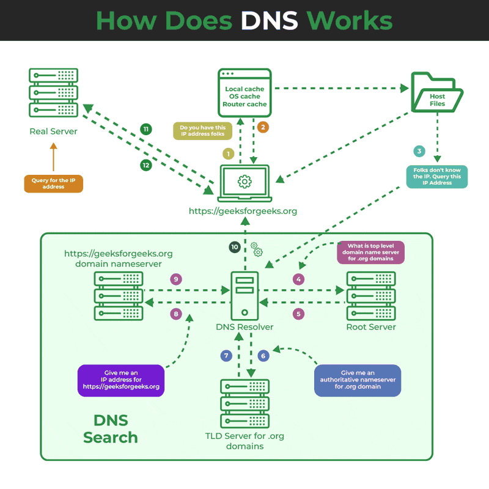

# **השכבה השנייה הרחבה**

## **Network Frames:**

**המידע הועבר במודל הOSI מתחלק לחתיכות מידע קטנות יותר על מנת העברה טובה של המידע ברשת , פיירמים היא צורת חלוקה מסויימת של המידע הזה שתומכת בTDM (שיטה המאפשרת למספר אותות לשתף ערוץ תקשורת בודד על ידי חלוקתו למשבצות זמן כך שכל אות יוכל להשתמש בערוץ) והיא יחסית דומה לחלוקה של המידע לפקטות , החלוקה של המידע לפריימים עוזרת להבין איך לפענח ולקרוא את המידע שעובר.**

**ישנם 2 סוגי של פריימים:**

### **Fixed-length:**

- **גודל הפריים קבוע ולא צריך לספק לו תחום מסויים כי האורך עצמו קבוע ומשמש כתחום.**

### **Variable-length:**

- **צריך לקבוע את סוף הפריים ואת תחילת הפריים הבא בכדי שיהיה אפשר לדעת מאיפה להתחיל לקרוא את ההבאה , זה נעשה בעזרת שדה length שבו מוגדר את גודל הפריים או בעזרת מסמן תחום שאומר איפה הפריים נגמר.**

### **השדות שקיימים בפריים הן:**

- - **Preamble: רצף של 0 ו1 המשמשים לבדיקת השעון במכשיר המקבל כדי לוודא שהוא יכול להבין את המידע המועבר אליו.**
    - **SDF :מסמן את התחלת הpayload ואת סוף הpreamble , ממש מסמן את "תחילת הפריים"**
    - **כתובת הMAC של היעד**
    - **כתובת MAC של השולח**
    - **EtherType: מסמן את סוג הפרוטוקול בpayload או את אורך המידע בpaylaod**
    - **Payload: המידע המקורי שצריך לעבור**
    - **FCS: שדה המשמש לבקר שגיאות**
    - **End Delimiter: מסמן את סוף הפריים ***
    - **Frame Status: ? מסמן אם הפריים הועתק אל העמדה? ***

*** אופציונלי , תלוי בסוג הפריים**

## **מבנה של כתובת MAC:**

**MAC נקרא גם הכתובת פיזית, זו היא כתובת ייחודית בגודל של 48 ביטים בינארים הבנויה מרצף של מספרים הקסדצימליים (12 מספרים) , כתובות MAC נקראות כתובות פיזיות כי הן חרוטות על כרטיס הרשת של המחשב לכל כרטיס רשת יש MAC משלו , 6 המספרים הראשונים משמשים בשביל זיהוי המפעל בו יוצר כרטיס הרשת ו-6 המספרים הנוספים הם ייחודיים לכל כתובת לפי הטווח של המפעל (מאחר וניתן לסווג יצרן גם למה שהוא מייצר ניתן לפעמים לנחש ניחוש מושכל של סוג הרכיב שזהו הMAC שלו למשל ראוטר טלפון לפטופ וכו').**

**4 דרכים לשנות כתובת MAC בWINDOWS:**

**שינוי כתובת הMAC בREGISTRY.**

**שינוי כתובת הMAC בCONTROL PANNEL.**

**שינוי כתובת הMAC דרך תוכנה חיצונית.**

*** דרך נוספת היא בעזרת POWERSHELL.**

**דרכים לשנות כתובת MAC בLINUX:**

**שינוי כתובת MAC על ידי הCLI בעזרת פקודה , ip link set dev wlan address [mac adress]**

**שינוי כתובת MAC על ידי הCLI בעזרת פקודה דומה רק עם ifconfig**

**שינוי בעזרת תוכנה צד שלישית**

**לערוך את הקובץ כאן : /etc/NetworkManager/system-connections**

## **Boradcast Domain:**

**ברודקאסט דומיין הוא חילוק לוגי של הרשת כך שכל אחד מהרכיבים באותו האזור מחולקים בצורה כזו שהם יכולים לתקשר אחד עם השני בשכבה השנייה , חלוקה זאת יכולה להיות בתוך אותו הLAN או שניתן לחבר כמה LAN שונים ויהיו כולם חלק מהחלוקה הזאת , חלוקה זאת נעשית בעזרת חיבור המחשבים ברשת בעזרת רפיטר או סוויץ' , כל כמות מחשבים שמחוברים אחד לשני בעזרת רפיטר או סוויץ' נחשבים כברודקאסט דומיין , הדבר המפרד/תוחם בין בורדקאסט דומיינס שונים הוא ראוטר (רכיב שכבה 3) או חלוקה לVLANים.**

**בעזרת הראוטרים והVLANים ניתן לשלוט על הגודל של הדומיינים האלו , בנוסף ניתן לעשות זאת בעזרת subnnetים , נרצה לחלק את הרשת ליותר דומיינים מאשר דומיינין אחד גדול , כלומר נרצה להקטין את הכמות של המשתתפים בדומיין אחד ואם צריך ליצור דומיין חדש מכיוון שזה יגרום להקלה על הרשת , כשאשר יש המון מכשירים שכולם עושים ברודקאסט אחד לשני זה יוצר עומס גדול על הרשת לכן חשוב לבזר אותם.**

## **Collision Domain:**

**קוליז'ן דומיין זה סגמנט רשתי בו מידע שמועבר יכול להתנגש אחד בשני ולדרוס אחד את השני , מצב זה קורה כאשר שני רכיבים באותו הסגמנט הזה שולחים הודעה באותו הזמן ככה שהאותות החשמליים עולים אחד על השני והמידע שהם מנסים להעביר לא קריא מה שמוביל אותם לשלוח את המידע מחדש וכתוצאה מכך נוצר עומס על הרשת , הסגמנט יכול להיות לדוגמה חיבור של כמה מכשירים לHUB או לWIFI , בWIFI נשתמש בפרוטוקול CSMA\CA בשביל להתגבר על ההתנגשות (שליחת הודעת RTS ובמידה והmedium פנוי הוא ישלח לנו הודעת CTS ונתחיל העברת נתונים בלי הפרעה של אף מידע אחר תוך כדי) והצורה בה נוכל למנוע Domain collision באופן כללי זה בעזרת שימוש בswitch בשביל להפריד את הסגמנט לdomain collisions שונים מאחר ובswitch לכל פורט יש domain collision משלו.**

**ההבדל בין broadcasting לבין flooding היא שbroadcasting זה הוא מצב שבו רכיב שולח הודעות בצורה שהיא מבוקרת ותחת השליטה שלו , כלומר הוא עושה שליחה של הודעות אלו בצורה מכוונת בעלת מטרה , flooding הוא מצב בו הרכיב שולח הודעות בצורה לא נשלטת או מבוקרת , פעולה הנובעת מטעות ונעשית בצורה לא מכוונת או בזדון.**

## **רכיבים רשתיים**

### **Switch :**

**(שכבה שנייה או שלישית) זהו רכיב תוך רשתי , כלומר רכיב שעובד בטווח של הרשת המקומית והמטרה שלו היא לנתב פקטות אל הרכיבים האלה ומהרכיבים האלו (פנימה והחוצה) , הסוויץ' מעביר את הפקטות רק אל הרכיב אליהם הם מיועדות ולא לשאר הרכיבים בLAN.ישנם 2 סוגים של סוויצ'ים סוג אחד הוא סוג שעובד רק בטווח השכבה השניה של מודל הOSI , הוא מעביר את פקטות אל היעד שלהם בהתבסס על הכתובת MAC שלהם.סוג שני הוא סוויץ' שעובד בטווח של השכבה השלישית של מודל הOSI , הוא מעביר את הפקטות אל היעד שלהם בהתבסס על כתובת הIP שלהם.ישנם סוויצ'ים שמסוגלים לבצע את היכולות של שני הסוגים.**

**סוויץ' יכול להיות גם במודל מנוהל או לא מנוהל ההבדלים בינהם הם שסוויץ' מנוהל הוא הרבה יותר "חכם" , הוא מאפשר קונפיגורציות ותכונות רבות שניתן לתכנת בו לפי הצורך בשביל לשפר את יעילות התעבורה בעוד שסוויץ' לא מנוהל לא עושה כלום מעבר לעבודה הרגילה שלו שהיא לנהל משא ומתן על מהירויות העברה ולקבוע את סוג ההעברה הדו-צדדית של כל קישור.**

**כל מחשב ברשת המקומית מחובר לפורט מסויים בסוויץ' , לכל מחשב יש פורט שונה ובעזרת זה הסוויץ יודע לאיזה מחשב להעביר את הפקטות, הפקטות שעוברות בסוויץ' מתבססות על כך שהכתובת יעד שרשומה בכל פאקטה היא הכתובת MAC של מחשב היעד , כלומר הכתובת MAC מהווה ככתובת היעד של המחשב וגם ככתובת המקור של המחשב , בכדי לדעת איזה פורט משוייך לכל מחשב לסוויץ' יש טבלת CAM שבתוכה הוא שומר כתובות MAC של מחשבים לצד הפורט אליו הם משוייכים , במידה והטבלה מלאה או במידה והטבלה ריקה הסוויץ' ישלח את ההודעות לכל המחשבים ברשת , אם הטבלה ריקה הוא ידע לבנות את הטבלה מחדש לפי תגובת מחשב היעד , במידה והחשמל לסוויץ' נפסק כלומר הרכיב נכבה הטבלה נמחקת.**

### **Hub:**

**(שכבה שנייה) זהו רכיב טיפש שעובד בצורה דומה לסוויץ' , לHUB אין את היכולת לשמור כתובות ופורטים כי אין לו טבלה כמו שיש לסוויץ'; במקום זאת הוא מעביר את הנתונים בצורה של broadcast כלומר הוא שולח לכל הרכיבים ברשת; שמחוברים אליו את המידע שמגיע אליו.ישנם 3 סוגים של HUBים , אקטיבי - נמצא בבקרה על האותות של הפורטים במידה והאות נחלש אז הוא מחזק ומחדש אותו , פסיבי - יכול רק לשלוח את הפקטות , חכם - עובד כמו אקטיבי עם כל מיני פיצ'רים כמו ניתור על התעבורה ברשת , ניתוח ופתרון בעיות של בעיות ברשת.**

**ההבדל המהותי בי HUB לSWITCH הוא שSWITCH הוא רכיב חכם ויודע להעביר את המידע ליעד המתאים לו ורק לו וHUB לא יכול.**

### **Bridge:**

**(שכבה שנייה) רכיב שמסוגל לחבר בין 2 LAN-ים שונים ומעלה, המטרה שלו היא לאפשר לLANים קטנים להתחבר לLAN גדול יותר.רכיב זה מאוד דומה לסוויץ' גם לו יש טבלה שלפיה הוא יודע לזהות מחשב לפי הסגמנט שלו ומעביר את המידע בין סגמנטים בהתאם או חוסם את המידע במידה והוא לא נועד לסגמנט אחר , יש 3 סוגים של Bridge-ים : בלי נראה , ניתוב לפי מקור ומתרגם.**

**נושאים נוספים:**

- **הסיבה שבגללה אנו צריכים רכיב רשת מרכזי היא מאותה הסיבה שאנחנו צריכים רמזורים בכבישים , אם היינו נוסעים בכביש בלי רמזורים זה היה מאוד עמוס ולא יעיל , מאותה סיבה יש לנו רכיב רשת מרכזי שמאפשר לנו יעילות עבודה באינטרנט ומעבר של מידע בצורה טובה ומסודרת.**
- **כאשר מגיע רכיב חדש לרשת או כשאשר הטבלה של הSWITCH נמחקת או כתובות ספציפיות נמחקות ממנה והSWITCH מקבל הודעה להעביר לגורם כלשהו , כאשר הוא כמובן לא מכיר , הSWITCH שולח את FRAMEים של המידע לכל הרכיבים המחוברים אליו מלבד הרכיב שהעביר אליו את המידע ככה שבתקווה והרכיב שהמידע אמור להגיע אליו יגיב בחזרה ובכך הSWITCH ידע להעביר אליו את שאר המידע.**

## **VLAN:**

**השימוש הנפוץ ביותר בVLAN בעבר היה בשביל למזער Domain Collision אבל כפתרון לכך נוצר הswitch וכיום השימוש בVLANים בעיקר קורה בכדי למידור ובידול של סביבות רשתיות , בזכות שימוש בVLANים ניתן לפצל רשת אחת לכמה רשתות שונות למרות שהן מחוברות לאותו הסוויץ' , בזכות זה ניתן למנוע בעיות אבטחיות , הרשאות וגישות לרכיבים שלא צריכים את המידע המסויים וכו'.**

### **Access Port:**

**פורט מסוג זה הוא משמש לניהול הVLAN בצורה כזו שהוא מאפשר מעבר רק של סוג VLAN אחד דרכו , כלומר**

### **Trunk Port:**

**פורט מסוג זה משמש לניהול הVLAN בצורה כזו שהוא מאפשר למעבר של כמה סוגי VLAN בתוכו , הוא עובד בצורה של קילוף תיוג של הודעות שזו היא מין שיטה בה שכבה נוספת שעל המידע המועבר מקולפת בכניסה שלה לפורט , ב"קליפה" הזאת רשום את המידע שסוויץ' צריך בשביל לדעת לאיזה VLAN הוא שייך.**

**נשתמש בACCESS PORT כאשר אין צורך או שימוש בVLANים , כלומר כשהודעות אינן מתוייגות ונשתמש בTRUNK PORT כאשר יש שימוש בVLAN ומידור או פיצול של הLAN לכמה LANים שונים.**

### **VLAN Tagging:**

**תיוג 802.1 q עובד בצורה כזאת שהוא מוסיף על הפריים המקורי עוד 4 בתים בין הtype-length לבין הMAC מקור את התג שלו , בו מצויין ה TPID וTCI , הTPID מסמל את הפריים ואומר שהיא מתוייגת ב802.1 q והחלק השני אחראי על עדיפות הפריים מ1-7 , סימול הפורמט של הMAC ומזהה הVLAN (לאיזה VLAN הפריים שייך - VLAN ID) , כאשר הוא מתווסף הFCS מחושב מחדש , כאשר הפאקטה יוצאת הסוויץ' לאחר שהיא תוייגה היא עוברת לרכיב הבא והוא מקלף ממנה בכניסה את התיוג והיא חוזרת להיות פריים ETHERNET רגילה.**

**לא ניתן לתייג פריים יותר מפעם אחת בפורמט של 802.1q מהסיבה הפשוטה שהוא עובדת בצורה שהוא מוסיף את ה4 בתים בהם הוא מציין את VLAN ID שמציין את השייכות של הפריים , בנוסף סוויץ' בנוי בצורה כזו שהוא יכול ל"עכל" רק תיוג אחד לכל פריים, עם זאת כן ניתן לתייג פעמים בעזרת פורמטים אחרים כמו 802.1ad שמאפשר לתייג פריים כמה פעמיים , הטכניקה נקראת QinQ או Stacked VLAN's , שיטה זו פותחה כדי לאפשר יותר דינמיות בתיוג ולאפשר לפרוץ את המגבלה של 4096 שתיוג כפול ומעלה מספק 4096^2 במינימום וכך מתאפשרת גדילה של הרשת.**

### **VLAN hopping:**

**זו היא שיטה בה ניתן ל"קפץ" בין VLAN אחד לאחר , בכך להצליח לתקשר עם VLAN שונה מהVLAN שבו אנו נמצאים , ניתן לממש את המתקפה הזאת ב1 מ2 דרכים.**

**double tagging , שבשיטה זו אנו נתייג את פיסת הפריים פעמיים , ותחבר לעוד סוויץ' , לאחר שנתייג את הפריים פעמיים נעביר אותו לסוויץ, הנוסף שחיברו , אותו הסוויץ' יקלף את התיוג הראשון וישאיר רק את התיוג השני אותו הוא יעביר לסוויץ' האחר שבו יש את התיוגים של שאר הVLANים ובכך נוכל להתחזות לחלק מהVLAN האחר הזה.**

**שיטה נוספת היא להדמות לסוויץ' , נוכל לעשות זאת בכל שנשתמש בפרוטוקול שסוויצ'ים משתמשים בו (DTP) , בשביל ליצור TURNK עם הסוויץ' , זה ניתן רק כאשר מוגדר dynamic auto או dynamic desirable כברירת המחדל בסוויץ' , כאשר יהיה TURNK מחובר למחשב התוקף תיהיה לו גישה לכל הVLANים.**

## **MTU – Maximum Transmission Units:**

**MTU הוא גודל המנה המקסימלית בבתים שפרוטוקול מסויים מסוגל לעביר , כלומר גודל של יחידת מידע מקסימלית שתעבור , ככל שגודל הMTU גדול יותר כך ניצולו של הbandwidth יעיל יותר , במודל TCP\IP תוכננו הפרוטוקולים בצורה כזו שיהיה אפשר לקשר בין צמתים רבים כך שכל צומת בדרך כלל יודעת מה הMTU רק של הצמתים הסמוכים לה כך שיכול לקרות מצב בו עוברת מנה גדולה ממה שצומת כלשהי יכולה לקבל אם היא עברה בין כמה צמתים.**

**הפתרון לכך הוא חילוק של המנות למנות קטנות יותר וכך להעביר אותן בצורה שכל תת מנה שווה לערך הMTU והמנה האחרונה היא השארית , עם זאת במקרים בהם אחת מהתת מנות אבדו נצטרך לשלוח את המנה כולה מחדש לעשות שוב את התהליך ונוסף על כך זה פחות יעיל מאשר אם המנות ניו מחולקות נכון כמו שצריך מלכתחילה.**

**הMTU משפיע על האינטרנט בכך שהוא מאפשר מעבר מסויים של מנות , הוא מאפשר הגבלה של גודל המנות ומאפשר ולמנוע עומסים , מעבר מהיר יותר של מידע ,עיבוד מהיר יותר שלו מכיוון שהוא מחולק ליותר חלקים קטנים ויעילות של איבוד נתונים במקרה בו אבדו מנות ניתן לשחזר אותן ספציפית במקום את כל המנות כולן (כמו במקרה וזה היה רק מנה אחת מאוד גדולה שעוברת) ובזכות כל זה מאפשר יעלות גבוה והפחתת התקורה (שימוש במשאבים שלא תורם ליישום מטרה מסויימת)**

*** MTU PATH הוא הנתיב המוגדר כגודל המנה המקסימלית שיכול לעבור בנתיב ללא הצורך לפצל אותן לתתי מנות.**

*** כדי לראות את הMTU בלינוקס עושים ifconfig.**
